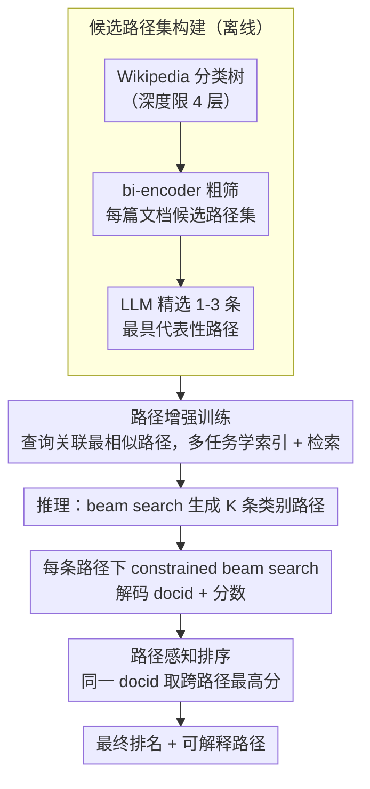

# Why These Documents? Explainable Generative Retrieval with Hierarchical Category Paths

**会议**: ACL 2026  
**arXiv**: [2411.05572](https://arxiv.org/abs/2411.05572)  
**代码**: [GitHub](https://augustinlib.github.io/HyPE/)  
**领域**: 信息检索  
**关键词**: 生成式检索, 可解释检索, 层级类别路径, 文档标识符, 路径感知排序

## 一句话总结
提出 HyPE 框架，在生成式检索中通过先生成层级类别路径（如 "Government >> Government by cities"）再解码文档标识符，为检索结果提供查询相关的可解释路径，同时提升检索准确率。

## 研究背景与动机

**领域现状** 生成式检索（Generative Retrieval）通过单一生成模型直接解码文档标识符（docid）来响应查询，实现端到端优化、减少外部索引依赖。现有方法在 docid 设计上探索了语义型（数字聚类索引）和词汇型（标题、关键词、子串）两大类。

**现有痛点** 无论语义型还是词汇型 docid，现有生成式检索都无法回答"为什么检索到这篇文档"。例如对于文档"迪拜"，不同的查询关注"迪拜经济"或"迪拜政府"，但检索系统返回的 docid 都一样，无法解释检索决策与查询意图之间的对应关系。

**核心矛盾** 可解释性在检索中至关重要——缺乏解释会削弱用户对检索结果的信任，也不利于用户探索相关信息。然而，现有可解释检索方法要么仅限于关键词归因（语义上下文不足），要么依赖 LLM 生成自然语言解释（推理延迟高、不适合实时检索）。

**本文目标** 设计一个可解释的生成式检索框架，在检索过程中提供清晰、合理的解释，同时保持甚至提升检索性能。

**切入角度** 利用结构化的层级类别路径（如 Wikipedia 分类树）作为解释载体，在解码 docid 之前先逐步生成从粗到细的语义类别路径。这既提供了对检索决策的解释，又通过 coarse-to-fine 的推理过程引导模型更好地定位相关文档。

**核心 idea** 层级类别路径是一种"恰到好处"的解释形式——比关键词更具语义结构，比自然语言更紧凑高效（平均仅 13.5 token vs 自然语言 61 token），且可以根据不同查询为同一文档生成不同的解释路径。

## 方法详解

### 整体框架
HyPE 把「先解释、后检索」做进生成式检索的解码流程：模型在吐出文档标识符（docid）之前，先逐级生成一条从粗到细的层级类别路径（如 "Government >> Government by cities"），既给出检索决策的解释，又借这条 coarse-to-fine 路径把搜索空间逐步收窄。整个框架由三段串起来——离线先为每篇文档构建候选类别路径集，训练时把查询与最贴切的路径绑定、让模型同时学「索引」与「检索」两个任务，推理时先用 beam search 生成多条路径、再在每条路径条件下解码 docid，最后用路径感知排序把多路径结果聚合成最终排名。

### 关键设计

**1. 候选路径集构建：编码器粗筛 + LLM 精选，为每篇文档配 1-3 条语义路径**

解释要可靠，前提是每篇文档都挂上语义上确实合适的层级路径。HyPE 以 Wikipedia 分类树为骨架层级结构（深度限制 4 层），但分类树的路径成千上万，全塞进 LLM 会超出上下文长度，于是拆成两阶段：先用 bi-encoder 按语义相似度从全部路径中筛出每篇文档的候选路径集 $\hat{\mathcal{P}}_D$，再让 LLM 从候选中精选最多 3 条最能代表文档内容的路径。编码器负责把候选量级压下来，LLM 负责把质量提上去，既控成本又保证路径贴切。

**2. 路径增强训练：在 docid 前插入路径，让解码经历 coarse-to-fine 的伪推理**

为让模型学会先定类别再定文档，HyPE 对训练集中每个查询-文档对，从该文档候选路径集中挑出与查询语义最相似的一条路径关联起来，构成路径增强训练集 $\mathcal{X}^+ = \{(q, p^q, D, d)\}$。模型据此同时优化两个任务：索引任务 $\mathcal{M}^\theta(p^q, d \mid D)$ 把文档映射到「路径 + docid」，检索任务 $\mathcal{M}^\theta(p^q, d \mid q)$ 把查询映射到「路径 + docid」。在 docid 前多生成一段路径，等于让解码先确定文档的语义类别再落到具体文档，比直接跳到 docid 更贴近人类检索的推理顺序。

**3. 路径感知排序：聚合多条路径的解码结果，覆盖查询的多个语义面**

单条路径只能抓住查询的一个语义侧面，HyPE 因此在推理时先用 beam search 生成 $K_p$ 条类别路径，对每条路径再用 constrained beam search 解码 $m$ 个 docid-score 对，然后对同一个 docid 只保留它在所有路径中的最高分、按分数降序排列，即 $\tilde{Y} = \{(d, s) \mid s = \max\{s' \mid (d, s') \in Y_j\}\}$。取最高分的好处在于：只要某文档在任一相关话题维度上得分高，就有机会排到前面，从而让覆盖多话题的相关文档不被单一路径漏掉。

### 一个完整示例
以查询「迪拜的政府如何运作」为例：模型先用 beam search 生成若干条类别路径，其中一条是 "Government >> Government by cities"；在这条路径条件下，constrained beam search 配合 prefix trie 解码出「迪拜」等合法 docid 及其分数。若另一条路径是 "Economy >> Economy by city"，则会偏向解码「迪拜经济」相关文档。最后路径感知排序对同一 docid 取跨路径最高分汇总——由于查询意图落在「政府」一面，"Government" 路径下的「迪拜」拿到更高分而排到前列。这也说明了为什么同一篇「迪拜」文档，面对不同查询会给出不同的解释路径与排序。

### 损失函数 / 训练策略
模型以 T5-base 为骨干，用标准 seq2seq 交叉熵损失做索引 + 检索的多任务学习。索引任务用 FirstP（文档前 $k$ 个 token）作为文档表示，并补充 5 个合成查询以缓解索引-检索的分布差异；推理时用 constrained beam search 配合 prefix trie，保证生成的 docid 始终合法。

## 实验关键数据

### 主实验

| Docid 类型 | 数据集 | 指标 R@10 | Baseline | + HyPE | 提升 |
|-----------|--------|----------|----------|--------|------|
| Title | NQ320K Full | R@10 | 78.7 | **83.5** | +6.1% |
| Title | NQ320K Unseen | R@10 | 68.9 | **73.6** | +6.8% |
| Summary | NQ320K Full | R@10 | 78.8 | **79.6** | +1.0% |
| Keyword | MS MARCO | R@10 | 61.2 | **62.7** | +2.5% |
| Atomic | MS MARCO | R@10 | 73.6 | **74.6** | +1.4% |

### 消融实验

| 分析维度 | 结果 | 说明 |
|---------|------|------|
| 路径数量 K=1 vs K=3 | K=1 已优于无路径，K=3 显著更好 | 多路径策略有效捕获多话题维度 |
| 路径质量（GPT-5 评估） | 94.6% 的路径被判定相关 | 路径生成质量高，错误传播风险小 |
| 人类重排序实验 | 有路径时 R@1 提升 23.7%，信心提升 12% | 路径解释确实帮助用户做更好决策 |
| 推理时间开销 | 仅增加 ~0.1s/样本 | 解释能力几乎不影响效率 |
| Token 效率 | 路径 13.5 token vs 自然语言 61 token | 4.5x 更高效 |

### 关键发现
- HyPE 可以正交地应用于所有 docid 类型（title、keyword、summary、atomic），具有很好的通用性
- Title docid 从 HyPE 中获益最大，因为标题编码粗粒度语义，与层级路径的 coarse-to-fine 结构最匹配
- 在非 Wikipedia 语料（MS MARCO）上同样有效，证明方法泛化性不依赖于语料与分类树的共源性
- 即使路径不完全准确（5.4% 被判无关），检索性能也不会显著下降，说明方法对路径错误具有鲁棒性

## 亮点与洞察
- 层级类别路径作为解释形式的设计非常精巧：结构化、紧凑、可自动生成、且能根据查询动态调整
- "先解释后检索"的范式将可解释性从事后归因变为检索过程的有机组成部分
- 路径感知排序策略巧妙地利用多路径覆盖查询的多个语义面
- 人类重排序实验（R@1 提升 23.7%）有力证明了可解释性对实际用户的价值

## 局限与展望
- 当前骨架层级结构基于 Wikipedia 分类树，对特定领域（如医疗、法律）可能需要替换为领域专用分类体系
- 不适用于语义型 docid（因为已有内置的层级结构），应用范围有一定限制
- 路径深度固定为 4 层，对于极细粒度的检索需求可能不够
- 未来可以探索让模型自动构建层级结构，而非依赖外部分类树

## 相关工作与启发
- 与 free-text explanation 方法相比，类别路径在 token 效率上有 4.5x 优势，延迟几乎不增加
- 与 DSI、NCI 等生成式检索方法正交，可以作为即插即用的增强模块
- 为检索系统的可解释性提供了一种新范式：不是事后解释，而是通过可解释的中间步骤来驱动检索

## 评分
- 新颖性: ⭐⭐⭐⭐ 层级路径作为可解释检索中介是新颖想法
- 实验充分度: ⭐⭐⭐⭐⭐ 两个数据集、四种docid类型、人类评估、LLM评估、效率分析俱全
- 写作质量: ⭐⭐⭐⭐⭐ 逻辑链清晰，案例分析直观
- 价值: ⭐⭐⭐⭐ 对可解释检索和生成式检索领域都有启发意义

<!-- RELATED:START -->

## 相关论文

- [\[ACL 2026\] From Relevance to Authority: Authority-aware Generative Retrieval in Web Search Engines](from_relevance_to_authority_authority-aware_generative_retrieval_in_web_search_e.md)
- [\[ACL 2026\] GLIER: Generative Legal Inference and Evidence Ranking for Legal Case Retrieval](glier_generative_legal_inference_and_evidence_ranking_for_legal_case_retrieval.md)
- [\[ACL 2025\] On Synthetic Data Strategies for Domain-Specific Generative Retrieval](../../ACL2025/information_retrieval/on_synthetic_data_strategies_for_domain-specific_generative_retrieval.md)
- [\[ACL 2026\] Hybrid-Vector Retrieval for Visually Rich Documents: Combining Single-Vector Efficiency and Multi-Vector Accuracy](hybrid-vector_retrieval_for_visually_rich_documents_combining_single-vector_effi.md)
- [\[ACL 2026\] Why Mean Pooling Works: Quantifying Second-Order Collapse in Text Embeddings](why_mean_pooling_works_quantifying_second-order_collapse_in_text_embeddings.md)

<!-- RELATED:END -->
