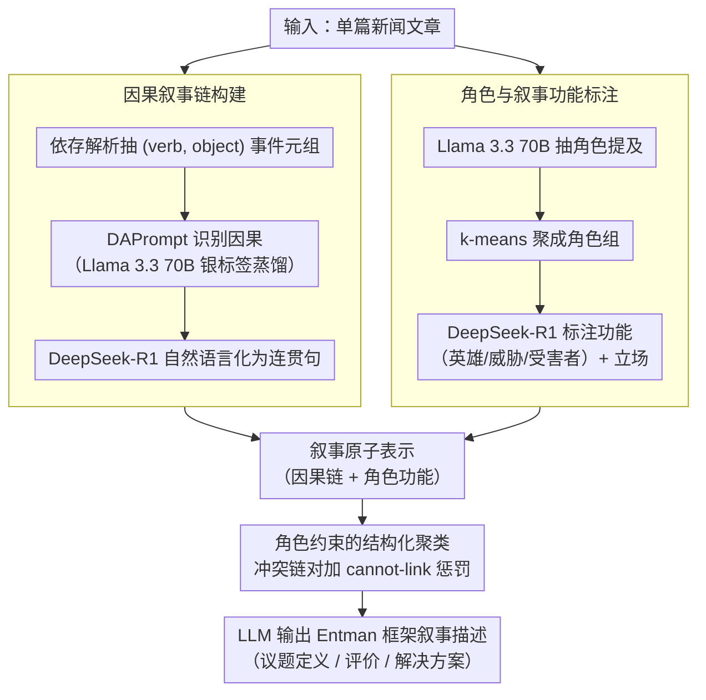

# A Structured Clustering Approach for Inducing Media Narratives

**会议**: ACL 2026  
**arXiv**: [2604.10368](https://arxiv.org/abs/2604.10368)  
**代码**: 有（论文提及）  
**领域**: 可解释性  
**关键词**: 媒体叙事, 结构化聚类, 因果事件链, 角色分析, 框架理论

## 一句话总结
提出一个从大规模新闻语料中自动归纳媒体叙事模式的框架，通过联合建模事件因果链和角色（英雄/威胁/受害者）信息，使用角色约束的聚类算法将叙事链组织成语义连贯的叙事模式，在移民和枪支控制两个领域生成了可解释且与框架理论一致的叙事模式。

## 研究背景与动机

**领域现状**：媒体叙事在塑造公众舆论中具有巨大影响力。NLP 领域对媒体分析的研究已有不少积累，主要分为两类：(1) 粗粒度标签方法（如"左/右"立场、"政治/经济/安全"主题框架），可扩展但丢失了叙事结构的细微差异；(2) 领域特定分类法（如针对移民或经济议题的专用标签），能捕捉细微差异但缺乏跨领域泛化能力。

**现有痛点**：粗粒度方法忽略了传播学研究强调的细腻叙事结构——如何通过角色设定、因果构建来引导读者走向特定结论。而领域特定方法需要大量手工标注，无法扩展到新领域。两类方法的割裂限制了跨领域的一致性叙事分析。

**核心矛盾**：可扩展性与解释深度之间的矛盾——要么牺牲叙事细节换取规模，要么牺牲规模换取深度。

**本文目标**：设计一个既能保持叙事结构深度（事件因果关系+角色功能定位）又能在无需领域特定分类法的前提下扩展到大规模语料的叙事归纳框架。

**切入角度**：从传播学中的叙事政策框架（Narrative Policy Framework）出发，将角色（英雄/威胁/受害者）作为叙事分析的关键结构元素，通过角色约束将表面相似但叙事含义不同的事件链区分开。

**核心 idea**：用事件因果链+角色标注构建叙事的原子表示，再通过角色约束的聚类（cannot-link constraints）自动归纳出跨文章的高层叙事模式。

## 方法详解

### 整体框架

本文要解决的是如何在不依赖领域分类法的前提下，从大规模新闻语料中自动归纳出语义连贯、可解释的叙事模式。框架以单篇文章为输入，先把文章拆解为带因果关系的事件链并用自然语言化表达，再为链中的角色标注叙事功能（英雄/威胁/受害者），把这两类信号组合成叙事的原子表示；随后用角色约束的聚类把成千上万条叙事链组织成若干高层模式，最后让 LLM 为每个聚类输出符合 Entman 框架理论的叙事描述（议题定义、评价、解决方案），形成可解释的叙事模式清单。

### 关键设计

**1. 因果叙事链构建：把文章压成「因为 X 所以 Y」的原子单位**

纯事件序列只能告诉我们发生了什么，却丢掉了媒体叙事最核心的操纵手法——因果构建，即通过"因为 X 所以 Y"的逻辑引导读者走向特定结论。为此先用依赖解析从文章抽取 (verb, object) 事件元组，再用 DAPrompt 方法识别事件对之间的因果关系。考虑到逐对调用大模型成本过高，作者让 Llama 3.3 70B 对 20K 事件对生成银标签，再把能力蒸馏到轻量的 DAPrompt 模型上做大规模推理。得到因果三元组后，用 DeepSeek-R1 推理模型将其自然语言化为连贯句子，使后续聚类既能利用结构信息，又能利用语义表示。

**2. 角色与叙事功能标注：决定叙事意识形态方向的关键信号**

同一条事件链，角色功能分配不同，传递的信息可能完全相反——"移民=受害者、执法者=威胁"与"移民=威胁、执法者=英雄"涉及相同实体却指向对立立场。为捕捉这一维度，先用 Llama 3.3 70B 在 5-shot 下从文章抽取角色提及，再用 k-means 将提及聚成角色组（如"移民""执法者"）；随后用 DeepSeek-R1 在 zero-shot 下为每个角色标注叙事功能（英雄/威胁/受害者）和整体立场（支持/反对）。这层标注把叙事的评价维度显式化，成为后续约束聚类的依据。

**3. 角色约束的结构化聚类：强行分开「话题相同、叙事相反」的链**

仅靠文本相似度聚类会把"移民是受害者"和"移民是威胁"归为一类，因为它们都谈论移民议题。为此，对角色功能配置冲突的链对（同一角色组在两条链中被赋予不同功能）生成 cannot-link 约束，并把 k-means 目标函数改写为 $\mathcal{R} = \frac{1}{2}\sum \|x_i - \mu_{l_i}\|^2 + \sum w_c \mathbf{1}[l_i = l_j]$，在原有距离项之外对违反约束的同簇分配施加惩罚 $w_c$；初始化也换成约束感知的 k-means++ 变体，从一开始就避免冲突链落入同一簇。约束让聚类结果不只是话题相似，更是叙事结构一致。

## 实验关键数据

### 主实验（结构化聚类 vs 标准 k-means）

| 领域 | 方法 | Frame F1 | Exact Match Purity | Avg. Role Purity |
|------|------|----------|-------------------|-----------------|
| 移民 | k-means | 41.19 | 26.90 | 80.79 |
| 移民 | **Structured Clustering** | **42.32** | **32.79** | **81.48** |
| 枪支控制 | k-means | 37.65 | 29.22 | 81.18 |
| 枪支控制 | **Structured Clustering** | **41.68** | **36.66** | **82.90** |

### 消融实验（Top 25% 距质心最近的链）

| 领域 | 方法 | Frame F1 | Exact Match Purity |
|------|------|----------|--------------------|
| 移民 | k-means | 33.22 | 32.31 |
| 移民 | Structured | **36.96** | **37.83** |
| 枪支控制 | k-means | 32.86 | 35.16 |
| 枪支控制 | Structured | **36.45** | **42.71** |

### 关键发现
- **结构化聚类在所有指标上一致优于标准 k-means**，尤其在 Exact Match Purity 上提升最明显（枪支控制域 +7.44pp）
- **角色约束对区分细腻叙事差异至关重要**：枪支控制域中"警察是英雄保护公众"vs"警察是威胁侵犯权利"被成功分开
- **因果链的自然语言化质量高**：移民域 3.3/4，枪支控制域 3.49/4
- **角色标注准确度优异**：枪支控制域 4.73/5，移民域 4.0/5
- **聚类中心附近的链质量更高**（Top 25% 的纯度指标更好），说明聚类有意义的核心结构

## 亮点与洞察
- **将角色的叙事功能（英雄/威胁/受害者）作为聚类约束**是一个巧妙的桥梁——连接了传播学理论和计算方法。这种做法让聚类结果不只是话题相似，更是叙事结构一致
- **pipeline 设计巧妙地平衡了成本和质量**：用大模型生成银标签→蒸馏到轻量模型做推理，在因果关系预测上只损失 15% 性能但大幅降低成本
- **领域无关性**是重要卖点：只需极少量的角色组标注（聚类级别而非样本级别），即可扩展到新领域

## 局限与展望
- 仅在两个英文政策领域（移民、枪支控制）验证，跨语言和更多领域的泛化性待考
- 因果关系预测的 F1 仅 58.46，错误可能级联到下游聚类
- 角色组的识别仍需要少量人工标注（聚类级别），完全无监督的角色发现是可能的改进方向
- 未考虑时间动态——叙事模式如何随时间演变（如选举前后的叙事转变）
- 聚类数目 k 的选择仍是开放问题

## 相关工作与启发
- **vs Chambers & Jurafsky (2008)**: 经典叙事模式归纳只关注事件序列，不考虑角色的评价维度。本文加入角色功能标注，更接近传播学对叙事的理解
- **vs 框架检测方法 (Card et al., 2015)**: 框架检测用粗粒度标签，本文通过结构化聚类得到更细粒度、更可解释的叙事模式
- **vs LLM-based 分析**: 直接用 LLM 分析叙事是端到端方案但缺乏可解释性和结构化。本文的 pipeline 每步都可验证和解释

## 评分
- 新颖性: ⭐⭐⭐⭐ 首次将角色叙事功能作为聚类约束，理论动机扎实
- 实验充分度: ⭐⭐⭐⭐ 有人工评估+多指标，但只有两个领域
- 写作质量: ⭐⭐⭐⭐⭐ 动机清晰，图示直观，方法流程完整
- 价值: ⭐⭐⭐⭐ 对计算传播学和媒体分析有实际价值，方法可迁移

<!-- RELATED:START -->

## 相关论文

- [\[NeurIPS 2025\] SpEx: A Spectral Approach to Explainable Clustering](../../NeurIPS2025/interpretability/spex_a_spectral_approach_to_explainable_clustering.md)
- [\[ACL 2026\] Style over Story: Measuring LLM Narrative Preferences via Structured Selection](style_over_story_measuring_llm_narrative_preferences_via_structured_selection.md)
- [\[ACL 2026\] Interpretable Semantic Gradients in SSD: A PCA Sweep Approach and a Case Study on AI Discourse](interpretable_semantic_gradients_in_ssd_a_pca_sweep_approach_and_a_case_study_on.md)
- [\[ICML 2026\] Learning Coherent Representations: A Topological Approach to Interpretability](../../ICML2026/interpretability/learning_coherent_representations_a_topological_approach_to_interpretability.md)
- [\[ICLR 2026\] Semantic Regexes: Auto-Interpreting LLM Features with a Structured Language](../../ICLR2026/interpretability/semantic_regexes_auto-interpreting_llm_features_with_a_structured_language_of_re.md)

<!-- RELATED:END -->
