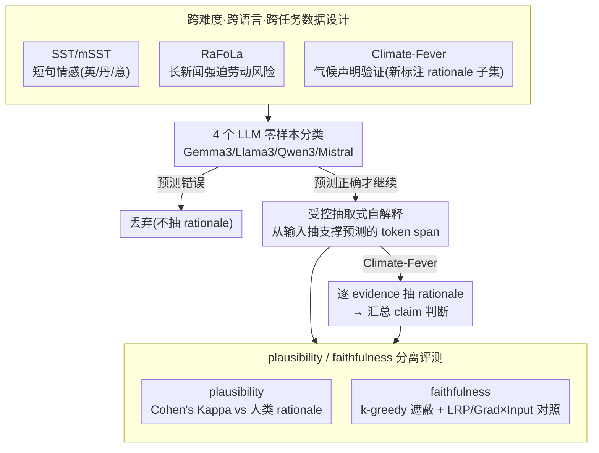

# A Systematic Comparison between Extractive Self-Explanations and Human Rationales in Text Classification

**会议**: ACL2026  
**arXiv**: [2410.03296](https://arxiv.org/abs/2410.03296)  
**代码**: https://github.com/oeberle/self_explanations_human_rationales  
**领域**: interpretability  
**关键词**: LLM自解释, 输入 rationale, 人类标注, 可解释性评测, 归因方法  

## 一句话总结
这篇论文系统比较了 4 个开源指令调优 LLM 在 3 类文本分类任务上生成的抽取式自解释与人类 rationale、后验归因方法之间的差异，发现自解释与人类标注的一致性强烈受文本长度和任务复杂度影响，但在扰动式 faithfulness 评测中，自解释往往能选出对模型预测更关键的 token 子集。

## 研究背景与动机
**领域现状**：LLM 已经被大量用于分类、摘要、问答和决策辅助场景，用户也越来越习惯让模型在给出答案时顺带解释“为什么”。这些解释通常是模型自己生成的自然语言说明或从输入中抽取的证据片段，不需要额外训练解释器，也不需要用户理解复杂的梯度归因或机制可解释性工具。

**现有痛点**：问题在于，自解释看起来像解释，并不等于它真的是好解释。一个 rationale 至少要经受两类检验：一是 plausibility，即它是否像人类会选择的理由；二是 faithfulness，即它是否真的触及模型做出该预测时依赖的信息。已有工作常常只研究短文本情感分类，或者只比较 self-explanation 与简单 saliency 方法，缺少跨任务、跨语言、跨后验归因方法的系统对照。

**核心矛盾**：用户希望解释既“符合人类直觉”又“忠实于模型内部决策”，但这两个目标并不总是一致。人类 rationale 可能偏向叙事和语义证据，模型自解释可能偏向任务可用的显式片段，而梯度归因方法可能强调系统提示符、格式 token 等对模型计算很重要但对人类不自然的元素。把任意一种解释当作唯一真相，都会遮蔽另一侧的信息。

**本文目标**：作者希望回答三个具体问题：LLM 生成的抽取式 self-explanation 与人类 rationale 在不同文本分类任务中有多一致；这些 rationale 在遮蔽输入 token 后是否真的会改变模型预测；与 LRP、Gradient×Input 等 post-hoc attribution 方法相比，自解释与人类解释各自采用了怎样的 token 选择策略。

**切入角度**：论文选择抽取式解释，而不是自由文本解释。这样做的好处是解释被严格锚定在输入文本中，可以转化为 token-level rationale，并直接与人类 token 标注、后验归因分数和扰动式 faithfulness 曲线比较。

**核心 idea**：把 LLM 自解释、人类 rationale 和 post-hoc attribution 放进同一个 token-level 评测框架中，用 plausibility、faithfulness 和语言统计三个视角拆开“看起来合理”和“对模型有效”之间的差别。

## 方法详解
这篇论文不是提出一个新的分类模型，而是设计了一个受控评测流程。作者先选取带有人类 rationale 的文本分类数据，补充标注一个新的 Climate-Fever rationale 子集；再让 4 个开源指令调优 LLM 在零样本设置下完成分类，并只在模型预测正确时要求它抽取支持该预测的输入片段；最后从 plausibility、faithfulness、post-hoc attribution 对齐和 token 统计等角度系统比较不同解释来源。

### 整体框架
整体 pipeline 可以分成五步。

第一步是准备任务和人类 rationale。论文覆盖情感分类、强迫劳动风险检测和气候声明验证三个任务：SST/mSST 提供短文本情感句子和多语言 rationale；RaFoLa 提供较长新闻文章中的强迫劳动风险指标 rationale；Climate-Fever 原始数据没有 token-level rationale，作者新收集了一个气候声明验证子集的人工 rationale。

第二步是模型分类。作者使用 Gemma3-12B、Llama3.1-8B、Qwen3-8B 和 Mistral-7B-Instruct-v0.3，在 zero-shot 设置下让模型完成对应分类任务。SST/mSST 是正负情感分类；RaFoLa 被改造成针对特定风险指标的二分类；Climate-Fever 要先判断 evidence，再汇总 claim label。

第三步是模型 rationale 抽取。只有当模型分类正确时，作者才继续要求模型从输入中抽取支持其判断的 rationale。这一点很关键：如果模型预测本身错误，再讨论解释是否忠实于正确决策会混淆分类错误和解释错误。

第四步是 plausibility 评测。作者把人类 rationale 当作人类可接受解释的参照，用 sample-wise Cohen's Kappa 衡量模型 rationale 与人类 token 标注的一致性。相比 F1，Kappa 能校正“选中 token / 未选中 token”类别不平衡和随机一致的影响，因此对 rationale agreement 更稳健。

第五步是 faithfulness 与策略分析。作者用 Gradient×Input 和 LRP 生成 post-hoc attribution，并通过遮蔽重要 token 后观察模型正确答案 token 与备选答案 token 的概率差变化来衡量 faithfulness。为了让二值的人类 / 模型 rationale 也能排序，论文采用 k-greedy importance ordering：逐步选择能最大降低预测概率差的 rationale token，短文本 SST 设 $k=1$，其他较长数据集设 $k=3$。

### 关键设计

**1. 跨难度、跨语言、跨任务的数据设计：不让结论只成立于短句情感分类**

解释质量很容易被数据集属性支配：短句里一个情感词就能定标签，模型和人类自然容易一致；可一旦换到证据跨句、含糊甚至彼此冲突的长文本，self-explanation 的局限才会暴露。为此作者刻意拉开三档难度——SST/mSST 是短句情感分类（mSST 还覆盖英语、丹麦语、意大利语），RaFoLa 是长新闻文章上的强迫劳动风险检测（文本长、证据常隐含），Climate-Fever 是气候声明验证（claim 本身欠规范，evidence 与 claim 的语义关系更模糊）。

由于 Climate-Fever 原本没有 token-level rationale，作者额外收集了一个含 104 个 claim、520 条 evidence 的人工 rationale 子集。三个任务串起来，正好说明解释质量不是模型的单一属性，而是模型、任务、文本结构共同作用的结果。

**2. 受控抽取式自解释：把“模型能说出理由”收敛成可测量的 token rationale**

自由文本解释更贴近真实用户场景，但一旦要评测它“像不像人类理由”或“是否真的影响预测”，就找不到一个干净的对齐单位——解释里可能掺入输入以外的背景知识和推理链。作者干脆把解释限制成从输入抽取的 token 片段：先让 LLM 输出分类结果，再**只在预测正确的样本上**要求它抽取支撑该结果的输入 span。这一步“预测正确才抽 rationale”很关键，否则会把分类错误和解释错误混在一起。

对于结构特殊的 Climate-Fever，作者沿用原始 claim-evidence 结构：先对 5 条 evidence 各自生成 rationale，再汇总成整体 claim 判断。这样无论哪个任务，模型解释、人类标注、后验归因都被压到同一种 token-level 粒度，解释质量问题就转化成可量化的 token agreement 与 token perturbation 问题。

**3. plausibility 与 faithfulness 分离评测：把“像人类”和“对模型有效”拆成两个独立问题**

一个解释可能与人类标注高度一致，却不是模型真正依赖的信息；也可能对预测非常关键，却因为包含格式符、系统提示符这类低层处理线索而不符合人类直觉。把这两件事混为一谈，就会把“可读性”误认成“忠实性”。所以作者用两套独立指标分别回答：plausibility 端用 sample-wise Cohen's Kappa 比较模型与人类 rationale 的一致性——相比 F1，Kappa 能校正“选中 / 未选中 token”的类别不平衡和随机一致，对 rationale agreement 更稳健。

faithfulness 端则靠 token masking：逐步遮蔽 rationale token，观察正确答案 token 与备选答案 token 的概率差是否快速下降。为了让二值的人类 / 模型 rationale 也能排序，作者采用 k-greedy importance ordering，每步选能最大降低概率差的 token，短文本 SST 设 $k=1$，其余较长数据集设 $k=3$；同时用 LRP 和 Gradient×Input 生成的 post-hoc attribution 作为第三方对照，看自然语言证据与梯度归因各自偏好哪类 token。

### 损失函数 / 训练策略
本文没有训练新的分类模型，也没有提出新的优化损失。实验采用零样本 prompting，所有模型都以 instruction-tuned open-weight LLM 形式直接运行。生成设置基于 `transformers`，重复惩罚设为 1.0，并根据不同任务和预期输出长度调整最大生成长度。为提高结果稳定性，作者在实验中使用 3 个随机种子并报告平均结果；对于 SST/mSST/RaFoLa，标准差均不超过 0.01。

在评测层面，核心“训练策略”可以理解为两套对齐过程：一套是把人类和模型 rationale 二值化并计算 Cohen's Kappa；另一套是把 rationale token 排序后逐步遮蔽，以概率差下降曲线衡量 faithfulness。对于人类和模型 rationale，排序不是来自模型内部梯度，而是通过 k-greedy 干预得到；对于 post-hoc attribution，排序来自 LRP 或 Gradient×Input 的归因分数。

## 实验关键数据

### 主实验
论文首先报告各模型的分类性能，作为后续解释评测的前提。总体上，短文本情感分类非常容易，SST/mSST 的 macro-F1 基本在 0.84 到 1.00；RaFoLa 长新闻任务明显更难，macro-F1 范围下降到 0.25 到 0.79；Climate-Fever 的 claim verification 更难，最佳 claim-level macro-F1 只有 0.45。

| 任务 / 数据集 | Gemma3 | Llama3 | Qwen3 | Mistral | 主要观察 |
|---|---:|---:|---:|---:|---|
| SST | 0.98 | 0.98 | 0.98 | 0.99 | 四个模型几乎都能解决短句情感分类 |
| mSST-EN | 1.00 | 0.98 | 0.99 | 0.98 | 英文多标注子集同样接近饱和 |
| mSST-DA | 0.94 | 0.84 | 0.96 | 0.96 | 丹麦语仍较高，但 Llama3 明显较低 |
| mSST-IT | 1.00 | 0.95 | 1.00 | 0.97 | 意大利语与英语表现接近 |
| RaFoLa #1 | 0.25 | 0.47 | 0.38 | 0.57 | “滥用脆弱性”较难，最佳也只有 0.57 |
| RaFoLa #2 | 0.37 | 0.60 | 0.47 | 0.58 | “恶劣工作和生活条件”仍偏难 |
| RaFoLa #5 | 0.79 | 0.73 | 0.74 | 0.60 | “过度加班”含更显式关键词，性能更高 |
| RaFoLa #8 | 0.65 | 0.76 | 0.67 | 0.73 | “身体和性暴力”也更容易被关键词触发 |
| Climate-Fever Claim | 0.45±0.04 | 0.33±0.04 | 0.38±0.02 | 0.24±0.01 | Gemma3 最好，但四分类 claim 验证整体困难 |
| Climate-Fever Evidence | 0.54±0.02 | 0.40±0.03 | 0.46±0.00 | 0.45±0.02 | evidence 三分类比 claim 略好 |

### 消融实验
本文没有传统意义上的模块消融，因为它不是一个新模型方法；更接近消融的是把解释来源拆成 human rationale、model self-explanation、LRP、Gradient×Input 和随机基线，再比较它们在 agreement、faithfulness 和 token 统计上的差异。

| 对比维度 | 关键指标 / 结果 | 说明 |
|---|---|---|
| 人类-模型 plausibility：SST/mSST | 英文子集多为 0.4-0.6 Cohen's Kappa；例外包括 Mistral-DA 0.32、Mistral-IT 0.31、Gemma-DA 0.33 | 短文本情感分类中，模型 rationale 与人类 rationale 通常有中等一致性 |
| 人类-模型 plausibility：RaFoLa | #1 为 0.12-0.17，#2 为 0.19-0.27，#5 为 0.21-0.48，#8 为 0.27-0.41 | 长文本任务中 agreement 强烈依赖具体风险指标，关键词更明确的 #5/#8 更好 |
| 人类-模型 plausibility：Climate-Fever | Gemma3 达 0.24，其余模型 0.12-0.18 | 三分类 rationale 和模糊 claim-evidence 关系导致一致性最低 |
| Faithfulness：self-explanation | k-greedy 排序后的 model rationale 在前 5-10% token 被遮蔽时产生最陡概率差下降 | 自解释虽然未必最像人类，但能找到对模型预测很敏感的 token 子集 |
| Faithfulness：post-hoc attribution | LRP 通常优于 Gradient×Input，但早期 token 的扰动效果仍不如排序后的 model/human rationale | 后验归因更容易抓到结构 token 和格式 token，而不是自然语言证据片段 |
| Rationale 策略：RaFoLa top 5% faithful tokens | 人类 TTR 29%-44%、停用词 34%-39%；模型 TTR 28%-47%、停用词 35%-38%；post-hoc 停用词仅 12%-25% | 人类和模型更像自然语言证据，post-hoc 更像孤立证据 token 与结构线索 |

### 关键发现
- 文本长度和任务复杂度是解释一致性的关键变量。SST 平均每篇约 20.86 个 token，RaFoLa 平均约 944.89 个 token，Climate-Fever 平均约 199.86 个 token；短文本情感分类的 human-model agreement 明显高于长新闻和 claim verification。
- self-explanation 的 plausibility 不稳定，但 faithfulness 并不弱。尤其在遮蔽前 5-10% token 时，经过 k-greedy 排序的模型 rationale 经常比 human rationale 和 post-hoc attribution 更能快速削弱模型的正确预测概率差。
- RaFoLa 中不同风险指标差异很大。#5 “Excessive overtime”和 #8 “Physical and sexual violence”包含 hours、day、sexual、women、violence 等更明确关键词，因此分类性能和 rationale agreement 都高于 #1/#2。
- Climate-Fever 的低 agreement 不能简单归因于表层文本复杂度。论文的 corpus statistics 显示 Climate-Fever 的平均依存深度低于 SST 和 RaFoLa，但 claim 欠规范、证据自动检索且语义关系含糊，使其 rationale 选择更难一致。
- post-hoc attribution 与自然语言解释策略不同。LRP / Gradient×Input 会强调 `<|begin_of_text|>`、`<s>`、`<bos>`、来源、日期、URL 等结构或格式 token；这些 token 对模型处理可能重要，但不一定是人类会接受的语义证据。

## 亮点与洞察
- 最大亮点是把 self-explanation 从“模型能说出理由”拉回到可测量的 token-level 解释问题。论文没有停留在主观评价，而是把人类 rationale、模型 rationale 和后验归因放在同一套 plausibility / faithfulness 评测里。
- 数据选择很有价值。SST/mSST、RaFoLa、Climate-Fever 分别代表短文本显式证据、长文隐式证据和 claim-evidence 模糊推理，三者串起来后，论文能说明解释质量不是模型的单一属性，而是模型、任务、文本结构和标注协议共同作用的结果。
- 论文清楚展示了“像人类”和“忠实于模型”不是同义词。post-hoc attribution 强调结构 token 看起来不自然，但它可能反映模型低层处理；self-explanation 更像自然语言证据，但也可能存在事后合理化。这个区分对解释型产品很重要。
- 对可解释性工具设计有直接启发：未来的解释系统不应该只输出一段漂亮的自然语言理由，也不应该只展示梯度最高的 token；更有希望的是把 attribution / activation 模式转译成自然语言，同时保留底层证据链。
- 论文对 Cohen's Kappa 的选择也很务实。rationale annotation 中“未选 token”远多于“选中 token”，直接用 F1 容易受类别比例影响；Kappa 虽然数值更低，但更适合比较不同任务的一致性。

## 局限与展望
- 作者承认，人类 rationale 本身并不是无偏真值。不同数据集的标注者数量、指导细节、专业背景都不一致，Climate-Fever 由 3 名亲自指导的标注者完成，RaFoLa 的法律专业标注者可能会给出不同 rationale。
- 论文只研究抽取式输入 rationale，没有评测自由文本解释。抽取式设置便于控制变量，但真实用户往往看到的是模型写出的自然语言解释，后者可能包含输入以外的背景知识、推理链和概念归纳。
- human-model agreement 不是解释质量的唯一目标。已有研究显示，人类并不总是偏好人类写出的解释；因此，低 Kappa 不一定意味着模型解释没用，高 Kappa 也不保证模型解释忠实。
- SST 上极高的 zero-shot 性能可能受到数据污染影响。作者明确指出，SST 很可能进入过模型训练数据，甚至 rationale 或任务说明也可能被训练语料包含，因此短文本情感分类结果不宜过度外推。
- faithfulness 评测依赖 token masking 和概率差变化，这是一种有用的干预代理指标，但遮蔽 token 也可能改变输入分布或破坏语义连贯性。长文本 RaFoLa 中出现概率差先下降后回弹，说明复杂文本中的证据交互并不是简单的单 token 加和。
- 后续工作可以扩展到自由文本解释、过程级解释和多轮推理任务，并研究如何让解释代理结合 activation / attribution 信息生成既自然又忠实的说明。

## 相关工作与启发
- **vs Huang et al. (2023)**: Huang 等研究 ChatGPT 在 SST 情感分类上的 self-explanation，并比较多种特征归因方法，但主要集中于短文本情感任务。本文扩展到 3 类任务、3 种语言、4 个开源 LLM，并加入更难的长文本和 claim verification 场景，因此更能观察任务复杂度对解释质量的影响。
- **vs Randl et al. (2025)**: Randl 等比较短文本任务中的抽取式 self-explanation、saliency explanation 和 human rationale，但没有纳入更复杂的梯度归因方法。本文使用面向 Transformer 的 LRP 和 Gradient×Input，并进一步分析 post-hoc rationale 为什么会偏向格式 token 和结构 token。
- **vs ERASER / rationale benchmark 传统**: ERASER 这类工作把人类 rationale 作为评测可解释模型的重要基准，强调 plausibility。本文继承了这个 token-level 评测思路，但额外指出仅靠人类一致性不够，还要看 rationale 遮蔽后是否真的影响模型预测。
- **vs 自由文本解释评测工作**: Wiegreffe、Kunz、Madsen 等研究自由文本 explanation 的真实性、语法性、选择性和 self-consistency。本文有意避开自由文本解释的开放评测难题，先在抽取式解释上建立更可控的比较框架，为后续评价 generative explanation 打基础。
- **启发**: 对下游应用来说，可以把 self-explanation 视为“候选语义证据”，把 attribution 视为“模型计算线索”，而不是强行二选一。一个更可靠的解释界面可以同时展示自然语言证据、模型敏感 token 和二者不一致的位置。

## 评分
- 新颖性: ⭐⭐⭐⭐☆ 论文不是提出新算法，而是把自解释、人类 rationale 和 post-hoc attribution 做了跨任务系统比较，问题设定和数据组合有明显价值。
- 实验充分度: ⭐⭐⭐⭐☆ 覆盖 4 个 LLM、3 类任务、3 种语言、plausibility 与 faithfulness 双指标；不足是 faithfulness 仍受 masking 协议限制，且自由文本解释未覆盖。
- 写作质量: ⭐⭐⭐⭐☆ 动机清楚，实验组织扎实，对 plausibility 和 faithfulness 的区别讲得很干净；部分表格来自图和附录，读者需要来回对应才能完整复现细节。
- 价值: ⭐⭐⭐⭐⭐ 对 LLM 解释可靠性评估非常实用，尤其提醒我们不要把“模型说得像理由”误认为“模型真的按这个理由决策”。

<!-- RELATED:START -->

## 相关论文

- [\[ACL 2026\] Dual Alignment Between Language Model Layers and Human Sentence Processing](dual_alignment_between_language_model_layers_and_human_sentence_processing.md)
- [\[ACL 2026\] Aligning What LLMs Do and Say: Towards Self-Consistent Explanations](aligning_what_llms_do_and_say_towards_self-consistent_explanations.md)
- [\[CVPR 2026\] Why Does It Look There? Structured Explanations for Image Classification](../../CVPR2026/interpretability/why_does_it_look_there_structured_explanations_for_image_classification.md)
- [\[ICML 2026\] Learn from A Rationalist: Distilling Intermediate Interpretable Rationales](../../ICML2026/interpretability/learn_from_a_rationalist_distilling_intermediate_interpretable_rationales.md)
- [\[AAAI 2026\] Can LLMs Truly Embody Human Personality? Analyzing AI and Human Behavior Alignment in Dispute Resolution](../../AAAI2026/interpretability/can_llms_truly_embody_human_personality_analyzing_ai_and_human_behavior_alignmen.md)

<!-- RELATED:END -->
