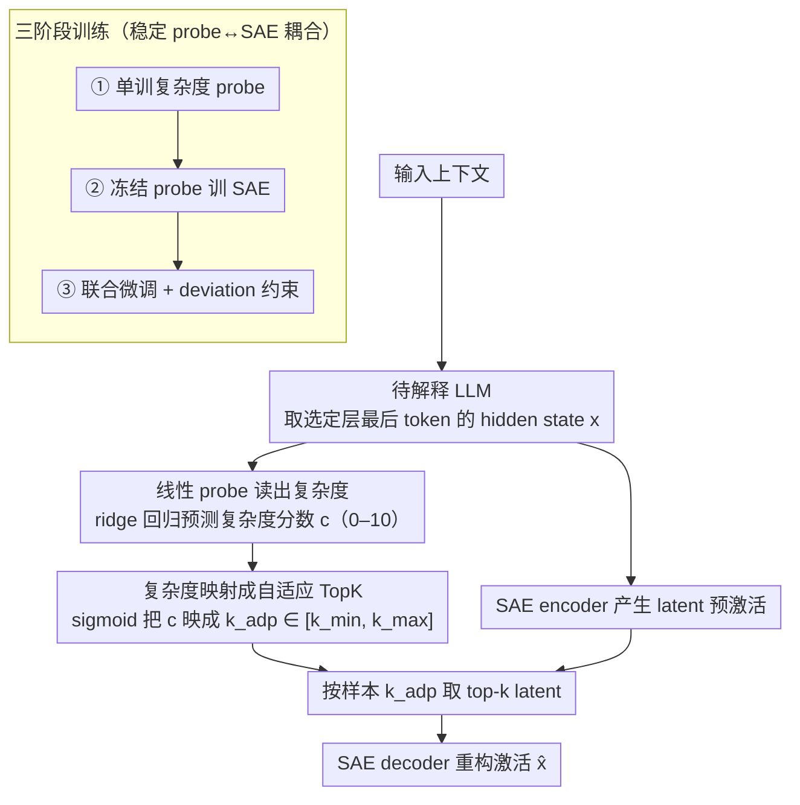

# AdaptiveK: Complexity-Driven Sparse Autoencoders for Interpretable Language Model Representations

**会议**: ACL 2026  
**arXiv**: [2508.17320](https://arxiv.org/abs/2508.17320)  
**代码**: https://github.com/hiyukie/adaptiveK  
**领域**: 模型可解释性 / Sparse Autoencoder  
**关键词**: 稀疏自编码器, 机制可解释性, 线性探针, 自适应稀疏, 表征复杂度  

## 一句话总结
AdaptiveK 提出一种由输入语义复杂度驱动的 Sparse Autoencoder，让简单文本激活更少特征、复杂文本激活更多特征，在 8 个自回归 LLM 和附加架构实验上改善重构质量、概念解耦与训练效率，并减少固定 TopK 需要反复调参的问题。

## 研究背景与动机
**领域现状**：Sparse Autoencoder（SAE）已经成为解释 LLM 内部表征的重要工具。它把模型激活分解到一个更高维但稀疏的 latent dictionary 中，希望每个 latent 对应更单义、更可理解的概念，从而缓解 polysemanticity 和 superposition 带来的解释困难。近年的 TopK SAE、BatchTopK、Gated SAE、JumpReLU、P-anneal、Matryoshka SAE 等方法主要围绕“如何在重构 fidelity 和稀疏性之间取平衡”改进。

**现有痛点**：这些 SAE 大多给所有输入施加统一的稀疏约束。例如 TopK 固定每个样本只保留同样数量的 active features，L1 / Gated / P-anneal 类方法也给不同输入施加相似的稀疏压力。问题是文本复杂度并不相同：一个简单短概念可能只需要少量特征就能解释，而专业长上下文、包含多实体和复杂逻辑的文本需要更多表示容量。统一稀疏约束会让简单样本浪费特征，也会让复杂样本被迫欠表示。

**核心矛盾**：SAE 训练通常把稀疏度当作全局超参数，但真实输入对表示容量的需求是局部变化的。固定 $k$ 为了照顾复杂样本会牺牲简单样本的稀疏性；为了保持整体稀疏又会让复杂样本重构不足。更麻烦的是，研究者往往要训练多个 $k$ 或多个 sparsity penalty 设置，才能找到合适的 Pareto trade-off。

**本文目标**：作者想解决三个具体问题：第一，LLM 激活中是否线性编码了“上下文复杂度”；第二，能否用这个复杂度信号动态决定 SAE 的 active feature 数量；第三，这种自适应稀疏是否在重构、可解释性和训练效率上优于固定稀疏基线。

**切入角度**：论文借鉴线性探针研究中的一个观察：很多高层属性，如 sentiment、政治立场、时空信息、truthfulness 等，都可以在 LLM 激活空间中用线性方向读出。作者进一步假设，文本复杂度虽然是多维属性，但也会被 LLM 表征线性编码；如果能用低成本 probe 读出复杂度，就可以把它转化成 SAE 的动态 $k$。

**核心 idea**：用线性探针预测输入复杂度，再把复杂度映射成每个样本自己的 TopK 值，从而用“复杂输入多给特征、简单输入少给特征”替代“一刀切固定稀疏度”。

## 方法详解
AdaptiveK 的方法可以看成在普通 TopK SAE 外面加了一个“复杂度控制器”。这个控制器不是直接读原文本，而是读 LLM 的 hidden activation；它输出一个连续复杂度分数，再通过 sigmoid 映射成当前样本应该保留多少个 SAE latent。这样，SAE 的 dictionary、encoder、decoder 仍然是熟悉的架构，但激活函数从固定 TopK 变成了 sample-adaptive TopK。

### 整体框架
整个 pipeline 分为四步。第一步，把输入上下文送入待解释的 LLM，抽取选定层的最后 token hidden state，作为上下文级激活 $x$。第二步，用一个经过预训练的线性 probe 预测复杂度 $c$。第三步，把 $c$ 映射为自适应稀疏度 $k_{adp}$，范围由 $k_{min}$ 和 $k_{max}$ 控制。第四步，SAE encoder 产生 latent pre-activation 后，只保留当前样本的 top-$k_{adp}$ 激活，再由 decoder 重构原始激活。

论文的关键直觉是：最后 token representation 已经聚合了前文上下文信息，因此可以作为“上下文复杂度”的读出点。主实验在 pile-uncopyrighted 上构造 250,000 个训练上下文和 10,000 个测试上下文，并用 GPT-4.1-mini 给上下文做多维复杂度评分。作者在正文实验设置中称每个上下文为 2048 tokens，附录又描述为 1024 tokens；这属于论文中一个需要注意的细节不一致，但不影响方法主线。

### 关键设计

**1. 用线性 probe 读出上下文复杂度：AdaptiveK 的控制信号**

如果复杂度只能靠复杂非线性模型预测，AdaptiveK 就等于用一个黑盒去控制另一个黑盒；而线性 probe 几乎和 mechanistic interpretability 里“线性方向”的假设天然兼容，也让复杂度信号本身可解释。作者先用 GPT-4.1-mini 从词汇复杂度、句法复杂度、概念密度、领域专门性、逻辑结构等维度给文本打出 0 到 10 的复杂度分，再用 ridge regression 从 LLM hidden state 预测这个分数，训练目标为 $L(w,b)=\frac{1}{n}\sum_i(y_i-(w^Tx_i+b))^2+\frac{\lambda}{2}\|w\|_2^2$。这个 0–10 的连续分数就是后续决定激活多少 latent 的唯一控制量。

**2. 把复杂度映射成自适应 TopK：让每个输入拥有自己的特征预算**

线性映射可能对极端复杂度过于敏感，固定 TopK 又完全忽略复杂度；作者用 sigmoid 把复杂度 $c$ 映射到有上下界的区间 $[k_{min}, k_{max}]$：$k_{adp}=k_{min}+\sigma(s((c-c_{min})/(c_{max}-c_{min})-0.5))(k_{max}-k_{min})$，其中 $s$ 控制曲线陡度，默认配置 $k_{min}=20$、base $k=80$、$k_{max}=320$。这样既避免简单样本激活过多 latent、浪费表示容量，也避免复杂样本被固定 $k$ 压成欠表示。

**3. 三阶段训练稳定 probe 与 SAE 的耦合：防止重构目标把复杂度信号带歪**

如果一开始就联合训练，probe 可能为了迎合 SAE 的重构误差而偏离原来的复杂度语义；如果永远冻结 probe，又会错过和 SAE latent 空间共同适配的机会。为此设计三阶段：第一阶段只训练复杂度 probe；第二阶段冻结 probe 只训练 SAE，损失为 $L_{SAE}=L_{recon}+\alpha L_{sparsity}+\beta L_{aux}$，其中 $\alpha=0.005$、$\beta=1/32$；第三阶段联合微调 probe 和 SAE，并用 deviation penalty 约束 probe 不要偏离预训练参数，在语义稳定性和任务适配之间取折衷。

### 损失函数 / 训练策略
训练分为 probe 预训练、冻结 probe 的 SAE 训练、联合微调三步。probe 采用 ridge regression，并通过 5-fold cross-validation 在 $\{0.001,0.01,0.1,1.0,10.0,100.0,1000.0\}$ 中选择正则强度，最终选择 $\lambda=100.0$。

SAE 阶段的重构目标是让 decoder 输出 $\hat{x}$ 接近原激活 $x$，稀疏正则使用归一化 $L_1$ 项 $\|z\|_1/\|x\|_2$，并加入辅助 loss 处理 dead features。联合微调阶段的目标为 $L_{joint}=L_{SAE}+\gamma(L_{probe}+\delta L_{deviation})$，其中 $\gamma=0.9$，$\delta$ 初始为 0.2，并在 0.01 到 0.5 之间动态调整，防止 probe 参数偏离预训练值过远。优化器使用 Adam，学习率 $1e^{-3}$，warm-up 15 steps，并在 70% 训练进度后做线性衰减。

## 实验关键数据

### 主实验
论文主实验覆盖 8 个 decoder-only LLM：Pythia-70M、Pythia-160M、Gemma-2-2B、Gemma-2-9B、Llama-3.1-8B、Qwen-3-8B、Qwen-3-14B、Phi-4-14B。所有 SAE 的 dictionary size 都是 16,384，对比 7 类基线：ReLU、ReLU_new、TopK、BatchTopK、Gated、P-anneal、Matryoshka。正文的 Pareto 曲线显示 AdaptiveK 在同等 sparsity 下整体获得更低 L2 loss、更低 unexplained variance 和更低 $1-\cos$，但论文没有在主文表格中给出每个模型的逐点数值，因此这里不编造“提升百分比”。

线性复杂度 probe 的第一组可复核数字来自 Pythia-70M 上的 250,000 训练上下文和 10,000 测试样本。线性模型虽然比 MLP 略低，但与非线性模型非常接近，支持“复杂度可线性读出”的前提。

| 复杂度预测器 | RMSE ↓ | Pearson ↑ | Spearman ↑ | 结论 |
|--------------|--------|-----------|------------|------|
| Linear probe | 1.41 | 0.72 | 0.76 | 已接近非线性模型，且可解释性更好 |
| MLP | 1.37 | 0.74 | 0.77 | 数值略优，但引入额外非线性黑盒 |
| XGBoost | 1.42 | 0.71 | 0.74 | 没有超过线性 probe |

自适应容量分配的代表性现象也很清楚：固定 TopK 在所有复杂度样本上保持同一个 $k$，而 AdaptiveK 会随复杂度升高增加 active features。论文 Fig. 1 中，TopK 以固定 80 features 为例，AdaptiveK 则可从约 103 features 扩展到约 394 features。

### 消融实验
作者重点消融了复杂度到 $k$ 的映射范围、sigmoid 陡峭度、probe 权重和 mapping function。一个核心结果是：扩大 $k_{max}$ 会稳定改善重构，但平均激活数也会上升，说明 AdaptiveK 仍服从常见的容量-稀疏 trade-off。

| $k$ 范围设置 | 测试集 min $k$ | 测试集 max $k$ | 平均 $k$ | Explained Var ↑ | Cosine Sim ↑ | L2 Ratio |
|--------------|----------------|----------------|----------|-----------------|--------------|----------|
| $k_{min}=20,k_{max}=320$ | 96 | 291 | 214 | 0.743 | 0.909 | 0.921 |
| $k_{min}=20,k_{max}=480$ | 132 | 435 | 313 | 0.768 | 0.919 | 0.926 |
| $k_{min}=20,k_{max}=640$ | 170 | 579 | 415 | 0.789 | 0.926 | 0.935 |

sigmoid 陡峭度 $s$ 的消融显示方法对该超参数不敏感。以 Gemma-2-2B 为例，$s=2.0$ 到 $s=12.0$ 会把 $k$ 的动态范围从 143-225 扩大到 58-315，但 explained variance 只在 0.738-0.743 间变化，cosine similarity 基本保持在 0.908-0.909。

| $s$ | min $k$ | max $k$ | avg $k$ | Explained Var ↑ | Cosine Sim ↑ | L2 Ratio |
|-----|---------|---------|---------|-----------------|--------------|----------|
| 2.0 | 143 | 225 | 188 | 0.738 | 0.908 | 0.911 |
| 6.0 | 96 | 291 | 214 | 0.743 | 0.909 | 0.921 |
| 12.0 | 58 | 315 | 232 | 0.742 | 0.909 | 0.917 |

### 关键发现
- **复杂度确实能被线性 probe 读出**：在 Pythia-70M 上，Linear probe 的 RMSE 为 1.41、Pearson 为 0.72、Spearman 为 0.76，与 MLP / XGBoost 接近；Gemma-2-2B 的 layer-wise 分析中，probe 在第 22 层达到 Pearson 0.814、RMSE 1.18。
- **AdaptiveK 在 Pareto frontier 上优于固定稀疏**：论文在 L2 loss、unexplained variance、cosine similarity 三组曲线中都报告 AdaptiveK 在同等 sparsity 下更优；少数基线需要 10 倍以上的更高 sparsity 才能追上部分重构指标。
- **跨架构扩展可行**：BERT-340M 的 cosine similarity 为 0.89、L2 ratio 为 0.8225；T5-small encoder 的 explained variance / cosine similarity / L2 ratio 分别为 0.97 / 0.98 / 1.0093，decoder 为 0.74 / 0.97 / 1.0139。
- **训练效率有现实意义**：Gemma-2-2B 上 AdaptiveK 总训练时间为 11,084 分钟，单个固定稀疏 TopK 为 13,955 分钟；如果传统方法为了调参训练 6 个 sparsity level，总耗时会超过 AdaptiveK 的 6 倍。
- **可解释性指标也支持 AdaptiveK**：RAVEL 上 AdaptiveK 的 disentanglement / cause / isolation 分数约为 0.62 / 0.60 / 0.65；Sparse Probing 中 SAE Full / LLM Full 约为 0.997，Top-1 latent 能捕获约 82% 的 SAE full representation 信息。

## 亮点与洞察
- **把“输入复杂度”从直觉变成了训练信号**：很多 SAE 工作都默认样本难度不同，但仍用全局稀疏超参数处理。AdaptiveK 的关键价值在于把这个直觉落到可训练、可测量的线性 probe 上。
- **自适应稀疏比单纯扩大 dictionary 更优雅**：固定 TopK 想改善复杂样本，只能整体增大 $k$，这会让简单样本也激活更多特征。AdaptiveK 不是简单加容量，而是让容量跟随样本移动，因此更贴近解释任务里“只激活必要概念”的目标。
- **线性 probe 的选择很克制**：作者没有用一个复杂 controller 网络去决定 $k$，而是用 ridge regression。这让方法更容易和 mechanistic interpretability 的线性方向叙事连接，也降低了“用另一个黑盒解释黑盒”的尴尬。
- **实验把 reconstruction 和 human-understandable interpretability 分开看**：论文不仅看 L2、variance、cosine，还用 MaxAct、VocabProj、SAEBench 风格指标检查 latent 是否更语义集中。尤其是 MaxAct 中 AdaptiveK 对 biomedical 例子更聚焦专业术语，而 TopK 会混入较多语义弱的功能词，这个分析比单纯报重构误差更有说服力。

## 局限与展望
- **复杂度标注依赖 GPT-4.1-mini，成本和偏差都需要进一步验证**：作者承认由于 API 标注成本，训练数据远小于 SAEBench 的 500,000,000 tokens。虽然 250,000 contexts 已经表现不错，但复杂度评分本身可能携带模型偏好，也可能对非英语、代码、数学文本不稳定。
- **上下文长度描述存在不一致**：正文实验设置称每个 context 为 2048 tokens，方法和附录多处又写 1024 tokens。这不一定改变结论，但会影响复现者对 buffer、last-token representation 和 token-level evaluation 的理解。
- **主结果大量依赖曲线而非表格**：Pareto frontier 图展示了 AdaptiveK 相对基线的优势，但缺少逐模型、逐 sparsity 的完整数值表。对于需要严格比较提升幅度的读者，复现实验或源码日志仍然必要。
- **复杂度不等于所有解释难度**：文本复杂度可以解释“需要多少特征”的一部分，但某些概念可能语义简单却机制上复杂，例如安全拒答方向、特定事实编辑、稀有 token 行为。未来可以把复杂度 probe 扩展为多种 capacity signals，而不是单一分数。
- **更大规模训练仍需检验**：作者强调 AdaptiveK 用较小数据就能达到强表现，但它在真正超大规模 SAE、token-level 全量训练、跨语言语料和 frontier LLM 上的稳定性还需要进一步实验。

## 相关工作与启发
- **vs TopK SAE / BatchTopK SAE**：TopK 和 BatchTopK 直接限制 active latent 数量，优点是简单稳定，缺点是 $k$ 对所有输入固定。AdaptiveK 保留 TopK 的清晰稀疏机制，但把 $k$ 从全局超参数变成样本级变量，因此更适合复杂度差异大的上下文。
- **vs Gated SAE / P-anneal SAE**：Gated 和 P-anneal 通过正则或门控缓解 L1 shrinkage 和稀疏控制问题，但稀疏压力仍主要是全局设定。AdaptiveK 的区别在于稀疏度本身由输入内容决定，而不是只由训练配置决定。
- **vs Matryoshka SAE**：Matryoshka 关注多层级 dictionary 和 feature hierarchy，能处理 feature splitting / absorption 相关问题。AdaptiveK 则从“每个样本该用多少 latent”入手，两者并不冲突；未来可以考虑把自适应 $k$ 与层级 SAE 结合。
- **vs 线性探针可解释性工作**：Gurnee & Tegmark 等工作证明 LLM 中存在时空等线性方向，本文把类似思想用于“复杂度”这一更综合的属性。启发在于：很多解释工具的超参数，也许可以由模型激活中的线性可读属性自动控制。
- **对后续研究的启发**：AdaptiveK 提醒我们，SAE 的可解释性不只取决于 dictionary 学得好不好，还取决于激活预算如何分配。对于多模态模型、代码模型、agent trajectory 等长上下文任务，可以尝试用任务复杂度、信息密度、步骤数或不确定性来动态控制 SAE 容量。

## 评分
- 新颖性: ⭐⭐⭐⭐☆ 从输入复杂度自适应决定 SAE 稀疏度是清晰且有用的创新，虽然核心部件仍是线性 probe + TopK SAE 的组合。
- 实验充分度: ⭐⭐⭐⭐☆ 覆盖 8 个 decoder LLM、7 类 SAE 基线、多个附录指标和消融；不足是主 Pareto 结果缺少完整数值表，部分设置描述也不够一致。
- 写作质量: ⭐⭐⭐⭐☆ 动机链条清楚，方法和训练策略讲得完整；但个别维度描述重复、上下文长度不一致、表格与曲线信息分散，影响复现友好性。
- 价值: ⭐⭐⭐⭐⭐ 对 SAE 可解释性实践很有启发，尤其适合需要减少固定 $k$ 调参成本、同时希望保持 latent 语义集中度的研究场景。

<!-- RELATED:START -->

## 相关论文

- [\[ICLR 2026\] Temporal Sparse Autoencoders: Leveraging the Sequential Nature of Language for Interpretability](../../ICLR2026/interpretability/temporal_sparse_autoencoders_leveraging_the_sequential_nature_of_language_for_in.md)
- [\[ICML 2026\] Sparse Autoencoders are Topic Models](../../ICML2026/interpretability/sparse_autoencoders_are_topic_models.md)
- [\[NeurIPS 2025\] Transformer Key-Value Memories Are Nearly as Interpretable as Sparse Autoencoders](../../NeurIPS2025/interpretability/transformer_key-value_memories_are_nearly_as_interpretable_as_sparse_autoencoder.md)
- [\[ICLR 2026\] Toward Faithful Retrieval-Augmented Generation with Sparse Autoencoders](../../ICLR2026/interpretability/toward_faithful_retrieval-augmented_generation_with_sparse_autoencoders.md)
- [\[ACL 2026\] Linear Probes Detect Task Format, Not Reasoning Mode in Language Model Hidden States](linear_probes_detect_task_format_not_reasoning_mode_in_language_model_hidden_sta.md)

<!-- RELATED:END -->
