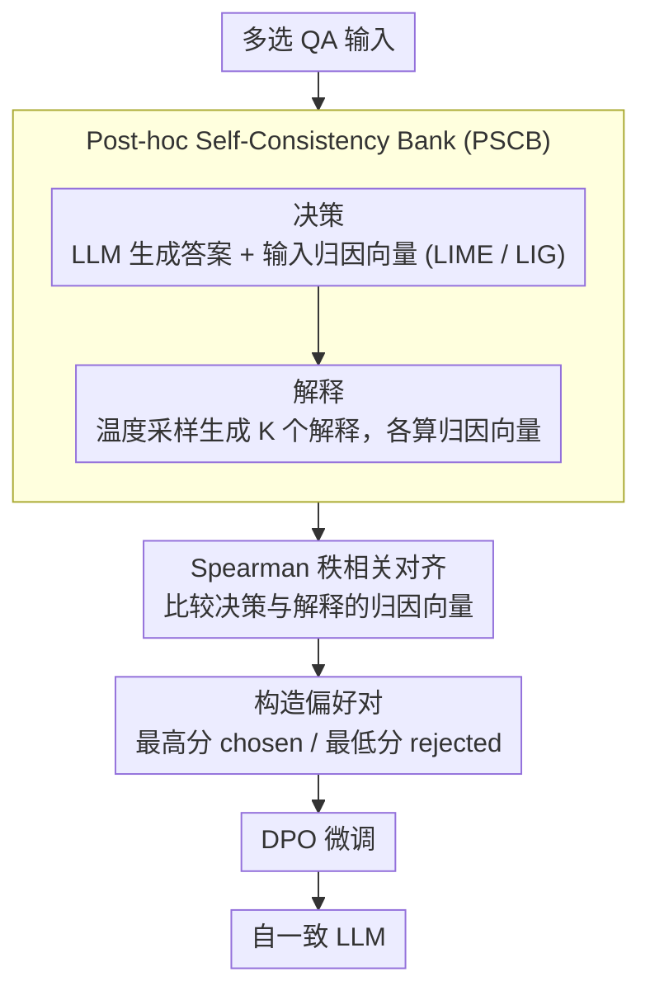

# Aligning What LLMs Do and Say: Towards Self-Consistent Explanations

**会议**: ACL 2026 Findings  
**arXiv**: [2506.07523](https://arxiv.org/abs/2506.07523)  
**代码**: [GitHub](https://github.com/saharad1/ConstLLM)  
**领域**: 可解释性  
**关键词**: 自一致性, 特征归因, 解释忠实性, DPO优化, 归因对齐

## 一句话总结

构建大规模Post-hoc Self-Consistency Bank（PSCB，85K决策×428K解释），量化LLM答案与其解释之间的特征归因差距，并通过DPO优化在不损害准确率的前提下提升解释的归因一致性。

## 研究背景与动机

**领域现状**：LLM常被要求生成自然语言解释来说明其答案，但这些post-hoc解释往往与实际驱动答案的输入特征不一致——解释说的和模型做的不一样。

**现有痛点**：(1) 现有忠实性度量方法（如反事实干预）计算成本极高，难以大规模应用；(2) CC-SHAP等方法仅评估了约100个样本，结论可靠性受限；(3) 没有人展示过如何改善这种归因不一致。

**核心矛盾**：LLM的解释可能流畅合理但"答非所问"——解释关注的输入特征与实际驱动答案的特征不同，这对可信AI构成根本威胁。

**本文目标**：(1) 大规模量化答案与解释之间的归因一致性；(2) 提出改善方法。

**切入角度**：对每个QA决策和其多个解释分别计算特征归因向量，比较两者的对齐度。用DPO在归因偏好数据上微调以改善一致性。

**核心 idea**：Spearman秩相关比余弦相似度更能区分高低质量解释；基于归因偏好的DPO优化能有效提升自一致性且跨域泛化。

## 方法详解

### 整体框架

PSCB构建流程：(1) 对QA决策计算特征归因向量；(2) 对每个决策生成K个多样化解释，分别计算归因向量；(3) 用对齐函数度量决策与解释的归因一致性；(4) 选取最好和最差解释构建偏好对，用DPO优化。前两步共同填充 PSCB 这一基准库，后两步基于库中数据做对齐度量与偏好优化。

### 关键设计

**1. Post-hoc Self-Consistency Bank (PSCB)：把评估规模从百样本撑到十万级**

此前 CC-SHAP 等工作仅能在约 100 个样本上评估归因一致性，样本太少使结论的可靠性受限，也无法支撑系统性研究。PSCB 把规模撑到 85K 决策 × 每个 5 个解释 = 428K 解释-归因对，并同时用 LIME 和 Layer Integrated Gradients (LIG) 两种归因方法、覆盖 4 个 QA 数据集和 2 个 LLM，为后续的大规模量化与 DPO 优化提供归因增强的基准。

**2. Spearman 秩相关作为对齐度量：比余弦相似度更能分辨好坏解释**

余弦相似度在区分好坏解释时分布高度重叠、区分力很弱，因为它受归因量纲影响。本文改用 Spearman 秩相关 $CC_{sp} = 1 - \frac{6\sum(r(\phi_i^{dec}) - r(\phi_i^{exp}))^2}{m(m^2-1)}$，只看决策向量与解释向量在特征优先级上的一致性而不受量纲干扰，因此能把不同质量的解释清晰分离。

**3. 基于归因偏好的 DPO 优化：不损害准确率地提升自一致性**

SFT 在同样数据上学不到归因偏好的微妙差异，效果较差。本文改用偏好学习：从 PSCB 中取自一致性最高的解释作为 chosen、最低的作为 rejected 构造偏好对，再用 DPO 微调 LLM，使模型在保持任务准确率的同时偏向产出与决策归因更一致的解释。

### 损失函数 / 训练策略

使用标准DPO目标函数，训练在PSCB的偏好对上进行。解释通过温度采样生成（p=0.9, T=0.7），每个决策5个解释，取最好和最差构建偏好对。

## 实验关键数据

### 主实验

| 模型 | 数据集 | CC-Sp(优化前) | CC-Sp(DPO后) | 准确率变化 |
|------|--------|-------------|-------------|----------|
| LLaMA3.1-8B | ECQA | 18.47(mean) | 显著提升 | 不降 |
| LLaMA3.2-3B | ECQA | 9.75(mean) | 显著提升 | 不降 |

### 消融实验

| 配置 | 关键指标 | 说明 |
|------|---------|------|
| DPO vs SFT | DPO显著优于SFT | SFT无法学到归因偏好 |
| LIME vs LIG | 提升不跨方法泛化 | 不同归因方法捕获不同维度 |
| 跨域泛化 | 有效 | ECQA训练的改善泛化到ARC等 |
| 正确vs错误答案 | 正交 | 自一致性与准确率基本无关 |

### 关键发现
- 自一致性与准确率基本正交——解释不一致的答案也可能正确，一致的也可能错误
- Spearman秩相关的区分力显著优于余弦相似度
- DPO优化带来的自一致性提升能跨域泛化，但不跨归因方法
- 不同归因方法（LIME vs LIG）捕获本质不同的输入相关性概念

## 亮点与洞察
- "自一致性与准确率正交"是重要发现——准确的模型不一定给出忠实的解释
- 揭示了一个实用的矛盾：DPO可以提升LIME-based一致性但不提升LIG-based，说明"忠实解释"本身是多维概念
- PSCB作为大规模资源对可解释性社区有长期价值

## 局限与展望
- 仅在选择题QA上验证，开放生成任务的适用性未知
- LIME和LIG各有局限，更先进的归因方法可能得出不同结论
- 自一致性仍是忠实性的代理指标，不等同于真实的决策过程可解释
- 未来可扩展到更大模型和更多任务类型

## 相关工作与启发
- **vs CC-SHAP**: 将评估规模从100个样本扩大到85K，并首次展示改善方法
- **vs 反事实干预方法**: 用归因向量比较代替昂贵的反事实测试，大幅降低成本
- **vs RLHF**: 将偏好学习从"人类偏好"扩展到"归因一致性偏好"，是alignment的新维度

## 评分
- 新颖性: ⭐⭐⭐⭐⭐ 归因偏好DPO优化是全新方向
- 实验充分度: ⭐⭐⭐⭐ 大规模benchmark、跨域泛化、DPO vs SFT对比
- 写作质量: ⭐⭐⭐⭐ 形式化严谨，实验设计清晰
- 价值: ⭐⭐⭐⭐⭐ 对LLM可解释性和可信AI有深远影响

<!-- RELATED:START -->

## 相关论文

- [\[ACL 2026\] A Systematic Comparison between Extractive Self-Explanations and Human Rationales in Text Classification](a_systematic_comparison_between_extractive_self-explanations_and_human_rationale.md)
- [\[ACL 2026\] Do LLMs Know Tool Irrelevance? Demystifying Structural Alignment Bias in Tool Invocations](do_llms_know_tool_irrelevance_demystifying_structural_alignment_bias_in_tool_inv.md)
- [\[ACL 2026\] Do LLMs Capture Embodied Cognition and Cultural Variation? Cross-Linguistic Evidence from Demonstratives](do_llms_capture_embodied_cognition_and_cultural_variation_cross-linguistic_evide.md)
- [\[AAAI 2026\] LLM Circuit Analyses Are Consistent Across Training and Scale](../../AAAI2026/interpretability/llm_circuit_analyses_consistent_across_training_and_scale.md)
- [\[ACL 2025\] Llama See, Llama Do: A Mechanistic Perspective on Contextual Entrainment and Distraction in LLMs](../../ACL2025/interpretability/llama_see_llama_do_entrainment.md)

<!-- RELATED:END -->
