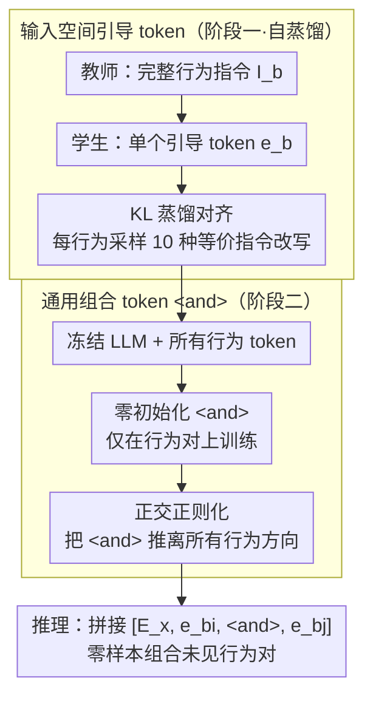

# Compositional Steering of Large Language Models with Steering Tokens

**会议**: ACL 2026  
**arXiv**: [2601.05062](https://arxiv.org/abs/2601.05062)  
**代码**: 无  
**领域**: 模型压缩  
**关键词**: 组合引导, 引导token, 自蒸馏, 多行为控制, 零样本组合

## 一句话总结

本文提出组合引导 token，通过自蒸馏将行为指令压缩为输入空间的嵌入向量，并训练专用组合 token <and> 来捕获"组合"的通用概念，在未见过的行为组合、未见过的行为以及未见过的组合数量上均展现强泛化能力。

## 研究背景与动机

**领域现状**：LLM 部署需要同时满足多个行为约束（如语言、长度、格式）。微调计算成本高且可能破坏通用能力，$N$ 种行为的任意组合意味着 $2^N$ 种微调。指令引导灵活但脆弱——语义等价的提示产生不一致的行为。

**现有痛点**：(1) 激活空间引导方法（如 CAA）通过向量加法组合行为，但直接组合独立训练的模块具有破坏性；(2) Gist token 仅处理单行为压缩，未解决组合问题；(3) 现有组合引导缺乏严格评估——大多仅提供轶事证据或缺少基线比较。

**核心矛盾**：独立训练的行为表示在组合时产生干扰，但如果为每种组合单独训练则组合爆炸。需要一种表示方式能学习"组合"本身的概念，而非每种特定组合。

**本文目标**：学习一个通用的组合 token <and>，使其在未见过的行为组合上泛化，包括未见过的行为和未见过的组合数量。

**切入角度**：行为表示放在输入空间（而非激活空间），支持更好的零样本组合；训练组合 token 时冻结行为 token，迫使 <and> 学习行为无关的组合函数。

**核心 idea**：组合 = 一个可学习的通用操作符，而非针对每种行为对的特定调整。

## 方法详解

### 整体框架

方法把"让模型同时满足多个行为约束"这件事拆成两阶段训练：先为每个单行为各学一个引导 token，再单独学一个通用的组合 token <and> 来把任意两个行为拼在一起。第一阶段用自蒸馏，教师吃完整指令文本、学生只吃一个引导 token，逼学生把指令语义压进输入嵌入空间；第二阶段冻住 LLM 和所有行为 token，只在行为对上训 <and>，迫使它学"组合"这个操作本身而非记某一对的特例。推理时按 $[\mathbf{E}_x, \mathbf{e}_{b_i}, \mathbf{e}_{\text{<and>}}, \mathbf{e}_{b_j}]$ 拼接输入即可零样本组合未见过的行为对。

### 关键设计

**1. 输入空间引导 token：把行为指令压成一个可组合的嵌入向量**

激活空间引导（如 CAA）通过向量加法组合行为，但独立训练的方向直接相加会互相干扰，组合准确率几乎归零。本文把行为表示放回模型的输入嵌入空间——每个行为对应一个引导 token $\mathbf{e}_b \in \mathbb{R}^d$，通过自蒸馏学得：最小化 $\text{KL}(P_{\text{teacher}}(y|x, I_b) \| P_{\text{student}}(y|x, \texttt{<b>}))$，让只看到一个 token 的学生复现看到完整指令 $I_b$ 的教师分布。训练时对同一行为采样 10 种语义等价的指令改写，避免 token 过拟合到某一句措辞。输入空间的好处是表示天然走正常的前向计算，比激活空间的强行相加更容易被后续的组合 token 协调。

**2. 通用组合 token <and>：把"组合"学成一个与行为无关的操作符**

如果为每种行为对单独调参就会组合爆炸（$N$ 种行为有 $2^N$ 种组合）。本文的关键决策是只学一个共享的 <and>，且在第二阶段把所有行为 token 冻结——这样 <and> 没法靠修改个别行为来取巧，只能学到"如何把两个行为拼起来"这个通用函数。<and> 采用零初始化（不偏向任何已有行为），并配合正交正则化防止它坍缩进行为 token 张成的子空间。正因为学的是操作而非特例，它能泛化到未见过的行为组合、含未见行为的组合，甚至只训了 2-行为却能推到 3-行为。

**3. 正交正则化：阻止组合 token 与行为 token 表示坍缩**

零初始化的 <and> 在训练中容易被拉向某些高频行为 token，退化成"换个名字的行为向量"，从而丢掉通用性。为此对 <and> 与每个已见行为 token 施加余弦相似度平方惩罚 $\mathcal{L}_{\text{orth}} = \sum_{b \in \mathcal{B}_{\text{seen}}} \left(\frac{\mathbf{e}_{\text{<and>}} \cdot \mathbf{e}_b}{\|\mathbf{e}_{\text{<and>}}\| \cdot \|\mathbf{e}_b\|}\right)^2$，把它推到与所有行为方向都正交的位置，最终损失为 $\mathcal{L} = \mathcal{L}_{\text{dist}} + \lambda \cdot \mathcal{L}_{\text{orth}}$。消融显示去掉这一项后已见组合只轻微下降、未见组合明显下降，说明正交性正是零样本泛化的关键来源。

### 损失函数 / 训练策略

整体目标为自蒸馏损失加正交正则化。LLM 全程冻结，可训练参数仅 $|\mathcal{B}|+1$ 个 $d$ 维向量（每个行为一个 + 一个 <and>）。蒸馏温度取 $T=10.0$ 以鼓励学生匹配教师的完整概率分布而非只对齐 argmax。行为 token 用语义初始化（取其指令 token 嵌入的均值），组合 token 则零初始化，二者配合上面的正交约束共同保证组合能力可泛化。

## 实验关键数据

### 主实验

**Qwen3-8B 上的 2-行为组合准确率（%）**

| 方法 | 已见组合 | 未见组合 | 顺序方差↓ |
|------|---------|---------|----------|
| CAA（激活引导） | 1.6 | 0.5 | - |
| LM-Steer | 18.1 | 13.4 | - |
| LoRA DARE | 81.5 | 44.8 | - |
| 指令引导 | 86.2 | 67.3 | 12.3 |
| **引导 token** | **90.5** | **75.5** | **4.8** |
| **引导 token + 指令** | **92.0** | **80.3** | **3.5** |

### 消融实验

| 配置 | 已见组合 | 未见组合 | 说明 |
|------|---------|---------|------|
| 无 <and> token（直接拼接） | 下降 | 大幅下降 | 组合 token 关键 |
| 无正交正则化 | 轻微下降 | 明显下降 | 正交性对泛化重要 |
| 随机初始化 <and> | 轻微下降 | 下降 | 零初始化更优 |
| 仅 2-行为训练 | - | 泛化到 3-行为 | 组合概念可泛化 |

### 关键发现

- 引导 token 在已见和未见组合上均大幅超越激活引导方法（CAA: 1.6% vs 引导 token: 90.5%）
- 组合 token 成功泛化到：未见过的行为组合、包含未见行为的组合、3-行为组合（仅训练了 2-行为）
- 引导 token + 指令的混合方法在所有设置下最优，两者具有互补性
- 组合准确率和鲁棒性随模型规模增长而提升（4B → 8B → 14B）
- 引导 token 的顺序方差远低于指令引导，说明行为表示更稳定

## 亮点与洞察

- "学习组合操作符而非每种组合"的思路简洁有力——类似于学习函数 vs 记忆表格
- 冻结行为 token 训练 <and> 是关键设计决策，确保了泛化而非过拟合
- 引导 token 与指令的互补性令人惊喜——压缩表示和自然语言提供不同类型的控制信号

## 局限与展望

- 仅在可自动验证的约束上评估（长度、格式、语言），主观行为（如风格、语气）未覆盖
- 每个行为需要独立训练引导 token，行为数量增长时训练成本线性增加
- 组合 token 仅训练了 2-行为组合，更多行为的组合效果可能下降
- 依赖自蒸馏质量——如果教师（指令引导）本身不遵循指令，学生也无法学好

## 相关工作与启发

- **vs CAA/Rimsky et al.**: 激活空间引导在组合时干扰严重（1.6%），输入空间引导 token 完胜
- **vs Gist token**: Gist token 仅压缩单指令，未解决组合问题
- **vs LoRA merging**: LoRA DARE 在已见组合上有竞争力（81.5%）但在未见组合上泛化差（44.8%）

## 评分

- 新颖性: ⭐⭐⭐⭐⭐ 通用组合操作符的概念和冻结训练设计独创性强
- 实验充分度: ⭐⭐⭐⭐⭐ 七个模型、15 种行为、多种组合设置、100万+评估，极其全面
- 写作质量: ⭐⭐⭐⭐⭐ 动机清晰，方法优雅，实验设计严谨
- 价值: ⭐⭐⭐⭐⭐ 为多行为可控生成提供了简洁有效的新范式

<!-- RELATED:START -->

## 相关论文

- [\[ACL 2026\] FineSteer: A Unified Framework for Fine-Grained Inference-Time Steering in Large Language Models](finesteer_a_unified_framework_for_fine-grained_inference-time_steering_in_large_.md)
- [\[ACL 2026\] From Weights to Activations: Is Steering the Next Frontier of Adaptation?](from_weights_to_activations_is_steering_the_next_frontier_of_adaptation.md)
- [\[CVPR 2026\] Language Models Can Explain Visual Features via Steering](../../CVPR2026/interpretability/language_models_can_explain_visual_features_via_steering.md)
- [\[ACL 2026\] Knowledge Vector of Logical Reasoning in Large Language Models](knowledge_vector_of_logical_reasoning_in_large_language_models.md)
- [\[ACL 2026\] Tracing Relational Knowledge Recall in Large Language Models](tracing_relational_knowledge_recall_in_large_language_models.md)

<!-- RELATED:END -->
