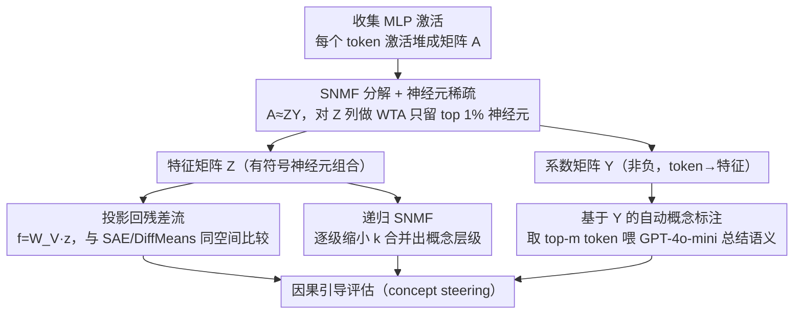

# Constructing Interpretable Features from Compositional Neuron Groups

**会议**: ACL 2026  
**arXiv**: [2506.10920](https://arxiv.org/abs/2506.10920)  
**代码**: <https://github.com/ordavid-s/snmf-mlp-decomposition>  
**领域**: 可解释性 / 机械可解释性 / LLM 内部表示  
**关键词**: SNMF、MLP 分解、特征引导、稀疏自编码器、概念层级

## 一句话总结
作者用半非负矩阵分解（SNMF）直接把 MLP 激活拆成"稀疏神经元组 × 非负系数"，得到既能映射回激活上下文又能跨层组合的可解释特征，在 Llama-3.1-8B / Gemma-2-2B / GPT-2 上的因果引导（concept steering）评估全面超过最新 SAE（Llamascope / Gemmascope）和强监督基线 DiffMeans。

## 研究背景与动机

**领域现状**：机械可解释性的核心问题是"用什么单元解释 LLM"。早期看单个神经元，但已知它们是多义的；近年共识转向"激活空间的方向"，主流做法是稀疏自编码器（SAE）从残差流学一个"特征字典"。

**现有痛点**：SAE 在因果评估里频繁失效——直接干预 SAE 特征往往无法定向改变模型行为；而且 SAE 学到的方向不被强制约束在原模型的表示空间里，也不和具体的 MLP 计算挂钩，导致其"可解释性"很大程度上靠后验自然语言标注硬贴。

**核心矛盾**：从零学一组方向 vs 模型内部本来就存在的神经元组合——前者灵活但脱离机制，后者天然有机制锚点但需要无监督方法把它们挖出来。

**本文目标**：给出一种无监督方法，使得发现的"特征"满足：(1) 是 MLP 神经元的稀疏线性组合，(2) 自带从特征到激活上下文的反向映射，(3) 在因果干预下真能定向改变生成。

**切入角度**：MLP 输出本来就是 $\sum_i a_i \mathbf{v}_i$（神经元激活加权向量列），那相似输入应当激活相似神经元组——只要能从激活矩阵 $A$ 把这种"共激活模式"分解出来，特征就天然带机制锚点。

**核心 idea**：用 SNMF 把 MLP 激活 $A \approx Z Y$ 分解，$Z$ 是允许正负的"特征矩阵"（神经元线性组合），$Y$ 强制非负作为"系数矩阵"（哪些 token 触发了这个特征）——非负的 $Y$ 鼓励 parts-based 加性表示，正负 $Z$ 适配 MLP 激活的双向语义。

## 方法详解

### 整体框架

核心想法是：MLP 输出本来就是 $\sum_i a_i \mathbf{v}_i$，即一组神经元按激活值加权叠加，那么相似输入应当触发相似的神经元组合，只要把这种共激活模式从激活矩阵里分解出来，特征就天然锚定在模型的真实计算上。具体地，对预训练 LLM 的某一层 MLP，先在大量文本上前向，收集每个 token 在该层的激活向量 $\mathbf{a} \in \mathbb{R}^{d_a}$ 堆成矩阵 $A \in \mathbb{R}^{d_a \times n}$；再用半非负矩阵分解解 $A \approx Z Y$，得到 $k$ 个 MLP 特征 $\mathbf{z}_i$（$d_a$ 维的神经元加权方向）和非负系数矩阵 $Y$。每个特征乘 $W_V$ 投影回残差流得到 $\mathbf{f}_i = W_V \mathbf{z}_i$，从而能和 SAE / DiffMeans 在同一空间公平比较；而 $Y$ 直接给出每个特征被哪些 token 强激活，自带 SAE 缺失的"激活上下文"标注。

### 关键设计

**1. SNMF 分解 + 神经元稀疏：让特征是少量神经元的有符号线性组合**

SAE 用非负正则鼓励 parts-based 表示，但 MLP 激活本身有正有负、对应概念的促进与抑制，强行让特征非负会丢掉一半语义。SNMF 正好放松"特征非负"、只保留"系数非负"：用 Ding 等的 Multiplicative Updates 交替更新 $Z$（闭式 $Z \leftarrow A Y^\top (Y Y^\top + \lambda I)^{-1}$，允许正负）和 $Y$（带正负部分分解的乘法更新，保持非负），既留住激活的双向语义又保证系数侧的加性可解释。每次迭代后对 $Z$ 的每列做硬 winner-take-all，只保留绝对值 top $p\%=1\%$ 的神经元、其余清零——这是 Peharz & Pernkopf 2012 的 $\ell_0$ 约束方案，强制每个特征只由极少数神经元构成；实验证明 1% 显著优于 5% / 10%。

**2. 基于 $Y$ 的自动概念标注：把 token-to-feature 归因变成方法的内置闭环**

SAE 的特征描述得靠 Neuronpedia / autointerp 这类第三方流水线、按纯激活值排序硬贴标签，而 SNMF 的系数矩阵 $Y$ 本身就编码了"哪些 token 触发了哪个特征"。对特征 $\mathbf{z}_i$ 直接从 $Y$ 第 $i$ 行取 top-$m$ token，把它们的上下文喂给 GPT-4o-mini 总结共同语义模式：浅层用"激活输入"描述、深层用 logits lens 风格的"输出 token"描述（Gur-Arieh 2025）。这一自带归因既让方法独立闭环，也解释了 SNMF 为何在 concept detection 上常领先——其特征的 log-ratio $S_{CD} := \log \bar{a}_{\text{act}} / \bar{a}_{\text{neutral}}$ 均值更高，即激活在相关上下文上更集中。

**3. 递归 SNMF：用越来越小的 $k$ 暴露"具体 → 抽象"的概念层级**

把学到的 MLP 特征再用更小的 $k$ 反复分解，能自然长出层级树。做法是先以 $k=[400,200,100,50]$ 跑多级 SNMF，再用梯度下降联合微调全部层级以最小化 $\mathcal{L} = \frac{1}{2}\|A - Z_L Y_L \cdots Y_1 Y_0\|_F^2$，得到"周一/周二 → 工作日/周末 → 星期"的合并轨迹；同时对 $Z$ 二值化算 $M = \bar{Z}\bar{Z}^\top$ 可视化同义概念的神经元重叠。这恰是 SAE feature splitting 的反方向——SAE 放大字典时一个特征裂成多个，SNMF 缩小 $k$ 时多个特征合成一个抽象概念。进一步对"工作日 base 神经元"与"Monday-only 独占神经元"分别做因果干预，证明模型确实以"核心 + 专属"的组合方式搭建概念。

### 损失函数 / 训练策略

SNMF 最小化 Frobenius 重建误差 $\|A - ZY\|_F^2$，外加仅对 $Y$ 的非负约束与对 $Z$ 列的 WTA 稀疏。初始化方面，$Y \sim \mathcal{U}(0,1)$、$Z \sim \mathcal{N}(0,1)$ 的随机初始化与 SVD / K-Means 性能相当，只是收敛更慢（3325 vs 1484 / 2474 迭代）。所有实验取 $k \in \{100, 200, 300, 400\}$、$p=1\%$（GPT-2 用 5\%）。

## 实验关键数据

### 主实验（因果引导：concept steering + fluency 谐波均值，越高越好）

| 模型 / 层 | SAE-out | SAE-act（同容量） | DiffMeans（监督） | SNMF（本文） |
|-----------|---------|-------------------|-------------------|--------------|
| Llama-3.1-8B L23 | ≈0.35 | ≈0.37 | ≈0.40 | **0.45** |
| Llama-3.1-8B L31 | ≈0.20 | ≈0.25 | ≈0.27 | **0.31** |
| Gemma-2-2B L18 | 较低 | 中等 | 中等 | **最高** |
| GPT-2 Small | 类似趋势 | 类似趋势 | 类似趋势 | **领先** |

> Concept Detection 上 SNMF 与 SAE-out 大致持平、显著超过同容量 SAE-act（>75% 的特征 $S_{CD} > 0$），但 SNMF 真正决定性优势在 Concept Steering。

### 消融实验（Llama-3.1-8B，SNMF $k=100$）

| 配置 | Concept Detection（L0） | Concept Steering+Fluency（L23） | 说明 |
|------|------------------------|-------------------------------|------|
| Random init | 2.99 ± 1.55 | 0.45 ± 0.32 | 默认 |
| SVD init | 2.76 ± 1.79 | 0.41 ± 0.31 | 性能相当但收敛快 |
| K-Means init | 2.55 ± 1.51 | 0.47 ± 0.33 | 1484 迭代收敛 |
| WTA = 1% | 2.99 / 1.67 / 0.81 / 2.35 / 1.89 / 0.48 | 0.45 ± 0.32 | 论文默认，最佳 |
| WTA = 5% | 全面略低 | 0.41 ± 0.30 | 稀疏度下降 |
| WTA = 10% | 全面略低 | 0.34 ± 0.30 | 进一步退化 |

层级实验（GPT-2 Large 因果干预，Table 2 节选）：

| 干预的神经元组 | Monday logit | Tuesday | Friday | Sunday |
|----------------|--------------|---------|--------|--------|
| Monday-exclusive | **+2.0** | -0.8 | -0.8 | -0.1 |
| Friday-exclusive | -2.9 | -2.8 | **+1.3** | -2.6 |
| Sunday-exclusive | -0.4 | -1.7 | -0.8 | **+2.6** |
| **Core 工作日（base）** | **+5.8** | **+5.7** | **+6.0** | **+4.7** |

### 关键发现
- SNMF 在因果引导上稳定超过 SAE-out 和 DiffMeans，证明"内嵌在 MLP 权重里的神经元组合"才是真正的可干预单元，而 SAE 学到的方向往往不能定向操控行为。
- 递归 SNMF 暴露的层级结构（个别工作日 → 周末/工作日 → 星期）和"工作日 base 神经元 + 每天 exclusive 神经元"的双层组合机制，给"SAE feature splitting"现象提供了机制级解释——splitting 不是 SAE 训练副产品，而是模型本身用神经元组合构造细化概念的反映。
- 1% WTA 稀疏度 + 随机初始化是最优 trade-off；性能对初始化策略相当鲁棒，K-Means 主要带来收敛加速。
- 浅层（layer 0/1）concept detection 分数最高的现象提示：未经过多注意力混合的激活更易解构出单义特征。

## 亮点与洞察
- SNMF 选择是"非负正则只放在系数上"的正解：MLP 激活本身有正有负、对应概念的促进 vs 抑制，强行让特征非负（如 NMF）会丢掉这一半信息。
- 系数矩阵 $Y$ 自带 token-to-feature 反向映射，省去 Neuronpedia / autointerp 的第三方描述流水线，使方法可独立闭环。
- 把 SAE 的"feature splitting"重新解释成"模型自身的 feature merging 的反向投影"是一个范式级洞察——它把"找特征"和"理解模型如何用神经元搭概念"统一成同一件事。
- 双层"core base + exclusive 神经元"的因果证据（核心激活推所有相关 token，专属激活只推自己抑制兄弟）非常优雅，可以迁移到月份、季节、数字、语法属性等其他线性结构概念的研究。

## 局限与展望
- 实验 $k < 500$，对超大字典（数千到百万 SAE 那样）尚未验证可扩展性；Multiplicative Updates 优化器不易加正则、未来可能需要换 projected gradient descent。
- 一些层（Gemma-2-2B layer 12）出现"$k$ 增大反而下降"现象，提示该层有意义概念数比 $k$ 少，需要自动选 $k$ 的策略。
- 评估强依赖 GPT-4o-mini judge（人工 Spearman ρ=0.8 验证），仍可能对 prompt 敏感。
- 当前 fluency 在 layer 0 干预上掉得很厉害，浅层引导的"propagation 副作用"未被系统建模。

## 相关工作与启发
- **vs SAE（Bricken et al. / Gemmascope / Llamascope）**：SAE 从残差流学方向、规模大但因果失效；SNMF 在 MLP 激活上直接分解、规模小但因果强。两者互补——SAE 给广度，SNMF 给机制锚点。
- **vs DiffMeans（监督基线）**：DiffMeans 用 positive/negative 平均差直接拿到方向，受无关概念噪声影响大；SNMF 在浅层尤其明显优于它。
- **vs Yun et al. 2021（残差流 NMF）**：他们在残差流做 NMF 主要用于语言学分析；本文在 MLP 激活做 SNMF 并把每个特征锚定到具体神经元组合 + 引入因果评估。
- **vs Cao et al. 2025（NeurFlow）**：同样关心神经元组的功能聚类，本文把它放到 LLM MLP + 无监督因果场景下。

## 评分
- 新颖性: ⭐⭐⭐⭐⭐ SNMF + WTA + 递归层级 + token-to-feature 反映射的组合在 LLM 可解释性社区是新角度
- 实验充分度: ⭐⭐⭐⭐ 三模型 × 多层 × 多 $k$ × 因果 + 检测双轴，但 $k$ 较小、未与 RAVEL / MIB 等大型 benchmark 直接对比
- 写作质量: ⭐⭐⭐⭐⭐ 公式清晰、附录详尽（初始化、稀疏度、层级数据集）、提供完整工作日案例研究
- 价值: ⭐⭐⭐⭐⭐ 给 MI 社区提供了一条"MLP 内嵌特征"路线，且开源代码，对未来研究有直接 actionable 价值

<!-- RELATED:START -->

## 相关论文

- [\[ACL 2026\] Compositional Steering of Large Language Models with Steering Tokens](compositional_steering_of_large_language_models_with_steering_tokens.md)
- [\[ACL 2026\] DPN-LE: Dual Personality Neuron Localization and Editing for Large Language Models](dpn-le_dual_personality_neuron_localization_and_editing_for_large_language_model.md)
- [\[CVPR 2026\] Language Models Can Explain Visual Features via Steering](../../CVPR2026/interpretability/language_models_can_explain_visual_features_via_steering.md)
- [\[CVPR 2026\] CI-ICE: Intrinsic Concept Extraction Based on Compositional Interpretability](../../CVPR2026/interpretability/ciice_intrinsic_concept_extraction_compositional.md)
- [\[ACL 2026\] Model Internal Sleuthing: Finding Lexical Identity and Inflectional Features in Modern Language Models](model_internal_sleuthing_finding_lexical_identity_and_inflectional_features_in_m.md)

<!-- RELATED:END -->
