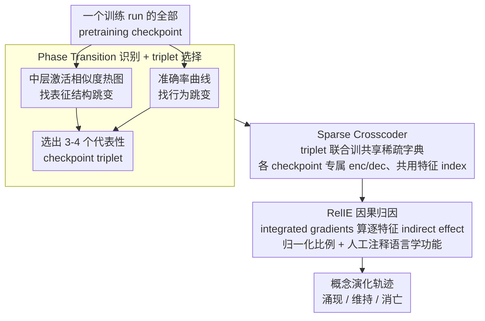

# Crosscoding Through Time: Tracking Emergence & Consolidation Of Linguistic Representations Throughout LLM Pretraining

**会议**: ACL 2026  
**arXiv**: [2509.05291](https://arxiv.org/abs/2509.05291)  
**代码**: [github.com/bayazitdeniz/crosscoding-through-time](https://github.com/bayazitdeniz/crosscoding-through-time)  
**领域**: LLM 可解释性 / 训练动态 / 表征学习  
**关键词**: sparse crosscoder, pretraining dynamics, RelIE, 因果归因, 句法概念涌现

## 一句话总结
用 sparse crosscoder 在同一 LLM 的多个 pretraining checkpoint 间训练一个共享特征字典，并提出 Relative Indirect Effect (RelIE) 度量逐特征的因果重要性如何在 token 数量推移中"涌现/维持/消失"，从而首次在 Pythia/OLMo/BLOOM 上观察到 LLM 从"特定子词检测器"逐步内化为"抽象句法/跨语言检测器"的概念级演化轨迹。

## 研究背景与动机

**领域现状**：理解 LLM "什么时候学会了什么能力"主要靠两类方法——(a) 在 BLiMP 等代理任务上跑准确率曲线、看 phase transition；(b) 看激活/参数空间的相似度变化。最近 SAE（稀疏自编码器）被用来把单一 checkpoint 的稠密激活解构成可解释的稀疏特征字典，得到了 subject-verb agreement、parenthesis matching 等机制的细粒度刻画。

**现有痛点**：

1. 准确率/激活相似度只能告诉你"哪一步发生了变化"，但不能说明"模型内部发生了什么概念级的转变"；
2. 给每个 checkpoint 单独训一个 SAE，每个 SAE 的特征空间互不通约——没法回答"checkpoint A 的 feature 17 和 checkpoint B 的 feature 17 是不是同一个东西"；
3. crosscoder 框架已被提出（学习多模型间的共享特征空间），但目前只用在 post-training 比较（pretrained vs instruction-tuned），从没有人把它用在 pretraining 时间维度上。

**核心矛盾**：要追踪"概念在 pretraining 哪一刻涌现并稳定下来"，需要一个能跨 checkpoint 直接对比特征的解释器；同时，"共享特征字典"自身只能告诉你某个 feature 在两个 checkpoint 上谁的解码器范数更大（结构相似性），但不能告诉你它对任务实际贡献多大（因果重要性）——这两个信息必须正交地获得。

**本文目标**：

- 子问题 1：能否训出一个跨多个 pretraining checkpoint 共享的稀疏特征字典（且对极早期接近随机的 checkpoint 也鲁棒）？
- 子问题 2：在共享字典里，怎样独立度量每个特征对每个 checkpoint 的因果贡献，从而追踪"涌现-维持-消亡"轨迹？

**切入角度**：把 Lindsey et al. 2024 的 crosscoder 从"两个 post-trained 模型"拓展到"同一个训练 run 的 triplet checkpoints"，并在 SAE 社区已有的 integrated-gradients-based indirect effect 工具上设计一个新的归一化比例度量 RelIE，把"结构相对性"和"因果相对性"完全分开。

**核心 idea**：**Crosscoder + RelIE = 时间轴上的概念级因果归因**。用 crosscoder 解决"特征跨 checkpoint 对齐"，用 RelIE 解决"特征贡献在哪个 checkpoint 真的发生"。

## 方法详解

### 整体框架

目标是追踪一个语言学概念在预训练的哪一刻涌现、又在哪一刻稳定下来。难点在于给每个 checkpoint 单独训 SAE 得到的特征空间互不通约——没法判断 checkpoint A 的 feature 17 和 B 的 feature 17 是不是同一个东西。方法用一条三步流水线绕过这点：先在目标语法任务上结合准确率曲线和中层激活相似度热图，挑出 3-4 个"概念真正变化"的代表性 checkpoint（triplet）；再在这组 triplet 上联合训一个共享稀疏字典（sparse crosscoder），让所有 checkpoint 共用同一组特征 index；最后用 integrated gradients 算每个特征的因果重要性，并用新提出的 RelIE 做归一化对比，把每个 top 特征的语言学功能人工注释出来，从而画出"涌现-维持-消亡"的轨迹。下面三个关键设计按这条流水线的先后顺序展开。

### 关键设计

**1. Phase Transition 识别 + checkpoint triplet 选择：把训练算力花在概念真正变化的节点上**

在每对 checkpoint 都训 crosscoder 极其昂贵，因此第一步要先定位关键节点。方法并行追踪两条信号：(a) checkpoint 在目标 benchmark 上的准确率曲线，找行为跳变；(b) 各 checkpoint 之间的**中层**激活成对 cosine 相似度热图，找表征结构跳变——只取中层是因为它捕捉高阶语言/跨语言抽象，而前后层主要绑在输入/输出上。两条信号常不同步，例如 OLMo 准确率 33B 后基本平稳但激活相似度直到 3T 仍在变，这种"准确率饱和但表征仍在精炼"正是 crosscoder 最有价值的研究区。双信号策略保证选出的 triplet 既含行为跳变又含表征跳变，对应论文里 Pythia 选 {128M, 1B, 4B, 286B}、OLMo 选 {2B, 4B, 33B, 3T}、BLOOM 选 {550M, 6B, 55B, 341B}。

**2. Sparse Crosscoder：跨 checkpoint 共享的稀疏特征字典**

选好 triplet 后，第二步要解决"特征跨 checkpoint 对齐"。传统 SAE 的特征空间是单点的、不可通约，无法在时间轴上对齐。crosscoder 让每个 checkpoint $c$ 拥有专属的 encoder/decoder 权重 $W_{\text{enc}}^c, W_{\text{dec}}^c$，却共用同一个特征激活向量——编码为 $\mathbf{f}=\text{ReLU}(\sum_c W_{\text{enc}}^c \mathbf{x}_c + \mathbf{b}_{\text{enc}})$，于是"checkpoint A 的 feature $i$"和"B 的 feature $i$"天然指向同一个概念槽。损失为各 checkpoint 重建误差之和加上聚合稀疏惩罚 $\sum_c \sum_i \mathbf{f}_i \lVert W_{\text{dec},i}^c \rVert_2$；这种 aggregated sparsity 把"共享特征 vs 某 checkpoint 独有特征"翻译成"各 checkpoint decoder 范数大小"的可读信号，使特征的时间演化首次可比较，且对极早期、接近随机的 checkpoint 仍稳健（§6.2 验证 ΔCE < 0.35）。

**3. Relative Indirect Effect (RelIE)：把因果重要性从结构相对性中解耦出来**

有了共享字典还不够——它只能告诉你某特征在哪个 checkpoint 被编码得更强（结构），但一个特征可能被强力学到却对当前任务毫无因果作用。第三步的 RelIE 直接挂上任务表现做归因：对每个特征 $f_i$、每个 checkpoint $c$，用 integrated gradients 近似它对任务 metric $m(x) = \log p(t_{\text{wrong}}|x) - \log p(t_{\text{correct}}|x)$ 的 indirect effect（零消融时 $m$ 的变化），再算归一化比例 $\text{RelIE}_{2\text{-way},i} = |\hat{\text{IE}}_{ig,i}^{c_2}| / (|\hat{\text{IE}}_{ig,i}^{c_1}| + |\hat{\text{IE}}_{ig,i}^{c_2}|)$，三 checkpoint 版本扩展为 one-vs-all 向量。RelIE 接近 1 表示该特征几乎只对 $c_2$ 有因果作用，接近 0.5 表示两个 checkpoint 上都贡献（共享因果特征）。它与 Lindsey et al. 的 RelDec（解码器范数比例，只反映结构）正交：附录 E 证实 RelIE 能过滤掉 task-agnostic 噪声、暴露出更多真正驱动行为的 task-specific 特征。

### 损失函数 / 训练策略

Crosscoder 损失联合各 checkpoint 重建误差与上式的 aggregated sparsity，字典大小固定为 $2^{14}$，训练数据在各模型对应的 Pile / Dolma / mC4 多语言子集上各采样 400M tokens。归因侧统一用 integrated gradients 近似 IE、zero-ablation 作为 patching。三种模型各有分工：Pythia-1B 早期 checkpoint 密集适合看涌现、OLMo-1B 训练超长适合看维持、BLOOM-1B 多语言适合看跨语言抽象。

## 实验关键数据

### 主实验

下表是论文核心定性结果（Table 1）：在 Pythia-1B 的 1B↔4B↔286B 三 checkpoint crosscoder 上，按 RelIE 把特征分类：

| 类别 | RelIE [1B, 4B, 286B] | 特征示例 | 含义 |
|---|---|---|---|
| 1B-4B 共享 | [0.53, 0.33, 0.15] | 检测子词 -ans (vans/cans...) | 早期特定 token 检测器 |
| 1B-286B 共享 | [0.52, 0.01, 0.46] | 检测 man (常为单数名词) | 跨阶段的 lexical 特征 |
| 4B 独有 | [0.00, 1.00, 0.00] | 多词科学复合名词检测 | 中期短暂的抽象概念 |
| 4B 独有 | [0.02, 0.68, 0.30] | 复数人称名词 (people/students) | 群体级抽象涌现 |
| 286B 独有 | [0.00, 0.18, 0.82] | 动名化名词 (reactions, inclusion) | 最后阶段才稳定的语法抽象 |
| 286B 独有 | [0.00, 0.01, 0.99] | 介词检测器 | 准确率平稳后才出现的功能词检测 |

跨语言扩展（BLOOM-1B 在 CLAMS 上）：6B 阶段还有 fra/por/spa 专用的 év 子词检测器；到 55B-341B 共享阶段，特征演化为跨 ar/en/fr/pt/es 的"多语言关系代词检测器"（que/that/who/aladhi）——清晰展示"语言专用 → 跨语言抽象"的合并轨迹。

定量上：Pythia-1B 在 128M→4B tokens 区间 BLiMP 准确率从 ~50% 跃升到 >90%（一次 phase transition），随后 4B→286B 准确率基本平稳但中层激活相似度热图持续变化，说明 RelIE 在准确率平稳期仍能捕捉到概念级演化。

### 消融实验

| 配置 | ΔCE / 关键观察 | 含义 |
|---|---|---|
| Crosscoder on 已训练 triplet | ΔCE < 0.2 | 中后期 checkpoint 重建质量很好 |
| Crosscoder on 早期 + 后期 mix | ΔCE ≈ 0.35 (略升 + 更多 dead features) | 早期接近随机的 checkpoint 仍可学到稀疏字典，但 dead feature 增多 |
| RelDec only (论文附录 E) | 暴露大量 task-irrelevant 特征 | 仅靠结构相对性的局限 |
| RelIE (本文) | 显著缩到 task-driving 特征子集 | 验证因果归一化的必要性 |
| Top-100 IE features pairwise vs triplet | 趋势一致 | 三 checkpoint 训练不引入额外偏差 |

### 关键发现

- **概念演化遵循"具体 → 抽象"轨迹**：1B 时期 top features 是子词/不规则形式检测器，4B 时期变为多词复合名词/群体名词，286B 时期是介词/动名化等功能词与高阶语法 — 完美对应"先记 token、再学结构"的学习假说。
- **准确率平台 ≠ 表征静止**：OLMo 准确率在 33B 已经饱和，但中层激活相似度一直变化到 3T；新涌现的 feature（如"描述职业/技能的复数名词"）证明 LLM 即使在 benchmark 已经满分时仍在重组内部表征。
- **跨语言抽象会在 pretraining 后期合并**：BLOOM 早期是 fr/pt/es 各自的 év 类子词检测器，55B-341B 才合并成跨 6 种语言的关系代词检测器——首次直接观测到多语言模型从"语言专用 → 跨语言共享"的特征压缩过程。
- **早期 checkpoint 也可被稀疏字典覆盖**：传统 SAE 在完全随机模型上无法工作，但 crosscoder 用 aggregated sparsity 在 128M tokens 这种部分训练的早期点仍能学到可解释字典（ΔCE 可控），扩大了机制可解释性的适用范围。

## 亮点与洞察

- **RelDec / RelIE 的解耦**是这篇最值得记住的方法论：把"结构相对性"（特征被哪个 checkpoint 编码得更强）和"因果相对性"（特征在哪个 checkpoint 真正影响行为）分开度量；前者像"形态"，后者像"功能"——可以直接迁移到任何 checkpoint 比较场景，例如 RLHF 前后、持续学习前后、跨模型 distillation 前后。
- **Phase Transition Identification 用"准确率 + 中层激活相似度"双信号**是一个被低估的小技巧：很多机制可解释性工作只看准确率曲线，会漏掉"准确率平了但表征还在变"的关键阶段（如 OLMo 33B 之后），双信号让 crosscoder 的训练资源花在刀刃上。
- **从子词检测器到介词检测器的轨迹**给了一个很形象的"AI 学语言"画面：模型不是一次性学会 grammar，而是先粗糙建立"哪些 token 经常一起出现"，再逐步用句法范畴重组它们——这跟 child language acquisition 的"item-based → schema-based"理论有强类比，潜在的认知科学交叉价值很高。

## 局限与展望

- 字典大小固定在 $2^{14}$，对 1B 模型已经足够，扩到更大模型时是否需要按比例放大尚未验证；training compute 也会显著增长（每对 triplet 都要训一个新 crosscoder）。
- 任务集中在 subject-verb agreement（BLiMP/MultiBLiMP/CLAMS），其他语言学现象（指代消解、长程依赖、语义角色）是否呈现相同的"具体→抽象"轨迹尚需扩展。
- RelIE 用 integrated gradients 近似 IE，依赖 zero-ablation 作为 patching；零激活并不总是 in-distribution 的反事实，未来可改成 mean-ablation 或 distribution-matched ablation 复测。
- 论文只覆盖 1B 级模型；7B/70B 量级模型的预训练动态是否仍展示这种清晰的轨迹，尤其是"准确率平台后表征仍演化"是否更夸张，是一个非常值得做的扩展。

## 相关工作与启发

- **vs Lindsey et al. 2024（crosscoder 原作）**：他们把 crosscoder 用在 post-training（pretrained vs instruction-tuned）比较；本文是首次将其拓展到同一训练 run 的多个 pretraining checkpoint，把"跨模型"换成"跨时间"。
- **vs Kangaslahti et al. 2025 (POLCA)**：POLCA 通过训练 loss patterns 发现概念级 phase transition，回答"什么时候"涌现；本文回答"涌现的是哪个具体的 representational role"，两条路径互补。
- **vs Marks et al. 2025 / Hanna & Mueller 2025**：他们做单一 final checkpoint 的电路/特征级分析；本文把这种分析嫁接到时间轴，提供"机制何时形成"的视角。
- **vs Wu et al. 2020 / Saphra & Lopez 2019**：传统 training dynamics 工作看激活/参数变化，但无法绑定到可解释的概念上；crosscoder + RelIE 终于把"动态"和"可解释概念"接起来。

## 评分

- 新颖性: ⭐⭐⭐⭐⭐ 第一次把 crosscoder 用在 pretraining 时间维度，并提出 RelIE 把"结构 vs 因果"解耦，方法论贡献清晰且可复用。
- 实验充分度: ⭐⭐⭐⭐ 三个开源模型族 × 三个语法 benchmark，验证了 crosscoder 对早期 checkpoint 的鲁棒性；但只到 1B 规模、只在 subject-verb agreement 任务上，覆盖面可以更广。
- 写作质量: ⭐⭐⭐⭐ 概念图（Fig 1）和 RelIE 三维示意（Fig 4）非常直观，注释表格（Table 1/2）信息密度高；公式编号略复杂，需要回看。
- 价值: ⭐⭐⭐⭐ 给机制可解释性社区提供了一个新的时间维度工具，并为"为什么准确率饱和后模型还在改变"这种工业现象提供了直接证据。

<!-- RELATED:START -->

## 相关论文

- [\[ICLR 2026\] Grokking in LLM Pretraining? Monitor Memorization-to-Generalization without Test](../../ICLR2026/interpretability/grokking_in_llm_pretraining_monitor_memorization-to-generalization_without_test.md)
- [\[ACL 2026\] Rhetorical Questions in LLM Representations: A Linear Probing Study](rhetorical_questions_in_llm_representations_a_linear_probing_study.md)
- [\[ACL 2026\] Do LLMs Capture Embodied Cognition and Cultural Variation? Cross-Linguistic Evidence from Demonstratives](do_llms_capture_embodied_cognition_and_cultural_variation_cross-linguistic_evide.md)
- [\[ICML 2026\] CorrSteer: Generation-Time LLM Steering via Correlated Sparse Autoencoder Features](../../ICML2026/interpretability/corrsteer_generation-time_llm_steering_via_correlated_sparse_autoencoder_feature.md)
- [\[ICML 2026\] Memorization Dynamics of Fill-in-the-Middle Pretraining](../../ICML2026/interpretability/memorization_dynamics_of_fill-in-the-middle_pretraining.md)

<!-- RELATED:END -->
