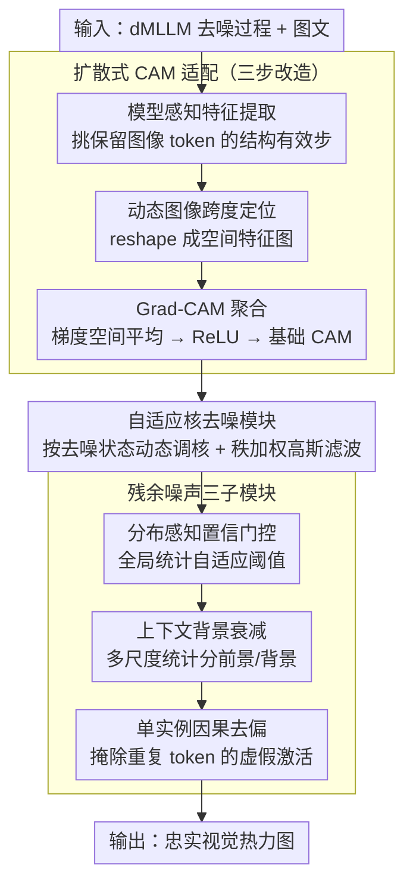

# Diffusion-CAM: Faithful Visual Explanations for dMLLMs

**会议**: ACL 2026  
**arXiv**: [2604.11005](https://arxiv.org/abs/2604.11005)  
**代码**: [GitHub](https://github.com/ZzzzzZhhmm/Diffusion-CAM)  
**领域**: 图像复原  
**关键词**: 扩散多模态模型, 类激活映射, 视觉解释, 可解释AI, 并行生成

## 一句话总结
提出 Diffusion-CAM，首个专为扩散式多模态大语言模型（dMLLM）设计的可解释性方法，通过在去噪轨迹中提取结构有效的中间表征并配合四个后处理模块（自适应核去噪、分布感知置信门控、上下文背景衰减、单实例因果去偏），在 COCO Caption 和 GranDf 上显著超越自回归 CAM 基线。

## 研究背景与动机

**领域现状**：多模态 LLM 正从自回归架构（LLaVA、Qwen-VL）向扩散式架构（LaViDa、LLaDA-V、MMaDA）范式转变。扩散式模型通过并行掩码去噪生成整个句子，提升了生成速度和全局连贯性。

**现有痛点**：(1) 现有 CAM 方法（如 LLaVA-CAM、TAM）依赖自回归模型的顺序、注意力丰富的特性来追踪 token 生成——但 dMLLM 没有显式的 token 级注意力权重，也没有从左到右的因果结构；(2) 直接将传统 CAM 应用于 dMLLM 会产生弥散的、非特异性的热力图；(3) dMLLM 的并行去噪过程产生平滑、分布式的激活模式，与自回归的局部、顺序依赖性本质不同。

**核心矛盾**：dMLLM 的架构优势（并行生成、全局规划）恰恰是传统可解释性工具的障碍——后者假设顺序依赖但前者是并行的。

**本文目标**：设计首个适配扩散式多模态模型的视觉解释方法。

**切入角度**：在去噪轨迹中找到"结构有效"的中间步——图像条件化的空间信息仍被保留且可以通过梯度链接到最终预测。

**核心 idea**：从去噪过程的结构有效步提取梯度 CAM + 四个扩散特定的后处理模块解决空间噪声、背景弥散和冗余 token 相关等问题。

## 方法详解

### 整体框架

Diffusion-CAM 要解决的是"传统 CAM 默认顺序注意力，而 dMLLM 是并行去噪"这一根本错位。它先在 dMLLM 的中间 transformer 块挂上 hook，从去噪轨迹中挑出仍保留完整图像条件信息的"结构有效步"，提取该步的图像 token 特征与梯度；再把最终响应分数反向传播到图像区域，按 Grad-CAM 方式聚合出一张基础热力图；最后串接四个针对扩散噪声特性设计的后处理模块，把这张弥散、带架构伪影的粗图精炼成定位准确、背景干净的视觉解释。输入是 dMLLM 的去噪过程与图文，中间是有效步上的梯度归因，输出是忠实的视觉热力图。

### 关键设计

**1. 扩散式 CAM 适配（三步改造）：让梯度归因兼容非自回归的去噪生成**

dMLLM 既没有从左到右的因果结构，也没有显式的 token 级注意力权重，直接套用 CAM 会失效，因此这里用一条通用的可行性判据来改造。第一步是模型感知特征提取——只选取那些 hook 隐状态序列里仍完整包含图像 token 跨度的去噪步，保证归因来自尚未丢失图像条件信息的中间状态；第二步是动态图像跨度定位，从 info4cam 元数据解析出图像 token 的边界，把对应特征 reshape 成空间特征图；第三步是 Grad-CAM 聚合，对梯度做空间平均得到通道权重，加权求和后经 ReLU 得到基础 CAM。整套流程不预设固定的图像 token 位置或特定去噪步，而是靠可行性判据自适应地挑步，这正是它能迁移到不同 dMLLM 的关键。

**2. 自适应核去噪模块：按去噪状态动态调核，抑制自注意力的高频伪影**

Transformer 自注意力会在热力图上留下高频架构伪影，而固定大小的滤波核无法适配不同去噪步、不同图像内容下变化的噪声特征。该模块改为动态缩放滤波核尺寸 $k_{\text{adaptive}}$，同时考量三个因素：去噪步数（步数越多核越大）、空间方差（噪声高时核增大）、以及分辨率（保证尺度不变性）。更进一步，它用秩加权高斯滤波——按激活值大小排序来分配权重，而非按空间距离，这样在平滑伪影的同时尽量保住高激活语义区域的结构。

**3. 分布感知置信门控 + 上下文背景衰减 + 单实例因果去偏：三个子模块各清一类残余噪声**

扩散模型的多步去噪会叠加多种噪声源，单一手段难以兼顾，于是这一设计用三个互补子模块逐一收尾。分布感知置信门控根据全局统计量自适应地确定阈值，对高/低置信区域差异化处理，压掉高方差激活伪影；上下文背景衰减借助多尺度统计集成（阈值如 $\delta_\sigma$、$\delta_\mu$）划定前景/背景的分离边界，消除背景里弥散的残留信号；单实例因果去偏则检测重复 token 并掩除其异常高的激活，去掉冗余 token 带来的虚假响应。三者缺一不可——消融显示任一模块缺席，热力图都会在某一类噪声上退化。

## 实验关键数据

### 主实验（COCO Caption + GranDf）

| 方法 | 定位准确率 | 背景抑制 | 视觉保真度 |
|------|---------|---------|---------|
| LLaVA-CAM | 基线 | 弱 | 弱 |
| Grad-CAM (直接应用) | 差 | 差 | 差 |
| **Diffusion-CAM** | **SOTA** | **SOTA** | **SOTA** |

### 消融实验

| 模块 | 贡献 |
|------|------|
| 自适应核去噪 | 抑制高频伪影，提升热力图平滑度 |
| 置信门控 | 区分语义区域和噪声 |
| 背景衰减 | 消除弥散背景响应 |
| 因果去偏 | 消除重复 token 引起的冗余激活 |
| **四模块联合** | **最优，各模块互补** |

### 关键发现
- **直接将自回归 CAM 应用于 dMLLM 完全失效**——产生弥散的、不可解释的热力图
- **四个后处理模块各解决一个特定问题，缺一不可**
- **去噪步的选择至关重要**：只有在结构有效的步才能提取有意义的视觉归因
- **Diffusion-CAM 在定位准确率和视觉保真度上显著超越所有基线**

## 亮点与洞察
- **首次揭示了 dMLLM 可解释性的根本挑战**：并行生成 vs 顺序依赖的冲突。随着扩散式架构的流行，这个问题会越来越重要
- **"结构有效步"的概念**提供了一个通用原则——在非自回归模型中，归因应从保留输入条件化空间信息的中间状态提取
- **四模块设计**虽然看似工程导向，但每个模块都有清晰的理论动机（噪声分析）

## 局限与展望
- 目前仅在 LaViDa 系列上验证，其他 dMLLM（如 LLaDA-V、MMaDA）的适配性待确认
- 四个模块的超参数（如 $\delta_\sigma$, $\delta_\mu$）需要根据模型调整
- 梯度回传路径在并行去噪中可能不唯一，归因的因果有效性需要更深入分析
- 计算开销比自回归 CAM 大（需要存储去噪中间状态）
- 未探索文本 token 级的归因（目前只做视觉区域归因）

## 相关工作与启发
- **vs LLaVA-CAM**: 专为自回归模型设计，直接用于 dMLLM 效果极差。Diffusion-CAM 是必要的替代
- **vs DAAM (Tang et al.)**: DAAM 做文生图扩散模型的归因，但目标和方法与多模态推理不同
- **vs 注意力可视化**: dMLLM 没有显式的自回归注意力权重，注意力方法不适用

## 评分
- 新颖性: ⭐⭐⭐⭐ 首个 dMLLM 可解释性方法，但核心思路（梯度 CAM + 后处理）不新
- 实验充分度: ⭐⭐⭐⭐ 两个基准+消融+对比，但 dMLLM 生态尚小
- 写作质量: ⭐⭐⭐⭐ 问题动机清晰，四模块设计有条理
- 价值: ⭐⭐⭐⭐ 随着 dMLLM 普及，这项工作的重要性会增长

<!-- RELATED:START -->

## 相关论文

- [\[CVPR 2026\] Towards Faithful Multimodal Concept Bottleneck Models](../../CVPR2026/interpretability/towards_faithful_multimodal_concept_bottleneck_models.md)
- [\[ACL 2026\] Aligning What LLMs Do and Say: Towards Self-Consistent Explanations](aligning_what_llms_do_and_say_towards_self-consistent_explanations.md)
- [\[ACL 2026\] Evian: Towards Explainable Visual Instruction-tuning Data Auditing](evian_towards_explainable_visual_instruction-tuning_data_auditing.md)
- [\[ICLR 2026\] Toward Faithful Retrieval-Augmented Generation with Sparse Autoencoders](../../ICLR2026/interpretability/toward_faithful_retrieval-augmented_generation_with_sparse_autoencoders.md)
- [\[AAAI 2026\] Using Certifying Constraint Solvers for Generating Step-wise Explanations](../../AAAI2026/interpretability/using_certifying_constraint_solvers_for_generating_step-wise_explanations.md)

<!-- RELATED:END -->
