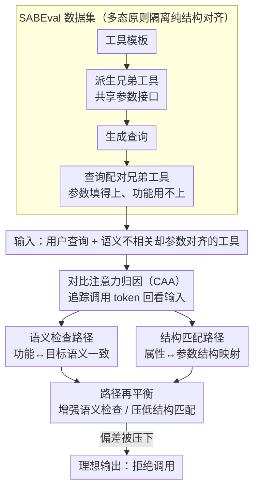

# Do LLMs Know Tool Irrelevance? Demystifying Structural Alignment Bias in Tool Invocations

**会议**: ACL 2026  
**arXiv**: [2604.11322](https://arxiv.org/abs/2604.11322)  
**代码**: [GitHub](https://github.com/along-l/irrelevant-tool)  
**领域**: 可解释性  
**关键词**: 工具调用, 结构对齐偏差, 不相关工具拒绝, 可解释性, 注意力归因

## 一句话总结
发现并形式化了 LLM 工具调用中的"结构对齐偏差"——当查询属性可以有效映射到工具参数时（即使工具功能与用户目标无关），LLM 仍倾向调用该工具。构建 SABEval 数据集解耦结构对齐和语义相关性，用对比注意力归因揭示内部存在语义检查和结构匹配两条竞争路径，提出再平衡策略实现 80% 的相对错误减少。

## 研究背景与动机

**领域现状**：LLM 使用外部工具的能力已成为关键能力，但在实际场景中模型经常面对与用户查询无关的工具——此时正确行为是拒绝调用。

**现有痛点**：(1) LLM 存在一个被忽视的系统性缺陷：即使工具功能与用户目标不匹配（语义不相关），只要查询中的属性可以有效填入工具参数（结构对齐），模型就倾向调用该工具；(2) 现有评测通过随机配对查询和工具来构造不相关场景，但这种构造通常同时引入结构不对齐，混淆了评估结果——模型可能只是因为参数填不上才拒绝，而非真的理解语义不相关性。

**核心矛盾**：LLM 是否真的理解"语义相关性"是工具调用的必要条件，还是仅仅依赖"结构对齐"作为捷径来决策？

**本文目标**：(1) 识别和形式化结构对齐偏差；(2) 构建数据集解耦两个因素；(3) 揭示内部机制；(4) 提出缓解方法。

**切入角度**：借鉴面向对象编程中的多态原则——不同服务可以共享统一接口（即结构对齐但语义不同），构造真实场景的评估数据。

**核心 idea**：结构对齐偏差 = LLM 将"参数能填上"当作"工具该调用"的系统性捷径。通过揭示内部存在的两条竞争信息流（语义检查 vs 结构匹配），提出路径再平衡来缓解偏差。

## 方法详解

### 整体框架
论文把"LLM 该不该调用一个不相关工具"拆成可控的研究对象：先用 SABEval 数据集制造"参数填得上、但功能完全用不上"的纯结构对齐场景，量化模型究竟有多容易上钩；再用对比注意力归因把决策时的内部信息流拆成"语义检查"和"结构匹配"两条相互竞争的路径；最后在这两条路径上做再平衡，直接把偏差压下去。输入是一条用户查询和一个语义不相关却参数对齐的工具，理想输出是拒绝调用。

### 关键设计

**1. SABEval 数据集：用多态原则隔离纯结构对齐。** 现有评测用随机配对来制造"不相关工具"，但随机配对往往连参数都填不上，于是模型的拒绝既可能源于"懂得语义不相关"，也可能只是"参数对不齐填不进去"，两个因素被混在一起。SABEval 借鉴面向对象编程的多态思想——不同服务共享同一接口——来制造结构对齐但语义不同的兄弟工具：先从工具模板派生出共享相同参数接口的兄弟工具（例如"任天堂游戏查询"和"PlayStation 游戏查询"都吃 `game_title` + `region`），再为每个工具生成查询，最后把查询与它的兄弟工具配对。这样每条样本都保证参数能填、功能却用不上，任何调用都是错误。整套数据含 101 个工具模板、每工具 5 条查询、10 个兄弟组合，共 5050 个无有效工具可用的样本。

**2. 对比注意力归因（CAA）：把决策信息流拆成两条竞争路径。** 要解释模型为什么上钩，自然想用反事实归因，但传统反事实分析要求被对比的两段输入在 token 级严格对应，而工具调用里工具描述和查询长度天然不同，对不上。CAA 绕开这个限制，直接追踪从工具调用 token 回看输入 token 的注意力归因，发现两条彼此竞争的路径：**语义检查路径**关注工具功能描述与查询目标之间的语义一致性，**结构匹配路径**关注查询属性与工具参数之间的结构映射。最终是否调用，取决于这两条路径相对强度的角力——结构对齐偏差的本质就是结构匹配路径压过了语义检查路径。

**3. 路径再平衡：在竞争机制上做精确干预。** 既然偏差来自两条路径的强度失衡，缓解就不必重训整个模型，只要在 CAA 识别出的机制上做手术：增强语义检查路径的相对强度、或压低结构匹配路径的影响，让"语义不相关"重新成为主导信号。这种推理时干预实现了约 80% 的相对错误减少，且因为只动竞争路径、不动模型权重，正常的工具使用能力基本不受损。

## 实验关键数据

### 主实验（5 个工具增强 LLM）

| 模型 | 随机配对 TIR↓ | SABEval TIR↓ | Δ |
|------|-------------|-------------|-----|
| Qwen3-4B | 0.16% | 40.04% | +39.88 |
| Qwen3-8B | 0.04% | 34.26% | +34.22 |
| Qwen3-14B | ~0.1% | ~35% | ~+35 |
| ToolACE-2.5-8B | ~0.1% | ~42% | ~+42 |
| Watt-Tool-8B | ~0.2% | ~45% | ~+45 |

### 结构对齐程度实验

| 结构对齐程度 | 错误调用率 |
|------------|---------|
| 无对齐（随机配对） | <0.2% |
| 基础对齐（SABEval D0） | 41.9% |
| 更强对齐（+4 参数） | **90.4%** |

### 关键发现
- **结构对齐偏差非常严重**：在结构不对齐时错误率 <0.2%，结构对齐时飙升到 41.9%，更强对齐时达 90.4%
- **所有 5 个主流工具增强 LLM 都受影响**，说明这是一个系统性问题
- **反事实分析确认因果关系**：结构对齐与错误调用之间存在强因果联系
- **CAA 成功识别了两条竞争路径**：语义检查路径和结构匹配路径
- **路径再平衡实现 80% 相对错误减少**且不损害正常工具使用能力

## 亮点与洞察
- **"结构对齐偏差"的发现和形式化**是本文最大贡献——揭示了一个普遍但被忽视的安全风险，对工具增强 LLM 的部署有直接警示
- **SABEval 的构造方法论**（基于面向对象多态原则）非常巧妙——从软件工程借鉴设计真实场景的评估数据
- **从行为分析到内部机制再到缓解的完整链条**展示了可解释性驱动的安全改进范式

## 局限与展望
- SABEval 的构造依赖 GPT-4o 生成附加参数，可能引入偏差
- 路径再平衡的效果可能因模型架构而异
- 仅在 5 个模型上验证，更大规模模型（70B+）的表现未知
- 未考虑多工具选择场景（当前是单工具判断）
- 偏差的根源可能在预训练数据中——大量工具调用示例都是正例

## 相关工作与启发
- **vs Patil et al. (2025) / 现有评测**: 现有评测混淆了结构对齐和语义相关性，本文首次解耦
- **vs 工具选择研究**: 工具选择关注"选哪个工具"，本文关注"该不该调用任何工具"
- **vs 注意力归因方法**: 传统方法需要反事实对的 token 级对应，CAA 放松了这一限制

## 评分
- 新颖性: ⭐⭐⭐⭐⭐ 问题识别+形式化+数据集+机制分析+缓解，全链条创新
- 实验充分度: ⭐⭐⭐⭐⭐ 5 模型+因果分析+程度实验+再平衡验证
- 写作质量: ⭐⭐⭐⭐⭐ 问题定义清晰，实验设计严谨
- 价值: ⭐⭐⭐⭐⭐ 对工具增强 LLM 的安全部署有直接指导意义

<!-- RELATED:START -->

## 相关论文

- [\[ACL 2026\] Aligning What LLMs Do and Say: Towards Self-Consistent Explanations](aligning_what_llms_do_and_say_towards_self-consistent_explanations.md)
- [\[ACL 2026\] Do LLMs Capture Embodied Cognition and Cultural Variation? Cross-Linguistic Evidence from Demonstratives](do_llms_capture_embodied_cognition_and_cultural_variation_cross-linguistic_evide.md)
- [\[ACL 2026\] Dual Alignment Between Language Model Layers and Human Sentence Processing](dual_alignment_between_language_model_layers_and_human_sentence_processing.md)
- [\[NeurIPS 2025\] Distributional Autoencoders Know the Score](../../NeurIPS2025/interpretability/distributional_autoencoders_know_the_score.md)
- [\[AAAI 2026\] Hypothesis Generation via LLM-Automated Language Bias for ILP](../../AAAI2026/interpretability/hypothesis_generation_via_llm-automated_language_bias_for_ilp.md)

<!-- RELATED:END -->
