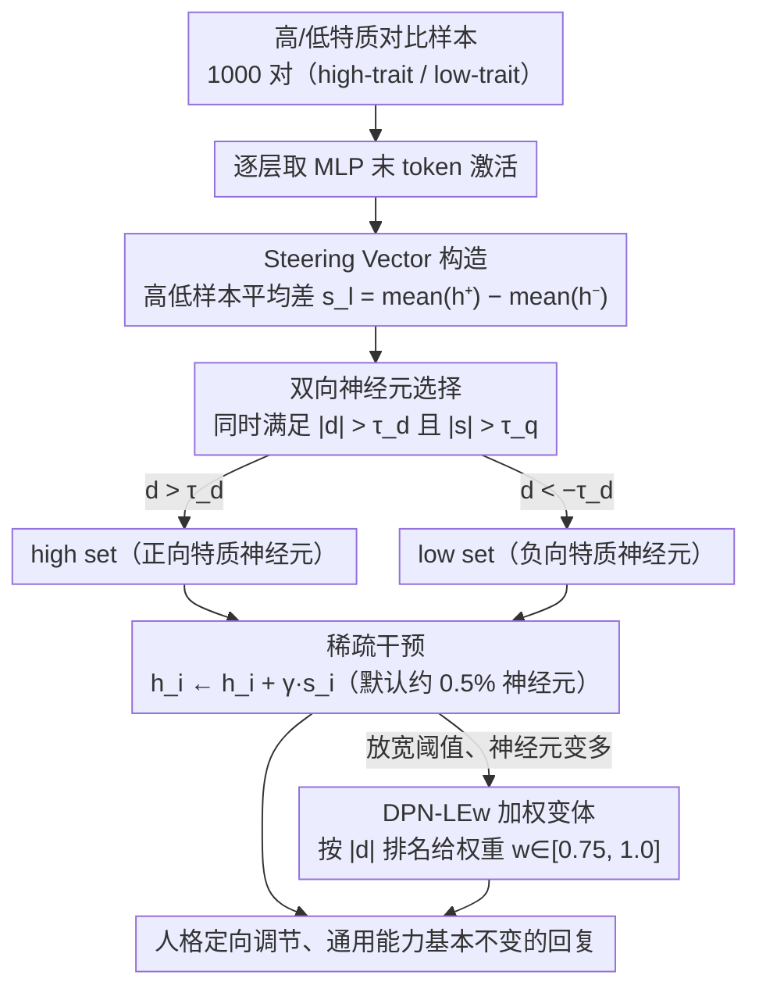

# DPN-LE: Dual Personality Neuron Localization and Editing for Large Language Models

**会议**: ACL2026 Findings  
**arXiv**: [2604.27929](https://arxiv.org/abs/2604.27929)  
**代码**: https://github.com/Z1ivan/DPN-LE  
**领域**: LLM可解释性 / 模型编辑  
**关键词**: 人格编辑, 神经元定位, 稀疏干预, Big Five, 表示分析

## 一句话总结
这篇论文提出 DPN-LE，通过对比高/低人格特质样本的 MLP 激活来定位互斥的人格相关神经元，只干预约 0.5% 神经元即可实现人格控制，并比既有大规模神经元编辑更好地保留通用能力。

## 研究背景与动机
**领域现状**：LLM 人格控制常用于角色扮演、社会调查、个性化助手和人格分析。已有方法大致分为 prompt-based personality induction 和 neuron-editing：前者简单但不稳定，后者更直接地干预内部表示，但往往需要修改大量神经元。

**现有痛点**：代表性 neuron editing 方法 NPTI 能改变人格特质，却会带来显著能力退化。论文的 preliminary 表明，在 LLaMA-3-8B-Instruct 上，NPTI 对 GSM8K 的平均下降达到 high direction 16.00%、low direction 40.79%，说明被修改的神经元中有大量与通用推理或知识相关。

**核心矛盾**：人格相关表示并不是与通用能力完全分离的独立开关。神经元具有多功能性，粗粒度编辑会同时碰到人格、知识和推理能力，因此人格控制和能力保持之间存在强 trade-off。

**本文目标**：作者希望回答“哪些神经元真正和人格特质相关”，并设计一种更稀疏、更有选择性的推理时干预方法，在不重训模型的情况下控制 Big Five 人格表达。

**切入角度**：论文观察到高/低人格特质样本在特定 MLP 层的激活空间中呈现互斥分离模式，因此可以通过高低样本对比找出 trait-exclusive neurons。

**核心 idea**：用高/低特质样本的平均激活差构造 steering vector，再结合 Cohen's $d$ 和激活幅度双重筛选，只保留统计显著且响应强的人格专属神经元做稀疏线性干预。

## 方法详解
DPN-LE 是一种 training-free inference-time editing 方法。它不改模型权重，而是在生成时对选中的 MLP hidden neurons 加上或减去人格方向的 steering signal。方法分为 steering vector 构造、双向神经元选择和稀疏干预三步。

### 整体框架
给定某个 Big Five 特质（例如 Neuroticism），DPN-LE 先用 1,000 对 high-trait / low-trait 对比样本统计每层 MLP 在最后 token 位置的激活，凝练出"这层往哪个方向偏就代表更高特质"的方向向量；再用统计显著性和响应幅度双重过滤，从全部神经元里挑出真正区分高低人格的稀疏互斥子集；最后在推理时只对这一小撮神经元沿方向加减信号——想增强特质就正向干预、想抑制就反向干预。输入是一条普通生成请求，输出是人格被定向调节、但通用能力基本不变的回复。

### 关键设计

**1. Steering Vector Construction：用成对样本平均差刻画人格方向。** 人格不是单个 token 或单条 prompt 的局部现象，落在任意一例上都带噪声。DPN-LE 对第 $l$ 层 MLP hidden state 取高低样本的平均差 $s_l = \mathrm{mean}(h_l^+) - \mathrm{mean}(h_l^-)$，其中 $h_l^+$、$h_l^-$ 分别来自 high-trait 与 low-trait 样本。成对平均把个例噪声抹平，留下该特质在这层激活空间中稳定的平均偏移，作为后续筛选和干预共用的方向基准。

**2. Dual-Direction Neuron Selection：双标准挑出人格专属的稀疏子集。** 神经元具有多功能性，只看单一指标都会选错：只看效应量会混进一堆弱响应神经元，只看激活幅度又会选到统计上不稳的差异。DPN-LE 要求一个神经元同时满足 $|d_l| > \tau_d$ 和 $|s_l| > \tau_q$——Cohen's $d$ 保证高低样本差异有统计意义，steering magnitude 的分位阈值保证响应足够强。通过筛选后，$d_l > \tau_d$ 的进入 high set、$d_l < -\tau_d$ 的进入 low set，形成两个互斥方向的稀疏集合，把与通用语言处理纠缠的冗余神经元尽量排除在外。

**3. Sparse Intervention and Weighted Variant：极少神经元控人格、按特异性加权保稳定。** 默认只选约 0.5% 神经元（Q995 设置下每层约 70 个），已经足够稀疏，因此基础版 DPN-LE 对选中神经元统一施加 $h_i \leftarrow h_i + \gamma s_i$ 即可。当阈值放宽、选入更多神经元时，弱特异性神经元会带来不稳定，于是 DPN-LEw 按 $|d_l|$ 排名给权重 $w_i \in [0.75, 1.0]$，让越人格专属的神经元干预越强、边缘神经元干预越弱，在更宽集合下缓解副作用。

### 损失函数 / 训练策略
DPN-LE 没有训练损失，也不微调模型。它只用 1,000 对 contrastive samples 统计激活。LLaMA-3-8B-Instruct 上干预层为 12-31，Qwen2.5-7B-Instruct 上为 14-27；LLaMA 的关键超参为 quantile threshold $q=0.995$、Cohen's $d$ threshold $\tau_d=0.8$、干预强度 $\gamma \in [0.0, 2.0]$。Qwen 因高低特质激活差较弱，使用更低的 $\tau_d=0.3$。默认配置约选择总 MLP 神经元的 0.5%。

## 实验关键数据

### 主实验
| 任务 / 指标 | 本文方法 | 对比对象 | 关键数字 | 结论 |
|--------|----------|----------|----------|------|
| PersonalityBench 平均人格分 | DPN-LE 9.11 | NPTI 9.43 | 分数接近 SOTA | 稀疏干预仍能有效控制人格 |
| 修改神经元数量 | DPN-LE 平均 high 711 / low 713 | NPTI 平均 high 21,223 / low 22,140 | 减少 96.7% | 大量 NPTI 神经元是冗余的 |
| GSM8K 能力下降 | DPN-LEw 平均 high -7.08%, low -5.93% | NPTI high -16.00%, low -40.79% | 能力保持显著更好 | 稀疏选择减少推理损伤 |
| HotpotQA F1 下降 | DPN-LEw high -2.05, low -2.27 | NPTI high -1.04, low -2.81 | 与 NPTI 接近或更好 | QA 能力损失较小 |
| TriviaQA F1 下降 | DPN-LEw high -2.88, low -3.80 | NPTI high -3.61, low -4.34 | 更低退化 | 知识问答保留较好 |
| IPIP-NEO-300 total | DPN-LEw 6.64, DPN-LE 6.75 | P2P 7.71, LLaMA Few-shot 5.96 | 稀疏法优于部分 prompt 法但不一定最强 | 个体级人格匹配存在 trade-off |

### 消融实验
| 配置 | 关键指标 | 说明 |
|------|---------|------|
| $\gamma=0.8$ | trait score 8.02, fluency 9.85 | 人格控制与流畅性较平衡 |
| $\gamma=1.0$ | trait score 8.59, fluency 9.33 | 控制更强但流畅性下降 |
| $\gamma=1.5$ | DPN-LE fluency 5.42, DPN-LEw fluency 6.58 | 过强干预会破坏生成，weighted 更稳 |
| Q999 0.1% | trait 7.55, fluency 9.90 | 神经元太少，控制不足 |
| Q995 0.5% | trait 8.59, fluency 9.33 | 最佳平衡点 |
| Q970 3.0% | trait 8.68, fluency 7.78 | 多选神经元几乎不提升人格，但明显损伤流畅性 |

### 关键发现
- LLaMA 上每层平均只需约 72 个神经元，Qwen 上约 92 个神经元，就能形成可用的人格干预子集。
- DPN-LE 在能力保持上明显优于 NPTI，但某些 trait-direction 仍会损伤推理，例如 DPN-LEw 的 Extraversion-low 在 GSM8K 上下降 17.89%，Neuroticism-high 下降 11.37%。
- DPN-LEw 在较强干预下更稳定，说明当神经元集合变宽时，按 effect size 加权能减少低特异性神经元的副作用。

## 亮点与洞察
- 论文最重要的洞察是“人格神经元”不是越多越好。人格控制的关键在于排除通用能力相关神经元，而不是扩大干预范围。
- 双标准筛选很实用：Cohen's $d$ 解决统计显著性，steering magnitude 解决干预强度，两者配合比单一阈值更合理。
- 方法不训练、不改权重，只在推理时做稀疏激活修改，适合作为解释性研究工具，也方便分析 trait 与能力之间的重叠。

## 局限与展望
- DPN-LE 依赖 contrastive samples，样本是否能代表真实人格表达会直接影响 steering vector 质量。
- 虽然能力退化小于 NPTI，但部分人格方向仍与推理能力共享神经基础，尤其是 Extraversion 和 Neuroticism 相关方向。
- 本文只研究单一人格特质干预，多特质组合、特质冲突和长期对话稳定性尚未验证。
- IPIP-NEO-300 上的个体级对齐弱于 PAS 和 NPTI，说明稀疏能力保持与细粒度人格拟合之间仍有 trade-off。后续可加入 reasoning-protective neuron selection，显式排除和推理任务高度相关的神经元。

## 相关工作与启发
- **vs Simple Prompt / P2P**: Prompt 方法部署简单但依赖措辞，稳定性和持久性不足；DPN-LE 直接作用于表示层，更适合分析人格机制。
- **vs PAS**: PAS 搜索 attention heads 和 activation offsets，更偏优化式人格对齐；DPN-LE 关注 MLP 神经元的高低特质互斥表示。
- **vs NPTI**: NPTI 修改约 2 万个神经元，控制强但能力退化大；DPN-LE 只干预约 0.5% 神经元，能力保持更好。
- **启发**: 做 LLM 内部编辑时，先用对比激活和任务能力评测找“真正专属”的稀疏子集，比直接扩大编辑范围更稳。

## 评分
- 新颖性: ⭐⭐⭐⭐☆ 把人格编辑做成双向稀疏神经元定位，思路清晰且区别于大规模编辑。
- 实验充分度: ⭐⭐⭐⭐☆ 有 personality、general capability、generalization 和 ablation，但多特质组合未覆盖。
- 写作质量: ⭐⭐⭐⭐☆ 方法公式和实验结论较清楚，PDF 转文本中表格较密但主线明确。
- 价值: ⭐⭐⭐⭐☆ 对人格控制、模型编辑和表示可解释性都有参考价值，尤其适合研究能力保持型干预。

<!-- RELATED:START -->

## 相关论文

- [\[ICML 2026\] Dual Mechanisms of Value Expression: Intrinsic vs. Prompted Values in Large Language Models](../../ICML2026/interpretability/dual_mechanisms_of_value_expression_intrinsic_vs_prompted_values_in_large_langua.md)
- [\[ICML 2026\] Towards Atoms of Large Language Models](../../ICML2026/interpretability/towards_atoms_of_large_language_models.md)
- [\[ACL 2026\] Compositional Steering of Large Language Models with Steering Tokens](compositional_steering_of_large_language_models_with_steering_tokens.md)
- [\[ACL 2026\] Knowledge Vector of Logical Reasoning in Large Language Models](knowledge_vector_of_logical_reasoning_in_large_language_models.md)
- [\[ACL 2026\] Tracing Relational Knowledge Recall in Large Language Models](tracing_relational_knowledge_recall_in_large_language_models.md)

<!-- RELATED:END -->
