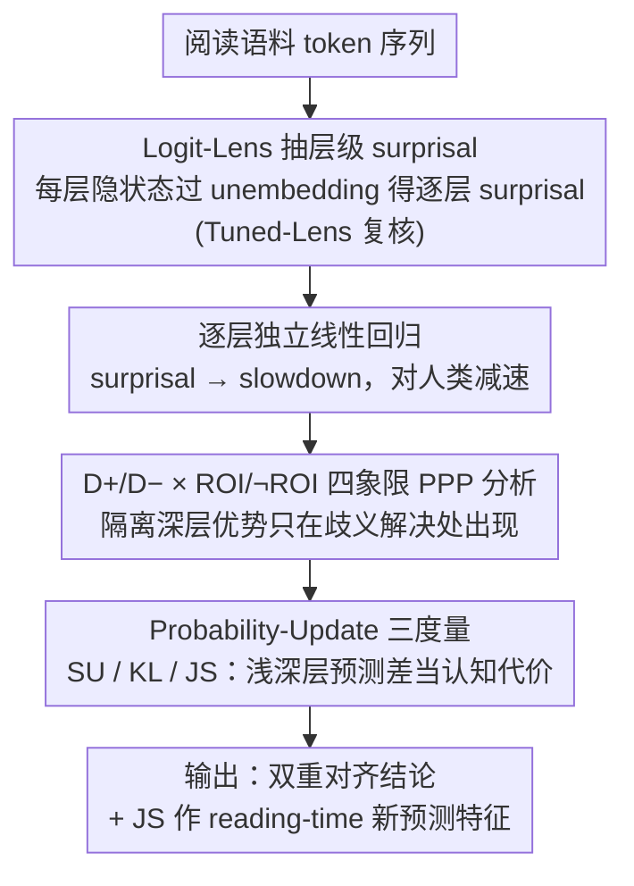

# Dual Alignment Between Language Model Layers and Human Sentence Processing

**会议**: ACL 2026  
**arXiv**: [2604.18563](https://arxiv.org/abs/2604.18563)  
**代码**: https://github.com/kuribayashi4/internal_surprisal_targeted_assessment （有）  
**领域**: 可解释性 / 认知 / 心理语言学  
**关键词**: surprisal、Logit-Lens、句法歧义、阅读时间、双重对齐

## 一句话总结
作者用 logit-lens 把 GPT-2/Pythia/OPT 共 19 个 LM 的每一层都解出"内部 surprisal"，发现一个反直觉的"双重对齐"：在自然阅读语料上**浅层**的 surprisal 最像人；但在 garden-path / NPS / NPZ / RC / Attachment 等**句法挑战句**上反而**深层**才像人，对应人类"shallow 默认 + 困难时切换到 deep 重分析"的双机制阅读模型——并由此提出用浅深层 surprisal 差（KL/JS）作为"层间预测更新量"来当 reading-time 的补充特征。

## 研究背景与动机

**领域现状**：计算心理语言学一直用 LM 的 surprisal $S_t = -\log P(w_t \mid w_{<t})$ 当 reading-time 的预测因子，因为大量实验证明 RT 与 surprisal 近似线性正相关 (Smith & Levy 2013)。最近 Kuribayashi et al. (2025) 把 logit-lens 拓展到层级：在自然阅读语料上发现**早期层**的 surprisal 比最终层更像人——他们把"holistic misalignment"问题给修了一半。

**现有痛点**：但还有一类"**targeted misalignment**"没解决——在 garden-path（如 MVRR "The girl fed the lamb remained..."）、NPS、NPZ 这类**句法挑战句**上，人类在 disambiguating point 上会显著慢下来，但所有 LM 最后一层的 surprisal 都**严重低估**这个 slowdown 幅度。一个自然问题：早期层在自然阅读上更好，是不是在句法挑战句上也更好？

**核心矛盾**：作者直接做实验给出了否定答案——**早期层在句法挑战句上反而几乎无差**（D+ 和 D− 的 surprisal 都差不多，因为它们只看到局部 co-occurrence，对长依赖不敏感）。这意味着"哪一层最像人"不是一个全局答案，而是依赖任务难度。

**本文目标**：(i) 厘清不同句法难度下"最佳层"在哪里；(ii) 用一个统一的视角解释为什么会有这种 dual alignment；(iii) 把这个"层间差"显式化成一种新的 reading-time predictor。

**切入角度**：作者把 LM 的层级 forward computation 类比成人类阅读的两阶段加工——**浅层 ≈ 默认 shallow processing**（fast、surface、局部）/ **深层 ≈ reanalysis / deep integration**（slow、需要完整 context）。如果这个 metaphor 成立，那 garden-path 应该需要"切到深层"。

**核心 idea**：layer-wise surprisal **不是一条单调曲线**——naturalistic 时浅层最像人、syntactically challenging 时深层最像人；并且**浅→深的预测更新量**（surprisal update / KL / JS）本身就可以当作处理代价的代理。

## 方法详解

### 整体框架
方法全程不训练模型，只把 LM 当探针、在阅读时间数据上跑回归。先用 logit-lens 把每个 LM、每个 token、每一层的隐状态都解码成"内部 surprisal"，让 surprisal 从单一标量变成一条按层展开的曲线；再在句法歧义阅读数据上逐层独立拟合"surprisal → slowdown"的线性回归，看哪一层估出的减速最接近真人，并用 D+/D− × ROI/¬ROI 四象限隔离"深层优势"到底出现在哪种数据点；最后把"浅层到深层的预测更新量"（SU/KL/JS）显式抽出来，当作 surprisal 之外的新阅读时间预测特征。输入是文本 token 序列，输出是逐层 surprisal、四象限相关分析和层间更新量对 reading-time 的解释力增益。

### 关键设计

**1. Logit-Lens 抽层级 surprisal + Tuned-Lens 鲁棒性补充：把"哪一层在预测下一个词"展开成层级曲线。** 要问"人类的快/慢处理对应模型的哪些层"，前提是先把"模型预测"从黑盒拆成按层的序列，这是整篇论文的视角基石。具体做法是对每一层第 $i$ 个 token 的隐状态 $h^{(l)}_{i}$ 套用模型自带的 unembedding 矩阵（带 LayerNorm），得到该层对下一个 token 的预测分布，再算目标词的层级 surprisal $S^{(l)}_t = -\log P^{(l)}(w_t \mid w_{<t})$，subword 用联合概率累加。早期层的 logit-lens 偏置较大，作者用 Tuned-Lens (Belrose 2023) 重复整套实验，确认主结论在更可靠的探针下依然稳定。

**2. D+/D− × ROI/¬ROI 四象限 PPP 分析：精确隔离"深层优势"只出现在歧义解决处。** 如果只看单一平均指标，"层深带来增益"这个效应会被其它数据点稀释掉，看不出来。论文把每个 token 按是否处于歧义句（D+ vs D−）× 是否落在 disambiguating window（ROI: $t^*-2$ 到 $t^*+2$ vs ¬ROI）四分，对每一层算 PPP $\Delta\mathrm{LL} = \mathrm{LL}_{\text{full}} - \mathrm{LL}_{\text{baseline}}$，再报每个 model × 构造 × 象限下"层深与 PPP 的 Pearson 相关"。dual alignment 假设预测：人类只在歧义解决处才切到深层重分析，因此理论上只有 D+ ∩ ROI 这一格应该出现"深层更好"的强正相关——四象限设计正是为了把这个 signature 干净地验出来。

**3. Probability-Update 三度量（SU / KL / JS）作为新 RT 特征：把"浅深层之间的预测差"数值化成认知代价。** 作者的解释模型是"shallow 先预测、deep 再修正"，那"被修正的幅度"本身就该是 effort 的代理，于是把它抽成独立特征。论文定义三种度量：SU 只在目标词位置看 $\mathrm{SU}(w_t) = \log \frac{Q_t(w_t)}{P_t(w_t)}$；KL 在全词表上算 $\mathrm{KL}(Q_t \| P_t) = \mathbb{E}_{w \sim Q_t}[\mathrm{SU}(w)]$；JS 是对称版 $\mathrm{JS}(Q_t \| P_t)$。其中 $P_t$ 取自浅层 logit-lens、$Q_t$ 取自最终层，回归前对每层 surprisal 做 z-score 归一以消掉 scale 差异。JS 比 KL 多了对称性、比 SU 多了全分布信息，因此实测在 RoI 区域提供 surprisal 之外最强的额外解释力；这一步等价于把 Li & Futrell (2024) 的"shallow vs deep processing"思想用层级 surprisal 落成可计算的 metric。

### 损失函数 / 训练策略
- **不做训练，纯探针**：作者全程不微调 LM，只用 logit-lens / tuned-lens 抽层级输出，再在 reading-time 数据上跑线性回归。
- **回归模型**：$\text{RT}(w_t) = \beta_0 + \beta_1 \text{Surprisal}(w_t) + \beta_2 \text{Length}(w_t) + \beta_3 \text{LogFreq}(w_t) + \text{spillover}(w_{t-1}, w_{t-2}) + \epsilon$，spillover 用 $t-1$ 和 $t-2$ 的同样三个特征。
- **PPP 指标**：$\Delta\text{LL} = \text{LL}_{\text{full}} - \text{LL}_{\text{baseline}}$，full 含 surprisal、baseline 不含。
- **填充集训练 / 目标集测试**：回归在 Huang 数据集的 filler 句上训练，target 句 (D+/D−) 上测；这能避免对 garden-path 的过拟合。

## 实验关键数据

### 主实验
**Exp.1**（Fig.2）：对 GPT-2 / OPT / Pythia 共 19 个 LM，每个模型每一层算估计 slowdown 与人类对照（人类红线）：

| 构造 | 人类 slowdown (ms) | 所有层 LM 估计 | 最佳层位置 |
|------|---------------------|----------------|------------|
| MVRR | ~100 | 最高 ~50（GPT2-xl 后期） | 后期层 |
| NPS | ~45 | 最高 ~25 | 后期层 |
| NPZ | ~100 | 最高 ~50 | 后期层 |
| RC | ~25 | 最高 ~15 | 后期层 |
| Attachment | ~10 | ~5-10 | 后期层 |

普遍结论：**所有层都低估**人类 slowdown，但**后期层比早期层更接近**；这与自然阅读上"早期层最佳"的 Kuribayashi 2025 结论**正好相反**。

**Exp.2**（Tab.2）：每个 LM × 5 构造 × 4 象限的 Pearson(层深, PPP) 相关系数，重点看 D+ ∩ ROI（句法挑战 + 歧义解决位置）：

| 模型 | MVRR D+∩RoI | NPS D+∩RoI | NPZ D+∩RoI | RC D+∩RoI | Attachment D+∩RoI |
|------|-------------|------------|------------|-----------|-------------------|
| GPT2-xl | +0.88 | -0.07 | +0.88 | +0.96 | -0.32 |
| OPT-13b | +0.09 | +0.71 | +0.81 | +0.88 | +0.26 |
| Pythia-12b | **+0.88** | **+0.93** | **+0.79** | **+0.97** | **+0.80** |

Pythia-12B 在五种构造上 D+ ∩ ROI 全部强正相关 (+0.79 ~ +0.97)，而对应 D− ∩ ROI 全部为负 (-0.41 ~ -0.89)；规模越大、对比越鲜明。

### 消融实验
**Exp.3**（Fig.4）：在 5 phenomena × {Full, RoI} = 10 个数据条件上，把 surprisal 替换为 SU / KL / JS，或叠加 surprisal+JS，报 19 个 LM 平均 PPP：

| 特征 | Full 平均 PPP | RoI 平均 PPP | 备注 |
|------|---------------|--------------|------|
| Surprisal (last layer) | 基准 | 基准 | 标准做法 |
| Surprisal Update (SU) | 显著优于 baseline | 边际 | 仅目标词位置 |
| KL(Q‖P) | 多数 phenomena 显著 | 部分显著 | 不对称 |
| JS | **三度量中最佳** | 部分显著 | 对称 |
| Surprisal + JS | **优于 Surprisal alone** | 优于 Surprisal alone | 互补 |

LR test 显示在 MVR (Full) / RC (Full) / Attachment (Full/RoI) 上 surprisal+JS 显著优于单 surprisal。

### 关键发现
- **早期层在句法挑战句上失效**：MVRR "fed the lamb remained" 早期层只看到 "the lamb remained" 局部 co-occurrence，给 D+ 和 D− 几乎相同的 surprisal——证明它们没有捕获长依赖、没有"是不是 garden-path"的句法敏感性。
- **Dual alignment 是大模型才更明显的现象**：Pythia 从 70M 到 12B，D+ ∩ ROI 的层深-PPP 正相关从 0 到 +0.97 单调放大；规模化让模型自然分化出"shallow vs deep"两套机制，呼应人类双机制阅读理论。
- **JS 比 KL 比 SU 更好**：因为 JS 既对称又考虑全分布，而 SU 只在目标词位置看差异；JS 在 RoI 区域提供 surprisal 之外的额外解释力。
- **slowdown 仍被低估**：即使最佳层 + JS 加成，模型估出来的 slowdown 还是 < 真人 ~50% ms，说明 LM 并没有完全捕获人类 garden-path 的全部 effort；这是个有意保留的开放问题。

## 亮点与洞察
- **"哪一层最像人"取决于任务难度** 这一发现把心理语言学界过去十年的"层级探针"研究推向了一个动态视角——不是找单一最优层，而是承认 LM 的不同阶段对应人脑的不同阶段。
- **2×2 设计精准隔离效应**：单看 D+ 或单看 ROI 都看不出，必须四分才能看出"深层优势仅出现在 D+ ∩ ROI"，这是 method 上很干净的因果隔离。
- **JS / KL / SU 三度量给出"浅深层差作为 cost 代理"的统一框架**：这个 idea 可以推广到所有 cognitive modeling 任务——任何"需要 reanalysis"的现象都可以用层间差异来量化。
- **承认低估但不堆 trick**：作者没有去过拟合 reading-time 数据，而是非常诚实地报告 "still underestimate"，把发现的边界与失败一起呈现——是好的 cognitive modeling 论文范式。
- **可复用 trick**：Logit-Lens + Tuned-Lens 双验证 + Whitespace-Trailing Decoding 这套 pipeline 是研究 transformer 内部预测分布的标准技术栈，复现门槛低。

## 局限与展望
- **slowdown 仍被低估约 50%**：layer-wise surprisal + JS 都不能完全解释 garden-path 的 effort，意味着 LM 内部"reanalysis"机制只是部分对齐人脑。
- **仅英语 + 仅书面阅读**：所有数据来自 Huang et al. 英语 SPR；其他语言（中文、日语）的 garden-path 是否同样需要深层，作者只在 discussion 提了一句。
- **不研究 instruction-tuned 模型**：作者明确排除 SFT/RLHF 模型，原因是 Kuribayashi 2024 显示它们扭曲 cognitive alignment；但工业界主流是这些模型，结论的实际部署价值有限。
- **从 layer 到 time 的理论缺口**：人脑动力学按时间展开，LM 按层展开，作者诚实地承认两者的对应"还需要一个 thorny 的理论桥梁"。
- **改进方向**：把"动态切换层"做成 explicit gating（根据当前 token 的 entropy / JS 阈值决定用哪层 surprisal），可能拿到更高 PPP；或者把 dual alignment 推广到 multilingual 模型上看跨语言的"深浅切换点"是否一致。

## 相关工作与启发
- **vs Kuribayashi et al. (2025)**：前作只在自然阅读上发现"早期层最佳"；本文把场景拓展到句法挑战句，给出反向结论，并统一为 "dual alignment" 框架。
- **vs van Schijndel & Linzen (2021) / Huang et al. (2024)**：他们已经报道 final-layer surprisal 在 garden-path 上低估 RT；本文进一步指出"低估"在所有层都存在但深层更好，并提供层间差作为新特征。
- **vs Tenney et al. (2019) "BERT rediscovers NLP pipeline"**：早期 probing 工作发现 BERT 早层做 POS、中层做 syntax、晚层做 semantics；本文从行为对齐角度给出对应的"早层 shallow、晚层 deep"读法，与那条 pipeline 假设一致。
- **vs Li & Futrell (2024)**：他们提出 shallow vs deep processing 的信息论模型；本文用 LM 层间 KL/JS 把它落实成了可计算的 metric。
- **启发**：在任何"模型 vs 人脑"对齐研究中，可以默认尝试**层级 / 时间步级**展开而非只看最终输出；并且 D+ vs D− 这种 contrastive minimal pair 设计能比单刺激强很多。

## 评分
- 新颖性: ⭐⭐⭐⭐ "深层优势仅在 garden-path 出现"是过去 layer probing 工作未明确报告过的反直觉结论。
- 实验充分度: ⭐⭐⭐⭐ 19 个 LM × 5 phenomena × 4 象限 × 3 layer-update measure，覆盖到位；Logit-Lens 用 Tuned-Lens 复核也很严谨。
- 写作质量: ⭐⭐⭐⭐⭐ Fig.1 一张图把"双重对齐"讲清楚；变量解释和理论 framing 都很流畅。
- 价值: ⭐⭐⭐⭐ 给计算心理语言学社区提供了一个新视角和一组新特征（JS update），并且对 NLP 可解释性研究也有迁移意义。

<!-- RELATED:START -->

## 相关论文

- [\[ACL 2026\] A Systematic Comparison between Extractive Self-Explanations and Human Rationales in Text Classification](a_systematic_comparison_between_extractive_self-explanations_and_human_rationale.md)
- [\[ICML 2026\] Discovering Implicit Large Language Model Alignment Objectives](../../ICML2026/interpretability/discovering_implicit_large_language_model_alignment_objectives.md)
- [\[AAAI 2026\] Can LLMs Truly Embody Human Personality? Analyzing AI and Human Behavior Alignment in Dispute Resolution](../../AAAI2026/interpretability/can_llms_truly_embody_human_personality_analyzing_ai_and_human_behavior_alignmen.md)
- [\[NeurIPS 2025\] Probabilistic Token Alignment for Large Language Model Fusion](../../NeurIPS2025/interpretability/probabilistic_token_alignment_for_large_language_model_fusion.md)
- [\[ACL 2026\] DPN-LE: Dual Personality Neuron Localization and Editing for Large Language Models](dpn-le_dual_personality_neuron_localization_and_editing_for_large_language_model.md)

<!-- RELATED:END -->
