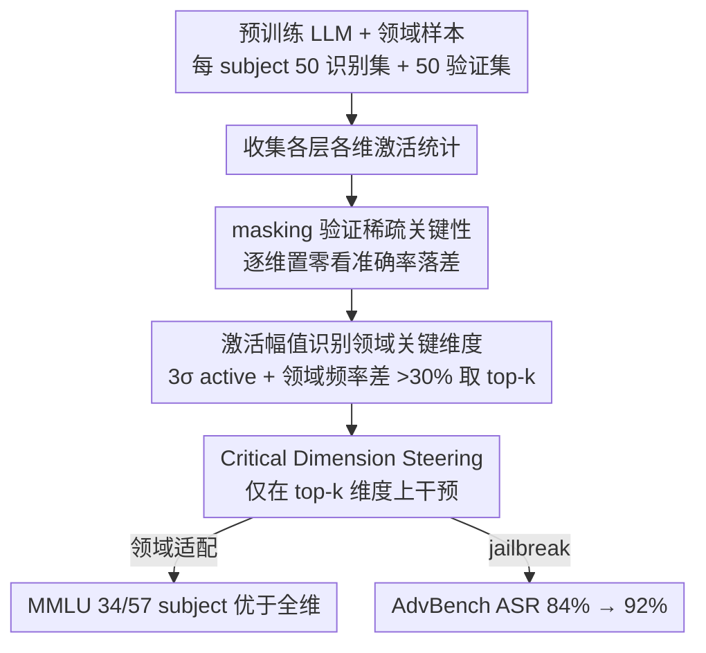

# Embracing Anisotropy: Turning Massive Activations into Interpretable Control Knobs for Large Language Models

**会议**: ACL2026  
**arXiv**: [2603.00029](https://arxiv.org/abs/2603.00029)  
**代码**: https://github.com/nyancat0222/dimension-analyzer  
**领域**: 解释性 / 激活 steering  
**关键词**: anisotropy, massive activations, domain-critical dimensions, activation steering, jailbreaking

## 一句话总结
本文把 LLM 中常被视为异常值的 massive activations 重新解释为可解释的领域关键维度，用无需训练的激活幅值准则识别这些维度，并只在这些维度上做 activation steering，从而在领域适配和 jailbreak 场景中比全维度 steering 更有效。

## 研究背景与动机
**领域现状**：Transformer LLM 的 hidden representations 通常高度 anisotropic，也就是少数维度拥有远高于其他维度的激活幅值。过去很多工作把这种现象当作表示空间失衡或量化/稳定性问题，目标是抑制 outlier dimensions 或让表示更 isotropic。

**现有痛点**：如果只把 extreme dimensions 当作噪声或 artifact，就会忽略它们可能承担的功能角色。另一方面，probe classifier 和 sparse autoencoder 等解释方法可以连接内部表示与语义概念，但通常需要额外训练，且会引入新的参数和解释偏差。

**核心矛盾**：massive activations 看起来像异常值，却可能也是模型为了领域专门化而形成的稀疏功能单元。问题在于，如何不用额外训练就识别这些维度，并验证它们既可解释又能控制模型行为。

**本文目标**：作者希望证明两件事：第一，少量 hidden dimensions 对特定领域性能高度关键；第二，这些维度可被当作 sparse control knobs，用于更精细的 activation steering。

**切入角度**：论文从 MMLU 的 57 个 subjects 出发，把每个 subject 看成一个 domain，分别采样 identification set 和 evaluation set。先通过 masking 证明单个维度可对领域性能造成巨大影响，再用简单激活统计近似识别这些 domain-critical dimensions。

**核心 idea**：不要消除 anisotropy，而是拥抱 anisotropy：用激活幅值找到领域关键维度，再只操控这些维度来实现领域适配或行为引导。

## 方法详解
这篇论文的中心假设是“极端激活不是纯噪声，而是功能专门化的痕迹”。作者围绕这个假设设计了两部分流程：先识别 domain-critical dimensions，再把这些维度作为 intervention target 做 Critical Dimension Steering。需要注意，本地缓存只包含到第 2.2 节附近，后续 steering 细节和完整 limitations 没有出现在缓存中；下面只写缓存中能确认的内容，不补造缺失表格。

### 整体框架
给定一个预训练 LLM、一个目标领域和若干领域样本，方法首先收集各层 hidden states 中每个维度的激活统计。对于 MMLU，每个 subject 使用 100 个 test prompts，其中 50 个作为 identification set 来找关键维度，另 50 个作为 evaluation set 验证这些维度对性能和控制的影响。识别阶段不训练 probe，也不训练 SAE，而是根据维度的 activation magnitude 和 domain-discriminative activation frequency 选择 top-$k$ 维度。控制阶段则把这些维度作为 sparse steering target，只修改被识别出的 critical dimensions，而不是对整个 hidden vector 做同等方向的干预。

### 关键设计

**1. 用 masking 验证维度的稀疏关键性：先证明“少数维度真的决定性能”，假设才立得住**

整套方法的前提是“极端激活不是噪声，而是功能专门化的痕迹”。要让这个前提成立，第一步得证明 hidden dimensions 并非等价——否则后面只盯着 top-$k$ 维度做文章就没有意义。作者对 Gemma-2-2B-IT 和 Qwen-3-8B 做逐维消融：把某个维度在每一层的 activation 置零（排除输入 embedding layer 以聚焦内部处理维度），再到 evaluation set 上测准确率掉多少。

结果很极端：Qwen-3-8B 单独 mask 掉 Rank-1 维度，平均准确率就从 73.30% 崩到 21.97%，而 Rank-100 维度几乎不影响。这种“一个维度抵几十个百分点”的落差，直接说明维度重要性高度稀疏，也为后面“只操控少数维度”提供了 ground truth。

**2. 用激活幅值识别 Domain-Critical Dimensions：让模型自带的统计信号替代训练出来的解释器**

masking 能找出关键维度，但要逐维试错代价太大；probe 和 SAE 又都要额外训练、引入新参数和解释偏差。作者的取巧之处是直接读模型已经形成的 activation magnitude：先把某维度对某 query 的激活是否偏离均值超过 $3\sigma$ 定义为 active criterion，再统计每个维度在一个 subject 内的激活频率；当两个领域之间的 activation frequency 差异超过 30%，该维度就被判为有 domain-discriminative pattern。最终取 top-$k$ high-magnitude dimensions 作为 domain-critical dimensions。

关键验证在于：这些纯靠统计选出的高幅值维度，与 masking 得到的 ground-truth critical dimensions 高度重合，token-level 上还能看到维度 1046 对应数学术语、2106 对应生物术语、334 对应 topic keywords——说明功能重要性确实可以从激活统计无训练地推断出来。

**3. Critical Dimension Steering：把验证过的稀疏维度当成精准旋钮，而不是整条向量乱推**

传统 activation steering 在整条 hidden vector 上施加一个方向，问题是若领域行为本就由少数高影响维度支配，全维 steering 会顺带扰动大量无关维度，带来副作用又难解释。CDS 改成只在 top-$k$ domain-critical dimensions 上干预、其余维度保持不动，相当于把干预限制在已被 masking 证明过的 causal handles 上。

> ⚠️ 本地缓存只到第 2.2 节附近，CDS 的完整 steering coefficient、层选择和实现公式未出现在缓存中，这里只描述能确认的设定。摘要与导言指出 CDS 同时用于领域适配和 jailbreaking 两类场景：MMLU 上 34/57 个 subject 优于全维 steering，AdvBench 上把 jailbreak ASR 从 84% 抬到 92%——稀疏 steering 在这两个方向都做到了更强控制。

### 损失函数 / 训练策略
本文方法本身是 training-free 的解释和 inference-time steering 方法，不引入新的训练损失。识别阶段使用 MMLU subject prompts 的 hidden activation statistics；验证阶段用 masking、领域适配准确率和 jailbreak attack success rate 评估。缓存中没有提供 CDS 的完整 steering coefficient、层选择或超参数搜索策略，因此这里不写未确认的训练细节。

## 实验关键数据

### 主实验
缓存中完整给出的主表主要是单维 masking 对准确率的影响，以及摘要/导言给出的 CDS 效果概述。

| 实验 | 模型 | 基线或对照 | 关键结果 | 说明 |
|------|------|------------|---------:|------|
| 单维 masking | Gemma-2-2B-IT | 原始准确率 56.53% | Rank-1 维度 masking 后 41.97% | 平均下降 14.56 点 |
| 单维 masking | Gemma-2-2B-IT | 原始准确率 56.53% | Rank-10 维度 masking 后 52.39% | 排名越靠后影响越弱 |
| 单维 masking | Qwen-3-8B | 原始准确率 73.30% | Rank-1 维度 masking 后 21.97% | 平均下降 51.33 点 |
| 单维 masking | Qwen-3-8B | 原始准确率 73.30% | Rank-100 维度 masking 后 71.97% | 大多数维度影响很小 |
| 领域适配 | MMLU 57 subjects | whole-dimension steering | CDS 在 34/57 subjects 上更好 | 只在导言中给出 aggregate |
| Jailbreaking | AdvBench | whole-dimension steering 84% ASR | CDS 达到 92% ASR | 只在摘要/导言中给出 aggregate |

### 消融实验
本地缓存未包含完整消融表，因此不能给出未读到的数值。能确认的是识别准则自身的两条证据：功能稀疏性和领域区分性。

| 分析对象 | 缓存中可确认的设置 | 观察 | 结论 |
|----------|------------------|------|------|
| 功能稀疏性 | 逐维 masking，每次把目标维度在每层置零 | Qwen-3-8B 的 Rank-1 维度 masking 平均准确率从 73.30% 降到 21.97% | 少数维度可支配领域性能 |
| 领域区分性 | activation value 偏离均值超过 $3\sigma$ 视为 active | 数学与生物 subject 间存在 activation frequency 差异超过 30% 的维度 | 极端激活可携带领域信息 |
| 可解释性案例 | Gemma-2-2B-IT token-level activation pattern | 维度 1046 激活数学术语，2106 激活生物术语，334 激活 topic keywords | 单维度可以像语义 detector 一样工作 |

### 关键发现
- 单个 hidden dimension 的影响可以非常大。Qwen-3-8B 中最关键维度被 mask 后，平均准确率从 73.30% 降到 21.97%。
- 高幅值维度并非只是不稳定 outlier，至少在 MMLU subject 里，它们与数学、生物等领域差异有对应关系。
- CDS 的 aggregate 结果显示，稀疏 steering 在 MMLU 领域适配中 34/57 个 subjects 优于 whole-dimension steering，在 AdvBench jailbreak 中 ASR 为 92%，高于 whole-dimension steering 的 84%。
- 本地缓存没有后续完整表格，无法确认每个 subject 的准确率、每个 layer 的效果或不同 top-$k$ 的敏感性。

## 亮点与洞察
- 论文最有意思的地方是立场反转：过去 anisotropy 常被当作需要被修正的表示缺陷，这篇把它当成模型内部专门化的自然结果。
- 用 magnitude 识别关键维度很朴素，但恰好抓住了 massive activations 的可观测信号；这使方法比 probe/SAE 更轻量，也更容易用于快速诊断。
- CDS 把解释性和控制连接起来：如果某个维度能解释领域概念，那么只操控这些维度就比全维 steering 更像“精准旋钮”。
- 对安全研究也有提醒：能够提升 jailbreak ASR 的 sparse dimensions 可能也是模型安全边界的薄弱点，解释性工具和攻击工具在这里非常接近。

## 局限与展望
- 作者的完整 limitations section 未出现在本地缓存中；因此这里不把以下内容标成“作者承认”，而是基于已读实验设计给出可见局限。
- 缓存中只看到 MMLU 和 AdvBench 的 aggregate 描述，没有完整 subject-level steering 表、layer ablation 或 top-$k$ 敏感性，难以判断 CDS 的稳定性边界。
- 领域主要由 MMLU subject operationalize，这对考试科目有效，但未必能覆盖真实应用中的混合领域、长上下文或开放生成任务。
- training-free magnitude criterion 很方便，但也可能把“高频格式特征”误当成语义功能单元；后续需要和 causal intervention、SAE feature、probe 结果做更细粒度对齐。
- Jailbreak ASR 被作为控制能力验证，但也意味着方法有潜在双用风险；公开工具需要配套防护分析。

## 相关工作与启发
- **vs isotropy calibration / outlier suppression**: 这些工作倾向于降低 extreme dimensions 的影响，本文则认为它们可能是有意义的功能单元，应该先解释再决定是否抑制。
- **vs probe classifier**: probe 能学到概念方向，但需要额外监督和训练；本文直接读 activation statistics，代价更低，解释链条也更短。
- **vs sparse autoencoder**: SAE 试图把多义 hidden features 分解成更稀疏的可解释特征；本文不解耦表示，而是在原始 hidden dimensions 上寻找领域关键维度，因此更轻但表达能力也更受限。
- **vs whole-dimension activation steering**: 传统 steering 会影响整条向量，可能引入无关扰动；CDS 只修改 critical dimensions，更像把干预限制在已验证的 causal handles 上。

## 评分
- 新颖性: ⭐⭐⭐⭐☆ 观点很鲜明，把 massive activations 从“异常”改写成“可解释控制单元”，且方法足够简单。
- 实验充分度: ⭐⭐⭐☆☆ 缓存中能看到关键 evidence 和 aggregate 结果，但缺少完整 steering 表、消融和 limitations，难以全面判断鲁棒性。
- 写作质量: ⭐⭐⭐⭐☆ 导言把争议背景和方法动机讲得清楚，缓存截断影响了后续可读性。
- 价值: ⭐⭐⭐⭐☆ 对解释性、activation steering 和安全评估都有启发，尤其适合做轻量级内部表征诊断。

<!-- RELATED:START -->

## 相关论文

- [\[ACL 2026\] Preference Heads in Large Language Models: A Mechanistic Framework for Interpretable Personalization](preference_heads_in_large_language_models_a_mechanistic_framework_for_interpreta.md)
- [\[ACL 2026\] Sparse Feature Coactivation Reveals Causal Semantic Modules in Large Language Models](sparse_feature_coactivation_reveals_causal_semantic_modules_in_large_language_mo.md)
- [\[ICML 2026\] Towards Atoms of Large Language Models](../../ICML2026/interpretability/towards_atoms_of_large_language_models.md)
- [\[ACL 2026\] Knowledge Vector of Logical Reasoning in Large Language Models](knowledge_vector_of_logical_reasoning_in_large_language_models.md)
- [\[ACL 2026\] Compositional Steering of Large Language Models with Steering Tokens](compositional_steering_of_large_language_models_with_steering_tokens.md)

<!-- RELATED:END -->
