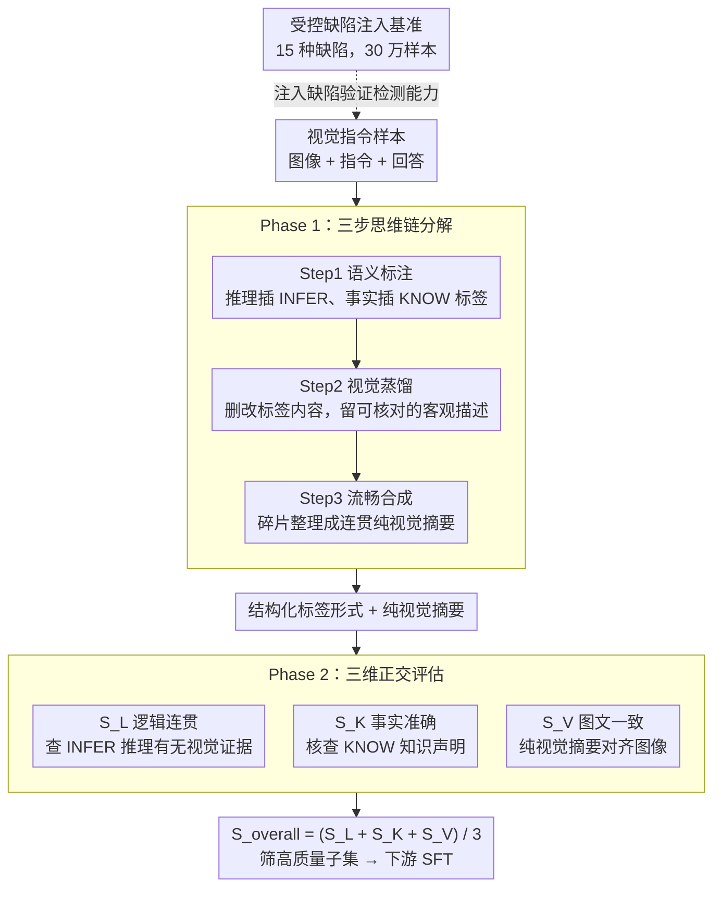

# Evian: Towards Explainable Visual Instruction-tuning Data Auditing

**会议**: ACL 2026  
**arXiv**: [2604.20544](https://arxiv.org/abs/2604.20544)  
**代码**: 无  
**领域**: 可解释性  
**关键词**: 数据审计、视觉指令微调、可解释评估、数据质量、多模态大模型

## 一句话总结

提出"分解-再评估"（Decomposition-then-Evaluation）范式和 EVIAN 框架，将视觉指令微调数据的回答分解为视觉描述、主观推理和事实声明三个组件，沿图文一致性、逻辑连贯性和事实准确性三个正交维度评估，发现用其筛选的少量高质量数据训练的模型优于大规模数据集训练的模型。

## 研究背景与动机

**领域现状**：大型视觉-语言模型（LVLM）依赖视觉指令微调（VIT）实现视觉感知与语言理解的对齐，但训练数据质量参差不齐。

**现有痛点**：（1）大规模数据合成（如 LLaVA-Instruct-150K）提升了指令遵循但引入噪声；（2）现有过滤方法（如 CLIP score）使用粗粒度的单维度打分，无法检测逻辑谬误、事实错误等细微语义缺陷；（3）LLM-as-a-Judge 范式存在偏差、不稳定和推理捷径问题。

**核心矛盾**：现有数据过滤将多种错误类型压缩为单一不透明分数，无法区分视觉误表述、事实不准确和推理缺陷等不同类型的质量问题。

**本文目标**：构建可解释的细粒度数据审计框架，将回答分解为可验证的认知组件进行多维度评估。

**切入角度**：将回答视为由视觉描述、主观推理和事实声明组成的复合结构，而非不可分割的文本块。

**核心 idea**：通过将复杂的审计任务分解为针对不同认知组件的可验证子任务，可以实现比粗粒度打分更精准的数据质量评估，且逻辑连贯性是数据质量中最关键的因素。

## 方法详解

### 整体框架

EVIAN 把一条视觉指令样本的回答当作"复合认知结构"来审计，而不是当作一整块不可分割的文本去打一个总分。流程分两步：先在 Phase 1 用一条三步思维链把回答拆成带标签的结构化形式与一份纯视觉摘要，把视觉描述、主观推理、事实声明三类内容彼此剥离；再在 Phase 2 沿逻辑连贯性 $S_L$、事实准确性 $S_K$、图文一致性 $S_V$ 三个互不重叠的维度各打 1-5 分，最终以三维平均 $S_{\text{overall}} = (S_L + S_K + S_V) / 3$ 作为可解释的数据质量分。此外，本文还自建一个受控缺陷注入基准，反过来量化这套审计管线的细粒度检测能力。

### 关键设计

**1. 三步思维链分解：把一句话拆成可独立验证的认知组件**

粗粒度打分之所以查不出逻辑谬误或事实错误，根因是把多种异质内容混在一起评判，任何单一分数都无法说清"错在哪一类"。EVIAN 用三步链条做剥离：Step 1 语义标注在主观推理处插入 `<INFER>` 标签、在事实声明处插入 `<KNOW>` 标签，未标注的部分即默认为纯视觉描述；Step 2 视觉蒸馏删除或改写带标签内容，只留下可由图像直接核对的客观描述；Step 3 流畅合成再把碎片化的蒸馏结果整理成连贯段落。拆分后每个组件都能交给最贴合它的评估维度，规避了混合评估固有的模糊性。

**2. 三维正交评估体系：不同缺陷用不同尺子量**

视觉误表述、事实不准确、推理缺陷本质上是三类毛病，需要三套不同的判据，混在一个维度里彼此会互相干扰。EVIAN 因此把评估正交化：$S_L$ 只看 `<INFER>` 标签内推理的逻辑性——是否有对应的视觉证据支撑；$S_K$ 对 `<KNOW>` 标签内的知识声明做事实核查；$S_V$ 衡量纯视觉摘要与图像的一致程度，并显式规定一致性优先于完整性。三个维度互不重叠，使得每一类缺陷都能被单独定位而不被其他信号稀释。

**3. 受控缺陷注入基准：给审计管线造一台 30 万样本的体检仪**

现有数据集没有系统注入的可控错误，无从量化一套审计管线的细粒度检测能力到底有多强。EVIAN 自建一个 15 种语义缺陷分类的基准（视觉一致性、逻辑连贯性、事实准确性各 5 种子类），并用三阶段管线注入这些缺陷：先做内容分析，再做上下文相关的错误类型选择，最后引导改写，使注入的错误足够细微且贴合上下文，而非一眼可辨的硬伤。这套受控平台让"审计器能否查出某类缺陷"变成可统计的指标。

### 损失函数 / 训练策略

使用 Qwen3-235B 执行回答分解，Qwen2.5-VL-7B 作为自动审计器评分；下游验证用 Qwen2-VL-2B 在筛选出的 10K 子集上微调。所有对比方法共享相同架构与 SFT 流程，确保性能差异只来自数据筛选策略本身。

## 实验关键数据

### 主实验（10K 子集微调 Qwen2-VL-2B）

| 方法 | MME | MMBench | ScienceQA | A-OKVQA | POPE | Avg |
|------|-----|---------|-----------|---------|------|-----|
| Random | 1475.76 | 0.5353 | 0.6614 | 0.7092 | 75.50 | 63.18 |
| Full Data (300K) | 1553.05 | 0.5953 | 0.6267 | 0.6934 | 78.17 | 63.77 |
| SCALE (SOTA) | 1814.97 | 0.6318 | 0.6916 | 0.7066 | 73.81 | 67.41 |
| EVIAN (Ours) | 1876.89 | 0.6463 | 0.7115 | 0.7493 | 79.87 | 70.20 |

### 消融实验

| 配置 | Avg | 说明 |
|------|-----|------|
| EVIAN (Full) | 70.20 | 完整框架最优 |
| w/o Decomposition | 67.93 | 去掉分解阶段损失 2.27 |
| w/o $S_L$ (逻辑连贯) | 57.27 | **去掉逻辑连贯性损失最大** (↓12.93) |
| w/o $S_K$ (事实准确) | 64.21 | 去掉事实准确性损失 5.99 |
| Only $S_V$ (图文一致) | 65.36 | 仅视觉一致性尚可但 POPE 暴跌至 68.56 |

### 关键发现
- **逻辑连贯性最关键**：去掉 $S_L$ 导致 Avg 从 70.20 暴跌至 57.27，因为仅靠 $S_K$ 和 $S_V$ 会选入事实正确但逻辑不一致的样本，产生矛盾的监督信号
- **"少即是多"**：EVIAN 筛选的 10K 子集（300K 的 3.3%）训练效果优于全部 300K 数据
- 评分分布中，92.3% 的原始高质量样本得分 ≥ 3.0，缺陷样本集中在 3.0 附近（JSD=0.35, AUC=0.86）
- 跨架构验证（InternVL2-2B）表明提升来自数据质量而非审计器与目标模型的归纳偏差对齐

## 亮点与洞察
- "分解-再评估"范式的核心洞察：将审计分解为可验证的子任务使复杂审计变得可靠
- 挑战了"数据量越大越好"的主流范式，用 3.3% 的数据超越了全量训练
- 发现逻辑连贯性（而非视觉对齐或事实准确性）是数据质量中最关键的因素，这一反直觉结论有重要意义
- 缺陷注入基准的分类学设计系统化，覆盖一致性、推理和知识三个大类各 5 种错误子类型

## 局限与展望
- 依赖大型多模态模型进行分解和评估，可能继承其偏差和盲点
- 分解阶段的错误会传播到后续评估，鲁棒性有待提升
- 计算成本较高（多次调用大模型），限制了超大规模数据集的应用
- 未建模风格多样性、教学价值等其他数据质量维度

## 相关工作与启发
- **vs SCALE**：SCALE 采用多阶段过滤（模态质量、相关性、清晰度、任务稀有度），但未进行组件级分解；EVIAN 通过认知组件分解实现更精准的细粒度审计
- **vs CLIPScore/BLIP**：基于相似度的粗粒度过滤无法捕捉逻辑谬误和事实错误
- **vs LLM-as-a-Judge**：直接让模型打整体分存在偏差和不稳定性，EVIAN 通过结构化分解减少了这一问题

## 评分
- 新颖性: ⭐⭐⭐⭐ "分解-再评估"范式新颖，15 种缺陷分类学系统化
- 实验充分度: ⭐⭐⭐⭐⭐ 多基线对比、消融完整、跨架构验证、30 万样本基准
- 写作质量: ⭐⭐⭐⭐ 结构清晰，图表丰富，分析深入
- 价值: ⭐⭐⭐⭐ 对多模态数据整理有重要指导意义，逻辑连贯性优先的发现有广泛影响

<!-- RELATED:START -->

## 相关论文

- [\[ICLR 2026\] Exploring Interpretability for Visual Prompt Tuning with Cross-layer Concepts](../../ICLR2026/interpretability/exploring_interpretability_for_visual_prompt_tuning_with_cross-layer_concepts.md)
- [\[ICML 2025\] Configurable Preference Tuning with Rubric-Guided Synthetic Data](../../ICML2025/interpretability/configurable_preference_tuning_with_rubric-guided_synthetic_data.md)
- [\[ACL 2026\] Diffusion-CAM: Faithful Visual Explanations for dMLLMs](diffusion-cam_faithful_visual_explanations_for_dmllms.md)
- [\[ACL 2026\] Investigating More Explainable and Partition-Free Compositionality Estimation for LLMs: A Rule-Generation Perspective](investigating_more_explainable_and_partition-free_compositionality_estimation_fo.md)
- [\[ACL 2026\] The Impact of Off-Policy Training Data on Probe Generalisation](the_impact_of_off-policy_training_data_on_probe_generalisation.md)

<!-- RELATED:END -->
