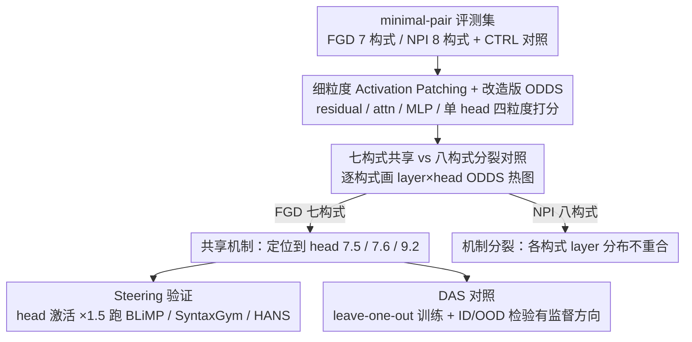

# Fine-Grained Analysis of Shared Syntactic Mechanisms in Language Models

**会议**: ACL 2026  
**arXiv**: [2604.22166](https://arxiv.org/abs/2604.22166)  
**代码**: https://github.com/ynklab/shared_syntactic_mechanism (有)  
**领域**: 可解释性 / 语言学 / 因果分析 / Mechanistic Interpretability  
**关键词**: Activation Patching、DAS、Filler-Gap Dependency、NPI、Pythia

## 一句话总结
论文用 activation patching 在 attention head 粒度上证明：Pythia/Gemma 处理英文 filler-gap 依赖（FGD）时七大构式共享同一套早-中层 3 个 attention head 的机制，把这几个 head 的激活×1.5 还能在 BLiMP 上多对一批题；而负极性项（NPI）授权没有这种统一机制，且训练阶段更易学到的"DAS 方向"在 OOD 上完全失效，说明无监督的 patching 比有监督的 DAS 更可信。

## 研究背景与动机
**领域现状**：要搞清楚 LLM 内部是不是真用了语言学家所说的"共享句法机制"，主流路径是 causal abstraction — 用 activation patching 或 DAS 对内部组件做因果干预看输出怎么变。前人（Finlayson 2021、Boguraev 2025、Arora 2024）在 subject-verb agreement 和 FGD 上做过初步分析，但大多只看 residual stream，没下钻到 attention head 这级粒度，也没系统验证 OOD 鲁棒性。

**现有痛点**：(1) **粒度太粗**：只看 residual stream 的话，两个用完全不同 head 集合但产出相似 residual 表征的机制会被误判为"同一个"；(2) **训练 artifact 风险**：DAS 这种有监督方法学到的"causal direction"可能只是 overfit 到训练 lexicon/构式分布，在 OOD 上失效却没人系统验证；(3) **缺验证闭环**：哪怕找出了一个"共享机制"，也没人验证这机制能否真改变模型在外部 benchmark（如 BLiMP）上的行为。

**核心矛盾**：共享句法机制是个语言学诱人假设，但用错方法可能"被看见"也可能"被错认"；要确凿地论证就必须同时满足 (a) attention-head 级别的细粒度、(b) OOD 泛化、(c) 行为级 steering 验证。

**本文目标**：在 attention head + MLP 粒度上检验 LM 是否在 FGD / NPI 两类涉及多构式的句法现象上共享内部机制；同时 contrast activation patching vs DAS 看哪个更可靠。

**切入角度**：(1) 选 FGD（7 构式）和 NPI（8 构式 + control）两类对比鲜明的现象 — FGD 主要需要远距离句法依赖，NPI 还要融合语义授权；(2) 用 modified ODDS 作为细粒度因果效应度量；(3) 训练 / ID test / OOD test 严格用不相交词表分离。

**核心 idea**：activation patching 不需要训练所以不会 overfit，正好做 OOD 对照实验；如果 patching 在 OOD 上还稳定但 DAS 不稳，就直接证明了 DAS 不可靠。

## 方法详解

### 整体框架
这是一项机制可解释性的因果分析：作者要在 attention head 这级粒度上确认 LM 处理多种句法构式时是否真的共用同一套内部机制。先构造一个 minimal-pair 评测集，覆盖 FGD 的 7 个构式（EWHK/EWHW/MWH/RELCL/CLEFT/PCLEFT/TOPIC）、NPI 的 8 个构式（COND/DNEG/SONLY/QNT/EMBQ/SMPQ/SUP/ONLY）外加一个 capital-knowledge control（CTRL）；然后在 Pythia（1B/2.8B/6.9B 多 checkpoint）和 Gemma 3（1B/12B）上跑 activation patching，对 residual stream、attention output、MLP、单个 attention head 四种粒度都打 ODDS 分数，再比较各构式的 ODDS 分布是否一致来判定"是否共享"。最后接两条验证支线：把识别出的关键 head 激活放大后跑 BLiMP/SyntaxGym/HANS 看行为是否随之改善，以及用同样设置跑 DAS 的 leave-one-out 训练与 ID/OOD 评测，检验有监督方法能否复现同一结论。

### 关键设计

**1. 细粒度 Activation Patching + 改造版 ODDS：把因果贡献定位到单个 head**

只看 residual stream 会把"用完全不同 head 集合却产出相似表征"的两种机制误判成同一个，所以必须下钻到 head 级。做法是把 base 输入 $b$ 上某个 component 的激活 $f(b)$ 替换成 source 输入 $s$ 的对应激活 $f(s)$，观察输出概率怎么变，并用改造版 $\text{ODDS}(p, p_{\text{interv}}, T) = \frac{1}{|T|}\sum \log\left(\frac{p(y_b|b)}{p(y_b|s)} \cdot \frac{p_{\text{interv}}(y_b|s,b)}{p_{\text{interv}}(y_b|b,s)}\right)$ 度量干预对特定 token $y_b$ 概率差距的位移。原始 Arora 版比较的是 $y_b$ vs $y_s$，但 NPI 场景下这两者在语法上非对称（$y_b$ 才是 NPI），故改成只跟踪同一 token 的概率变化。这一改动一举三得：patching 全程不训练因而无 overfit 风险；在 FGD 对称对上与原版数学等价（附录有证明）却能正确处理 NPI 非对称对；head 级粒度让"residual 相似但 head 不同"的两种机制得以区分。

**2. 七构式共享 vs 八构式分裂的对照设计：用可证伪假说立住"共享"的真实性**

如果只看 FGD 一组构式都共享，可能只是因为它们都借用了"远距离依赖"这一表面线索，无法排除是 patching 方法自身的伪影。作者因此为每个构式独立画一张 "layer × token × head" 的 ODDS 热图：FGD 七个构式若都在同一组 head、同一些 layer 显著高，就判为共享；NPI 八个构式若热图彼此差异巨大，就判为机制分裂。结果 FGD 的高 ODDS 全部集中在 layer 7 的 head 7.5/7.6 与 layer 9 的 head 9.2，七构式高度一致，而 NPI 在 DNEG/COND/SUP 上呈现明显不同的 layer 分布。引入 NPI 作对照恰好证明"共享"并非方法伪影——同一套方法在 NPI 上确实能看见机制分裂。

**3. Steering 验证：从 head 操控到 BLiMP 准确率的行为闭环**

仅在合成 minimal pair 上拿到高 ODDS 仍可能是 dataset artifact，必须验证这套机制在真实句子上确实管用。作者把识别出的 3 个 head（7.5、7.6、9.2）激活乘以系数 $\alpha \in \{0.8, 1.0, 1.5, 2.0\}$，在 BLiMP 上比较准确率：FGD 类题（wh_questions_object_gap 等 7 类）在 $\alpha>1$ 时准确率单调上升，而更出人意料的是 island effects、binding、quantifiers、NPI 等其他类别同样获益。这说明这几个 head 实际承担的是"层级依赖"这一通用句法骨架，而非 FGD 特化；BLiMP 作为独立且覆盖更广的 benchmark，其上的能力迁移是机制真实性最有力的证据。

### 损失函数 / 训练策略
activation patching 完全 inference-only，不涉及训练。DAS 则要训练一个一维向量 $a$，损失为 $\min_a (-\sum_{(b,s,y_b,y_s)\in D}\log p_{\text{interv}}(y_s|b,s))$，干预定义为 $f_{\text{interv}}(b, s) = f(b) + (f(s)\cdot a - f(b)\cdot a) \cdot a^T$；训练 100 步、lr $5\times 10^{-3}$、batch=4、10% linear warmup。数据集划分为 train 200 / ID 50 / OOD 50，其中 OOD 词表与 train/ID 完全不相交，以便严格检验有监督方向是否只是过拟合到训练 lexicon。

## 实验关键数据

### 主实验
ODDS scores (Pythia 1B, EWHK + 6 个 FGD 构式) 表现出共享，关键 head 定位：

| 构式 | Attention Head 7.5 ODDS | Head 7.6 ODDS | Head 9.2 ODDS | 共享 |
|------|------------------------|---------------|----------------|------|
| EWHK | ~2.0 | ~2.0 | ~1.5 | ✓ |
| EWHW | 一致高 | 一致高 | 一致高 | ✓ |
| MWH | 一致高 | 一致高 | 一致高 | ✓ |
| RELCL | 一致高 | 一致高 | 一致高 | ✓ |
| CLEFT | 一致高 | 一致高 | 一致高 | ✓ |
| PCLEFT | 一致高 | 一致高 | 一致高 | ✓ |
| TOPIC | 一致高 | 一致高 | 一致高 | ✓ |
| CTRL (control) | ~0 | ~0 | ~0 | — |

NPI 构式（COND、DNEG、SUP）则呈现明显的分裂模式：DNEG 在更早 layer 出现高 ODDS，COND/SUP 的最高 head 位置不重合。

BLiMP steering (放大 head 7.5/7.6/9.2 激活)：

| Category | $\alpha=0.8$ | $\alpha=1.0$ | $\alpha=1.5$ | $\alpha=2.0$ |
|----------|--------------|--------------|--------------|--------------|
| Filler gap (核心目标) | 略低 | baseline | **+** | **++** |
| Island effects | baseline | baseline | **+** | **+** |
| Binding | baseline | baseline | **+** | **+** |
| Quantifiers | baseline | baseline | **+** | **+** |
| NPI | baseline | baseline | **+** | **+** |
| Subject-verb agr. (PP/RC 干扰) | baseline | baseline | **+** | **+** |

### 消融实验
Activation Patching vs DAS 在 ID / OOD 上的对照：

| 设置 | ID ODDS | OOD ODDS | 一致性 |
|------|---------|----------|--------|
| Activation Patching (Residual stream) | 高（layer 7 起飞） | **高（与 ID 高度一致）** | ✓ |
| DAS (Residual stream) | 高（layer 7+） | **大幅下滑** | ✗（疑似 overfit） |
| Activation Patching (Attention head) | 高 | **高** | ✓ |
| DAS (Attention head) | 中等 | 稍下滑 | 部分 ✓ |

训练 step 演化 (Pythia 1B)：EWHK（高频构式）在 step 4000 就接近最终 ODDS；PCLEFT（低频）到 step 10000 还在涨 — 共享机制是 hierarchically 出现的，高频构式先学会。

模型 scaling：Pythia 1B/2.8B/6.9B 和 Gemma 3 1B/12B 都呈现"层数越多机制越往前 layer 提前"，但 head 数量和共享结构稳定。

### 关键发现
- **三个 head (7.5, 7.6, 9.2) 几乎扛起整个 FGD 处理** — 这种极端 sparsity + localization 在 mechanistic interpretability 文献里是少见的干净发现。
- **训练频次决定机制收敛速度** — 高频构式 step 4k 就稳定，低频构式 step 10k+ 才完成；说明"共享机制"是 frequency-driven 涌现而非天生 prior。
- **DAS 在 OOD 上失效** — 这是对 mechanistic interpretability 社区的硬警示：训练过的 causal direction 可能只是 dataset 拟合，必须强制做 OOD 验证。
- **被操控的 head 不只对 FGD 起作用，还能 boost binding / island / NPI / 长距离 SV agreement** — 说明这几个 head 真正学到的是"层级依赖"这一更通用的句法骨架。

## 亮点与洞察
- **方法论上**：用对比设计（FGD 共享 vs NPI 分裂）+ OOD 严格分离 + 行为级 steering 三件套，把 mechanistic interpretability 的 evidence 强度推到了前所未有的水准 — 后续任何"找到了 X 机制"的工作都应该被这套标准 benchmark。
- **科学发现上**：把"共享句法机制"从语言学猜想做成了可被 head 索引的实证发现 — 你可以指着 head 9.2 说"这就是 LM 的 filler-gap 处理器"。
- **训练动力学洞察**：高频构式先收敛、共享机制在 step 4k 内就建立，启示了"为什么 SLM 长尾构式表现不稳"的微观机制 — 数据多样性决定了机制能否扩展到低频构式。
- **DAS overfit 警示**：可能让相当一批 mechanistic interpretability 工作需要重新审视；同时为 "training-free" 因果方法正名。

## 局限与展望
- 只测英语，词序自由的语言（如日语、芬兰语）可能有不同的 head 分布；low-resource 语言下机制可能完全不同。
- 数据是合成 minimal pair，作者虽然加了真实句子小规模验证，但分布偏窄；BLiMP/SyntaxGym 部分弥补但仍是英语 syntax 限定。
- 只覆盖 FGD + NPI 两类构式，subject-verb agreement、anaphora、ellipsis 等其他构式是否也共享机制需另测。
- NPI 上"机制分裂"是一个负面结论，但作者没深入解释为何分裂 — 是因为语义授权机制太复杂，还是因为 NPI 词项变化少导致 patching 信号弱？
- 模型只测 Pythia + Gemma 3 两个家族，OpenAI / Claude / DeepSeek 等闭源模型上是否同样有 3-head 共享机制未知。

## 相关工作与启发
- **vs Boguraev et al. 2025 (FGD causal interventions)**: 同样研究 FGD 共享机制，但只看 residual stream 且没做严格 OOD；本文下钻到 head 级、严格 OOD 验证，并用 BLiMP steering 闭环 — 是直接的 superset。
- **vs Finlayson et al. 2021 (subject-verb agreement)**: 早期 causal mediation 工作，但没考虑 OOD 风险且未做 fine-grained head 分析；本文是方法论上的延伸。
- **vs Jumelet et al. 2021 (NPI monotonicity 假说)**: 后者认为 NPI 通过统一的 monotonicity 机制处理；本工作在 decoder LM 上找不到这种统一性，与原假说形成有趣 contrast。
- **vs Kryvosheieva et al. 2025 (probing 共享单元)**: probing 路线无法验证 causal impact，本工作的 causal + behavior 双重证据更强。

## 评分
- 新颖性: ⭐⭐⭐⭐ "细粒度 + OOD 严验 + steering 闭环" 三件套是 mechanistic interpretability 领域少见的工程级严谨度。
- 实验充分度: ⭐⭐⭐⭐⭐ 跨多模型、多 size、多 training step、ID/OOD 双 split + BLiMP/SyntaxGym/HANS 多 benchmark，几乎不留空白。
- 写作质量: ⭐⭐⭐⭐ Figure 1 一张图说清 FGD/NPI/control 三种 ODDS 分布对比；附录中数学等价证明扎实。
- 价值: ⭐⭐⭐⭐⭐ 既为 mechanistic interpretability 立了方法论标杆，也给"LM 是否真懂语法"这个长期争论提供了硬证据；负面 DAS 结论对社区有直接修正作用。

<!-- RELATED:START -->

## 相关论文

- [\[ACL 2026\] FineSteer: A Unified Framework for Fine-Grained Inference-Time Steering in Large Language Models](finesteer_a_unified_framework_for_fine-grained_inference-time_steering_in_large_.md)
- [\[CVPR 2025\] Prompt-CAM: Making Vision Transformers Interpretable for Fine-Grained Analysis](../../CVPR2025/interpretability/prompt-cam_making_vision_transformers_interpretable_for_fine-grained_analysis.md)
- [\[CVPR 2026\] Understanding Counting Mechanisms in Large Language and Vision-Language Models](../../CVPR2026/interpretability/understanding_counting_mechanisms_in_large_language_and_vision-language_models.md)
- [\[AAAI 2026\] Partially Shared Concept Bottleneck Models](../../AAAI2026/interpretability/partially_shared_concept_bottleneck_models.md)
- [\[ACL 2026\] How Language Models Conflate Logical Validity with Plausibility: A Representational Analysis of Content Effects](how_language_models_conflate_logical_validity_with_plausibility_a_representation.md)

<!-- RELATED:END -->
