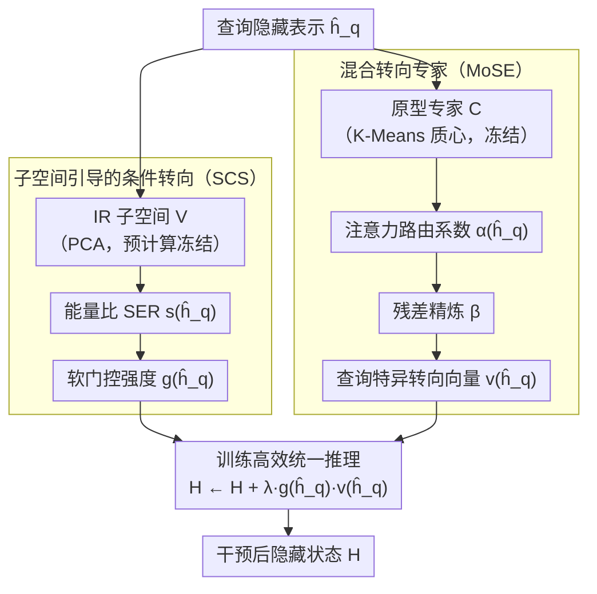

# FineSteer: A Unified Framework for Fine-Grained Inference-Time Steering in Large Language Models

**会议**: ACL 2026  
**arXiv**: [2604.15488](https://arxiv.org/abs/2604.15488)  
**代码**: [GitHub](https://github.com/YukinoAsuna/FineSteer)  
**领域**: 多模态VLM  
**关键词**: 推理时转向, 条件转向, 混合专家转向, 越狱防御, 幻觉缓解

## 一句话总结
FineSteer 将推理时转向分解为两个互补阶段：子空间引导的条件转向（SCS）决定"何时转向"——用 IR 查询子空间的能量比做门控；混合转向专家（MoSE）决定"如何转向"——通过注意力门控网络动态聚合原型专家+残差精炼生成查询特异性转向向量，在安全和真实性 benchmark 上超越 SOTA。

## 研究背景与动机

**领域现状**：推理时转向通过在推理时修改隐藏表示来调整 LLM 行为，避免参数更新。方法从全局固定向量（CAA、ITI、RV）发展到学习式自适应向量（AlphaSteer、TruthFlow）。

**现有痛点**：（1）全局转向向量是"一刀切"设计——对所有查询应用相同干预，在安全性和实用性之间形成尖锐权衡（如 RV 在拒绝恶意查询的同时也拒绝大量良性查询）；（2）AlphaSteer 学习了"何时转向"但对所有需干预查询应用几乎相同的向量，缺乏"如何转向"的细粒度校准；（3）训练效率低——AlphaSteer 需要 12,000 个通用查询训练条件矩阵。

**核心矛盾**：有效转向需要同时满足三个看似矛盾的目标——有效性（对目标查询足够强的干预）、实用性保持（对通用查询无影响）、训练效率（少量数据即可学习）。

**本文目标**：设计一个同时满足有效性、实用性保持和训练效率的统一转向框架。

**切入角度**：将推理时转向分解为"何时"和"如何"两个独立阶段，分别用专门机制解决。

**核心 idea**：SCS 用子空间能量比做高效门控 + MoSE 用原型专家+残差精炼做查询特异性向量合成。

## 方法详解

### 整体框架
FineSteer 把"推理时转向"这件事拆成两个问得很清楚的子问题——何时该转、该怎么转——再各用一个专门模块回答。输入一条查询的隐藏表示 $\hat{\mathbf{h}}_q$，先由子空间引导的条件转向（SCS）判断它是否落在"需要干预（IR）"的低维子空间里、给出一个软门控强度 $g(\hat{\mathbf{h}}_q)$；只要门控被打开，混合转向专家（MoSE）就为这条查询现场合成一个量身定制的转向向量 $\mathbf{v}(\hat{\mathbf{h}}_q)$。最终的隐藏状态干预统一写成 $\mathbf{H} \leftarrow \mathbf{H} + \lambda \cdot g(\hat{\mathbf{h}}_q) \cdot \mathbf{v}(\hat{\mathbf{h}}_q)$，门控决定有没有干预、专家决定干预往哪个方向走，二者解耦后可以各自独立优化。

### 关键设计

**1. 子空间引导的条件转向（SCS）：把"何时转"建成一个单类问题**

以往做条件判断的麻烦在于"通用查询"是一个开放、庞大、几乎无法显式建模的分布，AlphaSteer 为此要拿一万多条通用查询去学"什么时候不该转"。SCS 反过来只对紧凑的那一侧——需要干预的 IR 查询——建模：用 PCA 把 IR 查询的表示压进一个低维子空间 $\mathbf{V}$，对任意新查询计算它落在该子空间里的能量占比 $s(\hat{\mathbf{h}}_q) = \|V^\top(\hat{\mathbf{h}}_q - \boldsymbol{\mu}_h)\|^2 / \|\hat{\mathbf{h}}_q - \boldsymbol{\mu}_h\|^2$，能量比（SER）越高说明它越贴合 IR 模式。门控取一个保守的下尾阈值，对低于阈值的查询用快速衰减项 $(F(s)/\epsilon)^\gamma$ 把干预强度压到接近零。因为只需要刻画一个紧凑子空间而非整个开放分布，SCS 仅靠少量 IR 查询就能立起来，训练数据需求比 AlphaSteer 低一个数量级，这正是"实用性保持"和"训练效率"能同时拿到的关键。

**2. 混合转向专家（MoSE）：为每条查询现场合成方向**

不同的不良行为——事实幻觉、逻辑错误、越狱——本就需要朝不同方向纠正，单一全局向量无论如何调强度都没法同时照顾这种异质性。MoSE 用"固定原型 + 可学习路由 + 残差精炼"三步把向量合成做成查询特异的：先对训练集里的差异向量 $\delta_i = \mathbf{h}_+^{(i)} - \mathbf{h}_-^{(i)}$ 做 K-Means，质心当作原型专家 $\mathbf{C} = [\mathbf{c}_1, ..., \mathbf{c}_K]$ 并冻结不训；再用一个缩放点积注意力把当前查询路由成专家混合系数 $\alpha(\hat{\mathbf{h}}_q) = \text{softmax}((\mathbf{W}_K\mathbf{C})^\top(\mathbf{W}_Q\hat{\mathbf{h}}_q) / \sqrt{d_k})$；最后在 PCA 基空间 $\mathbf{U}_{res}$ 上用一个轻量 MLP 预测残差系数 $\boldsymbol{\beta}$，把原型没覆盖到的细粒度方向补回来。原型负责"大致往哪类问题的方向走"，注意力负责"这条查询更像哪几类",残差负责"再精修一点点"，三者叠加才得到与 $\hat{\mathbf{h}}_q$ 强相关的定制向量。

**3. 训练高效的统一推理：只学路由和精炼这点参数**

把昂贵的部分都预计算并冻结，是 FineSteer 能压住训练成本的根本原因。SCS 的子空间、MoSE 的原型专家与残差基空间都在训练前一次性算好并固定，整个框架真正可学的只有 $\Theta = \{\mathbf{W}_Q, \mathbf{W}_K, \boldsymbol{\beta}\}$ 这一小撮路由与精炼参数。训练目标也很直接——让合成出来的向量去对齐观察到的真实差异向量 $\mathcal{L} = \frac{1}{M}\sum\|\mathbf{v}(\hat{\mathbf{h}}_q^{(i)}) - \delta_i\|^2$。相比全参数学习式转向，这种"重的预计算 + 轻的可学路由"分工让计算开销和数据需求都低得多，却仍保留了查询级的适应能力。

### 损失函数 / 训练策略
训练用 MSE 把预测的转向向量对齐到真实差异向量，并加一项正则约束可学参数：$\mathcal{L} = \frac{1}{M}\sum\|\mathbf{v}(\hat{\mathbf{h}}_q^{(i)}) - \delta_i\|^2 + \lambda_{reg}\|\Theta\|^2$。由于原型专家与各基空间均预计算冻结，优化只作用在 $\Theta$ 上。

## 实验关键数据

### 主实验

| 任务 | 模型 | FineSteer | SOTA 基线 | 提升 |
|------|------|-----------|----------|------|
| TruthfulQA | Llama-3 | +7.6% | AlphaSteer | 显著 |
| 越狱防御 DSR | 多种攻击 | 高 | RV/BiPO | 高 DSR + 保持实用性 |
| 通用查询实用性 | MT-Bench | 近乎不变 | AlphaSteer 有下降 | 更好的实用性保持 |

### 消融实验

| 配置 | 关键指标 | 说明 |
|------|---------|------|
| 无 SCS（全部转向） | 实用性大降 | 条件门控是实用性保持的关键 |
| 无 MoSE（全局向量） | 有效性降 | 查询特异性向量更有效 |
| 无残差精炼 | 轻微下降 | 残差补充了原型专家的遗漏 |
| SCS hard vs soft | soft 更平滑 | 软门控在边界查询上更稳健 |

### 关键发现
- SCS 仅需少量 IR 查询（无需通用查询数据）即可实现可靠的条件转向
- MoSE 的原型专家自然对应不同类型的不良行为，聚类结果语义可解释
- FineSteer 在安全和真实性两个领域均达到 SOTA，证明框架的通用性
- 训练数据效率比 AlphaSteer 高出数量级

## 亮点与洞察
- **"何时"与"如何"的解耦**是一个优雅的设计——允许两个阶段独立优化，避免联合训练的复杂性
- SCS 的**单类建模**思路非常聪明——建模"需要干预的查询是什么样的"比建模"不需要干预的查询是什么样的"简单得多，因为前者是紧凑子空间而后者是开放分布
- MoSE 的**固定原型+可学习路由**架构在参数效率和适应性之间取得了极好的平衡

## 局限与展望
- 原型数量 K 通过 K-Means 自动确定但可能不是最优
- 仅在安全和真实性上验证，对创造性/多样性控制等其他转向目标的适用性未知
- SCS 的子空间假设可能在 IR 查询高度异质时失效
- 推理时增加的计算开销虽小但非零

## 相关工作与启发
- **vs CAA/ITI**: 全局固定向量，不区分查询，实用性损失大
- **vs RV**: 激进转向导致大量良性查询被拒绝
- **vs AlphaSteer**: 学习条件但不学习向量多样性，训练需要大量通用数据

## 评分
- 新颖性: ⭐⭐⭐⭐⭐ 条件转向+混合专家的两阶段分解非常新颖
- 实验充分度: ⭐⭐⭐⭐⭐ 安全+真实性双领域、多种攻击、详细消融
- 写作质量: ⭐⭐⭐⭐ 动机分析到位，数学形式化完整

<!-- RELATED:START -->

## 相关论文

- [\[ACL 2026\] Compositional Steering of Large Language Models with Steering Tokens](compositional_steering_of_large_language_models_with_steering_tokens.md)
- [\[ACL 2026\] Fine-Grained Analysis of Shared Syntactic Mechanisms in Language Models](fine-grained_analysis_of_shared_syntactic_mechanisms_in_language_models.md)
- [\[ACL 2026\] Preference Heads in Large Language Models: A Mechanistic Framework for Interpretable Personalization](preference_heads_in_large_language_models_a_mechanistic_framework_for_interpreta.md)
- [\[ACL 2026\] MINED: Probing and Updating with Multimodal Time-Sensitive Knowledge for Large Multimodal Models](mined_probing_and_updating_with_multimodal_time-sensitive_knowledge_for_large_mu.md)
- [\[ACL 2026\] Knowledge Vector of Logical Reasoning in Large Language Models](knowledge_vector_of_logical_reasoning_in_large_language_models.md)

<!-- RELATED:END -->
