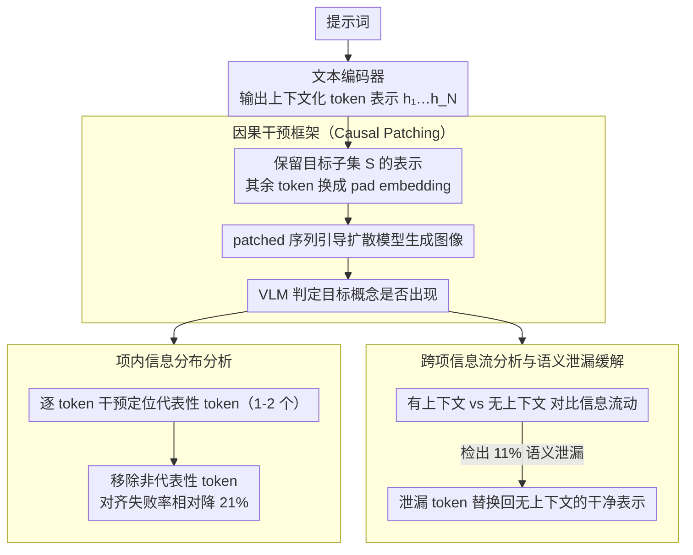

# Follow the Flow: On Information Flow Across Textual Tokens in Text-to-Image Models

**会议**: ACL 2026  
**arXiv**: [2504.01137](https://arxiv.org/abs/2504.01137)  
**代码**: [https://github.com/tokeron/lens](https://github.com/tokeron/lens)  
**领域**: 图像生成  
**关键词**: 文本到图像、信息流、Token表示、语义泄漏、文本编码器

## 一句话总结
本文通过因果干预框架系统研究了文本到图像模型中文本编码器输出的 token 级信息分布，发现词汇项的语义通常集中在 1-2 个代表性 token 上，且跨项信息流在 11% 的情况下会导致语义泄漏和图像错误解读，并提出了简单有效的 token 级干预方法来改善对齐。

## 研究背景与动机

**领域现状**：文本到图像（T2I）模型由文本编码器和扩散模型两部分组成，文本编码器将用户提示转化为引导扩散过程的表示。尽管使用广泛，T2I 模型经常出现图文不对齐的问题，生成的图像未能准确捕获文本中的对象和关系。

**现有痛点**：先前工作主要通过修改扩散过程（特别是交叉注意力机制）来改善对齐，隐含假设每个文本 token 都能可靠地编码其对应概念。然而，这一假设从未被系统验证——token 表示中的信息分布究竟是均匀的还是集中的？不同词汇项之间是否存在信息交叉？

**核心矛盾**：T2I 模型中的许多对齐改进方法（如 Attend-and-Excite）对所有 token 一视同仁，但如果信息分布不均匀，或者 token 间存在语义泄漏，这些方法的有效性就会受到根本性制约。

**本文目标**：回答两个基础问题——（1）词汇项的语义是均匀分布在其所有 token 上还是集中在少数 token 上？（2）每个 token 是否只编码自己的词汇项，还是也会吸收邻近项的信息？

**切入角度**：使用因果干预（patching）技术，通过用 pad embedding 替换其他 token 来隔离特定 token 的贡献，然后生成图像来直接检验该 token 编码了什么信息——这比探针方法更可靠，因为它测试的是扩散模型实际使用的信息。

**核心 idea**：通过逐 token 的因果干预揭示文本编码器中的信息分布规律，并据此设计 token 级干预方法来改善 T2I 对齐。

## 方法详解

### 整体框架
本文的核心是一套"用生成结果反推 token 含义"的因果干预探针。给定一条 T2I 提示词，先让文本编码器吐出全部 token 的上下文化表示 $h_1, \ldots, h_N$；要检验某个 token 子集 $S$ 到底编码了什么，就保留 $S$ 内的表示、把其余 token 全部替换成 pad embedding，组成一条 patched 序列送进扩散模型生成图像，再让 VLM（Qwen2-VL-72B）判断这张图里有没有出现目标概念。"图里出现 = 该子集确实编码了这个概念"，于是同一套干预既能在项内层面问"一个词的语义集中在哪几个 token 上"，也能在跨项层面问"一个 token 有没有偷吸邻居的信息"。

### 关键设计

**1. 因果干预框架（Causal Patching）：用下游生成验证信息是否真被用到**

探针方法可能学到虚假相关，注意力分析也常常具有误导性，二者都只是"旁观"表示而没有检验扩散模型是否真的依赖这部分信息。Causal Patching 直接把判断交给生成结果：对目标 token 子集 $S$ 构造 $\tilde{t}_i = h_i$（若 $i \in S$）、否则 $\tilde{t}_i = p_i$（pad embedding），用这条只保留 $S$ 的表示去引导扩散，再看生成图里有没有目标概念来认定 $S$ 是否为"代表性 token"。因为信号链路一路打到实际生成的图像上，这种验证测的是"下游组件真正使用了什么信息"，比间接观察可靠得多，也是后面两类分析共用的基本工具。

**2. 项内信息分布分析（In-Item Representation）：一个词的语义其实只压在 1-2 个 token 上**

把上面的干预逐 token 地用在同一个词汇项内，就能看清语义到底是摊薄还是集中。作者对一个词的每个 token 单独 patching 再判定生成图是否含该词，结果是 89% 的情况下至少存在一个代表性 token，而且通常只要 1-2 个 token 就足以代表整个概念（如 "pelican" 的三个 token 里只有 "lic" 撑得起鹈鹕），非代表性 token 在多 token 词汇项里占到 52%。更反直觉的是，把这些非代表性 token 移除不但不掉质量，反而让生成失败率相对降低 21%——说明编码器输出里混着不少会干扰扩散的"噪声" token，简单剪枝就是收益。

**3. 跨项信息流分析与语义泄漏缓解（Cross-Item & Semantic Leakage Mitigation）：定位并堵住编码器端的语义串味**

同一套干预换个对象，就能追踪信息有没有在不同词汇项之间流动：对每个词汇项分别在"有上下文"和"无上下文"两种条件下生成图像，比对上下文化的表示是否吸收了别的项的信息。统计下来 89% 的词对保持隔离，但仍有 11% 发生信息流动，多义词尤其容易出问题——比如 "a pool by a table" 里的 "pool" 被上下文带成了台球桌而不是泳池。一旦确认是这种泄漏导致的错误解读，修法很轻量：把泄漏 token 的上下文化表示替换回它在无上下文时的"干净"表示即可，在 FLUX-Schnell 上能把语义泄漏率从 94% 压到 14%，直接命中了对齐失败在编码器端的根源。

### 损失函数 / 训练策略
为了不必每次都跑一遍生成才能找冗余 token，作者额外训了一个单层线性分类器，直接从 token embedding 预测其是否冗余，达到 90% 精确率、83% 准确率，从而能在编码阶段即时过滤冗余 token。

## 实验关键数据

### 主实验

| 移除非代表性 token 数 | 提示数量 | 移除前准确率 | 移除后准确率 | 未受影响 | 改善 |
|----------------------|---------|------------|------------|---------|------|
| 1 | 144 | 81.25% | 83.33% | 98.29% | 14.83% |
| 2 | 98 | 82.65% | 88.78% | 100% | 35.27% |
| 总计 | 339 | 83.48% | 87.02% | 98.90% | 25.00% |

### 消融实验

| 模型 | 初始泄漏率 | RAG-Diffusion | Patching（本文） |
|------|-----------|---------------|-----------------|
| FLUX-Dev | 79% | 39% | 20% |
| FLUX-Schnell | 94% | 43% | 14% |

### 关键发现
- 词汇项的语义通常集中在 1-2 个代表性 token 上，非代表性 token 占多 token 项的 52%，移除它们反而相对改善 21% 的对齐
- 89% 的词汇项对之间不存在跨项信息流，但 11% 的情况下会出现信息流动，尤其多义词容易产生语义泄漏
- 编码器类型影响代表性 token 位置：双向 T5 中代表性 token 可出现在任意位置，单向 Gemma/CLIP 中总在最后一个 token
- CLIP 编码器的 [CLS] token 集中了大部分语义信息，导致其他 token 的信息量很弱，限制了 token 级别的可解释性

## 亮点与洞察
- 发现"移除非代表性 token 反而提升对齐"是反直觉但影响深远的结论——这意味着 T2I 模型的文本编码器输出中存在大量"噪声" token，扩散模型可能被这些噪声干扰。简单的 token 剪枝就能提升 21% 的对齐质量。
- 语义泄漏的机制分析非常精彩：在 "a pool by a table" 中，"pool" 的表示被上下文污染后编码为"台球桌"概念，而在 "a pool by a chair" 中则保持"泳池"含义。这揭示了文本编码器中多义词消歧的系统性失败模式。
- Patching 方法的泛化潜力值得关注：同一机制可用于多义词控制（用户主动选择词义）和偏见缓解（如消除 "runway" 因性别上下文产生的时装/机场偏见），将分析工具转化为实用的生成控制手段。

## 局限与展望
- 提示词集中于以对象为中心的简单语法情况，对拼写错误、罕见词或抽象概念的泛化性有待探索
- VLM 评判虽然与人类判断有较高一致性（Cohen's Kappa 0.868），但仍然是近似评估
- 代表性 token 在双向编码器中的形成机制（为什么 "T-shirt" 中 "T" 成为代表性 token）仍是开放问题
- 冗余 token 分类器仅在 FLUX-schnell 上训练和评估，对其他 T2I 模型的迁移性有待验证

## 相关工作与启发
- **vs Attend-and-Excite (Chefer et al., 2023)**: Attend-and-Excite 在扩散阶段修改注意力来改善对齐，但隐含假设 token 编码正确；本文证明问题可能源于编码阶段，从根源修复更高效
- **vs RAG-Diffusion (Tan et al., 2024)**: RAG-Diffusion 通过边界框限制扩散注意力来改善对齐，但在语义泄漏场景下效果不如本文的 patching 方法（FLUX-Schnell: 43% vs 14% 泄漏率）
- **vs Patchscopes (Ghandeharioun et al., 2024)**: Patchscopes 通过表示解码来分析 token 信息，但不测试下游组件是否实际使用了该信息；本文的因果干预方法通过图像生成直接验证信息的有效性

## 评分
- 新颖性: ⭐⭐⭐⭐ 首次系统研究 T2I 文本编码器中 token 级信息分布，揭示了代表性 token 和语义泄漏现象
- 实验充分度: ⭐⭐⭐⭐ 跨 4 个 T2I 模型和 3 种编码器类型验证，有人类评估和定量分析
- 写作质量: ⭐⭐⭐⭐⭐ 图示极为直观，从分析到应用的转化自然流畅
- 综合推荐: ⭐⭐⭐⭐ 为 T2I 模型的文本编码器研究提供了新的视角和实用工具
- 易复现性: ⭐⭐⭐⭐ 代码已开源，实验设置清晰，基于公开模型和数据集
- 影响力: ⭐⭐⭐⭐ 对理解和改进 T2I 对齐具有实际指导意义

<!-- RELATED:START -->

## 相关论文

- [\[ICCV 2025\] VITAL: More Understandable Feature Visualization through Distribution Alignment and Relevant Information Flow](../../ICCV2025/interpretability/vital_more_understandable_feature_visualization_through_distribution_alignment_a.md)
- [\[ACL 2026\] Compositional Steering of Large Language Models with Steering Tokens](compositional_steering_of_large_language_models_with_steering_tokens.md)
- [\[ACL 2026\] HistLens: Mapping Idea Change across Concepts and Corpora](histlens_mapping_idea_change_across_concepts_and_corpora.md)
- [\[ICLR 2026\] Concepts' Information Bottleneck Models](../../ICLR2026/interpretability/concepts_information_bottleneck_models.md)
- [\[ACL 2026\] A Systematic Comparison between Extractive Self-Explanations and Human Rationales in Text Classification](a_systematic_comparison_between_extractive_self-explanations_and_human_rationale.md)

<!-- RELATED:END -->
