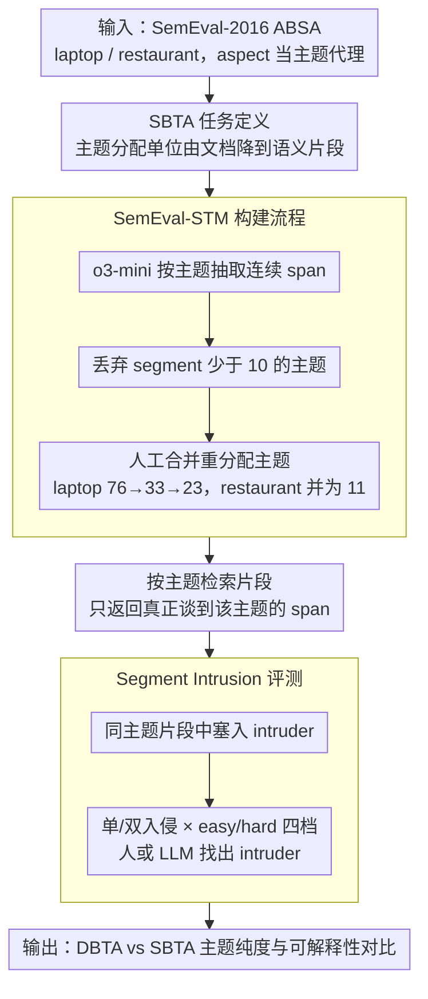

# From Documents to Segments: A Contextual Reformulation for Topic Assignment

**会议**: ACL2026  
**arXiv**: [2605.17714](https://arxiv.org/abs/2605.17714)  
**代码**: 数据集 https://huggingface.co/datasets/LG-AI-Research/SemEval-STM；代码仓库缓存未提供  
**领域**: 主题建模 / 可解释文本分析 / NLP理解  
**关键词**: 主题建模, 文本分段, 主题污染, SemEval-STM, segment intrusion  

## 一句话总结
本文把主题分配的基本单位从 document 改成 segment，提出 SBTA 和 SemEval-STM 数据集，证明在多主题短文本中按语义片段分配主题能显著提升主题纯度、可解释性和下游检索可用性。

## 研究背景与动机
**领域现状**：传统主题建模通常以文档为基本单位，把每篇文档表示成一个或多个主题的混合。LDA、BERTopic 和近期 LLM-based topic modeling 都沿用这个思路，只是在主题生成、标签命名或语义表示上更强。

**现有痛点**：真实应用里，很多文本并不是“整篇只讲一个主题”。一条产品评论可能同时谈价格、质量、服务和外观；一段员工反馈可能同时谈薪酬、文化和晋升。文档级主题分配会把这些不同主题混在一起，导致 topic contamination：检索某个主题时拿回的是整篇多主题文本，而不是最相关的具体陈述。

**核心矛盾**：主题建模的目标是得到清晰、可解释、可检索的主题集合，但文档这个单位经常比主题本身更粗。文档越异质，文档级分配越容易把无关内容带入主题簇。

**本文目标**：作者希望正式重定义 topic assignment：不再把主题分配给文档，而是分配给短小、语义自洽的文本片段，并构建一个能评估这种设定的数据集和任务。

**切入角度**：论文借用 aspect-based sentiment analysis 数据，因为 ABSA 天然有 aspect label，适合把 aspect 当成 proxy topic，并用 LLM 抽取与每个 aspect 对应的文本 span。

**核心 idea**：把 topic allocation 的基本对象改成 segment，让每个 topic 聚合真正相关的语义片段，而不是包含许多离题内容的完整文档。

## 方法详解
SBTA 可以理解为“topic modeling 的粒度重构”。它并不要求重新发明所有 topic modeling 算法，而是改变输入和输出的单位：先把文档拆成表达单一或少数相关主题的 segment，再在 segment 层面做主题分配、聚类评估和人工一致性评估。

### 整体框架
给定语料 $\mathcal{D}=\{d_1,\ldots,d_D\}$ 和 $K$ 个主题，DBTA 会把主题关联到整篇文档。SBTA 则为每篇文档构造 segment 集合 $\mathcal{Q}_d$，每个 segment 是一个连续 token span $[i:j]$ 和一组主题 $\mathcal{T}$ 的组合。若用户关注主题 $k$，系统返回的是 $\mathcal{Q}_{d,k}=\{Q\in\mathcal{Q}_d|k\in\mathcal{T}(Q)\}$，也就是文档中真正谈到该主题的片段。

数据层面，作者构建 SemEval-STM。它基于 SemEval-2016 ABSA 的 laptop 和 restaurant 两个领域，用 aspect label 作为主题代理。LLM 先为每个主题抽取相关 segment，然后作者进行后处理、人工合并和重分配，形成同时支持 DBTA 与 SBTA 对比的 benchmark。

### 关键设计

**1. Segment-based Topic Allocation 任务定义：把主题分配的原子单位从文档降到语义片段**

用户做文本分析时真正想知道的是“哪些句子在谈价格 / 服务 / 质量”，而不是拿回一整篇同时谈价格、质量、服务、外观的评论。文档级分配（DBTA）把这些异质内容混进同一个主题簇，造成 topic contamination。SBTA 把分配对象改成 segment：每个 segment 定义为 $([i:j],\mathcal{T})$，其中 $[i:j]$ 是一段连续 token span，$\mathcal{T}$ 是这段 span 涉及的主题集合。

由于一个 segment 通常只覆盖一到少数几个主题，它天然比整篇文档更纯。检索主题 $k$ 时，系统返回的是 $\mathcal{Q}_{d,k}=\{Q\in\mathcal{Q}_d\mid k\in\mathcal{T}(Q)\}$，即文档里真正谈到该主题的片段集合，而不是整篇离题内容一起带回。

**2. SemEval-STM 构建流程：用 ABSA 的 aspect 当 proxy topic，造一个 DBTA/SBTA 公平对照的 benchmark**

要验证“换单位有效”，得有一份能同时支持文档级与片段级对比的数据；从零人工标注 topic 成本太高，作者于是借 SemEval-2016 ABSA 的 laptop / restaurant 两域——它们自带 aspect label，正好当主题代理。构建时先用 o3-mini 按主题和文档抽取 maximal contiguous spans，丢弃 segment 少于 10 个的主题，再人工合并重分配：laptop 从 76 个主题降到 33 个、再并成 23 个，restaurant 整理为 11 个。

一个刻意的保守设计是：DBTA 和 SBTA 共用同一套主题集合，且选取的是“多主题但离题内容不占主导”的短文本——如果直接用极度异质的文档，SBTA 会赢得过于轻松，这样反而让对比更可信。

**3. Segment Intrusion Evaluation：把可解释性评测从“主题词像不像”换成“这些片段是不是同一类”**

传统 word intrusion 只在 topic words 里挑混入词，根本衡量不了 segment 在上下文上是否连贯，与 SBTA 的片段粒度不匹配。作者改造出 segment intrusion：在一组属于同一主题的 segment 里塞入一个语义不属于该主题的 intruder，让人类或 LLM 把它找出来，成功率越高说明原主题簇越一致。

任务按难度分四档——单入侵 / 双入侵，乘以 intruder 取自跨领域的 easy 和取自同领域的 hard。同领域双入侵最难（人类一致性 $\kappa$ 也降到 0.86–0.88），但整体仍保持较高的 inter-annotator 一致性，说明这套评测本身稳定，更贴近分析人员真正关心的“片段能否被看成同一类”。

### 损失函数 / 训练策略
本文不是提出一个端到端神经训练损失，而是提出任务重构、数据构建和评估协议。实验中使用 LDA、BERTopic 和多种 LLM-based topic assignment 方法作为基线或模型族。对于 LLM 方法，输入 segment 和预定义候选 topic list，让模型选择最相关主题，流程类似 TopicGPT 的 assignment 阶段，但把 assignment 单位换成 segment。

## 实验关键数据

### 主实验
| 对比项 | Domain | DBTA | SBTA | 结论 |
|--------|--------|------|------|------|
| DB Index ↓ | Laptop | 20.1768 | 6.2767 | SBTA 簇更紧凑 |
| CH Index ↑ | Laptop | 3.0037 | 15.5184 | SBTA 类间分离更强 |
| Silhouette ↑ | Laptop | -0.0522 | 0.0460 | SBTA 从负值提升到正值 |
| XB Index ↓ | Laptop | 95.8645 | 10.8348 | SBTA 明显降低类内混杂 |
| DB Index ↓ | Restaurant | 70.9506 | 6.6657 | DBTA 在 restaurant 上尤其混乱 |
| CH Index ↑ | Restaurant | 1.7204 | 22.6709 | SBTA 主题结构更明显 |
| Silhouette ↑ | Restaurant | -0.0303 | 0.0222 | SBTA 更可分 |
| XB Index ↓ | Restaurant | 1233.5519 | 12.1985 | 片段级分配大幅减少主题污染 |

### 消融实验
| 任务 / 指标 | 方法 | Laptop | Restaurant | 说明 |
|-------------|------|--------|------------|------|
| Label-based F1 ↑ | LDA | 0.3577 | 0.4512 | 传统主题模型较弱 |
| Label-based F1 ↑ | BERTopic | 0.5102 | 0.6692 | embedding 聚类有明显提升 |
| Label-based F1 ↑ | DeepSeek-v3 | 0.7383 | 0.8278 | LLM assignment 表现强 |
| Label-based F1 ↑ | Claude-3.7-Sonnet | 0.7182 | 0.8353 | restaurant 上主文报告的最佳模型 |
| Inter-annotator $\kappa$ | Laptop intrusion | easy single 1.0000 / easy double 1.0000 / hard single 0.9519 / hard double 0.8650 | - | hard double 最难，但一致性仍高 |
| Inter-annotator $\kappa$ | Restaurant intrusion | easy single 0.9514 / easy double 0.9550 / hard single 0.9753 / hard double 0.8800 | - | segment intrusion 评价有较稳定人工一致性 |

### 关键发现
- SBTA 在 clustering metrics 上显著优于 DBTA，说明主题污染主要来自文档单位过粗，而不是某个具体模型不够强。
- topic shuffling 后，SBTA 的聚类指标下降更明显，说明原始 SBTA 结构确实携带更强语义组织；DBTA 对打乱不敏感，反而暴露其主题簇本来就松散。
- 传统 coherence metrics 对 SBTA 不稳定，因为它们依赖词共现；短 segment 中词共现本来就少，导致这些指标难以区分好坏 topic。
- LLM 在 label-based topic assignment 上明显强于 LDA / BERTopic，但 segment intrusion 仍显示很多模型低于人类水平，说明细粒度语义一致性仍有提升空间。

## 亮点与洞察
- 这篇论文的核心贡献是换单位，而不是堆模型。它指出 topic modeling 很多解释性问题来自“文档不是合适原子单位”。
- SemEval-STM 的选择很聪明。ABSA 的 aspect label 提供天然弱监督，避免从零人工标注 topic，同时能保留真实评论中多主题交织的难度。
- segment intrusion 是很有启发的评测。它从“主题词像不像”转向“这些语义片段是否能被人类看成同一类”，更接近分析人员真正关心的可解释性。
- 对实际产品反馈、问卷、客服日志、用户评论分析来说，SBTA 比 DBTA 更符合工作流，因为下游往往要读具体证据句，而不是整篇文档。

## 局限与展望
- segment 抽取依赖 LLM，尽管有人工后处理，仍可能存在边界不一致和自动系统偏差。
- 传统 coherence metrics 与 SBTA 的 span-level 目标不匹配，这意味着现有自动评测体系需要重新设计。
- SemEval-STM 主要是短评论和短响应，长文档、新闻、会议记录或客服对话中的 segment 构建还需要进一步验证。
- 目前很多实验使用预定义 topic list。真实无监督部署还需要 topic generation 与 segment assignment 的完整闭环，并评估主题漂移和标签合并质量。

## 相关工作与启发
- **vs LDA / BERTopic**: LDA 和 BERTopic 通常输出文档级主题分布或文档聚类，SBTA 改变基本对象，让这些方法或 LLM assignment 可以在更纯的片段上工作。
- **vs TopicGPT**: TopicGPT 已经会用片段作为解释证据，但主题仍主要面向文档；本文把 segment 提升为正式的主题分配单位。
- **vs Topic Segmentation**: topic segmentation 关注在哪里切分文档，SBTA 关注切出的片段应分配给哪个主题以及如何用于主题建模，两者可以互补。

## 评分
- 新颖性: ⭐⭐⭐⭐☆ 任务重构很清楚，技术上不复杂，但对主题建模的基本假设提出了有效修正。
- 实验充分度: ⭐⭐⭐⭐☆ 数据构建、DBTA/SBTA 对比、LLM benchmark 和 intrusion 评测较完整；长文档场景不足。
- 写作质量: ⭐⭐⭐⭐☆ 动机和例子易懂，附录表格很充分；主文中部分完整模型结果依赖附录。
- 价值: ⭐⭐⭐⭐☆ 对用户反馈分析、问卷挖掘和企业文本洞察很实用，也为 LLM 主题建模提供了更细粒度的评测方向。

<!-- RELATED:START -->

## 相关论文

- [\[ICML 2026\] Sparse Autoencoders are Topic Models](../../ICML2026/interpretability/sparse_autoencoders_are_topic_models.md)
- [\[ACL 2026\] METER: Evaluating Multi-Level Contextual Causal Reasoning in Large Language Models](meter_evaluating_multi-level_contextual_causal_reasoning_in_large_language_model.md)
- [\[ACL 2025\] Llama See, Llama Do: A Mechanistic Perspective on Contextual Entrainment and Distraction in LLMs](../../ACL2025/interpretability/llama_see_llama_do_entrainment.md)
- [\[ACL 2026\] On Emergent Social World Models -- Evidence for Functional Integration of Theory of Mind and Pragmatic Reasoning in Language Models](on_emergent_social_world_models_--_evidence_for_functional_integration_of_theory.md)
- [\[ACL 2026\] Make Mechanistic Interpretability Auditable: A Call to Develop Guidelines via Continuous Collaborative Reviewing](make_mechanistic_interpretability_auditable_a_call_to_develop_guidelines_via_con.md)

<!-- RELATED:END -->
