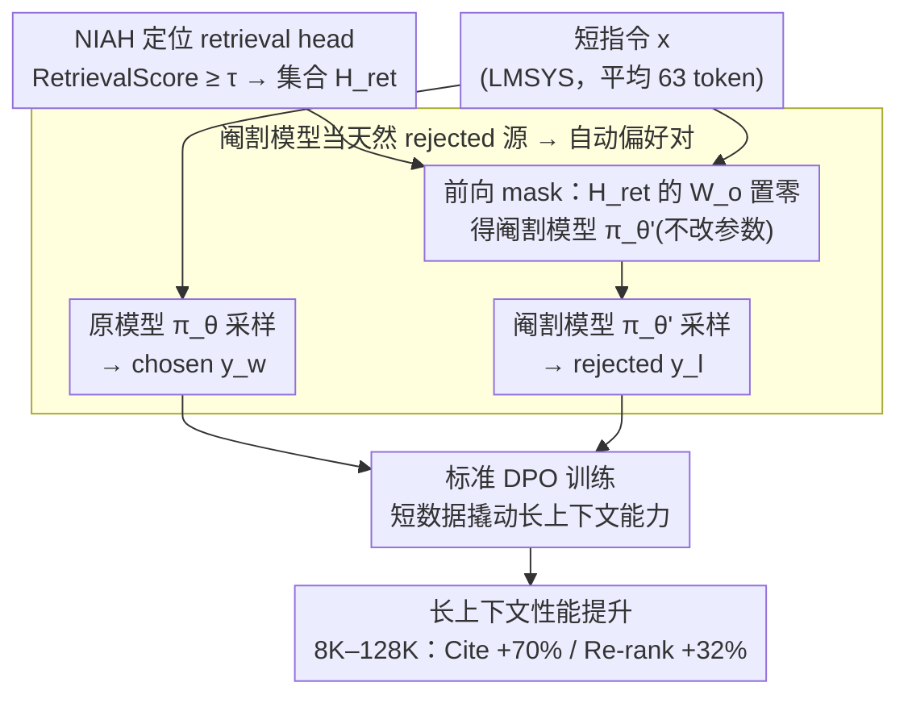

# From Interpretability to Performance: Optimizing Retrieval Heads for Long-Context Language Models

**会议**: ACL 2026 Findings  
**arXiv**: [2601.11020](https://arxiv.org/abs/2601.11020)  
**代码**: https://github.com/YoumiMa/RetMask  
**领域**: 长上下文 / 机制可解释性 / 检索头 / DPO  
**关键词**: Retrieval Head, DPO, Long-Context, Mechanistic Interpretability, Head Masking

## 一句话总结
RetMask 把"机制可解释性 (mechanistic interpretability)"找到的 retrieval heads 当成对比信号源 — 用屏蔽 retrieval head 后的 ablated 模型输出作为 rejected 样本、原模型输出作为 chosen 样本，跑 DPO 训练，无需 LLM judge 或人工标注，在 Llama-3.1 / Qwen3 / Olmo-3 三个模型族 128K 长度上一致提升，特别是 generation-with-citation +70% / re-rank +32%。

## 研究背景与动机

**领域现状**：mechanistic interpretability (MI) 这几年识别出了一系列"功能化"的注意力头 / 神经元 — knowledge neurons (Dai 2022, Meng 2022)、language-specific neurons (Tang 2024)、retrieval heads (Wu 2025b)。其中 retrieval heads 在 Needle-In-A-Haystack (NIAH) 任务中负责"从长上下文里把目标 span 拷贝到输出"，关掉它们会让 long-context 任务大幅掉点。

**现有痛点**：MI 的发现一直停留在"诊断"层面 — 我们知道是哪些 head 在干活，但**怎么用这些发现改进模型**是个开放问题。已有的尝试基本失败：Gu 2024 编辑 knowledge neuron 引入了显著的副作用（damaging general ability），Mondal 2025 在 language neuron 上的干预对下游任务也没收益。这说明"找到机制 ≠ 能优化机制"。

**核心矛盾**：retrieval head 的存在被反复验证（关掉它就掉点），但如何把"它很重要"这一**只 evidence**转化为"训练它会变更强"这一**正 evidence**？传统思路是直接 fine-tune retrieval head 参数，但会破坏模型整体能力。

**本文目标**：(1) 找到一种不动 retrieval head 参数、但能强化它们功能的训练方法；(2) 不依赖 LLM judge 或人工 criteria，全自动合成监督信号；(3) 在多个模型族上验证机制可解释性能产出 actionable performance gain，而非只是描述性发现。

**切入角度**：作者观察到 DPO 需要 (chosen, rejected) 对，而 ablated 模型（屏蔽 retrieval head）的输出**天然就是 rejected 样本** — 它们在 retrieval-heavy 任务上必然劣化。这把 MI 的诊断信号直接变成训练信号。

**核心 idea**：用 $\pi_\theta$ 输出当 chosen $y_w$、$\pi_{\theta'}$（mask retrieval head）输出当 rejected $y_l$，对同一个 instruction $x$ 跑标准 DPO — 不需要 judge，不需要人工，不需要原始数据集的 ground-truth response。

## 方法详解

### 整体框架

RetMask 的核心是把"机制诊断"无缝接成"训练信号"：先在 NIAH 任务上定位出负责长上下文拷贝的 retrieval head，把它们在前向时屏蔽掉得到一个功能阉割版（ablated）模型 $\pi_{\theta'}$；然后对任意 instruction-tuning 数据的每条指令 $x$，让原模型 $\pi_\theta$ 和阉割模型 $\pi_{\theta'}$ 各采样一条回复，前者天然更强、当 chosen $y_w$，后者天然劣化、当 rejected $y_l$；最后用这些自动合成的偏好对跑标准 DPO，把"使用 retrieval head 的行为"提升为模型偏好。整条 pipeline 不需要 LLM judge、不需要人工标注、也不需要原始数据集的 ground-truth response。

### 关键设计

**1. 用阉割（ablated）模型作为天然 rejected 源：让诊断信号直接当负样本**

retrieval head 的定义本身就保证了屏蔽它之后的 $\pi_{\theta'}$ 在 retrieval-heavy 行为上必然劣于 $\pi_\theta$——这是一个 in-distribution、机制可解释、且完全自动的偏好信号。具体做法是把同一条 instruction $x$ 分别喂给两个模型，$\pi_{\theta'}$ 的输出当 $y_l$、$\pi_\theta$ 的输出当 $y_w$，配成偏好对后 DPO 会自然地把模型推向"更像用了 retrieval head 的那一版"。这正好绕开了已有 long-context DPO 方法（如 LongReward）的痛点：它们需要一个 LLM judge 按人工 criteria 打分，既贵又自带 judge bias，而 RetMask 用 architectural intervention 替代了 evaluation intervention，信号无偏、零人工成本。机制可解释性社区长期停留在"诊断"层面，这是第一次把诊断结果直接变成自监督训练信号。

**2. 不修改参数，只在前向 mask：把干预限制在采样阶段**

构造 $\pi_{\theta'}$ 时不动任何参数，只是把属于 $\mathcal{H}_{ret}$ 的 head 在 attention output projection 矩阵中对应的那部分 $\bm{W}_o^h$ 在前向时置零。这种"前向 mask"既不需要做权重 surgery 也不需要重新 load 模型，可以在同一张 GPU、同一个进程里同时 host $\pi_\theta$ 和 $\pi_{\theta'}$ 做对比采样。之所以坚持 mask-only，是因为直接对 retrieval head 做 fine-tune 会改变参数空间、连带破坏其它功能（Gu 2024 的 knowledge editing 副作用就是前车之鉴）。把 mechanistic intervention 锁在 sampling 阶段后，DPO 的梯度执行的是一种 indirect optimization——目标不是"让 retrieval head 的数值变大"，而是"让最终输出更接近不缺 retrieval head 的版本"，从而在不伤通用能力的前提下强化检索功能。

**3. 短上下文训练 + 长上下文评测：用短样本撬动长能力**

训练数据平均输入只有 63.62 token、输出 494.69 token，但收益却体现在 8K–128K 的长度上。这背后的假设是：retrieval head 是预训练阶段就已形成的稳定结构，不需要在长序列上重新"教"它干什么，DPO 要做的只是把"使用 retrieval head 的输出风格"提升为模型偏好，而这种 preference 能跨长度泛化。相比之下，LongReward 等现有 long-context post-training 方法普遍要专门构造长样本、成本极高；RetMask 用短样本就把长能力撬了起来，与 Gao 2025"short-context instruction 数据已足够"的结论一致，工程上是极大的解放。

### 损失函数 / 训练策略

- 标准 DPO loss $\mathcal{L}(\pi_\theta) = -\mathbb{E}[\log\sigma(\beta\log\frac{\pi_\theta(y_w|x)}{\pi_{ref}(y_w|x)} - \beta\log\frac{\pi_\theta(y_l|x)}{\pi_{ref}(y_l|x)})]$，$\beta$ 取默认值，reference policy = 原模型。
- retrieval score 检测沿用 Wu 2025b：对每个 head $h$ 计算 $\text{RetrievalScore}(h) = \frac{1}{|\mathcal{T}|}\sum_{(g_h,k)\in\mathcal{T}} \frac{|g_h \cap k|}{|k|}$（$g_h$ 为 head 检索到的 token 集合，$k$ 为 needle 序列），score ≥ $\tau$ 的 head 进入 $\mathcal{H}_{ret}$。
- 训练数据：LMSYS-Chat-1M (294K 样本主实验), WildChat (消融), Guru (RL 数据集消融)；与评测 benchmark HELMET 完全无重叠。
- retrieval head 阈值：Llama-3.1 $\tau=0.1$，Qwen3 / Olmo-3 $\tau=0.05$（pilot 调出来）。
- Qwen3 在 retrieval score 计算时关 reasoning，在对比生成和评测时开 reasoning。

## 实验关键数据

### 主实验

HELMET 综合 long-context benchmark 在 8K-128K 输入下的均分（Llama-3.1-8B-Instruct）：

| 训练策略 | 8K | 16K | 32K | 64K | 128K |
|---------|-----|------|------|------|------|
| Base (no DPO) | 56.03 | 54.14 | 52.42 | 51.65 | 46.40 |
| Smaller-Model (3B) | 56.77 | 55.32 | 53.48 | 52.18 | 47.53 |
| Win-Lose-Pair (judge by Gemma-3-27B) | 56.50 | 54.42 | 52.47 | 51.62 | **46.05 (掉点)** |
| Non-Retrieval-Mask | 56.45 | 55.55 | 53.19 | 52.14 | 47.19 |
| Random-Mask | 56.67 | 55.95 | 53.14 | 52.30 | 47.04 |
| **RetMask (ours)** | **58.14** | **56.92** | **53.48** | **53.15** | **48.68** |

Llama-3.1 在 128K 上的 per-task 表现：

| 任务 | Base | RetMask | 相对提升 |
|------|------|---------|---------|
| Recall (NIAH) | 95.13 | 95.44 | +0.3% |
| RAG | 58.58 | 59.71 | +1.9% |
| **Cite (生成带引用)** | 3.09 | 5.25 | **+70%** |
| **Re-rank (段落重排)** | 13.73 | 18.16 | **+32%** |
| ICL | 83.80 | 84.92 | +1.3% |
| LongQA | 42.69 | 43.84 | +2.7% |
| Summ | 27.81 | 33.45 | +20% |

跨 family 验证：Qwen3-8B 128K 提 +0.89pp；Olmo-3-Instruct 64K 提 +0.59pp；Olmo-3-Think 64K 提 +0.47pp（reasoning 变体提升较小）。

### 消融实验

| 配置 | 128K avg | 说明 |
|------|---------|------|
| RetMask 全量 (294K samples) | **48.68** | 完整方法 |
| RetMask∗ (10K 下采样匹配 LongReward) | 46.89 | 仍超 LongReward |
| LongReward (现有 SOTA, 10K 样本 + LLM judge) | 46.71 | 同 size 下被超 |
| Random-Mask (随机 mask 同数量 head) | 47.04 | 验证不是 mask 操作本身的功劳 |
| Non-Retrieval-Mask (mask 同数量非检索 head) | 47.19 | 验证目标必须是 retrieval head |
| Win-Lose-Pair (用 Gemma judge 打分) | 46.05 | **倒退**，证明 quality 信号不抵 retrieval 信号 |
| Smaller-Model (用 3B 当 reject 源) | 47.53 | 弱于 RetMask 1.15pp |

通用能力保留：在 mathematics / coding / general knowledge 上 RetMask 与 base model 持平（详见原文 §5.1），无 catastrophic forgetting。

### 关键发现

- **+70% Cite, +32% Re-rank 这种 retrieval-heavy 任务收益最大**：印证 retrieval head 的功能定位 — 需要"从上下文里抓 span"的任务，强化 retrieval head 带来最直接的收益。
- **同样 mask 但目标不同 → 完全不同效果**：Random-Mask 和 Non-Retrieval-Mask 都涨点不显著（甚至跟 baseline 比一些 length 上 worse），证明效果不是 mask 操作的副作用，而是 retrieval head 选择本身的功劳。
- **RetMask > LongReward (现有 DPO SOTA) 即使在同等数据 size 下**：10K vs 10K 下 RetMask 仍领先，说明机制信号比 LLM judge 信号更强；且 RetMask 无需 judge，成本远低。
- **稀疏度决定收益大小**：作者观察到 retrieval score 分布越稀疏（少数 head 集中承担检索）的模型，RetMask 涨点越大；Qwen3 分布偏 dense，所以涨点比 Llama-3.1 / Olmo-3 modest。这是个干净的 mechanistic 解释。
- **Win-Lose-Pair (quality judge) 反而倒退**：说明"质量更好"的偏好信号在 long-context 任务上是无意义甚至负面的 — 必须用结构性、机制性信号。
- **短训练数据 → 长上下文收益**：训练样本平均 < 600 token，但 8K-128K 都涨，证明 retrieval head 是预训练形成的稳定结构，DPO 只需"激活偏好"而非"教学"。

## 亮点与洞察

- **从"诊断"到"治疗"的范式跳跃**：MI 圈第一次有一篇把诊断信号直接当训练信号用、且 work 在多模型族多 benchmark 上的工作。Knowledge editing / language neuron 等之前的尝试都失败了，本文用 DPO 这个"绕开直接编辑"的间接手法成功，给 MI → 实际收益 提供了通用模板。
- **"用 ablated 自己当 negative" 是简洁而强大的设计**：传统 contrastive learning 要么用人工标注的 negative，要么用另一个 model 当 negative；本文证明"同一个模型的功能阉割版"是最干净的 negative source — 因为 ablated 模型和原模型共享一切（数据分布、风格、tokenizer），唯一差异就是 retrieval 能力。这种 controlled contrast 信号强度可能比任何外部 judge 都高。
- **稀疏度作为可迁移性指示器**：作者把"RetMask 在哪个模型上好用"明确归因于 retrieval score 分布的稀疏度 — 这给后续研究一个清晰的 prior：要看一个 mechanistic intervention 是否值得做，先看相关 head 的分布有多 concentrated。
- **短训练 / 长收益的实用性**：294K LMSYS 短对话样本（avg 63 token in / 495 out）→ 128K 长上下文涨 2.28pp，意味着 RetMask 可以低成本地接到任何 continual pretrain pipeline 后端。

## 局限与展望

- **作者承认**：(1) Olmo-3-Think 涨幅小于 Olmo-3-Instruct，可能因为 retrieval head detection 在 reasoning 模型上不准（reasoning 内容打乱了"直接答"的 NIAH 假设）；(2) Qwen3 收益 modest，归因于 retrieval score 分布偏 dense；(3) 阈值 $\tau$ 需要 pilot 调整，跨模型不通用。
- **隐藏问题**：(1) 没分析 retrieval head 在 DPO 后是否在内部结构上发生变化（参数确实变了，retrieval score 还高吗？是否退化为"风格模仿"而非真正检索？）；(2) Cite/Re-rank +70/+32% 是相对提升，但绝对值 (3.09 → 5.25) 仍极低，128K 上模型本身就很弱；(3) 全部用 LMSYS / WildChat 短对话，没在 long-context 训练集（如 LongAlign）上验证，潜在 ceiling 不明；(4) 没汇报 retrieval head 数量 $|\mathcal{H}_{ret}|$ 对结果的敏感度。
- **改进思路**：(1) 把 RetMask 和 continual pretrain 串起来做联合 ablation；(2) 用类似思路把 knowledge neuron / safety head 都"ablated 自己当 negative"做 DPO，验证范式可推广性；(3) 在 reasoning 模型上重新设计 retrieval head detection（不用 NIAH 直接答，改用 reason-then-answer 协议）；(4) 动态 mask — 训练过程中随着模型变化重新识别 retrieval head 集合。

## 相关工作与启发

- **vs LongReward (Zhang 2025a)**：LongReward 用 LLM judge + human criteria 打分构造偏好对；RetMask 用 architectural ablation 构造，更简洁、不依赖 judge、且实证更强（同 size 下仍超）。
- **vs Knowledge Editing (Meng 2022, Gu 2024)**：knowledge editing 直接动参数，有副作用；RetMask 不动参数只动前向，通过 DPO 间接优化，不破坏通用能力。
- **vs Retrieval Head 原工作 (Wu 2025b)**：Wu 等只做了诊断（关掉就掉点），RetMask 首次把它做成 actionable training signal。
- **vs Continual Pretrain (Llama-3.1 / Qwen3 / Olmo-3 各家长上下文 recipe)**：作者明确指出 RetMask 与 continual pretrain **互补**，可以叠在最后做 post-training boost。

## 评分
- 新颖性: ⭐⭐⭐⭐⭐ "用 ablated 自己当 DPO negative" 是机制可解释性向训练范式的第一次成功跨界。
- 实验充分度: ⭐⭐⭐⭐ 3 个模型族 × 5 个 length × 7 个 task × 4 个 baseline，跨 alignment objective 验证。
- 写作质量: ⭐⭐⭐⭐ Figure 1/2 把 idea 讲得很直观，per-task 表格清晰。
- 价值: ⭐⭐⭐⭐⭐ 给 long-context 训练 pipeline 提供了一个低成本、高收益的 post-training 模块，工业可立刻接入。

<!-- RELATED:START -->

## 相关论文

- [\[ACL 2026\] Retrieval Heads are Dynamic](retrieval_heads_are_dynamic.md)
- [\[NeurIPS 2025\] A Controllable Examination for Long-Context Language Models](../../NeurIPS2025/interpretability/a_controllable_examination_for_longcontext_language_models.md)
- [\[ACL 2026\] Preference Heads in Large Language Models: A Mechanistic Framework for Interpretable Personalization](preference_heads_in_large_language_models_a_mechanistic_framework_for_interpreta.md)
- [\[ACL 2026\] Towards Intrinsic Interpretability of Large Language Models: A Survey of Design Principles and Architectures](towards_intrinsic_interpretability_of_large_language_modelsa_survey_of_design_pr.md)
- [\[ACL 2026\] Tracing Relational Knowledge Recall in Large Language Models](tracing_relational_knowledge_recall_in_large_language_models.md)

<!-- RELATED:END -->
