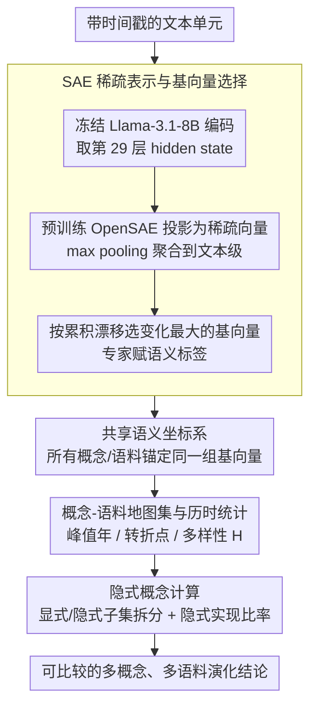

# HistLens: Mapping Idea Change across Concepts and Corpora

**会议**: ACL 2026  
**arXiv**: [2604.11749](https://arxiv.org/abs/2604.11749)  
**代码**: [https://github.com/LeoJ-xy/HistLens](https://github.com/LeoJ-xy/HistLens)  
**领域**: 人文计算 / 可解释性  
**关键词**: 概念史分析, 稀疏自编码器, 历时语义变化, 跨语料比较, 隐式概念计算

## 一句话总结
提出 HistLens 框架，基于稀疏自编码器（SAE）将概念表示分解为可解释的语义基向量，在共享坐标系中追踪多概念、多语料的历时演化轨迹，支持隐式概念计算，为数字人文和概念史研究提供可量化、可比较的分析工具。

## 研究背景与动机

**领域现状**：计算历时语义学和话语分析近年来取得显著进展，包括词汇语义变化检测、主题演化建模、立场和框架分析等。但将这些方法整合为可扩展、可比较、可解释的概念语义演化研究范式仍面临挑战。

**现有痛点**：(1) 可扩展性和可比较性不足——大量工作聚焦于单一概念或单一语料，不同概念和不同来源的分析结果难以直接比较，无法回答"多个概念是否协同演化"等核心问题；(2) 隐式概念刻画不足——现有方法依赖关键词和表面共现模式，无法捕捉未显式提及但通过稳定话语模式表达的概念，导致概念变化被误读为词汇替换。

**核心矛盾**：概念演化研究需要在可解释性、可比较性和隐式表达捕捉之间取得平衡，而现有计算方法无法同时满足这三个需求。

**本文目标**：构建一个统一的、基于可解释稀疏特征空间的多概念、多语料概念史分析框架。

**切入角度**：利用稀疏自编码器将 LLM 的隐层表示分解为可解释的语义基向量，将概念查询重新定义为这些基向量激活动态的追踪问题，不同概念锚定在同一坐标系中实现天然可比较。

**核心 idea**：将概念演化建模为共享 SAE 语义空间中可解释基向量的激活重组——概念不是消失或出现，而是其内部语义成分在历史压力下的重新加权。

## 方法详解

### 整体框架

HistLens 是一条全程冻结、不含任何训练的分析管线：输入是带时间戳的文本单元，先经冻结的 LLM 编码、再通过预训练 SAE 投影到一个稀疏、可解释的语义特征空间，所有概念都锚定在同一组基向量坐标系里，因而天然可比较。在这个共享空间上，框架逐层展开历时分析——先为每个（概念，语料）对构建地图集并算出导航统计量，再做单概念的语义分解、多概念之间的协同对比、跨语料的差异对比，最后把概念的显式词汇表达与隐式话语实践拆开量化。概念演化在这里被重新定义为基向量激活份额的重组，而非词汇的出现或消失。

### 关键设计

**1. SAE 稀疏表示与基向量选择：把密集表示拆成可比较的语义坐标系**

密集神经表示存在多义叠加，难以直接做概念史比较。HistLens 用冻结的 Llama-3.1-8B-Instruct 编码每个句子、取第 29 层残差流的 hidden state，经预训练 OpenSAE 映射为稀疏向量 $\mathbf{z}_{i,j} = f_{\text{SAE}}(\mathbf{h}_{i,j})$，再用 max pooling 聚合到文本级。要从上万维稀疏特征里挑出真正在变化的轴，框架对每个基向量算累积漂移 $D_k = \sum_{s=2}^{S} |\mu_{k,s} - \mu_{k,s-1}|$、取漂移最大的若干基向量，最后由人类专家根据各基向量的高激活文本赋予语义标签。SAE 既缓解了密集表示的多义叠加，又让所有概念、所有语料共享同一组基向量，从而把"跨概念、跨语料比较"建立在统一坐标系上。

**2. 概念-语料地图集与历时统计：用定量锚点替代主观选案例**

传统概念史研究靠研究者主观挑案例切入，难以复现。HistLens 把语料按年份切片，为每个（概念，语料）对计算三个可复现的统计量：峰值年（概念激活最大的年份）、转折点（相邻切片变化最大的年份，并带符号强度 $I$）、多样性 $H$（基向量贡献份额的归一化熵）。这三个量构成紧凑的导航信号，自动定位出值得深入的关键时间节点和案例，使分析入口从人工拍板变成系统化筛选。

**3. 隐式概念计算：把"没明说但确实在表达"的概念量出来**

概念史中大量概念并非通过规范术语、而是通过稳定的话语策略表达，只盯关键词会把概念变化误读成词汇替换，还会引入来源选择偏差。HistLens 把每个概念的高激活文本集 $\mathcal{I}_{c,r}$ 按是否含规范词汇拆成显式子集和隐式子集 $\mathcal{I}_{c,r}^{\text{Imp}}$，再算隐式实现比率 $\bar{r}_{c,r} = \sum_{i \in \mathcal{I}^{\text{Imp}}} m_i^{(c)} / \sum_{i \in \mathcal{I}} m_i^{(c)}$，其中 $m_i^{(c)}$ 为文本 $i$ 在概念 $c$ 相关基向量上的激活量。$\bar{r}$ 越高，说明概念越多依赖隐式话语模式而非显式词汇，这给源选择偏差和概念误读提供了一个可量化的检测手段。

### 主实验
在《新青年》和《向导》两个中国近现代报刊语料上分析"个人""社会""国家""世界"四个概念：

| 概念 | 语料 | 隐式比率 $\bar{r}$ | 多样性 $H$ | 峰值年 | 转折点 (年, $I$) |
|------|------|-------------------|-----------|--------|-----------------|
| 个人 | 新青年 | 0.920 | 0.741 | 1920 | (1918, +0.226) |
| 国家 | 新青年 | 0.921 | 0.743 | 1924 | (1918, +0.116) |
| 社会 | 新青年 | 0.595 | 0.368 | 1922 | (1918, -0.213) |
| 世界 | 新青年 | 0.900 | 0.683 | 1926 | (1918, +0.230) |
| 个人 | 向导 | 0.963 | 0.763 | 1923 | (1923, +0.067) |

### 消融/跨层鲁棒性

| 配置 | 说明 |
|------|------|
| Layer 29 (主) | 主要结果使用的层 |
| Layer 06/14/22 | 跨层鲁棒性分析，模式一致 |

### 关键发现
- "个人"概念并非语义同质对象，可分解为"行动主体性""个人主义话语""财产/经济个体性"三个独立演化的语义线索
- 《新青年》中四个概念在 1918 年共享最强转折点（|I|=0.116-0.230），而《向导》的转折点延后至 1923-1926 且强度更弱
- 隐式概念实践比例普遍很高（0.595-0.963），表明概念大量通过非规范词汇的话语模式表达
- 跨语料比较揭示"世界"概念在两个语料中共享革命/阶级斗争的语义骨架，但在《新青年》中偏重知识辩论，在《向导》中偏重组织动员

## 亮点与洞察
- 将概念演化重新定义为"可解释语义成分的激活重组"是一个深刻的洞察——概念不是出现或消失，而是其内部成分在历史压力下重新加权
- SAE 空间提供了天然的可比较性基础设施，使得跨概念、跨语料比较无需重新训练概念专用空间，这一设计具有很强的方法论价值
- 隐式概念计算为源选择偏差和概念变化误读提供了系统化的检测手段

## 局限与展望
- SAE 基向量的语义标签依赖人类专家解读，引入了主观性
- 仅验证了中文近现代报刊语料，对其他语言和时代的泛化性有待验证
- 基向量漂移排序可能遗漏重要但变化缓慢的语义成分
- 未来可探索将框架扩展到更长时间跨度和多语言语料的概念比较

## 相关工作与启发
- **vs 动态主题模型（DTM）**: DTM 学习主题级别的演化但不提供可解释的语义分解，HistLens 在基向量层面提供更细粒度的分析
- **vs 词向量时序对比**: 传统方法受各向异性和鲁棒性问题困扰，SAE 稀疏特征更稳定
- **vs 语义差异关键词方法**: 该方法聚焦词汇层面的"语义争夺地带"，HistLens 可捕捉隐式概念表达

## 评分
- 新颖性: ⭐⭐⭐⭐⭐ SAE 用于概念史分析是全新方向，隐式概念计算具有原创性
- 实验充分度: ⭐⭐⭐⭐ 多概念多语料分析详尽，但仅限于一种语言和时代
- 写作质量: ⭐⭐⭐⭐⭐ 计算方法与人文解读的融合非常出色
- 价值: ⭐⭐⭐⭐⭐ 为数字人文提供了重要的方法论基础设施
- 综合: ⭐⭐⭐⭐⭐ 跨学科融合的典范之作，计算与人文的深度整合

<!-- RELATED:START -->

## 相关论文

- [\[ACL 2026\] IDEA: An Interpretable and Editable Decision-Making Framework for LLMs via Verbal-to-Numeric Calibration](idea_an_interpretable_and_editable_decision-making_framework_for_llms_via_verbal.md)
- [\[ACL 2026\] Follow the Flow: On Information Flow Across Textual Tokens in Text-to-Image Models](follow_the_flow_on_information_flow_across_textual_tokens_in_text-to-image_model.md)
- [\[ICLR 2026\] Concepts' Information Bottleneck Models](../../ICLR2026/interpretability/concepts_information_bottleneck_models.md)
- [\[AAAI 2026\] LLM Circuit Analyses Are Consistent Across Training and Scale](../../AAAI2026/interpretability/llm_circuit_analyses_consistent_across_training_and_scale.md)
- [\[ICLR 2026\] Evolution of Concepts in Language Model Pre-Training](../../ICLR2026/interpretability/evolution_of_concepts_in_language_model_pre-training.md)

<!-- RELATED:END -->
