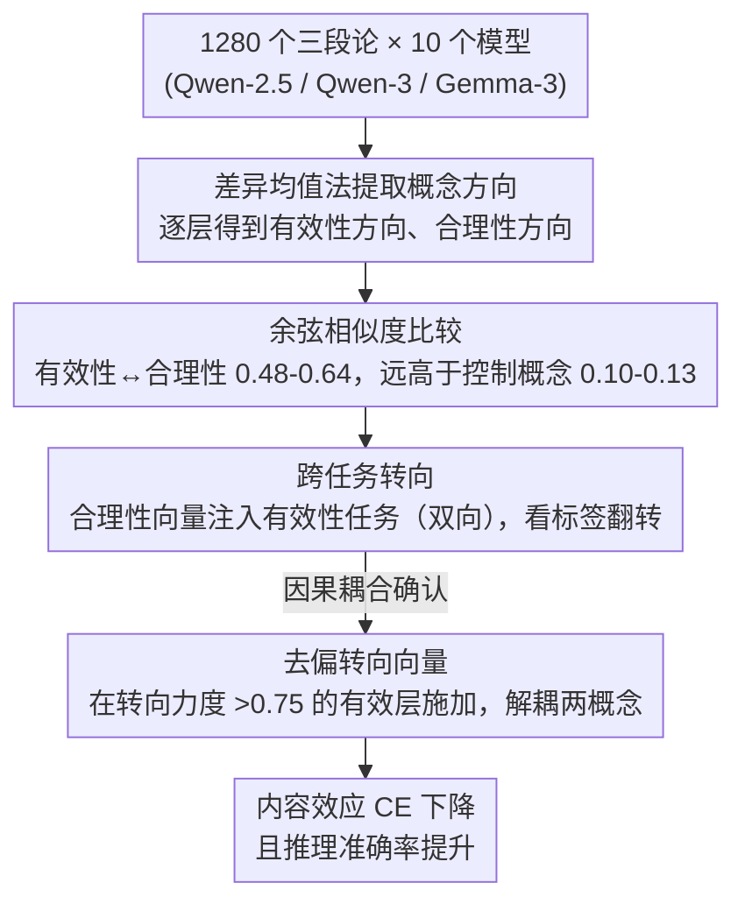

# How Language Models Conflate Logical Validity with Plausibility: A Representational Analysis of Content Effects

**会议**: ACL 2026 Findings  
**arXiv**: [2510.06700](https://arxiv.org/abs/2510.06700)  
**代码**: [https://github.com/leobertolazzi/content-effect-interpretability](https://github.com/leobertolazzi/content-effect-interpretability)  
**领域**: 社会计算  
**关键词**: 内容效应, 逻辑有效性, 合理性, 线性表示, 转向向量

## 一句话总结
通过表示分析揭示 LLM 中"逻辑有效性"和"合理性"两个概念在隐层空间中高度对齐，导致模型将合理性与有效性混淆（内容效应），并构造去偏转向向量有效解耦这两个概念，减少内容效应同时提升推理准确率。

## 研究背景与动机

**领域现状**：人类在三段论推理等逻辑任务中存在"内容效应"——语义内容的合理性影响对逻辑有效性的判断（如结论合理的无效论证容易被误判为有效）。人类的这一现象由双过程理论（快速直觉系统 vs 慢速分析系统）解释。近期研究发现 LLM 也展现类似的内容效应。

**现有痛点**：虽然 LLM 的内容效应行为已被充分记录，但其内在机制仍不清楚。已有研究停留在行为层面的观察，缺乏对 LLM 内部表示的深入分析。

**核心矛盾**：逻辑有效性取决于论证结构而非内容，但 LLM 在表示空间中可能将这两个本应独立的概念纠缠在一起。

**本文目标**：(1) 验证 LLM 是否展现内容效应；(2) 分析有效性和合理性在内部表示中的编码方式；(3) 探究表示层面的纠缠是否预测行为层面的内容效应；(4) 设计干预手段解耦这两个概念。

**切入角度**：基于线性表示假说——高层概念在 LLM 隐层空间中被线性编码——检验有效性和合理性的线性方向是否高度相似。

**核心 idea**：LLM 中内容效应的根源是有效性方向和合理性方向在表示几何中的纠缠对齐，可通过构造去偏转向向量来解耦。

## 方法详解

### 整体框架
本文想回答一个机理问题：LLM 在三段论推理中表现出的"内容效应"（被结论的合理性带偏、把合理的无效论证误判为有效），究竟是行为层面的偶然失误，还是表示几何里的结构性纠缠。为此作者在 1280 个三段论上测了 10 个模型（Qwen-2.5、Qwen-3、Gemma-3 系列），先用差异均值法把"有效性"和"合理性"各自压成隐层里的一条线性方向，比较两条方向的相似度；再用跨任务转向实验检验它们是否存在因果耦合；最后顺着这个诊断构造去偏转向向量，把两个概念解开。

### 关键设计

**1. 差异均值法提取概念方向：把二元概念压成隐层里的一条线**

要分析"有效性"和"合理性"是否纠缠，先得把它们在表示空间里各自定位成一个可比较的对象。作者对每一层 $l$，取模型预测为正类（如"有效"）和负类（如"无效"）样本在最后一个 token 位置的平均激活之差作为该概念方向 $v_{\text{concept}}^l = \mu_{\text{positive}}^l - \mu_{\text{negative}}^l$。这里有个关键细节：用模型自己的预测标签而非真实标签来分组——因为要刻画的是模型"心里"如何编码这个概念，而不是客观真值。这个做法直接对应线性表示假说，又简洁地让两个概念的方向落在同一空间里，能直接算余弦相似度。

**2. 跨任务转向：用一个概念的方向去推另一个概念的判断，验证因果而非相关**

仅仅发现两条方向余弦相似度高只能说明相关，不能证明合理性真的在驱动有效性判断。于是作者把从"合理性任务"提取的转向向量 $v_{\text{plausibility}}^l$ 注入到"逻辑有效性分类任务"里（以及反方向），用标签翻转比例作为转向力度。注入时始终对抗模型的原始预测——预测为负类就加上向量、预测为正类就减去向量——确保观测到的翻转来自这条方向本身。如果合理性向量能稳定翻转有效性判断、反之亦然，就说明两个概念在表示空间里是因果耦合而非仅仅相关。

**3. 去偏转向向量：顺着诊断把纠缠解开，同时压低内容效应、抬高推理准确率**

如果纠缠确实是内容效应的根源，那么解耦就该既减偏差又提推理。作者在转向力度 $>0.75$ 的"有效层"上施加去偏向量，让模型评估逻辑有效性时不再被合理性牵着走。衡量偏差用内容效应指标 $\text{CE} = \tfrac{1}{2}(\Delta_{v^+} + \Delta_{v^-})$，其中 $\Delta_{v^+}$ 衡量结论合理时有效论证相对无效论证的准确率优势；$\text{CE}=0$ 表示有效性判断完全独立于合理性，$\text{CE}=1$ 表示判断完全被合理性驱动。实验显示去偏向量能让 CE 下降的同时推理准确率反而提升，反过来印证了"纠缠即病根"这一假设。

## 实验关键数据

### 主实验
行为层面的内容效应：

| 模型 | 设置 | $D_{v^+,p^+}$ 准确率 | $D_{v^-,p^+}$ 准确率 | $D_{v^+,p^-}$ 准确率 | CE |
|------|------|---------------------|---------------------|---------------------|-----|
| Qwen2.5-32B | 0-shot | 100.00 | 67.50 | 60.92 | 0.348 |
| Qwen2.5-32B | CoT | 98.67 | 86.64 | 93.10 | 0.096 |
| Qwen3-14B | 0-shot | 97.33 | 90.83 | 60.92 | 0.213 |
| Qwen3-14B | CoT | 95.31 | 99.10 | 92.50 | 0.014 |

### 表示分析

| 概念对 | 平均余弦相似度 | 说明 |
|--------|--------------|------|
| 有效性 - 合理性 | 0.48-0.64 | 高度对齐 |
| 有效性 - 无害性 | 0.10-0.13 | 低相似（控制） |
| 有效性 - 上位词 | -0.12 至 -0.17 | 低相似（控制） |

### 关键发现
- 所有测试模型均展现内容效应，CoT 提示显著降低 CE（从 0.213-0.348 降至 0.014-0.096）
- 有效性和合理性向量的余弦相似度（0.48-0.64）远高于控制概念（0.10-0.13），确认特异性纠缠
- 跨任务转向成功：合理性向量能有效翻转有效性判断，且反之亦然
- 有效性-合理性对齐程度与行为层面的 CE 强度成正相关
- 去偏向量同时减少 CE 和提升推理准确率，证明解耦是有效的
- CoT 虽降低行为 CE，但表示层面的对齐程度并未显著改变（p=0.625）

## 亮点与洞察
- 提供了 LLM 内容效应的首个表示层面解释——不是行为上的"bug"而是表示几何的结构性问题。这一发现比纯行为研究深刻得多
- CoT 降低行为 CE 但不改变表示对齐的发现非常有趣——CoT 可能是在推理过程中"绕过"而非"解决"了纠缠问题
- 去偏转向向量作为干预手段，展示了从表示分析到实际改进的完整闭环

## 局限与展望
- 仅在三段论推理上验证，其他推理形式（条件推理、概率推理）的内容效应机制可能不同
- 数据集规模较小（1280 个三段论），虽覆盖所有 64 种类型但语义变化有限
- 去偏向量的效果依赖于层的选择，需要验证集来确定最优层
- 未来可探索非线性编码的概念是否也存在类似纠缠现象

## 相关工作与启发
- **vs Lampinen et al.**: 他们记录了 LLM 的内容效应行为，本文从表示层面揭示了机制
- **vs Marks & Tegmark (真值方向)**: 他们发现真值被线性编码，本文进一步发现有效性方向与合理性方向纠缠
- **vs Arditi et al. (拒绝方向)**: 类似方法论但应用于不同概念，本文的创新在于分析两个概念间的交互而非单一概念

## 评分
- 新颖性: ⭐⭐⭐⭐⭐ 首次从表示几何角度解释 LLM 内容效应，洞察深刻
- 实验充分度: ⭐⭐⭐⭐ 10 个模型、控制实验、因果验证齐全，但数据集单一
- 写作质量: ⭐⭐⭐⭐⭐ RQ 驱动的结构清晰，分析层层递进
- 价值: ⭐⭐⭐⭐⭐ 对理解和改进 LLM 逻辑推理有重要启示

<!-- RELATED:START -->

## 相关论文

- [\[ACL 2026\] Knowledge Vector of Logical Reasoning in Large Language Models](knowledge_vector_of_logical_reasoning_in_large_language_models.md)
- [\[ICML 2026\] How Language Models Process Negation](../../ICML2026/interpretability/how_language_models_process_negation.md)
- [\[ACL 2026\] Fine-Grained Analysis of Shared Syntactic Mechanisms in Language Models](fine-grained_analysis_of_shared_syntactic_mechanisms_in_language_models.md)
- [\[ICML 2026\] A Behavioural and Representational Evaluation of Goal-Directedness in Language Model Agents](../../ICML2026/interpretability/a_behavioural_and_representational_evaluation_of_goal-directedness_in_language_m.md)
- [\[ICML 2026\] Query Circuits: Explaining How Language Models Answer User Prompts](../../ICML2026/interpretability/query_circuits_explaining_how_language_models_answer_user_prompts.md)

<!-- RELATED:END -->
