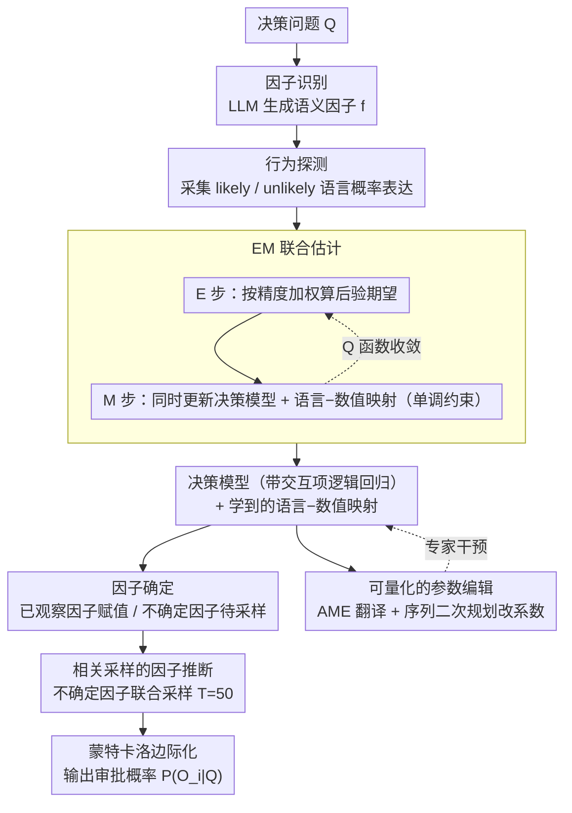

# IDEA: An Interpretable and Editable Decision-Making Framework for LLMs via Verbal-to-Numeric Calibration

**会议**: ACL 2026  
**arXiv**: [2604.12573](https://arxiv.org/abs/2604.12573)  
**代码**: [https://github.com/leonbig/IDEA](https://github.com/leonbig/IDEA)  
**领域**: 可解释性 / LLM决策  
**关键词**: 可解释决策, 语言概率校准, EM算法, 参数编辑, 人机协作

## 一句话总结

提出 IDEA 框架，将 LLM 的决策知识提取为语义因子上的可解释参数化模型，通过 EM 算法联合学习语言概率表达到数值的映射和决策参数，实现了可校准、可编辑、可解释的 LLM 决策，在五个数据集上以 Qwen-3-32B (78.6%) 超越 DeepSeek R1 (68.1%) 和 GPT-5.2 (77.9%)。

## 研究背景与动机

**领域现状**：LLM 越来越多地被部署在自动化决策场景中，但在金融投资、贷款审批等高风险领域的应用仍然受限于根本性的"信任赤字"——利益相关方无法可靠地验证、审计或干预决策过程。

**现有痛点**：现有方法在三个维度上存在不足：(1) LLM 产生的概率估计过度自信且校准不准；(2) 生成的解释往往是事后合理化，不能真正反映内部推理过程；(3) 缺乏定量框架将专家知识精确整合到决策中，仅靠 prompt 无法保证行为合规。例如，排序和打分对相同选项可能得出不一致的顺序，明确排除某因子的指令仍无法阻止其影响预测。

**核心矛盾**：LLM 的内部计算与外部输出之间存在根本性的错位（internal-external misalignment）。Logit 方法将下一个 token 的置信度与决策不确定性混为一谈，仍是黑箱；DeLLMa 依赖 LLM 直接产出精确数值，而这恰好是 LLM 不擅长的；BIRD 假设因子独立且使用固定的语言-数值映射，丢失了校准精度和因子间的自然相关性。

**本文目标**：构建一个同时满足三个性质的决策框架——校准的概率估计、语义可解释性、定量的人机协作（可精确编辑参数）。

**切入角度**：作者发现两个关键观察：(i) 虽然 LLM 无法可靠地产出精确数值概率，但能够从广泛知识中生成决策相关因子；(ii) LLM 在产出语言概率表达（如"likely""unlikely"）时比产出精确数字更一致——因为训练语料中这类短语远多于精确概率值。

**核心 idea**：不是让 LLM 内部推理过程透明，而是将其知识提取到一个本身就透明的形式——语义因子空间上的可解释参数化模型，通过 EM 算法联合学习语言-数值映射和决策参数。

## 方法详解

### 整体框架

IDEA 的出发点是：与其逼 LLM 把内部推理过程"说透"（往往只是事后合理化），不如把它的决策知识抽取到一个本身就透明的形式里。具体做法是把目标概率 $P(O_i|Q)$ 拆成两个可分离的部件——决策模型 $P(O_i|\mathbf{f})$（因子配置如何映射到结果）和因子推断 $P(\mathbf{f}|C)$（从条件推断各因子取值）。整条流水线分离线训练（因子识别 → 行为探测 → EM 联合估计）和在线推理（因子确定 → 联合采样 → 边际化）两段，并额外开放一个让专家直接改参数的干预接口。

### 关键设计

**1. EM 联合估计：把"语言概率→数值"的映射和决策参数一起学出来**

这里的核心困境是"鸡生蛋"：训练决策模型需要数值化的概率标签，而要确定"likely""unlikely"这类语言表达各自代表多少数值，又反过来需要决策模型。IDEA 用 EM 打破循环——E 步对每个潜在概率算后验期望（按精度加权地融合模型预测与当前语言映射），M 步同时更新决策模型参数和语言映射（映射带单调性约束，保证"likely"对应的数值高于"unlikely"）。决策模型本身用带交互项的逻辑回归，主效应直接量化每个因子的贡献。相比 BIRD 直接套用心理学文献里的固定映射（导致平均 F1 掉 6.8%），联合学习能贴合具体任务和该 LLM 自己的用词习惯。

**2. 相关采样的因子推断：边际化时保留因子之间的天然相关性**

真实决策里总有一部分因子无法直接观测。IDEA 把因子分成已观察集合和不确定集合，对不确定因子让 LLM 条件采样 $T=50$ 组联合配置（高温度保多样性），再用蒙特卡洛把这些配置下的决策概率平均起来，估计量无偏、标准误为 $O(1/\sqrt{T})$。关键在于"联合"采样而非逐因子独立采样——BIRD 假设因子条件独立，会把"高收入"和"稳定就业"这种本该相关的因子拆开，得到失真的边际化结果。

**3. 可量化的参数编辑：让专家以数学精确的方式改因子权重**

prompt 层面的干预极不可靠——明确叮嘱模型"排除信用历史"，该因子仍会偷偷影响预测（ERR 仅 0.06–0.43）。IDEA 把干预下沉到参数：先用平均边际效应（AME）把逻辑回归 log-odds 空间的系数翻译成直观的概率空间变化，专家既能做结构编辑（增删因子），也能做定量编辑（通过序列二次规划求解约束优化，在满足指定的重要性比例的同时把对其他因子的扰动压到最小）。例如要排除信用历史，只需把对应系数置零，审批概率就从 $21.6\%$ 精确变到 $52.3\%$，实现了完美的因子排除（ERR=1.00）和零相对误差。

### 一个完整示例：一笔贷款审批

以 German Credit 的一次审批走一遍在线推理：模型先从案情里识别出"收入水平""就业稳定性""信用历史"等语义因子；对能直接读出的因子赋值，对不确定的（如就业稳定性）让 LLM 采样 $T=50$ 组联合取值；每个因子的"likely/unlikely"经 EM 学到的映射换成数值，喂进带交互项的逻辑回归算出审批概率，再对采样配置蒙特卡洛平均得到最终估计。若审计时专家认为信用历史不该参与，就把该系数置零，概率从 $21.6\%$ 干净地跳到 $52.3\%$——全过程每一步都可读、可查、可改。

### 损失函数 / 训练策略

M 步更新决策模型参数用的是复合损失：MSE 重建损失 + 排序一致性 hinge 损失（保证"likely"的概率高于"unlikely"）+ 仅作用于交互项的弹性网正则（L1 诱导稀疏、L2 保数值稳定）。语言映射用心理学文献值初始化，迭代到 Q 函数变化小于 $10^{-4}$ 收敛。

## 实验关键数据

### 主实验

在五个数据集上评估二元决策准确率（复杂决策：BIGDATA22 股票预测、German Credit 贷款审批；推理：COMMON2SENSE、PLASMA、TODAY）：

| 模型 | 方法 | 五数据集平均 F1 | 三类排序 Macro F1 |
|------|------|----------------|------------------|
| Qwen-3-32B | IDEA | **78.6%** | **0.693** |
| Qwen-3-32B | CoT | 67.7% | 0.339 |
| Qwen-3-32B | BIRD | 71.4% | 0.521 |
| GPT-5.2 | CoT | 77.9% | 0.402 |
| DeepSeek R1 | CoT | 68.1% | 0.286 |
| Qwen-3-8B | IDEA | 73.2% | 0.697 |
| Qwen-3-4B | IDEA | 71.6% | 0.504 |

### 消融实验

| 配置 (Qwen-3-32B) | 平均 F1 | 排序 Macro F1 | 说明 |
|-------------------|---------|--------------|------|
| IDEA (完整) | 78.6% | 0.693 | 完整模型 |
| w/o EM | 71.8% (-6.8%) | 0.632 | 使用固定语言映射 |
| w/o Inter | 71.0% (-7.6%) | 0.644 | 去掉交互项 |
| w/o MC | 71.8% (-6.8%) | 0.617 | 确定性因子赋值 |

### 关键发现
- 三个模块贡献相当，各贡献约 6-8% 的提升，说明 EM 校准、交互项和相关采样都是不可或缺的
- IDEA 实现了完美的因子排除（ERR=1.00）和零校准误差，而 prompt-based 方法 ERR 最高仅 0.43
- 在较小模型（Qwen-3-4B）上 IDEA 也能显著超越直接 prompting，说明框架对模型规模不敏感
- 在排序任务中 IDEA 的优势更为明显，尤其是"等价"类别的识别能力远超其他方法

## 亮点与洞察
- **语言概率的一致性利用**：巧妙地利用了 LLM 产出"likely/unlikely"比精确数字更一致这一特性，将不可靠的数字输出转化为可靠的序数信号，再通过 EM 算法学习最优的数值映射。这个思路可以推广到任何需要从 LLM 提取数值信息的场景
- **参数编辑的数学保证**：通过 AME 和约束优化实现了精确、可预测、可逆的行为干预，是第一个在 LLM 决策中实现数学保证的框架。这种"提取-建模-编辑"的范式可以迁移到其他需要人类干预 AI 决策的场景
- **解耦设计的优雅性**：将决策分解为因子推断和决策模型两个独立组件，既利用了 LLM 的知识广度（因子生成），又避免了其数值不可靠性（参数化模型），是一种精巧的"扬长避短"设计

## 局限与展望
- 当前限于二元决策和二元因子的设定，扩展到多类别决策和连续因子需要更复杂的参数化
- 因子完备性假设在开放域决策中可能难以满足，遗漏重要因子会系统性地降低性能
- EM 只保证收敛到局部最优，初始化敏感性未被充分讨论
- 行为探测阶段需要大量 LLM 查询（至多 256 个配置），对 API 调用成本敏感的场景可能受限

## 相关工作与启发
- **vs BIRD**: BIRD 假设因子独立且使用固定映射，IDEA 通过 EM 联合学习和相关采样全面超越，平均 F1 提升约 7%
- **vs DeLLMa**: DeLLMa 依赖 LLM 直接产出数值效用，而这正是 LLM 不可靠的地方；IDEA 通过语言概率中介绕开了这个问题
- **vs Concept Bottleneck Models**: CBM 需要任务特定训练且假设概念独立，IDEA 提供了类似的可解释性但额外支持参数编辑

## 评分
- 新颖性: ⭐⭐⭐⭐⭐ 将语言概率校准、EM联合学习和参数编辑统一到一个框架中，思路新颖且实用
- 实验充分度: ⭐⭐⭐⭐ 五个数据集+三种模型规模+完整消融，但缺少更大模型和更多决策领域的验证
- 写作质量: ⭐⭐⭐⭐⭐ 动机推导清晰，从信任赤字出发层层递进，形式化严谨
- 价值: ⭐⭐⭐⭐ 为高风险领域的LLM决策提供了实用的可解释和可编辑方案，有实际落地潜力

<!-- RELATED:START -->

## 相关论文

- [\[NeurIPS 2025\] ValuePilot: A Two-Phase Framework for Value-Driven Decision-Making](../../NeurIPS2025/interpretability/valuepilot_a_two-phase_framework_for_value-driven_decision-making.md)
- [\[ACL 2026\] HistLens: Mapping Idea Change across Concepts and Corpora](histlens_mapping_idea_change_across_concepts_and_corpora.md)
- [\[ACL 2026\] Preference Heads in Large Language Models: A Mechanistic Framework for Interpretable Personalization](preference_heads_in_large_language_models_a_mechanistic_framework_for_interpreta.md)
- [\[ACL 2026\] FineSteer: A Unified Framework for Fine-Grained Inference-Time Steering in Large Language Models](finesteer_a_unified_framework_for_fine-grained_inference-time_steering_in_large_.md)
- [\[ACL 2026\] Flattery in Motion: Benchmarking and Analyzing Sycophancy in Video-LLMs](flattery_in_motion_benchmarking_and_analyzing_sycophancy_in_video-llms.md)

<!-- RELATED:END -->
