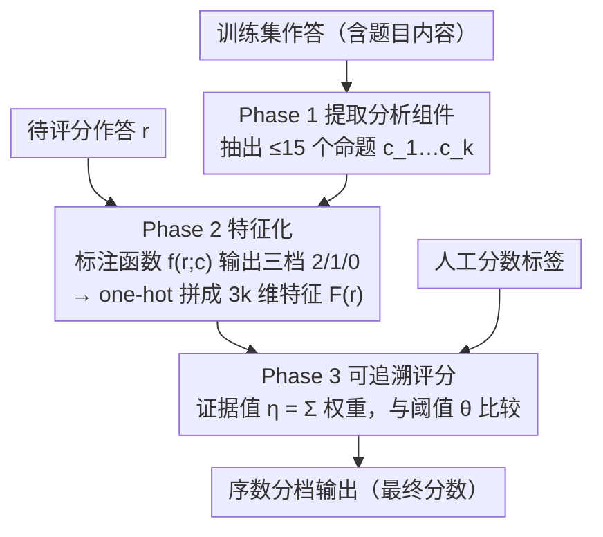

# Interpretability from the Ground Up

**会议**: ACL 2026 Findings  
**arXiv**: [2511.17069](https://arxiv.org/abs/2511.17069)  
**代码**: [GitHub](https://github.com/yunsungkim0908/analyticscore)  
**领域**: 可解释性 / 教育评估  
**关键词**: 可解释自动评分, 教育评估, FGTI原则, 分析性评分, 利益相关者设计

## 一句话总结

本文从教育评估利益相关者需求出发提出 FGTI 四原则（忠实、扎根、可追溯、可互换），开发 AnalyticScore 三阶段框架实现可解释自动评分，在 ASAP-SAS 上平均 QWK 仅比不可解释 SOTA 低 0.06。

## 研究背景与动机

**领域现状**：AI 自动评分能大规模、低成本地评判学生的开放式作答，需求与日俱增；但教育评估对透明与可解释的要求极高，而该领域至今没有一个被广泛接受的"可解释自动评分"方案能用于真实的大规模考试。

**现有痛点**：主流"可解释"做法都站不住脚。直接 prompt LLM"解释你的打分"产出的文字并不忠实——思维链不是模型内部计算的真实写照，且对 prompt 和输入的微小改动极其敏感、判断常自相矛盾；而特征重要性、归因热图、置信度这类事后解释既不扎根于可读特征，也无法让人追溯和介入评分逻辑。

**核心矛盾**：评分本质是一个证据推理过程，利益相关者需要能逐步检视、甚至介入替换其中每一步；但现有可解释手段要么不忠实，要么无法分解成人能可靠执行的清晰子步骤。

**本文目标**：从评估利益相关者的真实需求出发，提出一套可解释原则，并给出一个能落地、可作为后续研究基线的参考框架。

**切入角度**：扎根于教育评估几十年的文献，先界定不同利益相关者群体对可解释性的需求与收益，再据此提炼原则、设计框架，而非先有技术再补解释。

**核心 idea**：提出忠实/扎根/可追溯/可互换（FGTI）四原则，并用三段式的 AnalyticScore 框架证明这四条原则可同时实现，且评分精度逼近不可解释的 SOTA。

## 方法详解

### 整体框架

论文先从教育评估各类利益相关者（考生、教师、政策制定者等）的真实需求出发，提炼出可解释自动评分应满足的四条原则 FGTI——忠实（解释要真实反映模型计算，而非事后编的说辞）、扎根（特征要有人能看懂、且明确锚定在学生作答与题目上）、可追溯（评分逻辑要拆成一串定义清晰的推理子步骤）、可互换（每个子步骤的输出人都能接管替换）。AnalyticScore 就是落地这四条原则的参考框架，把"给一段学生短答打分"拆成三段串行流程：先从作答中抽取分析组件，再把每段作答按这些组件的出现情况特征化，最后用一个可追溯的评分模型把特征算成分数；其中前两段只用作答文本、不碰人工分数，人工分数只在第三段训练评分模型时才用到。

### 关键设计

**1. Phase 1 提取分析组件：把评分依据落成人能看懂、可增删的命题**

为满足"扎根"原则，AnalyticScore 不直接喂句向量这类不可读特征，而是先从训练集作答（必要时加上题目内容）里抽出一组分析组件 $[c_1,\dots,c_k]=\text{Extract}(r_1,\dots,r_m)$，本任务里把组件具体化为"命题"。抽取流程本身不限方法，本文用 LLM prompt 实现，并刻意把每个评分单元的组件数限制在 15 个以内——组件太多会让后续特征数膨胀、削弱"可互换"性。这一步天然嵌进评估开发的常规工作流：组件相当于自动生成的候选评分要点，评估专家可以直接 review、增删、改写。

**2. Phase 2 特征化：用三档标注函数把每段作答压成可读的二值特征**

确定组件后，对每段作答 $r$ 逐组件判断它是否覆盖该要点。标注函数 $f(r;c)$ 输出三档——$2$ 表示直接复述了 $c$、$1$ 表示部分复述、$0$ 表示没有——每一档都对应人能说清的含义（满足"扎根/可追溯"）。$f$ 用思维链 prompt 实现，但生成的"思考"过程显式丢弃、只取结论；并借鉴自一致性解码，用"先到三票"规则聚合多次判断以吸收对标注标准的歧义。最后把每个 $f(r;c_i)$ 做 one-hot 拼接，得到 $3k$ 维二值特征 $F(r)=\text{OneHot}(f(r;c_1))\,\|\cdots\|\,\text{OneHot}(f(r;c_k))$。为压低大规模评分时逐条调用专有 LLM 的线性成本，可用 o4-mini 标注的 10k 对 $(r,c)$ 样本，把一个小开源模型（Llama-3.1-8B + QLoRA）蒸馏成特征器。

**3. Phase 3 可追溯评分：用序数逻辑回归把特征算成分数，每个权重都可读可改**

最后一段才用到人工分数标签 $(r_1,s_1),\dots,(r_n,s_n)$ 训练评分模型。因为分数类别是有序的，作者选用即时阈值（Immediate-Threshold）变体的序数逻辑回归：把 Phase 2 的 one-hot 特征对应权重求和得到一个"证据值" $\eta=\sum_{i=1}^{k} w_{i,f(r,c_i)}$，再拿 $\eta$ 和一组学到的阈值 $\theta_j$ 比较，落在 $\theta_j \le \eta < \theta_{j+1}$ 区间就给序数类别 $j$。整个评分逻辑因此完全透明——每个组件、每档标注贡献了多少证据一目了然，人可以直接接管或替换任一权重（满足"可追溯/可互换"）。

### 一个完整示例：给"熊猫与考拉"短答打分

以题目"说明中国的熊猫和澳洲的考拉有何相似、又如何与蟒蛇不同"为例：Phase 1 先从大量作答里抽出若干命题组件，如"都是哺乳动物""都是地域特有物种""蟒蛇是冷血爬行动物"等（≤15 个）；Phase 2 对某段作答逐组件打三档分——直接写到了"哺乳动物"记 $2$、只隐约提及"地域特有"记 $1$、完全没提"冷血"记 $0$——拼成一条 $3k$ 维二值向量；Phase 3 把这些特征按学到的权重求和得证据值 $\eta$，与阈值比较给出最终分档。若评分专家觉得"冷血爬行动物"这条要点权重过高，可直接改对应权重，无需重训整套模型。

## 实验关键数据

### 主实验

在 ASAP-SAS 数据集的 10 道题上评估评分精度（QWK），并比对 AnalyticScore 的特征化行为与人工标注的一致性：

| 维度 | AnalyticScore | 说明 |
|------|--------------|------|
| 评分精度 (QWK) | 平均仅比不可解释 SOTA 低 0.06 | 跨 ASAP-SAS 10 道题，且优于多数不可解释方法 |
| 特征化与人类一致性 (QWK) | 0.90 / 0.72 / 0.81 | 三个评估维度上与人工标注高度一致 |

### 关键发现

- 用平均仅 0.06 QWK 的极小精度代价，换来了完全可追溯、可介入的评分逻辑，且仍优于多数不可解释方法——打破了"可解释必然大幅牺牲精度"的默认印象
- AnalyticScore 的特征化行为与人类标注高度对齐（0.90/0.72/0.81 QWK），说明它抽取的分析组件确实捕捉到了人所依据的评分要点
- 三阶段解耦让人能在任一环节接管，验证了 FGTI 原则在真实数据集上的可落地性

## 亮点与洞察

- 把"可解释性"从技术堆叠倒过来做——先界定利益相关者需求、再提原则、最后才设计框架，FGTI 四原则给出了一套可检验的判据，而不是空喊"可解释"
- 用"分析组件 + 三档标注 + 序数逻辑回归"这条朴素链路，证明完全透明的评分也能逼近黑箱 SOTA，挑战了"可解释必然大幅掉点"的默认假设
- 每个权重和特征都能被人直接替换，把"可解释"真正落成了"可干预"

## 局限与展望

- 仅在文本短答评分（ASAP-SAS）上验证，迁移到作文、数学解答等更复杂的作答形式还需检验
- 分析组件目前靠 LLM 抽取再人工 review，组件质量和数量上限（≤15）会直接决定精度天花板
- 序数逻辑回归是线性模型，遇到要点间存在强非线性交互的评分标准可能受限

## 相关工作与启发

- **vs prompt 出来的 LLM 解释**: 思维链等 prompt 解释不忠实于内部计算、对输入敏感，AnalyticScore 用结构化、可追溯的评分模型取代这类事后说辞
- **vs 特征重要性 / 归因热图**: 这类事后解释既不扎根于可读特征、也无法让人追溯介入，AnalyticScore 的每一步子程序都人可读、可替换

## 评分

- 新颖性: ⭐⭐⭐⭐ 有创新但部分技术是已有方法的组合
- 实验充分度: ⭐⭐⭐⭐ 评估较全面
- 写作质量: ⭐⭐⭐⭐ 结构清晰
- 价值: ⭐⭐⭐⭐ 对领域有实际贡献

<!-- RELATED:START -->

## 相关论文

- [\[ACL 2026\] Letting Tutor Personas Speak Up for LLMs: Learning Steering Vectors from Dialogue via Preference Optimization](letting_tutor_personas_speak_up_for_llms_learning_steering_vectors_from_dialogue.md)
- [\[ACL 2026\] Revitalizing Black-Box Interpretability: Actionable Interpretability for LLMs via Proxy Models](revitalizing_black-box_interpretability_actionable_interpretability_for_llms_via.md)
- [\[ICML 2026\] How Few-Shot Examples Add Up: A Causal Decomposition of Function Vectors in In-Context Learning](../../ICML2026/interpretability/how_few-shot_examples_add_up_a_causal_decomposition_of_function_vectors_in_in-co.md)
- [\[ICML 2026\] Interpretability Can Be Actionable](../../ICML2026/interpretability/interpretability_can_be_actionable.md)
- [\[ACL 2026\] From Interpretability to Performance: Optimizing Retrieval Heads for Long-Context Language Models](from_interpretability_to_performance_optimizing_retrieval_heads_for_long-context.md)

<!-- RELATED:END -->
