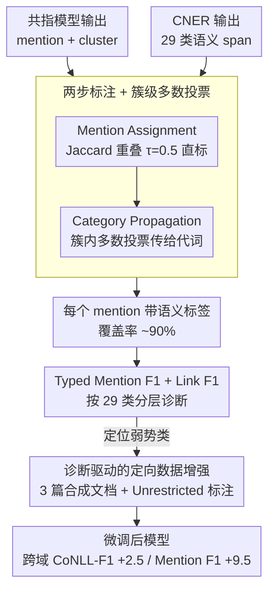

# Interpretable Coreference Resolution Evaluation Using Explicit Semantics

**会议**: ACL 2026  
**arXiv**: [2605.10627](https://arxiv.org/abs/2605.10627)  
**代码**: https://github.com/SapienzaNLP/cner-coref (有)  
**领域**: 可解释性 / 共指消解 / 评测 / 数据增强  
**关键词**: 共指消解、CNER、语义评测、Typed F1、定向数据增强

## 一句话总结
本文用 Concept and Named Entity Recognition (CNER) 把 29 类细粒度语义标签按"提及 + 簇级多数投票"覆盖到共指消解的输出上，得到按语义类别分层的 Mention F1 和 Link F1 诊断指标，从而看清"模型在哪个类别上系统性失败"，再用这些诊断指导仅 3 篇合成文档的定向数据增强，把 LitBank 训练的模型在 OntoNotes/PreCo 上 CoNLL-F1 提了 +2.5/+2.8，Mention F1 提了约 +9.5。

## 研究背景与动机

**领域现状**：共指消解的主流评测从 90 年代起就是 MUC、$B^3$、CEAF$_{\phi 4}$ 三件套及它们的平均 CoNLL-F1，要求 mention 边界严格相同、链接逐对匹配。模型这边 Maverick 等编解码联合模型已在 OntoNotes 上做到 SOTA。

**现有痛点**：(i) 单一聚合分数掩盖类别层面的失败模式——一个模型可能擅长人物链但完全搞不定事件和物体链，CoNLL-F1 看不出来；(ii) 跨领域评估时分数下降，但分不清是边界差异、标注规范差异，还是真正的语言能力缺陷；(iii) 仅有的语义化评测 (Agarwal et al. 2019) 用标准 NER 4 类标签 (PER/ORG/LOC/MISC)，覆盖率只有 50% 左右，且分类过粗。

**核心矛盾**：共指消解的 mention 中相当一部分是 nominal concept（普通名词如 president、city、whale），传统 NER 根本无法标注这些，只在命名实体上能给标签——这导致 "用语义视角评测共指" 在覆盖率和粒度上都不够，无法定位真正问题。

**本文目标**：(1) 给共指 cluster 打上密集、细粒度的语义标签；(2) 用这种标签算出按语义类分层的 typed F1 指标；(3) 用诊断结果指导小成本数据增强以验证可行性。

**切入角度**：用 Martinelli et al. 2024 的 CNER（同时标 named entity 和 nominal concept，统一 29 类），覆盖率从 NER 的 22-52% 直接拉到 ~90%，再加一个"簇级多数投票"机制把代词等无法直接标的 mention 通过其所在 cluster 反向获得标签。

**核心 idea**：在共指模型不动的前提下，把 CNER 语义层 overlay 到共指输出，按 token 级 Jaccard 重叠对齐 mention 与 CNER span，再以 cluster 为单位做多数投票传播标签，把共指评测变成"按语义类别分层的诊断界面"。

## 方法详解

### 整体框架

输入：文档 $D$ 中共指模型预测的 mention 集合 $\mathcal{M} = \{m_1, ..., m_n\}$ 与 cluster 集合 $\mathcal{G}$，以及 CNER 预测的标注 span $\mathcal{C} = \{c_1, ..., c_k\}$，每个 $c_j$ 有标签 $L(c_j) \in \mathcal{T}$（$\mathcal{T}$ 含 29 类如 PERSON / LOCATION / EVENT / RELATION / SUPERNATURAL / PLANT / DISEASE 等）。中间两步：(1) Mention Assignment 用 Jaccard 重叠把 mention $m_i$ 对到最大重叠的 CNER span $\hat{c}_j$，重叠 > τ=0.5 时赋标签；(2) Category Propagation 在每个 cluster $G$ 内用多数投票决定 $S(G) = \arg\max_{t \in \mathcal{T}} |\{m_G \in G : L(m_G) = t\}|$，再把 $S(G)$ 传播给所有未标 mention（含代词）。输出：每个 mention 都带 CNER 标签，可按类别分层计算 typed Mention F1 / Link F1。

### 关键设计

**1. 两步标注 + 簇级多数投票：把代词也拉进语义诊断**

传统 NER-based 评估在 PreCo 上只能标 22.8% 的 mention，代词、模糊指称根本无标签，per-class 分析无从谈起。本文先用重叠函数 $\Omega(m_i, c_j) = |\text{span}(m_i) \cap \text{span}(c_j)| / |\text{span}(m_i) \cup \text{span}(c_j)|$ 衡量 mention 与 CNER span 的 token 级 Jaccard 重叠，给每个 mention 选 $\hat{c}_j = \arg\max \Omega$，重叠 < 0.5 的暂时留空。直标这一步能覆盖 37.5–71.4% 的 mention，再借助"同一 cluster 内的 mention 必然语义同类"这条硬约束，在簇级别做多数投票把标签传播给剩下的空位（含纯代词），打平时用平均 $\Omega$ 最高的标签破纪录。

这样覆盖率从 NER 的两成多一路升到 ~90%，剩下的几乎都是没有任何 nominal 锚点的纯代词 cluster。整套传播只是查表 + 投票，用近乎零算力就把困扰语义评测多年的"密度问题"基本填平，让后续按类别切分的诊断真正成为可能。

**2. Typed Mention F1 + Link F1：把"识别"和"链接"两种能力拆开看**

CoNLL-F1 把边界、链接、聚类三种误差源揉成一个数，掉了 10 分也不知道该改哪里。本文把评测拆成两个互相独立的维度：Mention F1 只算特定类 $t$ 的 mention 抽取精度与召回，完全不看聚类对错；Link F1 则在 gold mention 输入下，评估同一 cluster 内 mention 对 $(m_1^G, m_2^G)$ 是否被正确连到一起，专门刻画聚类结构质量，与 mention 检测解耦。

两类指标都按 29 个语义类别分层报告，于是能精确定位"模型在 PER 上链接很好、但在 EVENT 上连 mention 都抽不准"这种细节。把单一聚合分数换成 mention/link × per-class 的诊断面板后，"在哪类失败 → 该补什么"的因果链第一次变得可追踪。

**3. 诊断驱动的定向数据增强：让评测能开出"补什么数据"的药方**

传统评测只能发现问题，给不出干预手段。本文把诊断结论（"LitBank 模型在 PLANT/EVENT/MEDIA 等类上崩溃"）直接翻译成 augmentation 配方：用 GPT-5.1 生成 3 篇约 2000 字的 LitBank 风格虚构叙事，每篇刻意塞入被判为弱势的 CNER 类提及；再按两种规范人工标注——Restricted 只标 LitBank 原有 6 类，Unrestricted 覆盖所有 nominal 与代词 mention——分别并入训练集得到 augmented 与 augmented-NR 两个模型。

之所以只用 3 篇文档，是要把规模压到最小可证伪：如果这点数据就能让 typed F1 诊断指向的弱类显著回升，就证明诊断真的可操作。结果 Unrestricted 版让 CoNLL-F1 平均 +2.5、Mention F1 +9.5，而 Restricted 版反而更差，闭环地说明"问题不在数据量，而在标注规范限定了类范围"，把"可解释评测"坐实成了"可执行评测"。

### 损失函数 / 训练策略

本文不改动共指模型，全部用 Maverick (mes 多专家版) 的三个官方 checkpoint（在 OntoNotes / LitBank / PreCo 上分别训练）。CNER 语义层用官方 CNER checkpoint 直接推理。数据增强部分对 LitBank-augmented 模型按原 Maverick 训练流程在原 LitBank 训练集 + 3 篇合成文档上微调。Mention/Link F1 都按标准 P/R 调和平均算。

## 实验关键数据

### 主实验（Maverick 三个变体在 3 数据集上 macro Mention/Link F1）

| Model | OntoNotes M-F1 | LitBank M-F1 | PreCo M-F1 | OntoNotes L-F1 | LitBank L-F1 | PreCo L-F1 |
|-------|----------------|--------------|------------|----------------|--------------|------------|
| maverick-mes-ontonotes | **0.85** | 0.48 | 0.40 | **0.77** | 0.53 | 0.57 |
| maverick-mes-litbank | 0.40 | **0.78** | 0.31 | 0.43 | 0.53 | 0.47 |
| maverick-mes-preco | 0.53 | 0.35 | **0.93** | 0.47 | 0.46 | **0.82** |

In-domain 全部模型都很强，但 LitBank 训练的模型在跨域上 macro Mention F1 比 OntoNotes / PreCo 训练的模型低很多，per-class Mention F1 (Figure 5) 显示 LitBank 模型在 PreCo/OntoNotes 上几乎所有非 PER 类都垫底；用 gold mention 算 Link F1 仍然 LitBank 训练最差，证实问题是聚类逻辑也带 person-centric 偏置而非仅边界差异。

CNER 覆盖率对比 NER（标注后 + 传播后）：OntoNotes 90% vs 52.8%，LitBank 90% vs 29.6%，PreCo 90% vs 22.8%，CNER 把"密度"问题彻底解决。手工验证（LitBank 测试集 30%）：CNER cluster-level 标签精度 90% / 召回 87% / F1 88%，证明传播链可靠。

### 消融 / 定向数据增强表（LitBank 训练 + 3 篇合成文档，跨域）

| Model | PreCo CoNLL-F1 | OntoNotes CoNLL-F1 | Avg CoNLL-F1 | Avg Link F1 | Avg Mention F1 |
|-------|----------------|---------------------|--------------|-------------|-----------------|
| maverick-mes-litbank | 45.5 | 51.7 | 48.6 | 29.89 | 30.58 |
| augmented (Restricted) | 44.7 | 51.9 | 48.3 | 30.67 | 28.01 |
| **augmented-NR (Unrestricted)** | **49.7** | **52.5** | **51.1** | **32.02** | **37.49** |
| Δ NR vs Restricted | +5.0 | +0.6 | +2.8 | +1.35 | **+9.49** |

### 关键发现

- LitBank 的人物中心标注规范 (83.1% PER) 真把模型训得过拟合：跨域上模型对所有非 PER 类系统性崩溃，而这一点在 CoNLL-F1 上是看不出来的。
- NER vs CNER 的差距是结构性的——NER 只标 22-53%，且大量类被压成 MISC 这种黑盒；切开 MISC 到 CNER 子类后能看到 GROUP / MEDIA / SUPER 等独立失败模式，证明粗粒度评测真的会掩盖大量类别盲点。
- 增强实验是论文最有力的存在证明：用 3 篇合成文档 + Unrestricted 标注就让 CoNLL-F1 平均涨 +2.5，Mention F1 涨 +9.5；而 Restricted 标注（仅保留 LitBank 6 类）反而比基线还差 -2.6 Mention F1——证明问题不在"数据少"，而在"标注规范限定类范围"。
- LitBank 模型在跨域使用 gold mention 算 Link F1 仍然最差，说明"语义偏置"会同时污染 mention 抽取和聚类链接两个能力，这两个机制是耦合损坏的。
- 诊断的因果可操作性：作者从 typed F1 看到 PLANT/EVENT/MEDIA/PSYCH 等被忽视类，再生成合成数据就能定向补——这是把"评测"从"打分"升级成"工程指南"。

## 亮点与洞察

- "Concept + NER" 把 nominal concepts 纳入语义层是简单到不能再简单的改进，但把共指评测从覆盖率 22% 拉到 90%、把可分类从 4 类拉到 29 类，是典型的"换工具就破局"的好案例，提醒我们评测瓶颈常常是工具瓶颈而非方法瓶颈。
- 簇级多数投票传播是非常迁移得动的 trick——任何"实体/事件/概念聚类 + 部分 mention 可独立打标签"的任务（如 entity linking、event coreference、对话角色追踪）都可以用同样的两步法把代词 / 模糊 mention 反向赋类。
- "诊断 → 3 篇合成数据 → +9.5 Mention F1" 的闭环把可解释评测的实用价值钉死了：评测不只是"评分"，它能直接告诉你"应该补什么数据"，这种"评测可执行性"应该成为未来 NLP 评测论文的默认要求。
- Restricted vs Unrestricted 的对照异常有教学价值——告诉社区"数据规模不是关键，标注规范才是"，反驳了 "augment 就有用" 的天真假设。

## 局限与展望

- CNER cluster-level 标签精度 90% / F1 88%，仍有 10-12% 标签噪声会传到 typed F1，论文没量化"标签错误对评测结论的扭曲"。
- ~10% mention 仍未标，主要是纯代词 cluster；作者建议未来用弱监督训轻量分类器补齐。
- 框架只在英语上验证，扩展到其他语言依赖多语种 CNER 模型，论文暂未提供。
- 数据增强只验证了 3 篇文档的小规模 PoC，工业级 augmentation 策略和质量控制流程未建立。
- 没引入 LLM 共指模型（如 GPT-4 zero-shot coreference）作为对比，框架本身可扩展，但实证缺位。

## 相关工作与启发

- **vs Agarwal et al. 2019 (NER-based coref evaluation)**：他们也用语义类做分层评测，但限于 NER 4 大类、覆盖率 < 53%，本文用 CNER 把覆盖拉到 90%、类数到 29，per-class 诊断粒度数量级提升。
- **vs Kummerfeld & Klein 2013 (error analysis toolkit)**：他们用错误类型聚类做诊断，本文用语义类型做诊断，两者互补——前者关注"错在哪种错误模式"，后者关注"错在哪种语义类"。
- **vs Porada et al. 2024 (annotation guideline analysis)**：他们论证跨域差距常是标注规范差异，本文用 typed F1 + 增强实验给出可操作的解决方法（用 Unrestricted 标注做小规模 augmentation）。
- **vs LEA / MINA**：他们改聚合分数权重和边界判定，本文不改算法、改诊断维度；这两种方向应组合使用。

## 评分
- 新颖性: ⭐⭐⭐⭐ CNER 用于共指评测是首次，"两步标注 + 簇传播"简单优雅，但单看"语义评测"思路已有前作。
- 实验充分度: ⭐⭐⭐⭐ 3 数据集 × 3 模型 × per-class M-F1/L-F1 + 手工验证 + 增强对照 + Restricted vs Unrestricted 反事实，证据链很完整。
- 写作质量: ⭐⭐⭐⭐⭐ 论证非常清晰、3 张 Figure 1 + 4 张表覆盖所有关键 claim，Limitation 也写得诚恳。
- 价值: ⭐⭐⭐⭐⭐ "评测→数据→模型"的闭环对所有 NLP 评测任务都有方法论启发，对共指消解社区来说是直接可用的 release。

<!-- RELATED:START -->

## 相关论文

- [\[ACL 2025\] CLEME2.0: Towards Interpretable Evaluation by Disentangling Edits for Grammatical Error Correction](../../ACL2025/interpretability/cleme2_gec_evaluation.md)
- [\[ICML 2026\] LLMs Lean on Priors, Not Programming Language Semantics](../../ICML2026/interpretability/llms_lean_on_priors_not_programming_language_semantics.md)
- [\[CVPR 2026\] Beyond Semantics: Disentangling Information Scope in Sparse Autoencoders for CLIP](../../CVPR2026/interpretability/beyond_semantics_disentangling_information_scope_in_sparse_autoencoders_for_clip.md)
- [\[ACL 2026\] Constructing Interpretable Features from Compositional Neuron Groups](constructing_interpretable_features_from_compositional_neuron_groups.md)
- [\[AAAI 2026\] CrossCheck-Bench: Diagnosing Compositional Failures in Multimodal Conflict Resolution](../../AAAI2026/interpretability/crosscheck-bench_diagnosing_compositional_failures_in_multim.md)

<!-- RELATED:END -->
