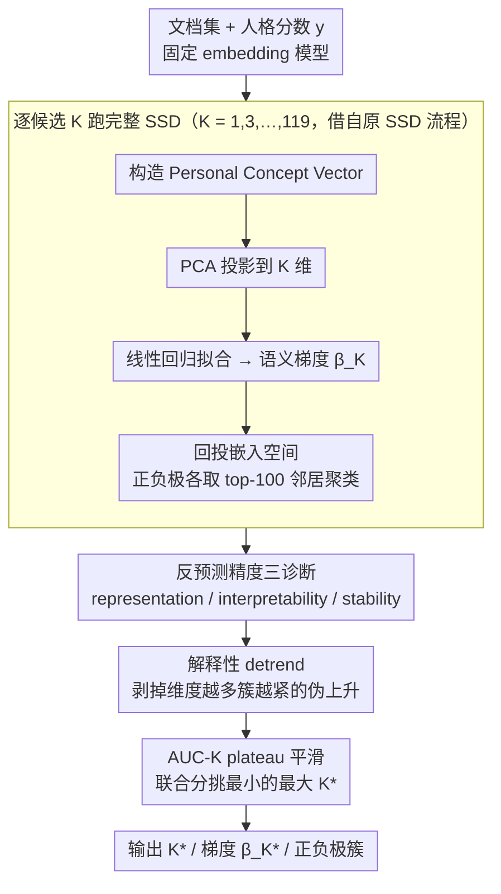

# Interpretable Semantic Gradients in SSD: A PCA Sweep Approach and a Case Study on AI Discourse

**会议**: ACL 2026  
**arXiv**: [2603.13038](https://arxiv.org/abs/2603.13038)  
**代码**: 待确认  
**领域**: 可解释性 / 心理语言学 / 嵌入分析  
**关键词**: Supervised Semantic Differential、PCA Sweep、语义梯度、自恋人格、研究者自由度

## 一句话总结
本文给 Supervised Semantic Differential (SSD) 这种"用个体差异变量估计文本嵌入语义梯度"的方法提了一个 PCA sweep 程序——用可解释性 + 稳定性两个诊断（而非预测精度）联合挑选 PCA 维度 $K$，并在 349 条 AI 主题短文 + 自恋问卷上演示：sweep 选出的 $K=15$ 给出 Admiration 相关的"乐观协作 vs 不信任嘲讽"稳定语义梯度，而高 $K=120$ 的反事实方案得到混乱难解释的簇。

## 研究背景与动机

**领域现状**：心理学 Semantic Differential 范式用极性形容词（warm/cold）测概念的内涵意义已有 70 年传统；现代分布式语义把这种想法迁移到词向量空间。Supervised Semantic Differential (SSD, Plisiecki et al. 2025) 把两者结合——把每位作者的文本聚成 Personal Concept Vector，对人格分数做线性回归，回归系数归一化后当作"语义梯度"，然后聚类正负极并回检原文，估测人格差异如何调制语言中的连接性意义。

**现有痛点**：SSD 流程里有一个未解的关键自由度——回归前先做 PCA，但 $K$（保留主成分数）怎么选完全没有原则，全凭研究者审美；这就掉进 Simmons et al. 2011 警告的"未公开分析灵活性"陷阱，给假阳性结论留了后门，也让语义梯度的解释可信度被打折扣。

**核心矛盾**：$K$ 太小则丢失语义结构，$K$ 太大则在小语料里捕捉噪声噪声维度并把回归方向带偏；常规"用预测精度选 $K$" 的思路与 SSD 的解释性目标冲突——预测最好的 $K$ 不一定语义最连贯。

**本文目标**：(1) 提出一个跟"预测精度无关"、专门为解释性方法服务的 $K$ 选择程序；(2) 把这个程序在真实心理学案例上跑通，证明它能给出可解释、可证伪的语义梯度。

**切入角度**：把 $K$ 选择视为"语义结构的稳定性 + 聚类的可解释性"两个性质的联合优化——好的 $K$ 应该既能让语义簇相干，又能让相邻 $K$ 下梯度方向几乎不变。

**核心 idea**：扫描 $K \in \{1,3,...,119\}$，对每个 $K$ 跑完整 SSD，记录"detrended interpretability"（解释性，去 log 方差解释的趋势）与"unit change"（稳定性，相邻 $K$ 梯度方向余弦差），分别 local smoothing 后联合打分挑最小的最大分 $K$。

## 方法详解

### 整体框架

输入：文档集合 $\{d_i\}$ 配对连续结果 $y_i$（人格分数）、固定 embedding 模型、可选 lexicon。中间过程：(1) 对每个候选 $K$，做相同预处理后构造 Personal Concept Vector $\mathbf{x}_i \in \mathbb{R}^D$，PCA 投影到 $\tilde{\mathbf{x}}_i \in \mathbb{R}^K$，拟合 $y_i = \alpha + \boldsymbol{\beta}^\top \tilde{\mathbf{x}}_i + \epsilon_i$，归一化系数得梯度 $\hat{\boldsymbol{\beta}}_K$；(2) 回投到原嵌入空间，正负极各取 top-100 邻居聚类，按 silhouette 选簇数 $k \in [2,5]$；(3) 计算三类诊断：representation (累计方差解释)、interpretability (簇相干 + 簇心与梯度的余弦对齐，按簇大小加权)、stability ($\Delta_K = 1 - \cos(\hat{\boldsymbol{\beta}}_K, \hat{\boldsymbol{\beta}}_{K-1})$)；(4) 对解释性按 log 方差解释 detrend 后 z-score，对解释性与稳定性各取 local AUC-K 平滑，最后挑联合分最大的最小 $K$。输出：选定的 $K^*$、对应梯度 $\hat{\boldsymbol{\beta}}_{K^*}$ 与正负极簇。

### 关键设计

**1. 三诊断联合的"反预测精度"选 $K$ 准则：让超参服务于解释而非拟合**

SSD 是个解释性方法，但若用 $R^2$ 或 $F$ 统计量选 $K$，结果会一路偏向高维——过拟合的回归恰好分数最高。本文索性把所有诊断量都算在回归拟合**之后**且刻意不依赖拟合度：representation 看累计方差解释，interpretability 看簇相干 + 簇心与梯度方向的余弦对齐（按簇大小加权），stability 看相邻 $K$ 的梯度余弦差 $\Delta_K = 1 - \cos(\hat{\boldsymbol{\beta}}_K, \hat{\boldsymbol{\beta}}_{K-1})$。这样选出的 $K$ 奖励的是"语义结构本身稳定一致"，而不是"对人格分数拟合得更好"。

这条准则的必要性被反事实直接坐实：$K=120$ 的 $R^2$ (0.234) 反而高过 sweep 选出的 $K=15$ (0.19)，但前者的语义簇彻底散架。如果按预测精度选超参，就会一头扎进噪声维度，正是 SSD 这类解释性方法最该避开的陷阱。

**2. 解释性指标的 detrend 设计：剥掉"维度越多簇越紧"的伪上升**

原始解释性 score 会被 $K$ 单调拉高——维度一多，簇内邻居自然更紧，机械上升掩盖了真正的拐点，让人看不出"什么时候开始变差"。本文对每个 $K$ 先算簇相干 + 簇心对齐的加权聚合，再用 log(累计方差解释) 做回归 detrend，取残差后 z-score。

去趋势后得到的"解释性"度量的是"超出维度自然增长之外的额外信号"，等于把指标 normalize 到一条公平基线上。只有先剥掉这条伪上升趋势，下一步 AUC-K 平滑想找的 plateau 才会真正凸显出来，否则曲线一路爬升，高原根本无从辨认。

**3. Plateau-sensitive smoothing (AUC-K)：奖励一整片好区，而非孤立尖峰**

即便去过趋势，低 $K$ 区域的解释性曲线仍抖动剧烈，单点峰值往往只是噪声。本文对解释性和稳定性两条曲线分别在以 $K$ 为中心、半径 3 的局部邻域取平均得到 AUC-K 值，再做 z-score 标准化，最后用联合分 $\text{joint\_score}_K = \frac{1}{2}(\text{interp\_auck}_K + \text{stab\_auck}_K)$ 来挑 $K^* = \min \arg\max_K \text{joint\_score}_K$。

平滑把"一整片区域都好"的高原揪出来，而非追逐转瞬即逝的局部峰；"最小取最大"则在并列的好区里偏向最低维度，自带 parsimony 倾向。这一步把"扫超参看曲线"从凭审美的目测升级成有明确判据的自动选择。

### 损失函数 / 训练策略

仅训练一个线性回归 $y_i = \alpha + \boldsymbol{\beta}^\top \tilde{\mathbf{x}}_i + \epsilon_i$，标准 OLS；每个候选 $K$ 重新拟合一次。Embedding 用 Dolma 300-d GloVe + SIF 加权 ($a=10^{-3}$) + 去顶主成分；聚类用 silhouette 选 $k \in [2,5]$。整个 sweep 计算量正比于 $|K|$ × 单次 SSD 时长，仍是廉价桌面级。

## 实验关键数据

### 主实验（349 条 AI 主题短文 + 自恋 NARQ 问卷，sweep 选 $K$ 后回归结果）

| 特质 | 选定 $K$ | $R^2_{\text{adj}}$ | $F$ | $p$ | $r$ | $\|\hat{\boldsymbol{\beta}}\|$ |
|------|----------|-------------------|-----|-----|-----|--------------------------------|
| Admiration (ADM) | **15** | **0.19** | 6.32 | $<10^{-10}$ | 0.47 | 5.58 |
| Rivalry (RIV) | 23 | 0.03 | 1.43 | 0.095 | 0.30 | 5.38 |

ADM sweep 诊断：解释性曲线在低 $K$ 急升、$K=15$ 达峰（解释 50% PCV 方差），稳定性曲线同位置出现 plateau；ADM 的正负极簇被定性聚类成 4 个：

| 极 | 簇大小 | 主题（Top Words + 摘录） |
|----|--------|--------------------------|
| + | 14 | Cultivation & enrichment: cultivate, rediscover, rejuvenated — "AI's potential is boundless..." |
| + | 86 | Innovation & collaboration: innovation, partnership, empower — "AI is transforming our world..." |
| − | 56 | Deception & threat: misleading, dishonest, unfair — "woke, evasive..." |
| − | 44 | Ridicule & contempt: ridiculous, absurd, laughable — "the stupid programmers..." |

### 反事实消融（$K=120$ 高维方案）

| 配置 | $R^2_{\text{adj}}$ | $p$ | 簇语义连贯 |
|------|---------------------|-----|------------|
| Sweep $K=15$ | 0.19 | $<10^{-10}$ | 4 个主题清晰的簇 |
| Counterfactual $K=120$ | **0.234** (更高) | $2.17 \times 10^{-5}$ | 簇散乱（地缘 + 品牌 + 动物 + 园艺词混杂） |

$K=120$ 拿到更高 $R^2$ 但簇内容如"inclusive, asean, maldives, rolex, brics, lagos, apec"或"birds, rabbits, squirrels, pigeons"，与 AI 主题毫无关联——证明高维 PCA 是把噪声维度塞进梯度方向，分数升解释性反而崩。

### 关键发现

- "$R^2$ 高 ≠ 语义好"被反事实直接证实：$K=120$ 比 $K=15$ 的 $R^2$ 还高 $0.04$，但簇内容散乱到无法解释——这是给"用预测精度选超参"的传统做法一记响亮耳光，对所有 mixed-method 解释性研究有教训意义。
- Sweep 选出的 $K=15$ 恰好对应 PCV 方差 50% 解释点，且解释性峰与稳定性 plateau 同位置出现——这种 alignment 是 sweep 程序在做"正确事情"的强证据。
- ADM 上语义极性"乐观协作 vs 不信任嘲讽"很符合心理学理论（Admiration 是 agentic、status-seeking 倾向，倾向认同正向叙事），论文以此说明 SSD + sweep 不仅是评估工具，也能产出真正可发表的心理学发现。
- RIV 上 sweep 选 $K=23$ 但回归不显著 ($p=0.095$)，作者诚实地拒绝过度解读——sweep 程序本身并不强行造出显著结果，反而在 SSD 不工作的特质上能识别出来"这里没东西"。
- 349 样本上能稳定跑通整个流程，证明 sweep 是计算上轻量、可被心理学社区接入日常工作流的工具。

## 亮点与洞察

- "诊断要跟评测目标对齐"的方法论提醒非常深——SSD 是解释性方法，所以选超参也应该用解释性 / 稳定性而非预测精度；这个原则可推广到所有 mixed-method 研究（topic model、explanatory PCA、聚类等），把"反预测精度选超参"做成一个一般范式。
- Detrending + AUC-K plateau smoothing 这两个小 trick 解决了"指标机械上升"和"局部噪声峰"两个常见坑，几乎可直接复用到任何"扫超参看曲线"的场景。
- 反事实 $K=120$ 实验设计很有教学价值：作者主动给出一个"看起来更好的 $R^2$"反例，证明 sweep 的优势不是数字而是结构——这种"主动证伪"的写作姿态值得学习。
- 把心理学个体差异 (Admiration 自恋) 直接连到语言学嵌入梯度，并给出可定性的极端文本，是 LLM/embedding 时代心理学社会学量化研究的范本。

## 局限与展望

- 案例只有 349 条短文，单语言（英语）、单平台（Prolific）、单话题（AI），不能宣称泛化；作者自己承认 sweep 只解决了 $K$ 这一个自由度，embedding 模型选择、word window 等其他 design choice 仍未原则化。
- 选用了"整文 PCV"而非 lexicon-based PCV，作者用"统一 prompt 让全文都和 AI 相关"为依据，但仍可能模糊细粒度语义。
- 心理学解释纯属相关性，没有干预实验；ADM "乐观叙事偏好" 也可能是 LLM sycophancy 偏置 + 用户重写共同结果（Perez et al. 2022），归因仍需更多实验。
- Sweep 程序对小语料 ($N<200$) 的稳健性未单独验证；高维 PCA 的反事实只给出 $K=120$ 一个对照点，更系统地刻画曲线行为还可深化。

## 相关工作与启发

- **vs Plisiecki et al. 2025 (原 SSD)**：作者扩展了同一方法链，把 $K$ 选择从"研究者拍脑袋"升级为"原则化扫描"。
- **vs Mimno et al. 2011 (topic coherence)**：他们用 coherence 评估话题模型质量，本文把同一思路嫁接到回归梯度的"解释性"侧。
- **vs Garg et al. 2018 / Kozlowski et al. 2019 (word embedding 偏置量化)**：他们用嵌入空间方向研究社会规范，本文用"梯度方向 + 个体差异变量"做更细粒度的人格语言学。
- **vs Simmons et al. 2011 (false-positive psychology)**：本文是把"减少未公开分析自由度"的呼吁具体落到 SSD 流程的工具级响应。

## 评分
- 新颖性: ⭐⭐⭐ 单看每个组件（PCA sweep、coherence、stability）都不新，但把它们组合并应用到 SSD 是首次。
- 实验充分度: ⭐⭐⭐ 只有一个案例研究 + 一个反事实，规模偏小；不过对方法学论文而言 PoC 足够。
- 写作质量: ⭐⭐⭐⭐ 动机和方法描述非常清晰、公式简洁、Discussion 把方法和案例的边界说得诚恳。
- 价值: ⭐⭐⭐⭐ 对 SSD 用户是马上能用的工具，对所有"嵌入空间 + 心理变量"的研究有方法学示范意义，但因受众较窄略减一星。

<!-- RELATED:START -->

## 相关论文

- [\[ACL 2026\] Understanding or Memorizing? A Case Study of German Definite Articles in Language Models](understanding_or_memorizing_a_case_study_of_german_definite_articles_in_language.md)
- [\[ICML 2025\] Do Sparse Autoencoders Generalize? A Case Study of Answerability](../../ICML2025/interpretability/do_sparse_autoencoders_generalize_a_case_study_of_answerability.md)
- [\[ACL 2026\] Rhetorical Questions in LLM Representations: A Linear Probing Study](rhetorical_questions_in_llm_representations_a_linear_probing_study.md)
- [\[ACL 2026\] A Structured Clustering Approach for Inducing Media Narratives](a_structured_clustering_approach_for_inducing_media_narratives.md)
- [\[ACL 2026\] NOSE: Neural Olfactory-Semantic Embedding with Tri-Modal Orthogonal Contrastive Learning](nose_neural_olfactory-semantic_embedding_with_tri-modal_orthogonal_contrastive_l.md)

<!-- RELATED:END -->
