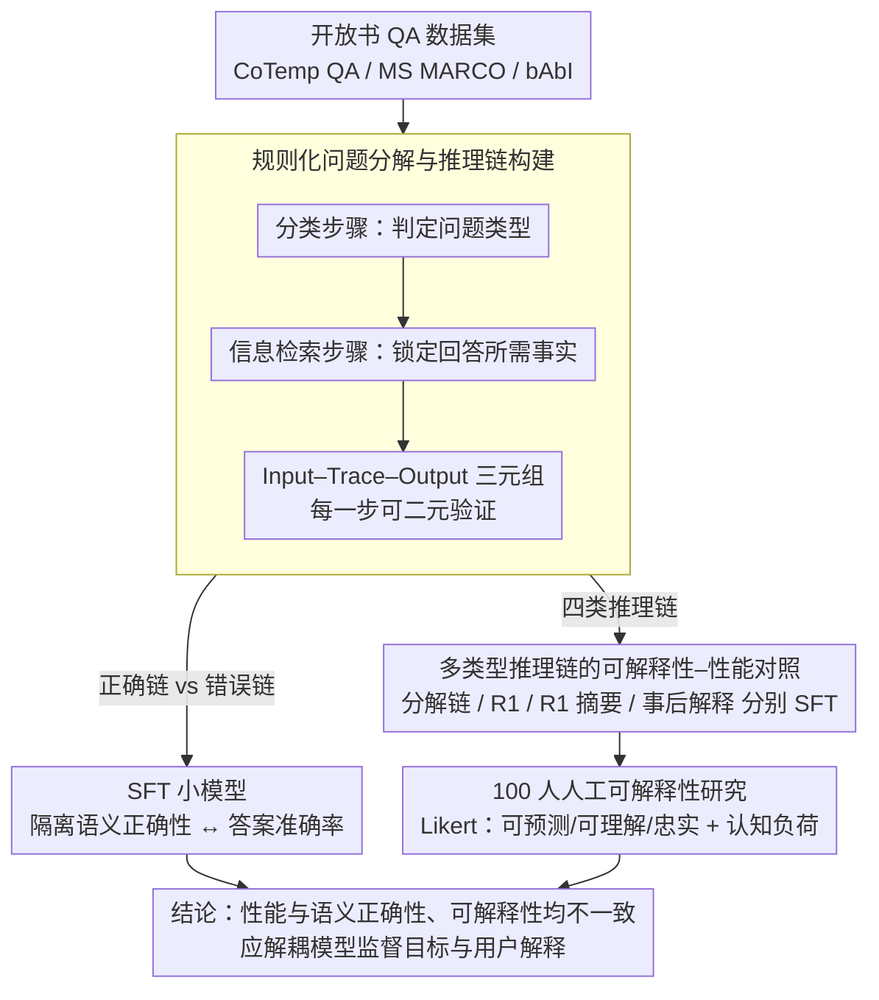

# Interpretable Traces, Unexpected Outcomes: Investigating the Disconnect in Trace-Based Knowledge Distillation

**会议**: ACL 2026  
**arXiv**: [2505.13792](https://arxiv.org/abs/2505.13792)  
**代码**: 有（GitHub）  
**领域**: 可解释性 / 知识蒸馏  
**关键词**: CoT推理链, 知识蒸馏, 语义正确性, 可解释性, 推理链忠实度

## 一句话总结
通过规则化问题分解方法构建可验证的中间推理链数据集，揭示 CoT 推理链的语义正确性与最终答案准确率不可靠地相关（正确链仅 28% 导致正确答案），且最可解释的推理链并非最提升性能的——冗长的 R1 链性能最优但用户评为最不可解释。

## 研究背景与动机

**领域现状**：推理型 LLM（如 DeepSeek R1）通过生成 CoT 推理链来提升性能，这些推理链不仅用于推理时引导，也作为知识蒸馏（KD）的监督信号来改进小模型。

**现有痛点**：当前普遍但未经检验的隐含假设是：CoT 推理链在推理时既是语义正确的，也是对终端用户可解释的。然而 SFT 训练目标并不要求推理链语义正确或可解释，只要求最终答案正确。推理链冗长且非结构化，使得验证其有效性和可解释性极其困难。

**核心矛盾**：推理链被同时赋予了两个角色——(1) 作为 LLM 的训练/推理信号提升性能，(2) 作为向用户解释推理过程的可解释性工具——但这两个目标可能根本矛盾。

**本文目标**：独立评估 (1) CoT 链的语义正确性是否与任务性能相关，(2) CoT 链的可解释性是否与任务性能相关。

**切入角度**：利用基于规则的问题分解方法（分类步骤 + 信息检索步骤）构建中间推理链可验证的 SFT 数据集，使得正确性和答案准确率可以独立评估。

**核心 idea**：通过可验证的实验设计证明：研究者应将"模型监督目标"和"面向用户的推理链设计"解耦——两者不应混为一谈。

## 方法详解

### 整体框架

本文要回答一个被默认却没人验证的问题：CoT 推理链既被当作提升性能的监督信号，又被当作向用户解释推理过程的工具，这两个角色是否其实相互矛盾。为此作者在开放书 QA（CoTemp QA、MS MARCO、Facebook bAbI）上用规则化问题分解生成"每一步都可独立验证"的中间推理链，据此构造正确链 / 错误链等多套 SFT 数据训练小模型，把"链的语义正确性"与"最终答案准确率"解耦评估；再叠加一项 100 人的人工可解释性研究，最终对照出"性能最优的链"与"用户觉得最可解释的链"是否同一种。

### 关键设计

**1. 规则化问题分解与推理链构建：让中间步骤可被二元验证**

LLM 自己生成的推理链噪声大、无法确定性判对错，正确性评估只能靠概率打分。本文改用基于规则的两步分解：先做分类步骤确定问题类型（如时间关系的种类），再做信息检索步骤锁定回答所需的文本事实，由此构造出 Input–Trace–Output 三元组，Trace 的每一步都能独立比对标准答案、给出非黑即白的判定。

有了这个可验证骨架，就能精确控制实验变量：SFT w/ Correct Traces 用正确分类 + 正确事实，SFT w/ Incorrect Traces 故意用错误分类 + 错误事实但保持最终答案正确。两者唯一的差别只在中间链的语义对错，于是"语义正确性到底带不带来性能"这个问题第一次能被干净地隔离出来回答。

**2. 多类型推理链的可解释性–性能对照：把权衡摆上台面**

如果可解释性和性能能同时优化，那用最可解释的链去 SFT，性能也该最好；若两者矛盾，就必须把"训练信号"和"用户解释"解耦。本文为此用四种来源的链分别做 SFT 并在同一任务上同时测性能与可解释性：(1) 规则化分解的正确链、(2) DeepSeek R1 的冗长原始链、(3) GPT-4o-mini 对 R1 链的摘要、(4) GPT-4o-mini 对 R1 链的事后解释。

这四种链恰好覆盖了从"短而结构化、人类易读"到"长而非结构化、机器友好"的整个谱系，把它们放进同一张表对比，就能直接读出"性能曲线"和"可解释性曲线"是否朝同一方向走——本文的结论是它们正好相反。

**3. 100 人人工可解释性研究：用人来给"可解释"定标**

模型性能可由自动指标衡量，可解释性却只能由人类主观评判，因此必须引入真人评测。作者在 Prolific 上招募 100 名参与者（四组各 25 人），用标准化 Likert 量表从可预测性、可理解性、忠实度三个维度给四种推理链打分，并同步测量认知负荷。

这一设计把"可解释"从研究者的口头声称变成可量化的用户感知信号，使其能与自动测得的性能放在同一坐标系里对照。正是它揭出了核心反差：R1 链性能最优却被评为最不可解释、认知负荷最高，而最可解释的分解链性能反而垫底。

### 训练策略
使用 Llama-3.2-1B-Instruct 和 Qwen3-1.7B 进行 SFT，可解释性实验额外使用 Qwen3-8B 和 Llama-3.1-8B。

## 实验关键数据

### 主实验
CoTemp QA 数据集上的结果：

| 模型+设置 | 最终答案准确率 | 分类步骤准确率 | IR步骤准确率 |
|----------|-------------|-------------|------------|
| Qwen3-1.7B SFT-Vanilla | 60.33% | — | — |
| Qwen3-1.7B SFT-正确链 | 52.88% | 47.06% | 78.99% |
| Qwen3-1.7B SFT-错误链 | **63.88%** | 20.36% | 56.92% |
| Llama SFT-Vanilla | 44.65% | — | — |
| Llama SFT-正确链 | 39.55% | 39.09% | 79.40% |
| Llama SFT-错误链 | **45.58%** | 18.80% | 73.62% |

### 可解释性评估

| 推理链类型 | 可解释性评分 (1-5) | 认知负荷 (1-5) | 模型性能 |
|-----------|-----------------|-------------|---------|
| R1 推理链 | 3.39（最低） | 4.59（最高） | **最优** |
| R1 摘要 | 中等 | 中等 | 中等 |
| 事后解释 | 中等偏高 | 中等偏低 | 中等 |
| 分解推理链 | **最高** | **最低** | 最低 |

### 关键发现
- 正确推理链仅 28% 导致正确最终答案——语义正确性与答案准确率不可靠地相关
- 用错误推理链训练的模型反而性能更好（63.88% vs 52.88%），说明推理链对 LLM 的作用不是语义指导
- R1 推理链性能最优但可解释性最差（3.39/5）、认知负荷最高（4.59/5）——存在根本性权衡
- 最可解释的分解推理链性能最差——可解释性和性能目标矛盾

## 亮点与洞察
- "语义正确的推理链不一定提升性能"这一发现对当前 CoT 蒸馏实践提出了根本性质疑——推理链可能更多是"token 密度调节器"而非"推理路径指导"
- "解耦模型监督目标和用户可解释性"的建议具有重要实践意义——系统应生成两套不同的推理链
- 规则化问题分解使推理链的正确性可独立验证，这一实验设计方法论本身具有推广价值

## 局限与展望
- 仅在 QA 领域验证，数学推理、代码生成等领域的结论可能不同
- 规则化分解仅适用于可结构化的问题类型，限制了泛化性
- 人工研究仅 100 人（每组 25 人），统计效力有限
- 未来应探索"为什么错误推理链也能提升性能"的机制性解释

## 相关工作与启发
- **vs Magister et al. (CoT蒸馏)**: 他们假设 CoT 链提供有价值的推理信号，本文质疑这一假设
- **vs Barez et al. (推理链不可解释)**: 他们论证推理链对用户不可解释，本文进一步量化了可解释性-性能的权衡
- **vs Kambhampati et al. (R1推理链分析)**: 他们指出 R1 链冗长且非结构化，本文提供了系统性实验证据

## 评分
- 新颖性: ⭐⭐⭐⭐⭐ 挑战了 CoT 蒸馏的核心假设，发现出人意料且重要
- 实验充分度: ⭐⭐⭐⭐ 三个数据集+四种推理链+人工研究，但规模有限
- 写作质量: ⭐⭐⭐⭐ 论证逻辑清晰，但部分结果表格可更直观
- 价值: ⭐⭐⭐⭐⭐ 对 CoT 蒸馏和可解释性研究有重要方向指引

<!-- RELATED:START -->

## 相关论文

- [\[ACL 2026\] Through a Compressed Lens: Investigating The Impact of Quantization on Factual Knowledge Recall](through_a_compressed_lens_investigating_the_impact_of_quantization_on_factual_kn.md)
- [\[ACL 2026\] Experiments or Outcomes? Probing Scientific Feasibility in Large Language Models](experiments_or_outcomes_probing_scientific_feasibility_in_large_language_models.md)
- [\[ACL 2026\] Investigating More Explainable and Partition-Free Compositionality Estimation for LLMs: A Rule-Generation Perspective](investigating_more_explainable_and_partition-free_compositionality_estimation_fo.md)
- [\[ACL 2026\] Knowledge Vector of Logical Reasoning in Large Language Models](knowledge_vector_of_logical_reasoning_in_large_language_models.md)
- [\[ACL 2026\] MINED: Probing and Updating with Multimodal Time-Sensitive Knowledge for Large Multimodal Models](mined_probing_and_updating_with_multimodal_time-sensitive_knowledge_for_large_mu.md)

<!-- RELATED:END -->
