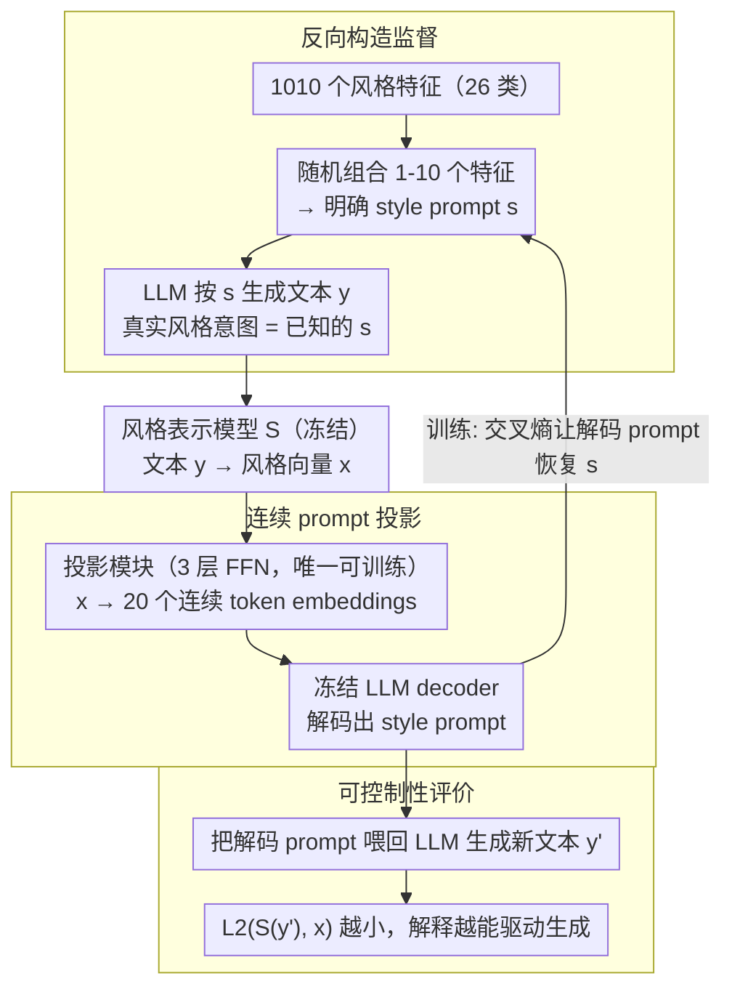

# Interpreting Style Representations via Style-Eliciting Prompts

**会议**: ACL2026  
**arXiv**: [2606.05716](https://arxiv.org/abs/2606.05716)  
**代码**: https://github.com/junghwanjkim/style-decoding  
**领域**: 可解释性 / 风格控制  
**关键词**: 风格表征, 风格提示词, 可解释表示, 文本风格控制, synthetic supervision  

## 一句话总结
这篇论文把难解释的文本风格向量解码成可直接驱动 LLM 写作的 style-eliciting prompts，用“可控制性”作为解释标准，在风格恢复、合成文本风格控制和人类文本风格模仿上都优于直接让 LLM 描述目标文本风格的基线。

## 研究背景与动机
**领域现状**：style representation models 已经能把文本映射到表示写作风格的向量空间，用于 authorship verification、style comparison 和 style transfer 等任务。这些向量通常由对比学习训练，能捕捉词汇、句法、语气、修辞等多层风格信号。

**现有痛点**：风格向量有效但不透明。已有解释方法常让 LLM 直接读一段文本并生成自然语言 style description，但这种描述容易受 LLM 先验和幻觉影响，而且通常只是解释性文本，不一定能拿来稳定复现目标风格。

**核心矛盾**：一个好的风格解释不仅要“说得像”，还应该“用得上”。如果描述无法指导 LLM 生成同样风格的文本，那么它对风格表征的解释价值有限。

**本文目标**：作者希望把 latent style representation 转换成自然语言 style prompt。这个 prompt 一方面让人能读懂风格特征，另一方面可以直接作为控制指令，让 LLM 生成风格相近的新文本。

**切入角度**：论文反过来构造监督数据：先设计明确的风格 prompt，再让 LLM 按这些 prompt 生成文本；因为生成文本的“真实风格意图”已知，就可以训练 decoder 从文本的 style vector 恢复原始 style prompt。

**核心 idea**：用合成的 prompt-text 对监督训练一个 style decoder，把解释问题转化为 prompt recovery，并用生成后的风格距离来检验解释是否真正可操作。

## 方法详解
论文研究的问题是：给定风格表示模型 $S$ 产生的向量 $x$，学习一个 decoder $D$ 输出自然语言 style prompt $s$，使得 LLM 在该 prompt 下生成的新文本 $y$ 的风格向量 $S(y)$ 接近原始 $x$。直接搜索离散 prompt 空间不可行，所以作者构造 synthetic supervision，将目标换成从合成文本的风格向量恢复已知 prompt。

### 整体框架
数据构造分三步。首先，作者用 GPT-4o 生成并人工清洗 1,010 个具体风格特征，覆盖 26 个风格类别，如 sentence structure、tone、formality、descriptive density、abstraction level 等。其次，从 Reddit、StackExchange 和 Yahoo Answers 三个平台采样 300,000 个真实 QA 问题，并保留对应 human answers 用于后续人类风格评估。最后，随机组合 1 到 10 个不同类别的风格特征形成 style prompt，并用 Phi-4、Qwen2.5-14B 和 OLMo-2-13B 生成 stylized responses，得到 1.8M LLM responses 和 434,535 个 unique style prompts。

模型部分由 frozen style representation model、trainable projection module 和 frozen LLM decoder 组成。风格表示模型使用 Mistral-Nemo-Instruct-2407，经 author-labeled data 对比学习训练。projection module 是三层 feedforward network，将 style vector 投影成 20 个连续 token embeddings；这些 embeddings 与自然语言指令一起输入 Ministral-8B-Instruct，生成形如“The author uses ...”的 style prompt。

### 关键设计

**1. 反向构造监督：从 prompt 生成文本，而不是从文本里猜描述**

风格解释最棘手的地方在于没有 ground truth——真实文本背后那套风格意图是隐式的，让 LLM 读完直接描述只会把模型自己的先验和幻觉一起写进去。作者把因果方向反过来：先随机组合 1 到 10 个具体风格特征拼成一条明确的 style prompt $s$，再让 LLM 按它生成文本 $y$。这样 $y$ 的“真实风格意图”就是已知的 $s$，训练时让 decoder $D$ 从 $y$ 的风格向量 $x=S(y)$ 把 $s$ 恢复出来即可，解释问题被转成一个有明确监督信号的 prompt recovery。这一步是整套方法能成立的关键——它把无法验证的“描述”换成了可比对的 prompt 标签。

**2. 连续 prompt 把风格向量接进冻结 LLM**

风格表征是稠密连续向量，而 LLM 只会生成离散文本，二者之间需要一座桥。直接微调 LLM 主体成本高、还容易破坏其语言能力，所以作者只训练一个轻量投影层：三层 feedforward network 把 style vector 映射成 20 个连续 token embeddings，作为 continuous prefix 拼在自然语言指令前面，输入冻结的 Ministral-8B-Instruct，由它生成形如“The author uses ...”的 style prompt。整条链路里只有这个 MLP 投影模块可训练，风格表示模型和 LLM 都冻结，既保住了大模型的生成质量，又用最少的参数完成了从向量空间到文本空间的对接。

**3. 用控制效果而非文本相似度来评价解释**

一段风格描述就算读起来很像，如果拿去指导生成却复现不出目标风格，它对风格表征的解释价值依然有限。作者因此在传统的 prompt recovery 指标（ROUGE-1、LaBSE、LLM-as-judge）之外，额外加了一条“可操作性”检验：把 decoded prompt 喂回 LLM 生成新回答 $y'$，再计算 $S(y')$ 与原始目标 $x$ 在风格表征空间里的 L2 距离，距离越小说明解释越能真正驱动生成。这把“解释”和“控制”绑在同一个指标上，直接逼问一句话——这个 prompt 到底用不用得上。

### 损失函数 / 训练策略
训练目标是 token-level cross-entropy，让 decoder 生成的 $\tilde{s}=D(S(x))$ 匹配 ground-truth style prompt $s$。数据按 8:1:1 划分训练、验证、测试；decoder 训练 5 epochs，learning rate 5e-5，batch size 32，最佳 checkpoint 按 validation loss 选择。所有 Section 6/7 结果使用 180K LLM responses 测试集，Section 8 使用 60K human responses。训练使用 PyTorch-Lightning、HuggingFace Transformers、AdamW 和 WSD learning rate schedule，在 2 张 A100 上约 16 小时。

## 实验关键数据

### 主实验
| 场景 | 方法 | Our Embedding L2↓ | LUAR L2↓ | StyleDistance L2↓ |
|------|------|-------------------|----------|-------------------|
| LLM 生成文本风格控制 | Decoder (Ours) | 26.07 | 6.01 | 6.82 |
| LLM 生成文本风格控制 | LLM Custom | 35.39 | 9.10 | 8.24 |
| LLM 生成文本风格控制 | Wang et al. 2025 | 73.21 | 8.26 | 8.41 |
| LLM 生成文本风格控制 | Jangra et al. 2025 | 100.10 | 8.90 | 9.85 |
| LLM 生成文本风格控制 | Bhandarkar et al. 2024 | 102.89 | 9.02 | 11.87 |
| LLM 生成文本风格控制 | TinyStyler | 49.97 | 11.40 | 10.82 |
| 人类文本风格 steering | Decoder (Ours) | 27.73 | 6.33 | 7.47 |
| 人类文本风格 steering | LLM Custom | 37.54 | 9.39 | 9.79 |
| 人类文本风格 steering | Bhandarkar et al. 2024 | 35.53 | 9.31 | 8.94 |
| 人类文本风格 steering | TinyStyler | 54.69 | 11.77 | 14.38 |

L2 距离越低表示生成文本风格越接近目标。无论用训练中的 style embedding，还是用未参与训练的 LUAR、StyleDistance 表征评估，本文 decoder 都取得最低距离，说明它不是只过拟合某一个表征空间。

### 消融实验
| 组件/数据 | 数值或设置 | 说明 |
|-----------|------------|------|
| 风格特征数 | 1,010 | 覆盖 26 个风格类别 |
| QA 问题数 | 300,000 | 来自 Reddit、StackExchange、Yahoo Answers |
| 合成回答数 | 1.8M | 由 Phi-4、Qwen2.5-14B、OLMo-2-13B 生成 |
| unique prompts | 434,535 | 每个 prompt 组合 1-10 个风格特征 |
| 人类回答数 | 300K | 用于真实人类写作风格 steering 评估 |
| projection 输出 | 20 token embeddings | 将 style vector 接入 frozen LLM |
| decoder LLM | Ministral-8B-Instruct | 主体冻结，只训练投影层 |

### 关键发现
- Prompt recovery 任务中，论文报告本文方法相比 baselines 在 ROUGE-1、LaBSE 和 LLM-as-judge 上分别带来 76.0%、21.7% 和 42.8% 的提升。
- 风格控制任务中，本文相对基线在 LLM-generated references 上带来 12.9% 的 L2 改善，在 human-written references 上带来 26.1% 的 L2 改善。
- LLM-based style description baselines 在 prompt recovery 中甚至低于 random prompt baseline，说明“读文本后描述风格”并不等价于恢复驱动该文本生成的真实风格意图。
- t-SNE 可视化显示，不同 style prompts 形成不同 clusters，语义相近风格也会在表征空间中靠近，支持“style representations 包含可解码风格信息”的前提。

## 亮点与洞察
- 论文把解释性和可控性绑在一起，这是最有启发的地方。style prompt 不只是给人看的标签，而是一个可以直接拿去生成文本的控制接口。
- 合成监督的设计很巧妙：如果从真实文本出发，很难知道真实风格标签；从 prompt 出发生成文本，虽然是 synthetic，但可以获得明确、细粒度、可组合的监督信号。
- 评估使用多个 style representation，包括没参与训练的 LUAR 和 StyleDistance，降低了“只在自家 embedding 上有效”的疑虑。

## 局限与展望
- 作者承认方法主要面向英语。不同语言的风格维度、句法表达和 LLM/风格表征质量都不同，跨语言泛化不能默认成立。
- 数据域限定在在线 QA。模型能否泛化到小说、正式公文、学术写作、新闻报道或法律文本，还需要进一步评估。
- 合成数据依赖 LLM 遵循 prompt 的能力。若 LLM 对某些细微风格特征执行不稳定，decoder 学到的也可能是 LLM 风格偏差，而不是更普遍的人类写作风格。
- 当前 decoder 输出的是 prompt 级解释，还没有证明每个具体词汇或句法现象在 style vector 中如何编码；更细粒度的 attribution 或 disentanglement 仍是未来方向。

## 相关工作与启发
- **vs LLM style description**: 直接提示 LLM 描述目标文本风格容易受内容和模型偏见影响；本文从 style vector 解码，并用 ground-truth style prompts 监督，解释更贴近表征本身。
- **vs style transfer**: style transfer 通常要求保留输入内容并改变风格；本文不要求内容保留，而是解释和复现风格，因此更适合分析 latent style representations。
- **vs prompt discovery**: 一般 prompt discovery 面向让模型生成目标输出或触发行为；本文的 prompt discovery 更细，目标是诱导特定写作风格，而且通过合成监督而不是 RL 搜索完成。

## 评分
- 新颖性: ⭐⭐⭐⭐⭐ 用 style-eliciting prompt 解释风格向量，并用控制效果验证解释，问题设定很漂亮。
- 实验充分度: ⭐⭐⭐⭐☆ 三个任务、多个 baseline、多个 style representation 和人类文本评估都覆盖到了；缺少跨语言和跨文体测试。
- 写作质量: ⭐⭐⭐⭐☆ 动机、数据构造和模型结构讲得清楚，附录数值补充充分；主文图形中的部分数值需要到附录查表。
- 价值: ⭐⭐⭐⭐☆ 对可解释风格建模、个性化写作助手、persona simulation 和可控生成都有直接启发。

<!-- RELATED:START -->

## 相关论文

- [\[ACL 2026\] Style over Story: Measuring LLM Narrative Preferences via Structured Selection](style_over_story_measuring_llm_narrative_preferences_via_structured_selection.md)
- [\[ACL 2026\] Rhetorical Questions in LLM Representations: A Linear Probing Study](rhetorical_questions_in_llm_representations_a_linear_probing_study.md)
- [\[ICML 2026\] Query Circuits: Explaining How Language Models Answer User Prompts](../../ICML2026/interpretability/query_circuits_explaining_how_language_models_answer_user_prompts.md)
- [\[ACL 2026\] AdaptiveK: Complexity-Driven Sparse Autoencoders for Interpretable Language Model Representations](adaptivek_complexity-driven_sparse_autoencoders_for_interpretable_language_model.md)
- [\[ACL 2026\] Crosscoding Through Time: Tracking Emergence & Consolidation Of Linguistic Representations Throughout LLM Pretraining](crosscoding_through_time_tracking_emergence_consolidation_of_linguistic_represen.md)

<!-- RELATED:END -->
