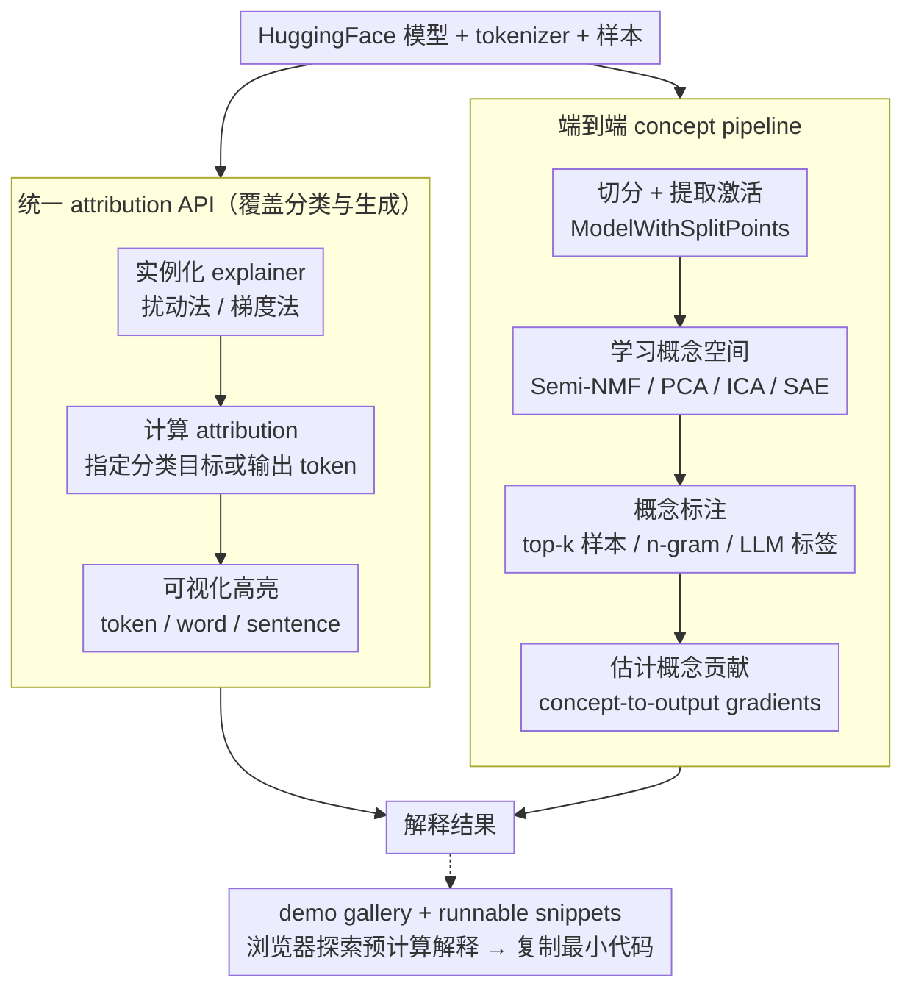

# Interpreto: An Explainability Library for Transformers

**会议**: ACL2026  
**arXiv**: [2512.09730](https://arxiv.org/abs/2512.09730)  
**代码**: https://github.com/FOR-sight-ai/interpreto  
**领域**: 可解释性 / 工具库  
**关键词**: Transformer 可解释性, attribution, concept-based explanation, HuggingFace, 机制解释  

## 一句话总结
Interpreto 是一个面向 HuggingFace 语言模型的开源 Python 可解释性库，把 token/word/sentence attribution 与 activation-level concept explanations 统一到一个 API 中，并提供 demo、教程、指标和端到端概念解释流水线。

## 研究背景与动机
**领域现状**：Transformer 语言模型广泛用于分类和生成，实际部署中需要解释工具来做调试、偏见分析、安全审计和文档化。现有工具大致分为 attribution 库和 mechanistic/concept interpretability 库。

**现有痛点**：很多库只覆盖一种解释家族、一个任务类型或一个 pipeline 阶段。比如有些库擅长 token attribution，但不支持生成模型；有些库能训练 SAE 或概念模型，却不提供从激活提取、概念学习、概念解释到贡献评分的完整流程。对普通 HuggingFace 用户来说，把这些工具拼起来成本高。

**核心矛盾**：可解释性研究方法越来越多，但实践者需要的是可安装、可复现、可比较、能跑完整 workflow 的工程工具。工具碎片化会阻碍方法落地，也让不同解释结果之间难以基准比较。

**本文目标**：作者希望提供一个统一库，让用户能用同一套接口解释分类和生成模型，并在 attribution 和 concept-based explanations 之间切换；同时提供可视化、指标、tutorials、demo gallery 和可扩展的自定义方法接口。

**切入角度**：Interpreto 直接围绕 HuggingFace 生态设计。attributions 模块提供常用扰动与梯度方法，concepts 模块包装 nnsight 做 model splitting，并串联 activation extraction、concept learning、interpretation 和 concept importance estimation。

**核心 idea**：把“解释方法集合”组织成可运行的工程 pipeline，而不是只实现孤立算法；尤其把 unsupervised concept discovery 的多个阶段装进一个库里。

## 方法详解
Interpreto 的系统由两个主模块组成：`interpreto.attributions` 和 `interpreto.concepts`。前者解释输入特征对预测的贡献，后者从模型中间激活中学习更高层概念，并分析这些概念如何影响输出。库覆盖 classification 和 generation 两类语言任务，提供 notebook visualization、demo website、metrics 和 minimal runnable snippets。

### 整体框架
attribution pipeline 通常有三步：实例化 explainer，输入 HuggingFace model/tokenizer 和待解释样本；计算 attribution，可指定分类目标或生成输出 token；最后可视化高亮 token、word 或 sentence。分类示例中，LIME 解释 BERT emotion classifier，显示 “thrilled” 驱动 joy 类；生成示例中，Occlusion 解释 Qwen3-0.6B 的某个输出 token，并展示输入-output attribution matrix 的切片。

concept pipeline 有四步。第一步用 `ModelWithSplitPoints` 包装 HuggingFace 模型，指定 split points，并在数据集上提取激活。第二步用 Semi-NMF、PCA、ICA、SAE 等方法学习 concept space。第三步用 top-k activating examples、tokens/ngrams 或 LLM labels 为概念赋予人类可读标签。第四步通过 concept-to-output gradients 或 concept×gradients 估计概念对预测的贡献。

### 关键设计

**1. 统一 attribution API 同时覆盖分类与生成**

NLP attribution 的可读性高度依赖粒度和任务目标，可现有库往往只服务一种任务——擅长 token attribution 的不支持生成模型，反之亦然，用户被迫在多个库之间反复切换。Interpreto 用同一类 explainer 同时解释 SequenceClassification 和 CausalLM：扰动方法收齐了 KernelSHAP、LIME、Occlusion、Sobol，梯度方法收齐了 GradientSHAP、Integrated Gradients、Saliency、SmoothGrad、SquareGrad、VarGrad，并允许在 logits/softmax/log-softmax 三种输出空间和 token/word/sentence 三种 granularity 之间自由组合。分类场景里 LIME 能指出 “thrilled” 驱动 BERT 把句子判成 joy，生成场景里 Occlusion 能解释 Qwen3-0.6B 某个输出 token 受哪些输入影响——同一套接口、不同任务，用户不必重学。

**2. 端到端的 concept-based pipeline 把四个分散环节串成一条流水线**

概念解释最大的工程痛点不是单个算法难，而是它被拆散在好几个研究工具里：模型切分、激活收集、概念学习、标签解释、重要性打分各用各的代码，普通用户很难拼完整。Interpreto 把这四步装进一个可执行 workflow：第一步用 `ModelWithSplitPoints` 包装 HuggingFace 模型、指定 split points 并在数据集上提取激活；第二步用 Semi-NMF、PCA、ICA、SAE 等方法（底层依赖 overcomplete）学习 concept space，支持 neurons-as-concepts、dictionary learning 和 sparse autoencoders；第三步用 top-k activating examples、tokens/ngrams 或 LLM labels 给概念赋人类可读标签；第四步通过 concept-to-output gradients 或 concept×gradients 估计每个概念对预测的贡献。split、learn、interpret、score 一气呵成，这正是库的核心价值所在。

**3. demo gallery 加 runnable snippets，把研究门槛降到“先看再抄”**

解释工具的门槛从来不只是 API，还有“结果怎么看懂、怎么复现”。Interpreto 的 demo website 覆盖 3 个分类器和 3 个生成模型，用户可以先在网页上挑 task、model、dataset、explanation family、method subset 和具体实例，直接浏览预计算好的解释；看明白了再把对应的最小可运行代码片段复制到本地改造。这个“先在浏览器里探索、再落地到代码”的路径，把试用一个解释方法的成本压到了很低。

### 损失函数 / 训练策略
这是一篇系统/工具论文，没有提出新的训练损失。库本身依赖已有解释方法的计算过程。attribution 方法内部可分为 perturbations、inference/gradients、aggregation 三个阶段，用户新增方法时主要实现对应组件。concept 方法则按 activation extraction、concept model fitting、interpretation、importance scoring 执行。运行环境支持 Python 3.10 到 3.13，torch >= 2.0，transformers >= 4.22，nnsight >= 0.5.1。

## 实验关键数据

### 主实验
| 能力 | Interpreto | Captum | Ferret | Inseq | SHAP |
|------|------------|--------|--------|-------|------|
| Sequence classification | ✓ | ✓ | ✓ | ✗ | ✓ |
| Text generation | ✓ | ✓ | ✗ | ✓ | ✓ |
| Faithfulness metrics | ✓ | ✓ | ✓ | ✗ | ✗ |
| Simple visualization | ✓ | ✗ | ✗ | ✗ | ✓ |
| Granularity control | ✓ | ✗ | ✗ | ✗ | ✗ |

在 attribution library 对比中，Interpreto 是表中唯一同时支持分类、生成、faithfulness metrics、简单可视化和粒度控制的库。

### 消融实验
| 维度 | Interpreto 支持情况 | 具体内容 |
|------|--------------------|----------|
| Attribution methods | 10 种 | 4 个 perturbation-based，6 个 gradient-based |
| Attribution metrics | 2 种 | Insertion、Deletion |
| Concept-learning options | 15 种 | neurons、KMeans/PCA/SVD/ICA/NMF/Semi-NMF/Convex NMF、多种 SAE |
| Concept interpretation | 3 类 | top-k tokens、top-k activating examples/words/n-grams、LLM labels |
| Concept metrics | 7 种 | 包括 MSE、FID、sparsity、stability、ConSim 等 |
| Tested architectures | 15+ | Albert、BART、BERT、DistilBERT、Electra、Roberta、T5、GPT2、GPT-Neo、GPT-J、CodeGen、Falcon、Llama3、Mistral、Starcoder、Qwen3 |

### 关键发现
- concept-based library 对比中，Interpreto 同时覆盖 model splitting、concept learning、interpretation、contributions、metrics、pip package 和 documentation；很多现有库只覆盖其中一两个阶段。
- demo gallery 覆盖 6 个模型：DistilBERT/IMDB、BERT/emotion、RoBERTa/AG-News 三个分类器，以及 GPT-2、Qwen3-0.6B、Llama 3.1 8B 三个生成模型。
- 运行成本方面，attribution 通常需要 10-100 次 forward passes 或 5-20 次 gradient computations，量级为秒；concept pipeline 的小实验在 RTX 3080 上是分钟级，较大的 SAE 可能需要小时级。
- generation concepts 示例用 Qwen3-0.6B 在 100 条 AG-News 样本上提取激活、训练 Semi-NMF 概念并用 GPT-4.1-nano 标注概念，RTX 3080 10GB 下可在 3 分钟内运行。

## 亮点与洞察
- 工具贡献的重点不在“发明一个新解释算法”，而在把分散算法变成同一套可执行接口。对解释性研究来说，这类工程整合能显著降低复现和比较成本。
- Interpreto 对 generation attribution 的处理很实用：每个输出 token 都是一个预测目标，直接展示完整矩阵很难读；让用户选择 output token 再看输入贡献，更符合分析工作流。
- concept pipeline 的端到端封装尤其有价值。很多实践者想用 SAE/NMF 等方法看概念，却卡在模型切分、激活收集、标签解释和重要性计算之间；Interpreto 把这些步骤连起来。

## 局限与展望
- 作者强调不存在“单一万能解释方法”。用户仍需比较多种方法，并用 counterfactual checks、ablations 和 targeted slices 验证解释是否可靠。
- attribution 分数的含义依赖方法。同样的高亮结果在 LIME、Integrated Gradients、Occlusion 中可能代表不同机制，不能简单当成因果解释。
- LLM-based concept labels 对 prompt 很敏感，可能过泛、重复、过细或不可操作；一个无法解释的 concept 可能来自模型本身、概念空间学习失败或标签器失败，目前很难定位原因。
- 库目前聚焦 HuggingFace 文本语言模型，不覆盖 circuit-level MI、data attribution 和 feature visualization；作者计划近期开 supervised concepts、更多 attribution methods/metrics，并长期扩展到 ViT 与多模态 transformer。

## 相关工作与启发
- **vs Captum / SHAP / Ferret / Inseq**: 这些库各有强项，但通常在任务覆盖、指标、可视化或粒度控制上不完整；Interpreto 的优势是把分类和生成的 attribution 统一起来。
- **vs TransformerLens / NNsight / SAELens / Neuronpedia**: 这些工具更偏研究阶段或某个 pipeline 环节；Interpreto 借助它们的思想或底层能力，面向更完整的 HuggingFace 工作流。
- **vs 单独 demo notebook**: Interpreto 把 demo website、文档、tutorial 和 pip 包一起发布，更适合作为实践者调试和教学的入口。

## 评分
- 新颖性: ⭐⭐⭐☆☆ 算法新意有限，但系统整合和 concept pipeline 封装有明确贡献。
- 实验充分度: ⭐⭐⭐⭐☆ 作为 demo/system paper，功能覆盖、库对比、demo、运行成本和测试架构说明较完整；缺少用户研究或大规模使用统计。
- 写作质量: ⭐⭐⭐⭐☆ 结构清晰，表格对比直接，代码示例具体；部分 LaTeX label 在 cache 文本中丢失，但不影响主旨。
- 价值: ⭐⭐⭐⭐☆ 对 HuggingFace 生态中的可解释性调试很实用，尤其适合把 attribution 和 concept explanations 放在同一项目里比较。

<!-- RELATED:START -->

## 相关论文

- [\[ICLR 2026\] Bridging Explainability and Embeddings: BEE Aware of Spuriousness](../../ICLR2026/interpretability/bridging_explainability_and_embeddings_bee_aware_of_spuriousness.md)
- [\[ICML 2026\] Cognitive Fatigue in Autoregressive Transformers: Formalization and Measurement](../../ICML2026/interpretability/cognitive_fatigue_in_autoregressive_transformers_formalization_and_measurement.md)
- [\[CVPR 2026\] Inside-Out: Measuring Generalization in Vision Transformers Through Inner Workings](../../CVPR2026/interpretability/inside-out_measuring_generalization_in_vision_transformers_through_inner_working.md)
- [\[ACL 2025\] Normalized AOPC: Fixing Misleading Faithfulness Metrics for Feature Attribution Explainability](../../ACL2025/interpretability/normalized_aopc_faithfulness_metrics.md)
- [\[NeurIPS 2025\] nnterp: A Standardized Interface for Mechanistic Interpretability of Transformers](../../NeurIPS2025/interpretability/nnterp_a_standardized_interface_for_mechanistic_interpretability_of_transformers.md)

<!-- RELATED:END -->
