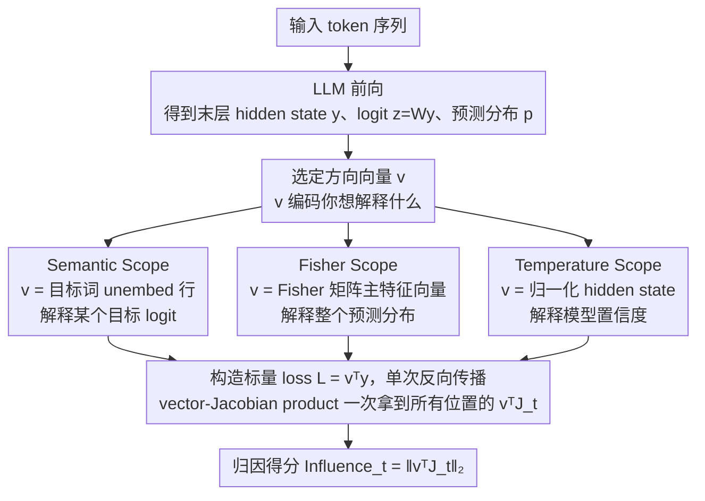

# Jacobian Scopes: Token-Level Causal Attributions in LLMs

**会议**: ACL 2026  
**arXiv**: [2601.16407](https://arxiv.org/abs/2601.16407)  
**代码**: https://huggingface.co/spaces/Typony/JacobianScopes (在线 demo)  
**领域**: 可解释性 / 因果归因 / LLM 内部机制  
**关键词**: Jacobian、vector-Jacobian product、Fisher 信息、有效温度、token 归因

## 一句话总结
作者提出 Jacobian Scopes——一套用"输入 token 嵌入到末层 hidden state 的 Jacobian 在某个 vector 上的投影"作为 token 归因强度的统一框架，配套三种 scope（Semantic / Fisher / Temperature）分别解释"某个目标 logit / 整个预测分布 / 模型置信度"如何被各输入 token 驱动，只需 1 次反向传播，AOPC 指标上与 Input×Gradient 持平、显著优于 Integrated Gradients。

## 研究背景与动机
**领域现状**：LLM 可解释性主流路径是注意力可视化、激活补丁（activation patching）、circuit tracing 或稀疏自编码器（SAE / Gemma Scope）；梯度类归因则有 Integrated Gradients、Input × Gradient、SmoothGrad 等。这些方法各有各的目标函数与几何假设，缺一个统一框架来回答"我到底想解释什么"。

**现有痛点**：（1）梯度归因方法把"某个 logit 怎么来的"和"整个预测分布怎么来的"混为一谈，对翻译这类预测非唯一的任务解释力不强；（2）IG 类方法要做多步积分（K 次前向 + 反向），成本高；（3）注意力可视化只解释结构信息，与最终预测的因果链条隔得太远；（4）几乎没有一种主流归因能解释"模型置信度（temperature）"这个对 ICL 时间序列预测尤其关键的维度。

**核心矛盾**：归因方法需要一个**显式的解释对象（explanandum）**——是 logit、是分布形状还是分布宽度？不同对象对应不同的几何方向 $\bm{v}$，但现有工作要么写死成 logit（IG），要么用启发式（注意力），缺乏一个"指定方向就能算归因"的统一原语。

**本文目标**：构造一个数学上清晰、计算上单次反向、几何上可解释的归因原语，并在该原语下给出三种典型的解释对象（语义 / 分布 / 置信度），使每种都对应一个易算的方向向量 $\bm{v}$。

**切入角度**：观察到所有"输入 token $\bm{x}_t$ 如何影响某种输出性质"的问题都可写成 $\|\bm{v}^\intercal \bm{J}_t\|_2$，其中 $\bm{J}_t := \partial \bm{y} / \partial \bm{x}_t$ 是输入到末层 hidden 的 Jacobian，$\bm{v}$ 是你想问的"方向"。这把整族归因问题压缩到"挑一个 $\bm{v}$"的设计选择上。

**核心 idea**：用 vector-Jacobian product (VJP) $\bm{v}^\intercal \bm{J}_t$ 作为统一的 token 归因原语；通过 $\bm{v}$ 的不同选择（unembed 行 / Fisher 主特征向量 / 归一化 hidden state）派生出 Semantic / Fisher / Temperature 三种 Scope，覆盖 logit、全分布、置信度三种解释对象，且每种都只需 1 次反向传播。

## 方法详解

### 整体框架
把 LLM 看成一个函数 $f:\bm{X}_{1:T}\mapsto\bm{y}\in\mathbb{R}^{d_{\text{model}}}$，输出末层 post-LN 的 hidden state $\bm{y}$，再经 $\bm{z}=\bm{W}\bm{y}$、$\bm{p}=\mathrm{softmax}(\bm{z})$ 得到 logit 与预测分布。对每个输入位置 $t$ 可定义输入到输出的 Jacobian $\bm{J}_t=\partial\bm{y}/\partial\bm{x}_t\in\mathbb{R}^{d_{\text{model}}\times d_{\text{model}}}$，但直接算它要 $d_{\text{model}}$ 次反向传播。本文的核心观察是：任何"输入 token 如何影响某种输出性质"的问题都能写成 $\|\bm{v}^\intercal\bm{J}_t\|_2$ 这一个形式，其中方向向量 $\bm{v}$ 就编码了"你想解释什么"。于是只要构造标量 loss $\mathcal{L}=\bm{v}^\intercal\bm{y}$ 做一次反向，就能用 vector-Jacobian product 一次性拿到所有位置的 $\bm{v}^\intercal\bm{J}_t$，统一归因得分 $\mathrm{Influence}_t:=\|\bm{v}^\intercal\bm{J}_t\|_2$ 的几何含义是"$\bm{x}_t$ 上一个 $\varepsilon$-范数扰动能在 $\bm{v}$ 方向上引起的最大位移"。整套流水线只需更换 $\bm{v}$，就分别派生出针对 logit、整个分布、置信度三种解释对象的 Semantic / Fisher / Temperature 三个 Scope。

### 关键设计

**1. Semantic Scope：用 unembed 行解释某个目标 token 的 logit**

当你心里有一个明确的目标词、想知道"为什么模型预测了 'truthful' 而不是别的"时，自然的解释对象就是该词的 logit。本文取 $\bm{v}=\bm{w}_{\text{target}}$（unembed 矩阵中目标 token 对应的那一行），此时标量 loss $\mathcal{L}_{\text{semantic}}=\bm{w}_{\text{target}}^\intercal\bm{y}=z_{\text{target}}$ 恰好就是目标 token 的 logit，归因得分为 $\mathrm{Influence}_t^{\text{Sem}}=\|\bm{w}_{\text{target}}^\intercal\bm{J}_t\|_2$。Input × Gradient、IG 其实都隐式在做这件事，Semantic Scope 的价值是把它显式写成 VJP 的特例、点明"目标方向就是 unembed 行"，因而最适合"目标词唯一"的解释场景，例如挖掘 LLaMA 对 "deceive" → "truthful" 的语义反转链条，或揭示 "Columbia → liberal"、"the South → conservative" 这类隐式政治偏见。

**2. Fisher Scope：用信息几何主方向解释整个预测分布**

翻译这类任务里预测并不唯一——多个同义词都对，此时盯某一个 logit 会丢失"分布偏向哪一族 token"的语义簇信息。Fisher Scope 改用信息几何中的 Fisher Information Matrix $\bm{F}=\bm{W}^\intercal(\mathrm{diag}(\bm{p})-\bm{p}\bm{p}^\intercal)\bm{W}$，它正是 KL 散度在该点的局部度规；对其做特征分解 $\bm{F}=\bm{U}\bm{\Lambda}\bm{U}^\intercal$，取最大特征值对应的主 Fisher 方向 $\bm{u}_1$ 作为 $\bm{v}$，归因得分为 $\mathrm{Influence}_t^{\text{Fisher}}=\|\bm{u}_1^\intercal\bm{J}_t\|_2$，理论上可证这是 $\bm{p}$ 与 $\bm{x}_t$ 之间总互信息的 rank-1 近似。这样它就能自动找出"分布最敏感"的输出空间方向，实验中清楚地展示出 LLaMA 在 IWSLT 上做的是"词级对齐 + 短语级跨 token 推理"。

**3. Temperature Scope：用 hidden state 方向解释模型置信度**

ICL 数值预测（如时间序列）的核心问题是"模型有多确定"，即预测分布那个近似 Gaussian 峰的宽度由谁控制，这是以前任何归因方法都没正面解释过的维度。Temperature Scope 把 hidden state 分解为模与方向 $\bm{y}=\|\bm{y}\|_2\,\hat{\bm{y}}$，于是 $\bm{z}=\beta_{\text{eff}}\hat{\bm{z}}$，其中 $\beta_{\text{eff}}=\|\bm{y}\|_2$ 是有效逆温度；作者在附录证明，当 softmax 输出近似 Gaussian 时 $\beta_{\text{eff}}^{-1}$ 与方差成正比。取 $\bm{v}=\hat{\bm{y}}$ 即得归因得分 $\mathrm{Influence}_t^{\text{Temp}}=\|\hat{\bm{y}}^\intercal\bm{J}_t\|_2$。它一举回答了"模型从历史里抄哪一段来决定下一步不确定性"，并直接验证了 context parroting 猜想——LLaMA 在 Lorenz 这类有周期 motif 的混沌系统上倾向于在延迟嵌入空间做最近邻搜索复制历史片段，而在 Brownian 这类无重复 motif 的系统上则只看 context 末尾几个 token。

### 损失函数 / 训练策略
本文是纯训练后分析方法，不涉及模型训练，只需选定 $\bm{v}$ 后做一次反向传播。三种 Scope 对应的标量 loss 如下：

| Scope | $\bm{v}$ | Loss $\mathcal{L}$ |
|-------|---------|-------------------|
| Semantic | $\bm{w}_{\text{target}}$ | $z_{\text{target}}$ |
| Fisher | $\bm{u}_1$（FIM 主特征向量） | $\bm{u}_1^\intercal \bm{y}$ |
| Temperature | $\hat{\bm{y}}$ | $\beta_{\text{eff}} = \|\bm{y}\|_2$ |

实现细节：参数梯度全部 disable，单次反向只在 input embeddings 上累积，因此一次归因的耗时仅相当于一次反向传播（Fig.3 例子在 RTX A4000 上 0.027s，前向 0.069s）。

## 实验关键数据

### 主实验：AOPC 归因质量对比（LLaMA-3.2 3B）
AOPC（Area Over Perturbation Curve）：把 top-k% 最高归因的 token 置零后，目标 token log-prob 的下降幅度（更负 = 归因更准）。

| Method | LAMBADA | IWSLT2017 DE→EN |
|--------|---------|-----------------|
| Random | $-0.23 \pm 0.01$ | $-0.19 \pm 0.01$ |
| Integrated Gradients | $-0.67 \pm 0.01$ | $-0.58 \pm 0.01$ |
| Input × Gradient | $-1.12 \pm 0.01$ | $-0.77 \pm 0.01$ |
| **Semantic Scope (本文)** | $-1.16 \pm 0.01$ | $-0.78 \pm 0.01$ |
| **Temperature Scope (本文)** | $\bm{-1.17 \pm 0.01}$ | $-0.76 \pm 0.01$ |
| **Fisher Scope (本文)** | $\bm{-1.17 \pm 0.01}$ | $\bm{-0.80 \pm 0.01}$ |

### 消融实验：跨模型规模 + Scope 之间相对优势

| 评估场景 | Semantic | Fisher | Temperature | 关键说明 |
|---------|----------|--------|------------|---------|
| 语义/偏见可视化 | ✅ 最佳 | – | – | 目标词明确，Semantic 直接给精准 token |
| 翻译（非唯一预测） | 模糊 | ✅ 最佳 | – | Fisher 抓到词级 + 短语级跨源对齐 |
| 时间序列 ICL（Lorenz） | – | – | ✅ 最佳 | Temperature 揭示"history-match" 注意模式 |
| 时间序列 ICL（Brownian） | – | – | ✅ 最佳 | Temperature 揭示"忘掉早期 context"行为 |
| LLaMA-3.2 1B / 3B / Qwen2.5 1.5B / 7B | 均超 IG | 均超 IG | 均超 IG | 跨模型规模/系列稳健 |

### 关键发现
- **三 Scope 互补，不可互相替代**：在 ICL 数值预测 task 上 Semantic / Fisher Scope 给的归因模糊，只有 Temperature Scope 准确指出"模型在抄哪一段"（A.5 详述）。
- **VJP 单次反向就够**：归因开销与一次反向同量级，比 IG 的 K 步积分快 K 倍以上，且 AOPC 还更好。
- **first-order sensitivity ≈ counterfactual relevance**：AOPC 是"把 token 置零看 prob 下降"的真实干预指标，而 Jacobian 是局部线性化的一阶量；二者吻合，说明 LLM 在 token 级粒度上的线性近似已足够刻画因果重要性。
- **Temperature Scope 验证 context parroting 猜想**：LLaMA 在 Lorenz 这类有重复 motif 的混沌系统上确实在 delayed-embedding 空间做"最近邻拷贝"，直接为 Zhang & Gilpin (2025) 的"context parroting"假说提供归因证据。
- **attention sink 干扰**：Brownian 实验中早期 token 的高归因部分来自 attention sink 现象，作者在 A.7 详细讨论了这个 caveat。

## 亮点与洞察
- **VJP-as-attribution-primitive**：把"挑一个方向 $\bm{v}$"作为归因方法的根本设计选择，是一套优雅的、可继续扩展的统一框架——未来任何新的解释对象（如某个 SAE feature、某条 circuit）都只要写出对应的 $\bm{v}$ 就能立刻得到归因，无需重造方法。
- **Fisher Scope 的信息几何视角**：用 FIM 的主特征方向回答"哪个输入最改变分布"，是首个把分布几何与 token 归因显式连起来的工作，可直接迁移到 RLHF reward 模型解释、bias 分析等场景。
- **Temperature Scope 解释 ICL 机制**：第一次给出"模型置信度的输入归因"，并把"为什么 LLM 能/不能 in-context 学动力系统"翻译成"模型在 context 里抄哪一段"，把 ICL 解释问题从"模式发现"推进到"机制因果"。
- **极简实现 + 可交互 demo**：单次反向 + HuggingFace Spaces 在线 demo，普通研究者可立即用在自己的 prompt 上做可视化，可复用性极强。

## 局限与展望
- **一阶线性**：Jacobian 只能捕捉输入嵌入附近的一阶因果关系，对于跨多层的非线性因果链（activation patching / circuit tracing 能抓的那种）没有解释力。
- **架构盲**：方法只看输入输出关系，不进 transformer 内部，因此无法说明"哪一层、哪个 attention head 起了作用"，对 mechanistic interpretability 社区的需求只回答了一半。
- **依赖反向传播**：相比纯前向方法（如 SAE feature 激活、注意力可视化）需要额外的 backward，但作者实测开销 $\approx$ 1 次反向，可接受。
- **attention sink 等架构 artifact 会污染归因**：Brownian 实验中早期 token 的虚高分数即一例，使用时需结合架构知识做校正。
- **未来方向**：Jacobian 与 FIM 的高阶谱结构（不只用 $\bm{u}_1$ 而是用前 $k$ 个特征方向）可派生出更多 Scope；可与 SAE feature 结合得到"feature-level Scope"；可扩展到多 token 联合归因。

## 相关工作与启发
- **vs. Integrated Gradients (Sundararajan 2017)**：IG 沿插值路径积分以满足 axiom，但要 K 步前向 + 反向；Jacobian Scope 只做局部一阶但单次反向，AOPC 反而更好，说明"满足公理 ≠ 实证更准"。
- **vs. Input × Gradient (Shrikumar 2017)**：本文可视为其严格泛化——I×G 等价于"$\bm{v}$ 取输入方向"的特例，本文允许任意 $\bm{v}$ 选择因而解释力更广。
- **vs. activation patching / circuit tracing (Heimersheim 2024; Ameisen 2025)**：那些是显式干预法、揭示 circuit；本文是观察法、解释 token-级因果，互补而非替代。
- **vs. SAE / Gemma Scope (Lieberum 2024)**：SAE 解释"feature 是什么"，本文解释"哪些 token 激活了这种 feature"，可以与 SAE 组合使用。
- **vs. context parroting (Zhang & Gilpin 2025)**：本文 Temperature Scope 为他们的猜想提供了第一份直接的归因证据。

## 评分
- 新颖性: ⭐⭐⭐⭐ VJP 作为统一归因原语 + Fisher / Temperature 两个新 Scope，是漂亮的几何重构；但梯度归因方法的基本思想并非全新。
- 实验充分度: ⭐⭐⭐⭐ AOPC 跨 LAMBADA / IWSLT、4 个模型规模 + 3 种 task 案例研究，覆盖广；但缺少更大规模（70B+）模型的验证。
- 写作质量: ⭐⭐⭐⭐⭐ 公式 + 几何解释 + 案例图全部一气呵成，附录补足理论证明，是少数能让人"看完就会用"的可解释性论文。
- 价值: ⭐⭐⭐⭐ 提供了即插即用工具 + 在线 demo + 统一框架，对 LLM 可解释性社区有长期参考意义，特别是 Temperature Scope 对 ICL 机制研究开了新口子。

<!-- RELATED:START -->

## 相关论文

- [\[ACL 2026\] METER: Evaluating Multi-Level Contextual Causal Reasoning in Large Language Models](meter_evaluating_multi-level_contextual_causal_reasoning_in_large_language_model.md)
- [\[NeurIPS 2025\] Learning to Focus: Causal Attention Distillation via Gradient-Guided Token Pruning](../../NeurIPS2025/interpretability/learning_to_focus_causal_attention_distillation_via_gradient-guided_token_prunin.md)
- [\[ICML 2026\] Towards Long-Horizon Interpretability: Efficient and Faithful Multi-Token Attribution for Reasoning LLMs](../../ICML2026/interpretability/towards_long-horizon_interpretability_efficient_and_faithful_multi-token_attribu.md)
- [\[ACL 2026\] Flattery in Motion: Benchmarking and Analyzing Sycophancy in Video-LLMs](flattery_in_motion_benchmarking_and_analyzing_sycophancy_in_video-llms.md)
- [\[ICML 2025\] Towards Attributions of Input Variables in a Coalition](../../ICML2025/interpretability/towards_attributions_of_input_variables_in_a_coalition.md)

<!-- RELATED:END -->
