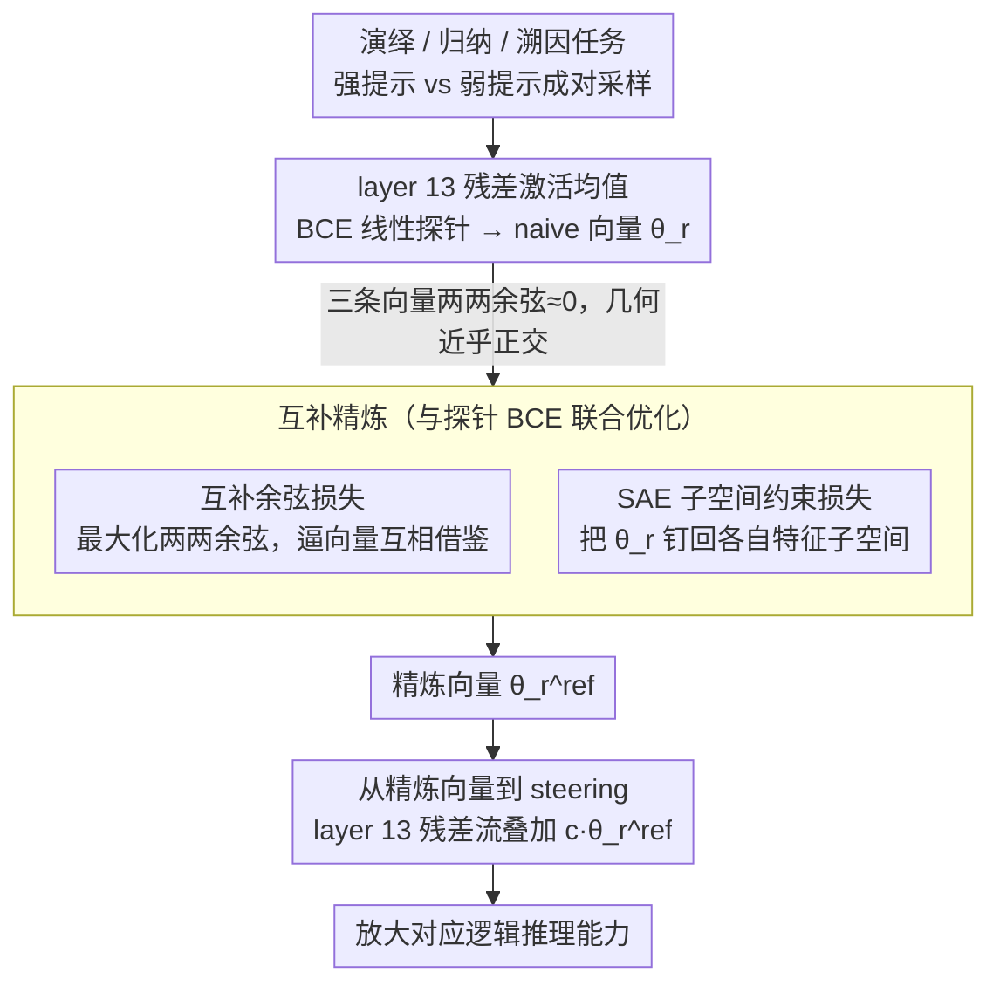

# Knowledge Vector of Logical Reasoning in Large Language Models

**会议**: ACL 2026  
**arXiv**: [2604.23877](https://arxiv.org/abs/2604.23877)  
**代码**: https://github.com/lei-nlp-lab/knowledge_vector_acl_2026  
**领域**: 可解释性 / 逻辑推理 / 激活引导  
**关键词**: 知识向量、逻辑推理、稀疏自编码器、互补子空间、激活引导

## 一句话总结
作者证明 LLM 内部的演绎、归纳、溯因三类逻辑推理能力可以被线性表示为三条几乎正交的"知识向量"，并提出一个基于 SAE 子空间约束的互补精炼框架，让这三条向量在保留各自独特特征的同时互相借鉴，从而在 steering 设置下稳定提升三类推理性能。

## 研究背景与动机

**领域现状**：知识向量 / activation steering 已被证明能在 LLM 中线性表示真实性、指令跟随等高层概念，并通过在残差流上叠加这条向量来调控模型行为。但已有工作几乎只针对单一具体行为（如 truthfulness、backtracking），还没人系统研究"通用逻辑推理能力"能不能被线性表示。

**现有痛点**：经典逻辑学把推理分为演绎 / 归纳 / 溯因三类，但 LLM 在内部到底用什么方式表征它们、彼此之间是独立还是协作，完全是黑箱。如果不能精确定位、就谈不上可控干预，也无法解释 chain-of-thought 究竟在做哪种推理。

**核心矛盾**：作者先用对比探针把每种推理类型抽出一条 naive 向量，发现这三条向量两两余弦相似度近乎 0——也就是说 LLM 把三类推理放在几乎正交的子空间里。但这违背了认知科学的事实：人脑中三类推理共享底层认知操作，归纳给出的新前提会立刻被演绎使用。所以"几何独立"很可能是 LLM 表征不够好的副产物，而不是最优表征。

**本文目标**：(1) 验证三类逻辑推理是否都满足线性表示假设；(2) 设计一个机制，让三条向量"该共享的共享，该独立的独立"，并通过 steering 性能验证这是更好的表征；(3) 借助 SAE 与 activation patching 对修正前后的内部回路做机制可解释性分析。

**切入角度**：稀疏自编码器（SAE）能把 LLM 残差流分解成稀疏可解释特征。对每类推理筛出最具区分度的 SAE 特征，再对它们的 decoder 方向做 QR 正交化，就得到一组保留该推理"指纹"的子空间基。把"互补吸引"和"留在子空间内"两个目标联合优化，就能让推理向量既互相借鉴又不互相覆盖。

**核心 idea**：用余弦互补损失把三条推理向量"拉近"，再用 SAE 子空间投影损失"拽回"各自特征结构，做出兼具共享性与独特性的互补推理向量。

## 方法详解

### 整体框架
方法分两阶段。第一阶段抽取 naive 知识向量：对演绎 / 归纳 / 溯因三类任务，用"强提示 vs 弱提示"成对采样、只保留"强提示推对、弱提示推错"的样本，把每条样本生成阶段 token 的残差激活在层 $l$ 上做平均，得到正激活 $\bar a^+$ 与负激活 $\bar a^-$，再在这些激活上训练 BCE 线性探针 $p_r=\sigma(\theta_r^\top x+b_r)$，把探针权重 $\theta_r$ 当作该推理类型的"知识向量"（Llama-3.1-8B-it 与 Gemma-2-9B-it 都取 layer 13）。第二阶段做互补精炼：在三条 $\theta_r$ 之上叠加互补余弦损失与 SAE 子空间约束损失，连同探针 BCE 一起联合优化，得到精炼向量 $\theta_r^{\text{ref}}$；推理时把它加到 layer 13 的生成 token 上做 steering，即可放大对应推理能力。核心张力是——naive 向量两两近乎正交，而精炼的目标是让它们"该共享的共享、该独立的独立"。

### 关键设计

**1. 互补余弦损失：把三条向量在方向上拉近，逼它们互相借鉴**

作者用对比探针抽出的三条 naive 向量两两余弦相似度近乎 0，等价于 LLM 把三类推理放进几乎正交的子空间、互不通气；但认知科学和作者自己的观察都表明，一种推理的中间产物（如归纳给出的新前提）常会被另一种推理（演绎）立刻使用，所以"几何独立"更像表征不够好的副产物。为此对所有不同类型 $r\neq s$ 最小化两两余弦相似度之和的相反数：

$$\mathcal{L}_{\text{com}}=-\sum_{r\neq s}\frac{\theta_r^\top\theta_s}{\|\theta_r\|\,\|\theta_s\|},$$

即直接把它们往一起拉。但单用这一项会让三条向量塌缩到同一个方向、丢掉各自特异性，因此它必须和下面的子空间约束配对使用。

**2. SAE 子空间约束损失：把每条向量"钉"在自身特异的特征子空间里**

为了在共享的同时不丢身份，作者先把残差激活送进预训练 SAE（Llama Scope / Gemma Scope）得到稀疏码 $z$，对每个隐元 $j$ 计算正/负样本上的均方激活比 $\rho_r(j)=\mu_r^+(j)/(\mu_r^-(j)+\varepsilon)$，取 $\alpha=0.9$ 分位以上、再按激活强度取 Top-$K{=}3000$ 得到该推理的特征集合 $\mathcal{F}_r$；把这些特征对应的 SAE decoder 方向堆成 $V_r$ 并做 QR 正交化得到正交基 $U_r$，然后惩罚 $\theta_r$ 落在子空间之外的分量：

$$\mathcal{L}_{\text{sub}}^{(r)}=\|(I-U_rU_r^\top)\theta_r\|_2^2.$$

这个 SAE 子空间相当于"该推理类型必须保留的指纹"：只要 $\theta_r$ 留在子空间内，它就可以在子空间内部任意旋转去吸收别的推理知识，既共享又不丢身份——比硬冻结维度或 L2 拉回原点的传统正则在语义上更同质。

**3. 从精炼向量到 steering：用方向加法放大对应推理**

精炼完成后，生成时在 prompt 结束后的每个新 token 位置上把 $c\cdot\theta_r^{\text{ref}}$ 加到 layer 13 的残差流，即可提升该推理类型的回答质量。三条损失连同探针 BCE 联合优化，总目标为

$$\mathcal{L}=\sum_r\mathcal{L}_{\text{probe}}^{(r)}+\lambda_{\text{com}}\mathcal{L}_{\text{com}}+\lambda_{\text{sub}}\sum_r\mathcal{L}_{\text{sub}}^{(r)},\quad \lambda_{\text{com}}=0.1,\ \lambda_{\text{sub}}=0.01.$$

作者观察到精炼后的向量在更小的 steering 系数下就能达到更高峰值性能，说明它们捕获的是更干净、更对齐的推理方向，印证了逻辑推理满足线性表示假设。

### 损失函数 / 训练策略
总目标见上式；优化器 Adam，lr=$10^{-3}$，batch 16；SAE 子空间筛选阈值 $\tau=0.9$、$K=3000$、$\varepsilon=10^{-6}$；三种推理共用一个联合训练 loop，Llama-3.1-8B-it 与 Gemma-2-9B-it 都干预 layer 13，GPT-OSS-20B 同样的训练范式直接迁移。

## 实验关键数据

### 主实验
三个数据集对应三类推理：JustLogic（演绎，acc）、DEER（归纳，METEOR）、ART（溯因，acc）。下面是 Llama-3.1-8B-it 在 Greedy 解码下的对比：

| 推理类型 | 数据集 | Unsteered | Mono Steering | Complementary | 提升 vs Unsteered |
|----------|--------|-----------|---------------|---------------|-------------------|
| 演绎 | JustLogic | 48.95 | 55.22 | **56.46** | +7.51 |
| 归纳 | DEER | 26.36 | 27.13 | **27.55** | +1.19 |
| 溯因 | ART | 32.27 | 39.19 | **40.95** | +8.68 |

Gemma-2-9B-it 上演绎 56.86 → 59.05、溯因 54.67 → 58.20；GPT-OSS-20B（MoE）上溯因 45.09 → 50.50，证明方法不依赖具体架构。Sampling@5 解码下趋势一致，互补 steering 始终优于 mono steering。跨任务迁移到 GSM8K 时，无 steering 76.26 → 互补 steering（演绎向量）79.37，说明学到的不只是数据集偏置。

### 消融实验
Llama-3.1-8B-it 完整模型 vs 去掉单个组件（相对 Δ）：

| 配置 | 演绎 | 归纳 | 溯因 | 说明 |
|------|------|------|------|------|
| Full（互补+子空间） | 56.46 | 27.55 | 40.95 | 完整方法 |
| w/o 互补知识增强 | −2.81 | −0.46 | −3.33 | 退化到 mono，演绎、溯因掉得明显 |
| w/o SAE 子空间约束 | −4.58 | −0.29 | −2.09 | 无约束的互补让演绎崩得最厉害 |

### 关键发现
- 两条损失缺一不可：去掉互补损失等于回到 mono；去掉子空间约束反而比去掉互补损失更糟（演绎 −4.58 vs −2.81），说明"放任互补"会让向量塌缩，破坏推理特异性比放弃共享更危险。
- 演绎和归纳精炼后 SAE 特征共激活相似度从 0.600 → 0.655，而溯因和它们的相似度持续下降（0.474 → 0.425），与"演绎/归纳同属基于证据的推理、溯因更偏假设选择"的认知规律一致。
- Activation patching 显示：核心注意力头（如 layer 31 head 14）在精炼前后都保持高激活，证明精炼没破坏原有回路；同时出现新激活头（如 layer 17 head 24 对演绎），整体激活更集中、更稀疏。
- 文本跨度分析：演绎向量倾向放大 "therefore/since" 等因果连接词，归纳向量偏好量词与"统计规律"短语，溯因向量则放大"more plausible/likely"等假设择优表达，证明向量编码了与人类语言学直觉一致的语义线索。

## 亮点与洞察
- "几何相似度近 0 ≠ 表征最优"是个反直觉切入点——大多数 steering 工作直接假设独立向量越独立越好，本文把它当作病症并对症下药。
- 用 SAE 子空间做"软锚定"是巧妙工程：传统正则要么硬约束（如冻结某些维度）、要么 L2 拉回原点；这里用 SAE decoder 方向构造"语义意义上的同质子空间"，允许向量在子空间内自由旋转，既保留身份又保留学习空间。
- 互补 + 子空间这一对偶设计可以直接迁移到其它"既要共享又要专化"的场景：多任务 LoRA、多语言知识神经元、多模态 head 等。
- 性能绝对增益不大（最大 +8），但作者诚实地把价值定位在"可控、可分析的推理 handle"上而不是 SOTA，体现了 mechanistic interpretability 工作的克制性。

## 局限与展望
- 只覆盖三类经典逻辑推理；类比推理、反事实推理、规划等是否仍可线性表示未验证。
- 互补损失仅是两两余弦最大化，规模到 $|\mathcal{P}|>3$ 时可能出现"中心化塌缩"风险，作者没讨论。
- 仅在 layer 13/14 一个位置做干预；多层级联或动态选层可能进一步提升。
- 干预系数仍需手工网格搜索；如能把 steering 强度也学出来会更实用。
- 评测主要是 in-domain；除 GSM8K 外的 OOD 泛化（如代码推理、定理证明）未测。

## 相关工作与启发
- **vs Rimsky et al. 2024 (CAA)**：CAA 用对比对求差向量做 steering；本文把"差向量"升级为"互补精炼后的子空间约束向量"，更稳健，且天生支持多任务共生。
- **vs Venhoff et al. 2025**：他们做 backtracking 这种具体推理模式的 steering vector；本文把粒度抬升到"通用逻辑推理类别"，并把多向量协作问题摆上桌面。
- **vs Wang et al. 2025a (Adaptive Activation Steering)**：那篇做 truthfulness 自适应 steering；本文方法可与之正交组合——先用 SAE 子空间精炼，再做自适应强度。
- **vs Cai et al. 2025 (deductive/inductive in LLMs)**：他们从行为层面分析两类推理的相互依赖；本文从表征层面给出了对应的几何证据与可控干预手段。

## 评分
- 新颖性: ⭐⭐⭐⭐ 把"推理向量几何独立"作为切入点，并用 SAE 子空间做正交化是一个新颖且自然的组合。
- 实验充分度: ⭐⭐⭐⭐ 三类推理 × 三个模型 × 两种解码 + GSM8K 跨任务 + activation patching + SAE 特征分析，覆盖面广；缺更多 OOD 任务。
- 写作质量: ⭐⭐⭐⭐ 动机、几何观察、方法和分析串联清晰，图 2 一目了然；个别符号说明可更紧凑。
- 价值: ⭐⭐⭐⭐ 给"推理类型的可控表征"提供了一个范式，对 mechanistic interpretability 与 multi-property steering 都有借鉴意义。

<!-- RELATED:START -->

## 相关论文

- [\[ACL 2026\] Tracing Relational Knowledge Recall in Large Language Models](tracing_relational_knowledge_recall_in_large_language_models.md)
- [\[ACL 2026\] METER: Evaluating Multi-Level Contextual Causal Reasoning in Large Language Models](meter_evaluating_multi-level_contextual_causal_reasoning_in_large_language_model.md)
- [\[ACL 2026\] MINED: Probing and Updating with Multimodal Time-Sensitive Knowledge for Large Multimodal Models](mined_probing_and_updating_with_multimodal_time-sensitive_knowledge_for_large_mu.md)
- [\[ACL 2026\] Compositional Steering of Large Language Models with Steering Tokens](compositional_steering_of_large_language_models_with_steering_tokens.md)
- [\[ICML 2026\] Towards Atoms of Large Language Models](../../ICML2026/interpretability/towards_atoms_of_large_language_models.md)

<!-- RELATED:END -->
