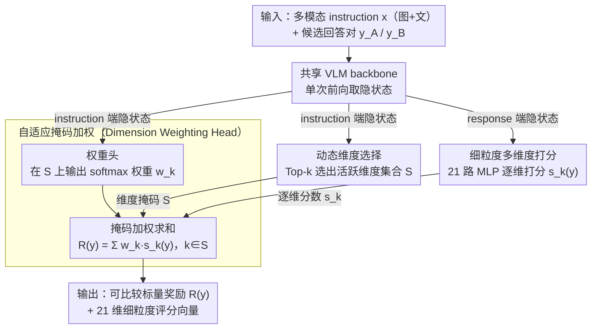

# Learning What Matters: Dynamic Dimension Selection and Aggregation for Interpretable Vision-Language Reward Modeling

**会议**: ACL 2026  
**arXiv**: [2604.05445](https://arxiv.org/abs/2604.05445)  
**代码**: 待确认  
**领域**: 可解释性 / 多模态奖励模型 / RLHF  
**关键词**: 视觉语言奖励模型、多维度评估、动态门控、DPO 对齐、可解释性

## 一句话总结
VL-MDR 把"单标量黑盒"的判别式视觉语言奖励模型升级成"动态选维度 + 各维度打分 + 自适应加权"的三头架构，配合 321k 条带 21 维细粒度偏好标注的数据集，在 VL-RewardBench 上击败现有开源 RM，并能产出更高质量的 DPO 偏好对来缓解 VLM 幻觉。

## 研究背景与动机
**领域现状**：多模态奖励模型（RM）是 LVLM 对齐的关键基础设施，目前主要分两派：生成式 RM（如 LLaVA-Critic）让模型用自然语言写评语再打分，可解释但慢且有位置偏置；判别式 RM（如 Skywork-VL）直接回归一个标量分数，吞吐高但完全是黑盒。

**现有痛点**：判别式 RM 把"图像保真度、空间推理、风格、安全"等正交维度全压成一个标量，无法区分一个回答"是看错了图（感知失败）"还是"图看对了但推理错了（推理失败）"。这种粗粒度反馈让下游的 RLHF/DPO 无从知道该针对哪类错误去优化模型。

**核心矛盾**：可解释性需要分维度输出多个信号，而效率要求单次前向不写长文本——两者在"标量 vs 文本评语"这条传统轴上不可调和。同时，多模态任务对"维度"的需求是查询相关的：算几何题不需要"风格质量"维度，看艺术图不需要"代码推理"维度，固定权重无法适配。

**本文目标**：(1) 设计一个能像人类评审一样"先看任务需要哪些能力维度，再针对这些维度逐项打分，最后加权汇总"的奖励模型；(2) 整个流程必须在**单次前向**内完成以保留判别式 RM 的效率；(3) 给出能支撑这种细粒度监督的大规模偏好数据。

**切入角度**：作者注意到多模态评估天然是"分层 + 条件相关"的——评估准则应仅由 instruction（图+问题）决定，而打分应由 response 决定。这种 Query-Response 解耦是设计动态门控架构的理论基石。

**核心 idea**：用 instruction 端预测"哪些维度相关 + 这些维度各占多少权重"，用 response 端给每个维度独立打分，再做掩码加权求和，单次前向得到可解释标量奖励。

## 方法详解

### 整体框架
VL-MDR 在一个共享的预训练 VLM backbone 上挂三个轻量 head，把传统判别式 RM 的"单标量回归"改写成"先判维度、再逐维打分、最后自适应加权"的可解释流水线。给定多模态 instruction $x$（图+文）和一对候选回答 $(y_A, y_B)$，模型在**单次前向**里走两路：instruction 端隐状态喂给 Dimension Prediction Head 与 Dimension Weighting Head，前者从 $K=21$ 维 taxonomy 里 Top-$k$ 选出本题相关的活跃维度集合 $\mathcal{S}$、后者在 $\mathcal{S}$ 上输出归一化权重；response 端隐状态喂给 Scoring Head，对每个候选在每维独立打分 $s_k(y)$。最终在被掩码选中的维度上做加权求和 $R(y) = \sum_{k \in \mathcal{S}} w_k \cdot s_k(y)$，既给出可直接用于偏好比较的标量奖励，又顺带产出 21 维细粒度评分向量。整套设计遵循 **查询-响应解耦（Query-Response Decoupling）** 原则：评估准则只由 instruction 决定，评估结果才由 response 决定。

### 关键设计

**1. 视觉感知的动态维度选择（Dimension Prediction Head）：让模型先想清楚"这题该考哪些能力"**

固定地拿全部 21 维去评估每条样本会引入大量噪声——给一张艺术图强行算"几何推理"分，只会让无关维度的梯度污染相关维度。这个 head 基于 instruction $x$ 预测每维的相关性概率 $\hat{z}_k = \sigma(f_{\text{dim}}(h_x))_k$，再 Top-$k$ 选出活跃维度集合 $\mathcal{S}$，本质上把"该评什么"建模成一个多标签分类问题，监督信号来自 21 维 taxonomy 的金标 $z_k$。它形似 MoE 路由，但路由的对象不是"走哪个专家的前向路径"而是"哪些评分维度进入聚合"——前向路径不变，只是用掩码把可解释性内化进结构，既砍掉计算冗余，又让最终奖励的因子分解贴合人类直觉。

**2. 细粒度多维度打分（Scoring Head）：用稀疏监督把每维 head 钉在它真正相关的样本上**

这个 head 用一个 21 路并行的轻量 MLP 读取 response 端隐状态，每路对候选回答 $y$ 输出一维偏好分数 $s_k(y)$，但只有落在 $\mathcal{S}$ 内的分数参与最终聚合、其余被掩码忽略。训练的关键在监督是稀疏的：用标签 $\mathbf{p} \in \{1,0,-1\}^K$ 只在 $z_k=1$ 的维度上施加 Bradley-Terry 偏好损失 $\mathcal{L}_{\text{pref}} = -\log \sigma\big(s_k(y_A) - s_k(y_B)\big) \cdot \mathbb{1}[p_k = 1]$。这样就避免了"对一张艺术图强行给几何维度打分"这种无意义信号，让每个维度 head 只在它真正相关的样本上学习，绕开了多任务学习里不相关任务相互拉扯的经典痛点。

**3. 自适应掩码加权（Adaptive Masked Aggregation，Dimension Weighting Head）：权重随任务变、且只看 instruction 防作弊**

不同任务对维度重要性差异极大——数学题里"数值计算"应占主导，安全场景里"危害检测"该一票否决，固定权重或单一全局权重都刻画不了这种条件依赖。这个 head 在选中的维度集合上输出 softmax 权重 $w_k = \mathrm{softmax}_{\mathcal{S}}(f_w(h_x))_k$，把稀疏的多维分数融合成最终标量 $R(y) = \sum_{k \in \mathcal{S}} w_k s_k(y)$。要点是权重只依赖 instruction、与 response 完全解耦，从而保证同一查询下 $y_A$ 与 $y_B$ 用同一套权重比较，杜绝了"为抬高自己分数而临时改权重"的作弊空间。

### 损失函数 / 训练策略
总损失三项联合优化：

- **维度相关性损失**：21 维 BCE，$\mathcal{L}_{\text{dim}} = \mathrm{BCE}(\hat{\mathbf{z}}, \mathbf{z})$
- **细粒度偏好损失**：掩码 Bradley-Terry，$\mathcal{L}_{\text{fine}} = \sum_k \mathbb{1}[z_k=1] \cdot \mathrm{BT}(s_k(y_A), s_k(y_B), p_k)$
- **整体偏好损失**：在最终聚合标量上施加 $\mathcal{L}_{\text{overall}} = \mathrm{BT}(R(y_A), R(y_B), o)$

数据上构建 321k 偏好对：从 7 个公开 VLM 偏好数据集（VLFeedback, RLAIF-V, SPA-VL, VisionArena, WildVision, RLHF-V, MM-RLHF，共 414.2k）出发，用三个强 VLM 评委（Qwen3-VL-235B、GLM-4.5V、InternVL3-78B）做 multi-model fine-grained overall-consistency 过滤，保留 77.6%；每条样本被标注 top-3 相关维度（共 ~964k 标签），覆盖 7 大核心能力 × 3 细维度 = 21 维。

## 实验关键数据

### 主实验
在 VL-RewardBench 及另外两个多模态 RM benchmark 上对比开源 RM；并用 VL-MDR 生成的偏好对训练下游 LVLM 做 DPO，评估幻觉缓解效果。

| 设置 | 评测基准 | 关键指标 | VL-MDR | 之前开源 SOTA | 趋势 |
|------|----------|----------|--------|---------------|------|
| RM 直接评估 | VL-RewardBench | 总体准确率 | 显著领先 | Skywork-VL / LLaVA-Critic | 优于判别式 + 优于生成式 |
| RM 直接评估 | 综合多模态 RM bench | 类别平均 | 稳定领先 | 各类别均衡 | 7 大能力均不掉点 |
| DPO 下游对齐 | 幻觉评测套件 | 幻觉率↓ / 可靠性↑ | 用 VL-MDR 偏好对显著优 | 用原始偏好对 | 验证细粒度信号的下游价值 |
| 效率 | 推理延迟 | 单次前向 | ≈ 判别式 RM | 远快于生成式 RM | 保留判别式的吞吐 |

### 消融实验

| 配置 | 关键指标趋势 | 说明 |
|------|--------------|------|
| Full VL-MDR | 最优 | 三 head + Top-$k$ 选择 + adaptive 权重 |
| w/o 动态维度选择（用全部 21 维） | 明显下降 | 无关维度引入噪声，证明 visual-aware gating 必要 |
| w/o adaptive weighting（均匀加权） | 明显下降 | 验证权重需随 instruction 动态变化 |
| w/o fine-grained 偏好损失（只用 overall） | 下降 | 退化为传统判别式 RM，丢失细粒度信号 |
| w/o multi-model consistency 过滤 | 训练数据噪声大，结果下降 | 数据质量是细粒度监督的前提 |

### 关键发现
- 三项损失里 **fine-grained 偏好损失**贡献最大：移除后模型回到传统判别式 RM 水平，证明"逐维度监督"才是可解释性提升的根因，而不是简单的多头结构。
- **动态 Top-$k$ 选择**比"全 21 维加权"效果更好：说明把无关维度的权重压到 0 比让模型自己学着压更可靠（避免无关维度的噪声梯度污染相关维度）。
- 用 VL-MDR 偏好对做 **DPO** 比用原始偏好对显著降低幻觉率：细粒度评分能挑出"在 hallucination 维度上明显劣"的对，比"整体偏好"的噪声小得多。
- 维度选择的 Top-3 标签分布与人类标注高度一致，证明 dimension head 学到了有意义的"任务类型识别"能力，可独立作为多模态任务分类器。

## 亮点与洞察
- **Query-Response Decoupling 是真正的结构性创新**：把"评估准则由 instruction 决定 / 评估结果由 response 决定"显式编码到架构里，防止权重和分数互相博弈，比单纯"分维度打分"的可解释 RM 鲁棒得多。
- **稀疏掩码偏好损失 $\mathbb{1}[z_k=1] \cdot \mathrm{BT}$ 是关键工程细节**：不在无关维度上施加监督，避免了多任务学习里"不相关任务相互拉扯"的经典痛点，思路可迁移到任何多 head 多任务 RM。
- **21 维 hierarchical taxonomy（7 核心 × 3 细分）的工程价值**：比一锅烩的"质量、流畅性、相关性"三分类粒度细 7 倍，又比完全开放标签更可控，是为可解释 RM 量身定做的标注体系。
- **三模型一致性过滤是细粒度数据的必要条件**：单个 LLM 评委的细粒度标注噪声极大，三模型 top-3 一致 + 整体偏好一致 + 与 ground truth 一致的三重过滤，把 414k 砍到 321k 但换来质量飞跃。

## 局限与展望
- **21 维 taxonomy 是手工设计的且强偏视觉场景**：扩展到代码、音频、视频等模态时需重新设计；论文未给出自动扩展维度的方案。
- **Top-$k$ 的 $k$ 是硬超参**：实际任务里"相关维度数"应自适应（数学题 $k=1$ 已足够，复杂多步推理可能 $k=5$），固定 $k$ 会引入偏差。
- **依赖三个 70B+ 评委做数据过滤**：复现成本极高，且评委自身的偏置（如 GPT-style 模型对"礼貌"维度过度敏感）会传导到 VL-MDR 学到的"偏好"上。
- **未在闭源最强 RM（如 GPT-4V-as-Judge）上对标**：开源 RM 之间领先不等于真正接近人类判别上限，下游 DPO 实验也只用了较小的 LVLM。
- **展望**：把 dimension head 改成可学习的 prototype（类似 MoE 路由）支持开放维度集合；把权重 head 改成 attention-based pooling 让 $k$ 自适应；探索基于 VL-MDR 的 process reward（每步打分）用于多模态 GRPO。

## 相关工作与启发
- **vs LLaVA-Critic（生成式 RM）**: 它通过生成自然语言评语+评分给可解释性，但延迟和位置偏置严重；VL-MDR 用结构化多 head 实现"等价可解释性"且保留判别式吞吐——可解释性可以来自架构而非必须来自自然语言。
- **vs Skywork-VL（判别式 RM）**: 它输出单标量黑盒，无法定位错误类型；VL-MDR 多了"维度分解"层，能告诉 RLHF 训练器"这个 chosen 比 rejected 好是因为幻觉少了 30% 而不是推理强了"——为细粒度对齐打开通道。
- **vs MoE Router**: 思路类似（输入相关地选子集），但 MoE 选的是不同专家走不同前向路径，VL-MDR 选的是"评分维度子集"参与聚合，路径不变只是掩码——是一种"结构化可解释 MoE"的轻量替代。
- **vs RLAIF-V/MM-RLHF 等数据集**: 它们提供单一整体偏好，VL-MDR 在其之上叠加 21 维细粒度标注 + 三模型一致性过滤，把偏好数据从"chosen vs rejected"升级为"chosen vs rejected on which dimensions"。

## 评分
- 新颖性: ⭐⭐⭐⭐ Query-Response Decoupling + 动态维度选择是干净的结构创新，但思路上和"多维度评分 RM"已有先例
- 实验充分度: ⭐⭐⭐⭐ 3 个 RM bench + DPO 下游 + 完整消融，但缺与闭源 GPT-4V judge 对标
- 写作质量: ⭐⭐⭐⭐ 问题设定清晰，三阶段方法图直观；数学符号略多
- 价值: ⭐⭐⭐⭐ 可解释 RM 是 VLM 对齐的刚需，开源 321k 数据集和 21 维 taxonomy 有长期复用价值

<!-- RELATED:START -->

## 相关论文

- [\[ICML 2026\] IdEst: Assessing Self-Supervised Learning Representations via Intrinsic Dimension](../../ICML2026/interpretability/idest_assessing_self-supervised_learning_representations_via_intrinsic_dimension.md)
- [\[ICML 2025\] What Makes an Ensemble (Un)interpretable?](../../ICML2025/interpretability/what_makes_an_ensemble_un_interpretable.md)
- [\[ACL 2026\] Aligning What LLMs Do and Say: Towards Self-Consistent Explanations](aligning_what_llms_do_and_say_towards_self-consistent_explanations.md)
- [\[ACL 2026\] Retrieval Heads are Dynamic](retrieval_heads_are_dynamic.md)
- [\[NeurIPS 2025\] Rectifying Shortcut Behaviors in Preference-based Reward Learning](../../NeurIPS2025/interpretability/rectifying_shortcut_behaviors_in_preference-based_reward_learning.md)

<!-- RELATED:END -->
