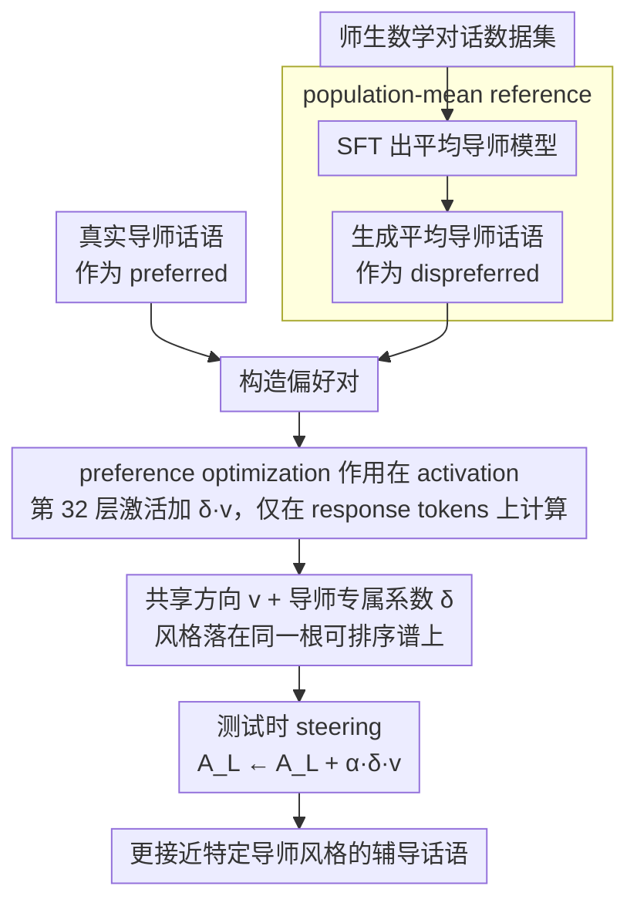

# Letting Tutor Personas Speak Up for LLMs: Learning Steering Vectors from Dialogue via Preference Optimization

**会议**: ACL2026  
**arXiv**: [2602.07639](https://arxiv.org/abs/2602.07639)  
**代码**: 未在缓存中看到本文专属公开代码链接  
**领域**: 可解释控制 / 教育智能  
**关键词**: steering vector、tutor persona、preference optimization、activation steering、LLM tutoring  

## 一句话总结
本文从真实师生对话中学习共享 steering direction 和导师专属缩放系数，让 LLM 在不显式写 persona prompt 的情况下生成更接近特定真人导师风格的辅导话语。

## 研究背景与动机
**领域现状**：LLM 已经大量用于教育辅导系统，常见做法是用 prompt 写入教学守则，或用 SFT/RL 学一个“平均优秀导师”策略，要求模型少泄题、多引导、保持苏格拉底式提问。

**现有痛点**：真实导师并不是一个单一策略。不同导师会在脚手架、直接讲解、反馈力度、情感支持和让学生自我完成之间做不同取舍。只学一个平均策略会抹平这种风格差异，也很难研究不同导师风格如何影响学生参与。

**核心矛盾**：如果用文本 prompt 明确描述 persona，控制信号依赖人工标签和描述词；如果只做 SFT，又只能逼近总体平均行为。论文想要从真实对话本身提取隐含 persona，并在激活空间里可控地施加它。

**本文目标**：学习一个能把模型输出从 population-mean tutor utterance 推向某个特定 tutor utterance 的 activation-space direction，并让不同导师通过不同缩放系数表达风格强弱。

**切入角度**：作者先把 LLM SFT 成能生成平均导师话语的模型，再把 SFT 生成的话语作为 dispreferred response，把真实导师话语作为 preferred response，用 preference optimization 学 steering vector。

**核心 idea**：不用显式 persona 描述，而是用“真实导师话语优于平均导师话语”的偏好对，在最后一层 activation 上学习共享方向 $v$ 和导师专属 $\delta_i$。

## 方法详解
这篇论文的方法很像把 DPO/BiPO 的偏好学习搬到 activation steering 上，但控制目标不是政治立场或安全属性，而是真实导师之间的教学风格差异。它把每个 tutor 的 persona 表示为同一个共享方向上的不同强度。

### 整体框架
给定一个 tutor-student dialogue dataset $\mathcal{D}$，每条对话由数学问题、学生轮次和导师轮次构成。系统先用 SFT 训练 LLM，使其能根据问题和历史对话生成合理的导师回复。这个 SFT 模型被视为 population-mean tutor，用来为每个对话上下文生成平均导师话语 $\bar{t}_{j,k}$。

接着，对于同一上下文，真实导师话语 $t^i_{j,k}$ 是 preferred response，SFT 生成的 $\bar{t}_{j,k}$ 是 dispreferred response。模型在某一层 activation $A_L(\cdot)$ 上加入 $\delta_i v$，并优化偏好损失，使 steered model 更倾向生成真实导师话语、更不倾向生成平均话语。测试时再乘全局强度 $\alpha$，通过 $A_L(\cdot)\leftarrow A_L(\cdot)+\alpha\delta_i v$ 控制 steering 强度。

### 关键设计

**1. population-mean reference：先定义“从哪里出发、要偏到哪里去”**

如果没有参照点，模型在偏好学习里会分不清自己是在学“怎么辅导”还是在学“这个导师和别人有什么不同”，个体风格就会被淹没在通用辅导能力里。作者先把 Llama-3.1-8B-Instruct SFT 成一个能根据对话上下文生成通用导师回复的模型，把它当作 population-mean tutor，用它为每个上下文生成一条平均导师话语 $\bar{t}_{j,k}$，并把这条话语固定为偏好对里的 dispreferred 样本。有了这个“平均行为”锚点，后续学习的方向才被严格限定为“真实导师相对平均导师的偏移”，而不是辅导能力本身。

**2. preference optimization 直接作用在 activation 上**

真实导师的 persona 体现在语气、对话动作、脚手架强度等多个层面，逐 token 的 SFT 只能逼近表面文本，学不到"相对更像某位导师"的方向。作者把 DPO/BiPO 式的偏好学习搬到 activation steering：在某一层激活上加入 $\delta_i v$，优化偏好损失，让加了 steering 之后真实导师话语相对 unsteered 模型的 log-likelihood ratio 变大、平均导师话语的 ratio 变小，且所有 likelihood 只在 response tokens 上计算。测试时再乘一个全局强度 $\alpha$，通过

$$A_L(\cdot)\leftarrow A_L(\cdot)+\alpha\delta_i v$$

调节 steering 力度。这条偏好目标直接优化的是"被引导后的激活更偏向真实导师"，比匹配表面字串更贴近 persona 控制的本质。

**3. 共享方向加导师专属系数：把风格变成一条可排序的谱**

如果给每个导师都学一个独立 steering 向量，样本需求和解释成本都会暴涨，而且一堆互不相关的向量根本没法横向比较。作者改为只学一个共享 steering vector $v$，让每位导师只持有一个正的缩放系数 $\delta_i$，风格强弱就落在同一根轴上。为消除尺度不确定性，$\delta_i$ 不直接学，而是用 $u_i$ 参数化再归一化：

$$\delta_i=\frac{\exp(u_i)}{\frac{1}{I}\sum_m\exp(u_m)}$$

这样所有导师的系数被约束在一个共同尺度下，风格差异自然呈现为可排序的连续谱——低 $\delta_i$ 的导师更重 rapport 和 scaffold，高 $\delta_i$ 的更偏任务完成式指导，整套表示既低维又可解释。

### 损失函数 / 训练策略
实验使用 Question-Anchored-Tutoring-Dialogues-2k 数据集，包含 21 个独特导师，按 dialogue level 为每个导师做 80/10/10 切分。训练集中每位导师平均 74.19 条对话，验证集 8.90 条，测试集 10.10 条；训练/验证/测试平均 turn 数分别为 11.75、12.06、12.25。

基础模型是 Llama-3.1-8B-Instruct，SFT 使用 LoRA，学习率 $5\times10^{-5}$、33 epochs、rank $r=32$、LoRA scaling $\alpha=64$。学习 steering vector 时在验证集上优化 $v$ 和 $u_i$，设置 $\beta=1.0$、learning rate 0.01，并在最后一层 transformer layer 32 施加 activation steering。生成使用 temperature 1.0、top-p 0.95；最终 validation loss 为 0.543，$T=17$，学到的 $u_i$ 均值 0.053、标准差 0.106；所有训练和评估使用单张 NVIDIA A40 48GB。

## 实验关键数据

### 主实验
主表按对话阶段比较 unsteered population-mean utterance $\bar{t}_j$ 和 steered utterance $\hat{t}_j$ 与真实导师话语的相似度。R 是 ROUGE-L，B 是 BLEU，C 是 SentenceBERT cosine similarity，W 是 LLM judge win rate。

| Stage | Count | Method | R | B | C | W |
|-------|-------|--------|---|---|---|---|
| early | 326 | $\bar{t}_j$ | 0.285 | 0.070 | 0.392 | - |
| early | 326 | $\hat{t}_j$ | 0.206 | 0.041 | 0.321 | 0.571 |
| mid | 1971 | $\bar{t}_j$ | 0.165 | 0.019 | 0.385 | - |
| mid | 1971 | $\hat{t}_j$ | 0.157 | 0.018 | 0.426 | 0.587 |
| late | 326 | $\bar{t}_j$ | 0.157 | 0.025 | 0.330 | - |
| late | 326 | $\hat{t}_j$ | 0.121 | 0.017 | 0.349 | 0.564 |

最关键的是 mid stage：这是数学问题解决的主体部分，steering 把 cosine similarity 从 0.385 提到 0.426，LLM judge 有 58.7% 情况偏好 steered output；ROUGE-L 从 0.165 小降到 0.157，BLEU 几乎不变 0.019 到 0.018，说明主要改变的是语义/话语策略而非逐字重合。

### 消融实验
| 全局强度 α | R | B | C | W | 说明 |
|------------|---|---|---|---|------|
| 0.0, unsteered | 0.179 | 0.026 | 0.379 | - | population-mean baseline |
| 0.3 | 0.181 | 0.027 | 0.400 | 0.536 | 温和 steering |
| 0.5 | 0.187 | 0.028 | 0.407 | 0.539 | 论文用于 qualitative analysis 的平衡点 |
| 0.7 | 0.176 | 0.026 | 0.404 | 0.562 | 风格更强，词面开始下降 |
| 1.0 | 0.159 | 0.021 | 0.403 | 0.582 | judge 更偏好，但 lexical similarity 明显下降 |

### 关键发现
- steering 在 mid/late 阶段提升语义相似度，但 early 阶段下降。作者解释为开头寒暄/鼓励本来就更通用，强行加 persona 容易过度风格化。
- $\alpha=0.5$ 在语义对齐与词面相似之间最平衡，因此用于 case study。
- 学到的 $\delta_i$ 呈现可解释谱系：低 $\delta_i$ 导师更重视 rapport 和 scaffold，中间更偏简短诊断与纠错，高端则更像低投入、任务完成式指导。
- case study 显示 steered output 更能复现导师的对话动作，例如先肯定再解释、简短纠错、或直接推进下一步。

## 亮点与洞察
- 最大亮点是 persona 不靠人工标签，而是从真实对话偏好对中学习。这让“导师风格”变成可学习的 latent control signal。
- population-mean reference 很关键。它把问题从“生成好辅导”改成“偏离平均辅导，靠近某个导师”，从而更准确地捕捉个体差异。
- 共享方向加 tutor coefficient 的设计很有解释性，能把多个导师排序成风格连续谱，而不是得到一堆难以比较的独立向量。
- 结果提醒我们，词面指标可能低估 persona control。steering 后 ROUGE/BLEU 有时下降，但语义相似度和 judge preference 上升，说明风格对齐不等于复制原话。

## 局限与展望
- 作者承认只在一个数学对话数据集上评估，尚不清楚能否泛化到其他学科、年龄段、平台或更开放的辅导场景。
- baseline 主要是 SFT 类方法，没有系统比较显式 persona prompting、persona adapters 或更强 RL tutoring 方法。
- 没有人类评估，结果依赖自动指标和 LLM judge；教育场景真正关心的学生学习收益、参与度和长期效果没有直接测量。
- 当前只学习单个共享方向，未来可以用低秩子空间或多个 steering direction 分离情感支持、纠错风格、脚手架强度等不同教学属性。

## 相关工作与启发
- **vs prompt-based persona control**: prompt 需要人工描述 persona，表达粒度受限；本文从真实对话中直接学习隐式 persona。
- **vs SFT tutoring policy**: SFT 学到平均导师行为，容易抹平个体差异；steering vector 在平均行为基础上做可控偏移。
- **vs BiPO / DPO steering**: BiPO 用偏好优化学习可控方向；本文把它改造成 tutor-specific 系数和共享方向，用于教育对话风格。
- **对后续工作的启发**: 可以把类似方法用于医疗问诊、客服、心理支持等需要保留个体沟通风格但又不能牺牲任务正确性的场景。

## 评分
- 新颖性: ⭐⭐⭐⭐☆ 把 activation steering 和 tutor persona 结合得自然，尤其是从真实对话中学习隐式风格。
- 实验充分度: ⭐⭐⭐☆☆ 定量、强度分析和 case study 都有，但数据集和 baseline 范围偏窄，缺少人类评估。
- 写作质量: ⭐⭐⭐⭐☆ 方法叙述清楚，例子能帮助理解 $\delta_i$ 的语义。
- 价值: ⭐⭐⭐⭐☆ 对可控教育 LLM 和 persona steering 很有启发，距离真实教学效果验证还差一步。

<!-- RELATED:START -->

## 相关论文

- [\[ICML 2026\] How Few-Shot Examples Add Up: A Causal Decomposition of Function Vectors in In-Context Learning](../../ICML2026/interpretability/how_few-shot_examples_add_up_a_causal_decomposition_of_function_vectors_in_in-co.md)
- [\[ACL 2026\] Interpretability from the Ground Up](interpretability_from_the_ground_up_stakeholder-centric_design_of_automated_scor.md)
- [\[ICLR 2026\] Behavior Learning (BL): Learning Hierarchical Optimization Structures from Data](../../ICLR2026/interpretability/behavior_learning_bl_learning_hierarchical_optimization_structures_from_data.md)
- [\[ACL 2026\] Compositional Steering of Large Language Models with Steering Tokens](compositional_steering_of_large_language_models_with_steering_tokens.md)
- [\[ACL 2026\] Preference Heads in Large Language Models: A Mechanistic Framework for Interpretable Personalization](preference_heads_in_large_language_models_a_mechanistic_framework_for_interpreta.md)

<!-- RELATED:END -->
