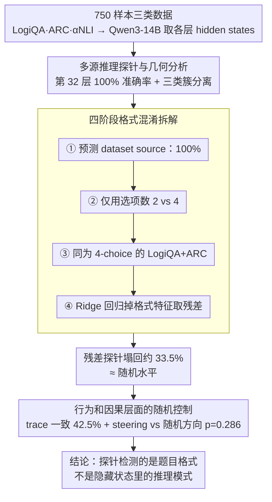

# Linear Probes Detect Task Format, Not Reasoning Mode in Language Model Hidden States

**会议**: ACL 2026  
**arXiv**: [2606.02907](https://arxiv.org/abs/2606.02907)  
**代码**: https://github.com/SubramanyamSahoo/Linear-Probes-Detect-Task-Format-Not-Reasoning-Mode  
**领域**: 可解释性 / 线性探针 / LLM 推理分析  
**关键词**: 线性探针, 格式混淆, 表征几何, 因果转向, 推理模式

## 一句话总结
这篇论文用 Qwen3-14B 上的探针、残差去混淆、trace-anchor 和 causal steering 实验证明：线性探针看似能 100% 区分演绎、归纳、溯因推理，但实际检测到的是数据源和题目格式，而不是隐藏状态中的推理模式。

## 研究背景与动机
**领域现状**：机械可解释性中常用线性探针来判断模型隐藏状态是否编码了某种属性。如果探针可以高准确率预测“推理类型”，很多工作会进一步解释为模型内部形成了不同的 reasoning circuits 或 mode-specific representations。

**现有痛点**：推理类型评测常常把不同 benchmark 直接对应到不同推理模式，例如 LogiQA 表示 deductive、ARC-Challenge 表示 inductive、$\alpha$NLI 表示 abductive。这样做会把 reasoning label 和 dataset source、选项数量、prompt 风格、输出长度等表面格式完全绑定。探针高准确率可能只是识别“这题来自哪个数据集”。

**核心矛盾**：隐藏状态确实包含大量可线性分离的信息，但“可预测”不等于“因果参与推理”。如果探针没有控制格式混淆，就无法区分模型是否真的有三种推理机制，还是只学到了输入分布的来源差异。

**本文目标**：作者希望给 reasoning-mode probing 做一次系统压力测试：先复现高探针准确率和漂亮几何分离，再逐步移除格式信息，并用行为和因果实验验证这种几何是否对应真实推理模式。

**切入角度**：论文故意采用标准的多源推理设置来构造一个平衡三分类数据集，然后问一个非常直接的问题：当 source identity、answer option count 和 response length 被控制后，原本 100% 的探针还能保留多少信号？

**核心 idea**：把线性探针结论从“高准确率即内部结构”拉回到“高准确率必须先通过格式去混淆和随机方向因果控制”的证据标准。

## 方法详解
论文的方法不是提出新的模型，而是提出一套对 probing 结论进行反证式验证的实验管线。它先让传统探针得到最强表面结果，再用残差分析、trace agreement 和 causal steering 分别从表示、行为、因果三个角度检验该结果是否站得住。

### 整体框架
数据集包含 750 个样本，三类各 250：LogiQA 2.0 代表 deductive，ARC-Challenge 代表 inductive，$\alpha$NLI 代表 abductive。模型是 Qwen3-14B，40 层，隐藏维度 5120，使用 bfloat16。作者统一 prompt，并在推理时设置 `DISABLE_THINKING=True`，移除 thinking blocks 后再分析，以避免 thinking mode 自身的语言风格成为额外混淆。

每个样本提取所有层最后一个 input token 的 hidden states、生成文本和输出置信度；几何分析只使用答对的样本。随后在各层训练 L2 正则的 logistic regression 线性探针，用 5-fold stratified cross-validation 预测 reasoning-mode label，并在最佳层做 manifold geometry。最后，用格式残差、trace-anchor 相似度和 activation steering 检验该几何是否具有推理功能。

### 关键设计

**1. 多源推理探针与几何分析：先把标准探针的表面结果做到极致，再反驳它**

整套验证的前提是：如果探针本身效果平平，否定它就没意义；只有当探针给出近乎完美的结果时，"这个结果其实是混淆"才有冲击力。因此作者在 Qwen3-14B 每一层训练 L2 正则的线性探针预测 deductive/inductive/abductive 三类标签，在第 32 层拿到 100% balanced accuracy。光有准确率还不够说服人，他们又在最佳层做几何分析，计算 intrinsic dimensionality、local curvature、inter-mode separation 和 convex hull contamination，让三类隐藏状态呈现出干净的簇分离。这一步刻意把"隐藏状态确实编码了推理模式"这个直觉证据堆到最满，为后面逐层拆解埋下反差。

**2. 四阶段格式混淆拆解：把"推理模式"信号一层层换成"题目格式"信号**

核心痛点是探针的高准确率究竟来自 reasoning mode 还是 task format——因为三类标签恰好和三个数据集一一绑定，source、选项数、response length 这些表面特征都可能冒充推理信号。作者用四个递进的反事实把这件事查清：第一阶段直接用同样的探针预测 dataset source，若也能 100% 命中，说明 mode label 和 source label 在信息上等价；第二阶段只用选项数（2 vs 4）预测；第三阶段把数据限制到选项数相同的 4-choice LogiQA + ARC，看词汇和题型风格还能不能分开；第四阶段最关键，把格式特征拼成

$$f_i=[\text{source one-hot},\ n_{\text{options}},\ |y_i|]$$

用 Ridge regression 从隐藏状态里回归掉格式信息，得到残差 $r_i=h_i-\hat{h}_i$，再在残差上重新探测 mode 和 source。结果残差探针塌回约 33.5% 的随机水平，意味着原本 100% 的分离基本由格式驱动。残差分析之所以是最强证据，正因为它做的是反事实——直接把混淆变量从表征里抽走，看剩下还有没有真信号。

**3. 行为和因果层面的随机控制：证明几何方向不只是相关，还要有功能**

即便几何分离真的存在，也还差一步：这个方向是不是真能改变推理模式，而不是任何扰动都会造成类似变化。作者从两个角度补这一步。行为上，trace-anchor 分析把模型生成的推理 trace 和三类 anchor 描述做余弦相似度，看外显推理是否随模式切换；结果 trace-mode agreement 只有 42.5%，仅略高于 33.3% 的 chance。因果上，steering 实验用 mode centroid difference 构造转向方向，但关键是拿它和 $N_{rand}=20$ 个随机方向对照，经验 $p$ 值用 Laplace correction 计算。随机方向控制是这里的灵魂——很多 steering 工作只报告目标方向有效，却没证明它比随机扰动更特殊；一旦做了对照，本文发现 targeted steering 的恢复效果和随机方向并无可信差异（$p=0.286$，Cohen's $d<0.5$），mode-specific 因果作用也就站不住了。

### 损失函数 / 训练策略
这篇论文不训练语言模型本身，训练的是分析用线性探针。探针是 logistic regression，使用 L2 正则，$C=1.0$，5-fold cross-validation。steering 的强度 $\alpha^*$ 不是手调，而是通过 coherence sweep 和 Otsu thresholding 从数据中确定；随机方向数最多 20，实际报告中为 20。

## 实验关键数据

### 主实验
原始探针结果非常强，但残差去格式后几乎完全塌到随机水平。这正是论文的核心证据。

| 分析对象 | 原始 hidden states | 去格式残差 states | 机会水平 |
|----------|-------------------|------------------|----------|
| Reasoning Mode (D/I/A) 探针 | 100.0% | 约 33.5% | 33.3% |
| Dataset Source 探针 | 100.0% | 约 33.5% | 33.3% |
| 最佳层 | 第 32 层 | 第 32 层残差 | 不适用 |
| 原始几何现象 | 三类 clean clusters | 不再保留 mode/source 可分性 | 不适用 |

### 消融实验
四阶段混淆分析显示，原始“推理模式”分离可以被格式解释逐步吃掉。

| 检验阶段 | 设置 | 结果 | 解释 |
|----------|------|------|------|
| Stage 1 | 用同样线性探针预测 source | 100% accuracy | mode label 和 source label 信息等价 |
| Stage 2 | 仅用选项数 2 vs. 4 | 33.3% mode accuracy | 选项数可直接识别 $\alpha$NLI 先验类 |
| Stage 3 | 只保留 4-choice 的 LogiQA + ARC | 近乎完美 | 即使选项数相同，词汇和题型风格仍可分离 |
| Stage 4 | 回归掉 source one-hot、选项数、response length | 约 33.5% | 原始线性分离基本由格式驱动 |

### 关键发现
- 第 32 层探针达到 100% balanced accuracy，三类 precision、recall 和 F1 都完美，permutation test 显示 $p<0.0002$。
- 第 32 层几何看似也很有说服力：deductive、inductive、abductive 的 intrinsic dimensionality 分别为 20.6、28.5、33.6，convex hull contamination 不超过 1.5%。
- 行为上，Qwen3-14B 三类任务总准确率为 86.0%，但 trace-mode agreement 只有 42.5%，只是略高于 33.3% chance。
- 数据源准确率差异很大：LogiQA 2.0 为 73.2%，ARC-Challenge 为 93.6%，$\alpha$NLI 为 91.2%，说明任务难度和来源分布本身差异明显。
- steering 实验中 targeted steering 的 accuracy recovery 为 40.0%，随机方向均值为 31.7% 加置信区间；经验 $p=0.286$，Cohen's $d<0.5$，不足以说明 centroid direction 有 mode-specific 因果作用。

## 亮点与洞察
- 论文最强的地方是没有停留在“探针可能有混淆”的泛泛提醒，而是构造了完整的反证链：原始探针、source 探针、残差探针、trace 行为、causal steering 五个证据环环相扣。
- `DISABLE_THINKING=True` 是一个细节但很重要。它避免了 thinking block 的语言风格把“推理模式”进一步外显化，使实验更聚焦于输入格式本身是否足以造成分离。
- 这篇论文给可解释性研究一个很实用的警告：如果 label 与数据来源一一对应，线性探针再高也只能说明 hidden state 保留 source 信息，不能直接说明存在目标概念。
- 随机方向 steering 控制值得复用。很多 steering 工作只报告目标方向有效，但没有证明目标方向比随机扰动更特殊；这篇论文把这个缺口摆得很清楚。

## 局限与展望
- 实验只覆盖 Qwen3-14B 一个模型，虽然格式混淆来自实验设计而非模型，但“统一推理策略”结论还需要在 Llama、Mistral、GPT 系列等模型上复现。
- 残差分析较保守，特别是回归掉 source one-hot 可能同时移除一些真实推理信号。作者也指出未来可只回归 option count 和 response length，检查非 source 格式特征能解释多少。
- trace-anchor 使用手写 anchor 描述和 cosine similarity，可能捕捉不到细粒度推理差别；更强的行为分析可以统计显式三段论、假设消除、模式枚举等 trace 操作。
- $\alpha$NLI 是 2-choice，LogiQA/ARC 是 4-choice，这个结构性差异非常明显。未来推理模式 benchmark 应尽量统一选项数、prompt 模板和输出格式。
- steering 评估规模有限，最多使用 15 个此前答错样本和 20 个随机方向，效应量边界仍然较宽。

## 相关工作与启发
- **vs 传统线性探针**: 传统 probe 强调可线性读出性，本文强调 probe 必须先通过去混淆和因果控制，否则只能说明相关性。
- **vs reasoning circuit 工作**: 如果 reasoning mode label 来自不同 benchmark，电路解释可能追踪到的是 benchmark style，而非推理算法本身。
- **vs activation steering**: 本文不是提出更强 steering，而是指出目标方向必须和随机方向做功能对照，才能讨论因果作用。
- **对后续工作的启发**: 构建推理可解释性数据集时，应优先在同一数据源、同一格式内标注推理子类型，或者用成对样本保持表面格式一致。

## 评分
- 新颖性: ⭐⭐⭐⭐ 不是新模型，但把 probe 反证管线做得很完整。
- 实验充分度: ⭐⭐⭐⭐ 表征、行为、因果三层证据扎实，但模型覆盖面有限。
- 写作质量: ⭐⭐⭐⭐⭐ 问题意识明确，实验逻辑非常清楚。
- 价值: ⭐⭐⭐⭐⭐ 对可解释性和 reasoning benchmark 设计都有很强方法论价值。

<!-- RELATED:START -->

## 相关论文

- [\[ICLR 2026\] Beyond Linear Probes: Dynamic Safety Monitoring for Language Models](../../ICLR2026/interpretability/beyond_linear_probes_dynamic_safety_monitoring_for_language_models.md)
- [\[ICLR 2026\] Hidden Breakthroughs in Language Model Training](../../ICLR2026/interpretability/hidden_breakthroughs_in_language_model_training.md)
- [\[ACL 2026\] AdaptiveK: Complexity-Driven Sparse Autoencoders for Interpretable Language Model Representations](adaptivek_complexity-driven_sparse_autoencoders_for_interpretable_language_model.md)
- [\[ACL 2026\] Rhetorical Questions in LLM Representations: A Linear Probing Study](rhetorical_questions_in_llm_representations_a_linear_probing_study.md)
- [\[ACL 2026\] Knowledge Vector of Logical Reasoning in Large Language Models](knowledge_vector_of_logical_reasoning_in_large_language_models.md)

<!-- RELATED:END -->
