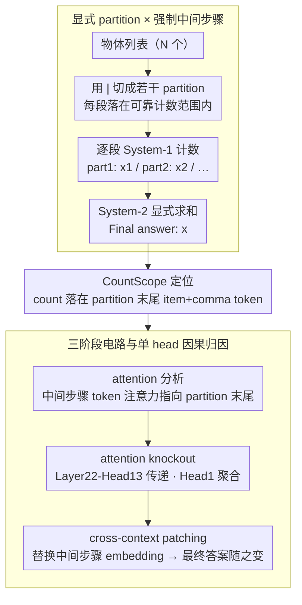

# Mechanistic Interpretability of Large-Scale Counting in LLMs through a System-2 Strategy

**会议**: ACL 2026  
**arXiv**: [2601.02989](https://arxiv.org/abs/2601.02989)  
**代码**: 待确认  
**领域**: 机制可解释性 / LLM 推理 / 计数  
**关键词**: System-2, 计数, activation patching, 因果中介, 注意力 knockout

## 一句话总结
针对 LLM 大数量计数失败（单 forward 因为 layer 深度有限只能数到 ~10–30），用一个简单的 test-time "用 `|` 把列表切片 + 让模型先逐段计数再求和"策略让 Qwen2.5/Llama3/Gemma3/GPT-4o/Gemini-2.5-Pro 在 50–100 物体场景下从 0–20% 准确率跃升到 50–95%，并通过 attention 分析 + 4 类因果中介实验把"分段计数→中间步骤聚合→最终求和"三阶段电路定位到 Qwen2.5-7B 的 Layer 22 (head 13 负责分段, head 1 负责聚合)。

## 研究背景与动机
**领域现状**：LLM 在简单算术上 OK，但「数一个列表里有几个 apple」这类朴素计数任务在 N > 10 后准确率断崖式下跌。前人 (Hasani 2025b, Yehudai 2024) 已经证明这是 transformer 的**架构性瓶颈**：计数信号在 layer 之间逐层累积 (latent counter)，达到 layer 深度上限就饱和；而 LLM 的数字表征本身又是 sublinear / log-like 压缩，越大的数越模糊。

**现有痛点**：(1) 单纯加 Chain-of-Thought 帮助有限（结构化 + CoT 才行）；(2) 训练侧的修复 (re-tokenization、专门数学模型) 治标不治本，依然受 depth 限制；(3) 即便有 test-time 分块技巧的工作 (LVLM-COUNT, Izadi 2025)，它们只验证了行为效果，没解释**内部机制**——切片到底激活了哪些 head 和 layer 在做什么。

**核心矛盾**：(a) **架构 vs 任务规模** —— transformer 单 forward 只能数到 depth 上限，但任务规模可以无穷大；(b) **行为 vs 机制** —— 我们知道 prompting 有效，但不知道为什么以及电路结构是什么，无法保证可控扩展。

**本文目标**：(1) 提出"显式分块 + CoT 求和"为 System-2 计数策略，证明对各种 LLM 都有效；(2) 通过 attention 分析 + activation patching + masking ablation + attention knockout 四类工具拆出"分段计数 → 写入中间步骤 → 聚合"三阶段电路；(3) 用 cross-context patching 因果验证最终答案受中间步骤 token embedding 直接调控。

**切入角度**：作者把 Kahneman 的双系统理论搬来：把 LLM 单 forward 的 implicit 计数当作"System-1"（快但有 depth 上限），把"切片 + CoT 逐步求和"当作"System-2"（慢、显式、可扩展），用 mechanistic interpretability 验证 System-2 在 transformer 内部确实通过特殊的 head/layer 实现。

**核心 idea**：在输入用 `|` 显式划分 partition，并要求模型先输出 `part1: x1, part2: x2, ...` 再 sum；这样每个 partition 维持在模型"可靠计数范围"内 (System-1 work)，而 System-2 只负责整数求和（这步几乎所有模型都对，见 Table 3 final-step accuracy 86–100%）。

## 方法详解

### 整体框架
方法把一个超出单 forward 计数能力的「数列表里有几个物体」任务，外化成一段可在 token 流上展开的多步运算：输入端用 `|` 把 N 个物体切成若干 partition（开源模型每段 ~6-9、闭源模型 ~15-25，都落在模型可靠计数 range 内），prompt 强制模型按固定格式先逐段输出局部计数 `part1: x1\npart2: x2\n...` 再给 `Final answer: x`。这样每个分段交给 System-1 的 implicit counter 去数（它在小数量上很可靠），跨段求和交给显式写出的 token 序列即 System-2 去做，全程无需微调、无外部工具。机制分析侧则围绕这条 pipeline 叠了一套因果探针——CountScope probing 定位 latent count 落在哪些 token、token 零消融与 layer-wise mask 找出写入 count 的层、attention knockout 找出关键 head、cross-context patching 验证因果方向——把行为效果一路追到具体电路。

### 关键设计

**1. 显式 partition × 强制中间步骤：缺一不可的双重组合**

大数计数的痛点在于 transformer 单 forward 的 latent counter 受 layer 深度限制会饱和，所以核心是把任务拆成模型「数得动」的子段、再把子结果具现成 token 让后续 attention 能访问。关键发现是这两步必须同时存在：单独加 `|` 而不给 CoT 反而**有害**——Qwen2.5-7B 在 N=11-20 的 acc 从 unstructured 的 0.38 跌到 structured-w/o-steps 的 0.20，因为 partition 重置了 implicit counter 却没让模型知道要汇总；单独加 CoT 而不切分也帮助寥寥；只有两者组合才能把 0.38 拉到 0.95。

之所以说瓶颈完全在分段计数而非求和，是因为几乎所有模型的 final-step accuracy（求和阶段正确率）都 ≥86%——求和这步 System-2 做得很好，错全错在 intermediate count 上，也就是 System-1 在每个分段内仍正常工作。partition 提供了一个可控的 System-1 子任务空间，CoT 把子结果落成 token 才让 System-2 有东西可聚合，这正是 System-2 计数的最小可行实现。

**2. CountScope：把 latent count 定位到 partition 边界 token**

要做因果干预，先得知道「每段的 count 存在哪个 token 的 hidden state 里」。作者实测 logit-lens / tuned-lens 对数字解码并不可靠，于是改用 CountScope (Hasani 2025b) 这种 task-conditioned 的 patching probe：把目标 token 的 activation 注入一个独立的空白计数 context，让 LM 在该 context 下吐出一个数，这个数就是该 token 隐含的 count。

探测结果把机制假设坐实了——每段的 count 信号高置信地落在**该 partition 的最后一个 item token + 最后一个 comma token**上，且 partition 之间 counter 会重置：第 2 段末尾存的是本段局部 count 而非累积值。这既给后续零消融、attention knockout 提供了精准的干预 target，也直接验证了「切分后每个子段独立计数」这一核心机制。

**3. 三阶段电路与单 head 因果归因**

最后把 System-2 计数还原成「信息存储（partition 末尾 token）→ 信息传递（中间步骤 token）→ 信息聚合（最终答案 token）」三阶段，并逐级定位到具体 attention pathway。先用 attention 分析看到 Layer 19-23 的注意力从中间步骤 token 强烈指向对应 partition 的末尾 item+comma；再用 attention knockout 锁定 Layer 22 为关键层——**Head 22-13** 负责「partition 末尾 → 中间步骤」的传递，**Head 22-1** 负责「中间步骤 → 最终答案」的聚合。

纯 attention 分析只能给「相关」证据，所以作者用 cross-context patching 做终极因果验证：把 context A 某个中间步骤 token 的 embedding 换成 context B 的，A 的最终答案随之改变（19→21、14→12），确认这些 token embedding 是因果中介而非伴随现象。不同 task stage 用不同 head 也意味着 LLM 在该任务上存在明确的 division of labor。

### 损失函数 / 训练策略
**纯 inference-time**，无任何训练。所有干预（CountScope probe / 零消融 / attention knockout / cross-context patching）都通过 forward hook 实现。

## 实验关键数据

### 主实验：行为效果（Accuracy / MAE in N=11–50 for open models, N=51–100 for closed models）

| 模型 | 输入 | 输出 | Acc N=21-30 | Acc N=41-50 | MAE N=41-50 |
|---|---|---|---|---|---|
| Qwen2.5-7B (28 layer) | Unstruct | w/o steps | 0.13 | 0.00 | 10.50 |
| Qwen2.5-7B | Unstruct | w/ steps | 0.11 | 0.00 | 9.68 |
| Qwen2.5-7B | Struct | w/o steps | 0.13 | 0.01 | 6.35 |
| **Qwen2.5-7B** | **Struct** | **w/ steps** | **0.61** | **0.24** | **2.18** |
| **Llama3-8B** (32 layer) | **Struct** | **w/ steps** | **0.54** | **0.26** | **2.20** |
| **Gemma3-27B** (62 layer) | **Struct** | **w/ steps** | **0.85** | **0.50** | **2.25** |

| 闭源模型 (N=51-100) | 输入/输出 | Acc N=91-100 | MAE N=91-100 |
|---|---|---|---|
| GPT-4o, Unstruct, w/o steps | — | 0.24 | 4.26 |
| **GPT-4o**, **Struct**, **w/ steps** | — | **0.86** | **0.18** |
| Gemini-2.5-Pro, Unstruct, w/o steps | — | 0.20 | 2.70 |
| **Gemini-2.5-Pro**, **Struct**, **w/ steps** | — | **0.91** | **0.07** |

**Structured + w/ steps 是唯一通杀配置**，单独加 partition 或单独加 CoT 都不行甚至更差。

### 消融：错误来源拆分 (Structured CoT setting)

| Model | Total Acc | Final-step Acc | Intermediate Acc |
|---|---|---|---|
| Qwen2.5-7B | 0.51 | **0.86** | 0.53 |
| Llama 3-8B | 0.49 | **0.96** | 0.48 |
| Gemma 3-27B | 0.71 | **0.93** | 0.76 |
| GPT-4o | 0.89 | **1.00** | 0.89 |
| Gemini-2.5-Pro | 0.94 | **0.97** | 0.94 |

聚合阶段 final-step Acc 全部 ≥86%，说明 bottleneck 完全是 intermediate count；attention knockout 在 Layer 22 把 Head 13 关掉，intermediate count 概率显著下降。

### 关键发现
- **三种 prompt 组合的失败模式各不相同**：单 partition 无 CoT 会让模型输出"最大 partition size"作为答案（Qwen2.5-7B 13% 错误样本、Llama3-8B **43.6%** 错误样本恰好等于最大 partition），这与 Hasani 2025b 的"模型输出最大 latent count"假说完全吻合。
- **System-2 mechanism 是 staged 的**：CountScope 显示 partition counter 在每个 `|` 之后重置，所以 partition 末尾 token 仅编码本段 count；中间步骤 token 通过 Layer 22-Head 13 attention 抓取这些边界 token；最终答案通过 Layer 22-Head 1 attention 聚合中间步骤 token。
- **跨模型机制一致性**：在 Llama3.2-8B (Layer 13-18) 和 Gemma3-4B (Layer 21-23) 上 attention pattern 完全平行，都是"生成中间 count 时 attention 集中到对应 partition 末尾 item+comma"，说明 System-2 通过 prompting 激活的电路是 transformer 普遍的 capability 而非模型特异性。
- **CoT 单独无效的反直觉发现**：常规印象是 CoT 万能，但本文清楚展示了 unstructured + CoT 几乎不提升 (0.45 vs 0.38)，必须配 structured 输入提供"显式 stage 边界"；这对 prompt engineering 实践很有指导意义。

## 亮点与洞察
- **三阶段 staged computation 框架**：本文把 LLM 的 System-2 行为拆解为「存储 → 传递 → 聚合」三阶段，并把每阶段映射到具体 token 位置和 attention head。这种 staged interpretation 范式可推广到任何"分而治之"风格的 LLM 任务，包括多步推理、长文档摘要、表格 QA。
- **"input structure 提供 stage 边界"是一个普适见解**：单纯 CoT 在很多任务里效果一般，因为模型缺乏"在哪里 reset 子任务计数器"的外部信号；显式 separator 在 token 流中创造了 attention head 可以索引的 stage anchor，比让模型自己发明 stage 更可靠。
- **CountScope 作为 numerical probe 的方法学贡献**：作者发现 logit-lens/tuned-lens 对数字 unreliable 这个细节很重要——数字解码是 patching-style probe 优于线性 probe 的典型 case，这对未来做 LLM 数学/推理可解释性研究是关键工具选择参考。
- **架构限制可以由 test-time scaling 绕过**：不需要"加 layer"，只需要让模型把超出 depth 的部分外化为 token 序列，token-by-token 生成等价于 unrolling 深度。这对 inference-time 优化 (test-time compute scaling 的最近热点) 是个简洁论证。

## 局限与展望
- 作者承认：(1) 只用了重复名词的合成数据，没在自然散文里验证；(2) 需要预先知道模型"可靠 partition size"，不同模型不同；(3) 该策略只适用于子任务近独立的问题（计数、多步算术、序贯规划），对子任务强耦合的推理 (e.g. 多跳因果链) 不通用。
- 我看到的额外限制：(1) Layer 22-Head 13/1 的定位仅在 Qwen2.5-7B 上验证，跨模型 (Llama3-8B, Gemma3) 只做了 layer-level attention 分析，没在每个模型重新做 attention knockout 找各自的关键 head，跨模型一致性可能被高估；(2) cross-context patching 只在第 18-24 层做，未试更早层；(3) 比较对象是 vanilla CoT，缺少对 "self-consistency / tree-of-thought" 等高级 prompting 的对照。
- 改进方向：自动决定最优 partition size (基于该模型 N≤? 的 reliable counting range)；扩展到带 stage interactivity 的任务 (如多跳问答的 entity tracking)；研究为什么 Qwen2.5-Math-7B 在 structured w/o steps 也表现好——可能 RLHF/SFT 内化了 implicit aggregation。

## 相关工作与启发
- **vs CoT (Wei 2022)**：CoT 提供 reasoning 中间步骤但不强制 stage boundary；本文证明在 saturation 任务上单靠 CoT 不够，必须配 input structure。
- **vs Hasani 2025b (CountScope 起源)**：他们提出 layer-wise counter / CountScope 工具，本文应用工具 + 引入 partition 策略 + 给出三阶段 staged interpretation。
- **vs Question Decomposition (Radhakrishnan 2023)**：他们关注 decomposition 提升 reasoning 忠实性，本文从机制角度解释 decomposition 为何 work。
- **vs Yehudai 2024 (transformer 何时能精确数数的理论)**：他们给 implicit counting 的 capacity 理论上界，本文用 test-time decomposition 经验性绕过这个上界。
- **vs Izadi 2025 (visual partitioning)**：他们在视觉计数里用图像切片，本文在文本里用 `|` 切片并补足机制解释。

## 评分
- 新颖性: ⭐⭐⭐⭐☆ 行为策略本身简单（partition + CoT），但**首次给出完整三阶段电路**和 cross-context patching 因果验证，机制贡献突出。
- 实验充分度: ⭐⭐⭐⭐⭐ 5 个模型 × 4 配置 × 多 context size + 5 个数学/小模型 robustness + 2 种 alternative input format + 多模型 attention pattern 对比 + 4 种因果干预，材料非常丰富。
- 写作质量: ⭐⭐⭐⭐☆ 章节结构清晰 (现象→定位→因果)，图例信息密度高；某些段落 (5.3) 论证略快需要反复读。
- 价值: ⭐⭐⭐⭐⭐ 对计数 / 长序列 / 推理任务的 prompt 设计和机制理解都有直接指导意义；System-2 staged framework 可扩展到其它 capacity-saturated 任务。

<!-- RELATED:START -->

## 相关论文

- [\[ACL 2026\] Revitalizing Black-Box Interpretability: Actionable Interpretability for LLMs via Proxy Models](revitalizing_black-box_interpretability_actionable_interpretability_for_llms_via.md)
- [\[ACL 2025\] Mechanistic Interpretability of Emotion Inference in Large Language Models](../../ACL2025/interpretability/mechanistic_interpretability_of_emotion_inference_in_large_language_models.md)
- [\[ACL 2026\] Towards Intrinsic Interpretability of Large Language Models: A Survey of Design Principles and Architectures](towards_intrinsic_interpretability_of_large_language_modelsa_survey_of_design_pr.md)
- [\[ACL 2026\] Preference Heads in Large Language Models: A Mechanistic Framework for Interpretable Personalization](preference_heads_in_large_language_models_a_mechanistic_framework_for_interpreta.md)
- [\[ICML 2026\] Beyond Additive Decompositions: Interpretability Through Separability](../../ICML2026/interpretability/beyond_additive_decompositions_interpretability_through_separability.md)

<!-- RELATED:END -->
