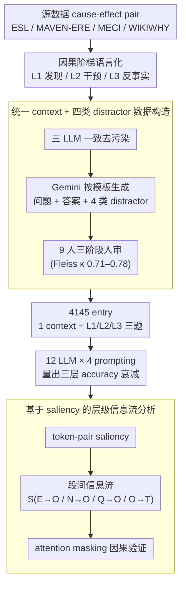

<!-- 由 src/gen_stubs.py 自动生成 -->
# METER: Evaluating Multi-Level Contextual Causal Reasoning in Large Language Models

**会议**: ACL 2026  
**arXiv**: [2604.11502](https://arxiv.org/abs/2604.11502)  
**代码**: https://github.com/SCUNLP/METER (有)  
**领域**: 因果推理评测 / 机制可解释性  
**关键词**: 上下文因果推理, 因果阶梯, 信息流分析, 显著性分数, LLM 评测

## 一句话总结
METER 是首个在**统一上下文**下系统评测 LLM 三层因果推理（discovery / intervention / counterfactual）的 benchmark（4145 条人审 + LLM 协同构造样本），通过显著性信息流分析发现 LLM 在因果阶梯上升时性能从 93% 跌到 73%——根因是 discovery 阶段被无关事实干扰、higher-level 阶段对上下文 faithfulness 显著下降。

## 研究背景与动机
**领域现状**：因果推理被视为 AGI 的必备能力，尤其在医疗诊断这种高风险领域，临床报告往往需要同时回答：(1) 为什么会缺血（discovery）；(2) 如果做 PCI 会怎样（intervention）；(3) 如果当初没堵塞会怎样（counterfactual）。Judea Pearl 的"因果阶梯"把这三类按难度分了三层。已有 benchmark 如 ExpliCa / CRASS / WIKIWHY / CausalQA / IfQA 都在评 LLM 的因果能力，但各自只覆盖一层。

**现有痛点**：
1. **覆盖不全**：现有 benchmark 要么只评 discovery（WIKIWHY、CausalQA、RECESS、CRAB），要么只评 counterfactual（CRASS、IfQA），没有任何一个把三层放在同一 benchmark 里。
2. **上下文不一致**：即便偶有跨层评测（CalQuest、CLADDER、CausalBench），不同问题用的是不同 context，无法严格对比同一段事实下三层能力的差距。
3. **缺乏机制分析**：没有 benchmark 配套"为什么错"的内部机制研究——只看分数不知道模型到底是哪里坏了。
4. **混合 paradigm**：现有工作混用 commonsense（用常识）、formal（符号规则）、contextual（基于文档）三种 paradigm，contextual causal reasoning（严格依证据文本）这一类没单独评。

**核心矛盾**：要做"公平的多层评测"必须保证每个 context 同时配三层问题，但人工标注成本极高，且需要严格 de-contamination 防止 LLM 已经背过答案。

**本文目标**：(i) 在统一 context 下系统评测三层因果推理；(ii) 提供大规模 (4K+)、高质量、去污染的人审样本；(iii) 用 mechanistic interpretability（信息流分析）解释 LLM 失败模式。

**切入角度**：把 Pearl 的因果阶梯（数值概率域）**翻译到 textual paradigm**，并用"human-LLM 协同 + 三阶段质检"流水线构造 benchmark；用 Wang et al. 2023 的 saliency-based information flow 来 trace LLM 内部到底关注什么。

**核心 idea**：(1) 同一 context 派生三层问题，控制变量做公平对比；(2) 设计四类 distractor（contradictory / unfounded / causal-reversal / irrelevant-fact）系统检测不同失败模式；(3) 在错误样本上做信息流分析，把"行为层失败" → "机制层失败"打通。

## 方法详解

### 整体框架
METER 把「LLM 在因果阶梯上的能力衰减」做成一个可严格量化的现象，由数据与分析两条线串起来。数据线从 ESL/MAVEN-ERE/MECI/WIKIWHY 四个源数据集抽 cause-effect pair，用 Gemini-2.5-Pro 扩展事件描述并按模板生成三层问题、答案和四类 distractor，经 9 名 NLP 背景标注员的三阶段人审，最终落成 4145 个 entry——每个 entry 一段 context 同时挂 L1/L2/L3 三道 5 选 multiple-choice，做到「同一事实、三层对比」的控制变量。分析线则在这套数据上跑 12 个 LLM（GPT-4o/GPT-5、Gemini-3 系列、Qwen3 全尺寸、Llama-3.3-70B）× 4 种 prompting，先量出三层 accuracy 的衰减，再对 Qwen3-4B/8B 和 Llama-3.2-3B 做 saliency-based 信息流分析，把「行为层失败」一路追到「机制层信息流」。

### 关键设计

**1. 把 Pearl 因果阶梯翻译成可操作的语言任务**

直接拿 Pearl 三层的数学定义去评 LLM 没法落地，于是作者按「动词 / 时序 / 修改维度」把每层重写成可批量套模板的语言任务。L1 **Causal Discovery** 是从文本里识别已存在的因果（靠显式词汇 "caused/because" 或隐式语义），如从临床报告读出 "thrombotic occlusion → myocardial ischemia"；L2 **Intervention** 是预测在 context 里「引入新动作」的后果、需多步链式推理，如「做 PCI 会怎样」要走 perform PCI → clear occlusion → restore blood flow；L3 **Counterfactual** 是反转已知条件推「当初不同会怎样」，如「如果当初没堵塞，伤害本来不会发生」。

这种语言化定义让每层都有清晰可判定的标准，也才能让问题模板批量生成。其中 L2 与 L3 的关键分野在于：L2 是在现实事实上 forward 推理，L3 则要在与现实冲突的假设上推理——后者逼着 LLM 真去「模拟反事实世界」而不是复述现实，这正是高层因果难的根源。

**2. 统一 context + 四类 distractor 的可控数据构造**

要把三层差距干净地归因到模型能力，就得排除「题目难度差异」这个混淆，所以每个 entry 严格保持「1 context（平均 228.91 token）+ 3 question」结构，三层共享同一段事实。每题 5 选项 = 1 正答 + 4 distractor，而四类 distractor 本身就是针对常见失败模式设计的诊断探针：**Contradictory**（与 context 事实直接冲突）、**Unfounded**（context 没提也推不出，典型幻觉）、**Causal Reversal**（因果方向反了）、**Irrelevant Fact**（context 里的真陈述但与因果链无关）——模型选了哪类错就暴露哪种 failure，使错误分布可解释。

构造流水线四阶段层层防污染防噪：(i) 用 Gemini-2.5-Pro、GPT-5、Qwen3-235B 三个 LLM 一致同意「无 context 也能答对」的 pair 全部 de-contaminate 掉；(ii) 人工三标注（Fleiss κ=0.78）过滤；(iii) Gemini-2.5-Pro 按预设 template 生成问题/答案/distractor；(iv) 9 名标注员两阶段人工编辑 + 过滤（Fleiss κ=0.71/0.75）。三 LLM ensemble + 90% 过滤率 + 三人独立标注共同把数据污染和质量噪声压到最低。

**3. 基于 saliency 的层级信息流分析**

Accuracy 只能说「模型多差」，说不清「差在哪里」，所以作者借 Wang et al. 2023 的 saliency-based information flow 把行为指标钻到机制层。对每个 token-pair $(i,j)$ 计算 saliency $I_l(i,j) = \sum_h |A_{h,l}^\top \frac{\partial \mathcal{L}}{\partial A_{h,l}}|$，再定义「段→段」的平均信息流 $S_{X \to Y} = \frac{\sum_{(i,j) \in \mathcal{C}_{X \to Y}} I_l(i,j)}{|\mathcal{C}_{XY}|}$。prompt 被切成五段——**E**（人标 evidence span）、**N**（non-evidence）、**Q**（question）、**O**（selected option）、**T**（target final token），重点跟踪 $S_{E\to O}, S_{N\to O}, S_{Q\to O}, S_{O\to T}, S_{rest}$ 随层数的变化并对比 Correct vs Error 子集。

配合人标 evidence span，这套指标能严格回答「模型有没有真去看证据」：Discovery 错样本上 evidence flow 显著降、noise flow 显著升，正对应「被无关事实分心」。最后再用 attention masking 做因果验证——屏蔽浅层（1-24）的 $E\to O$ flow 后 Discovery acc 从 0.827 掉到 0.579，坐实 evidence aggregation 主要发生在浅层。这套做法把 mechanistic interpretability 与 benchmark 评测漂亮地缝在了一起。

### 损失函数 / 训练策略
**纯评测项目，无训练**。所有 closed-source LLM 走官方 API；open-source LLM 用 vLLM 在 4×A100 上推理；decoding temperature=0；Zero-shot/Zero-shot CoT/Few-shot/Few-shot CoT 四种 prompting；reasoning-optimized 模型 (GPT-5/Gemini-3-Pro/Qwen3-Next-Thinking) 只跑 Zero-shot 和 Few-shot；evaluation metric=accuracy；所有结果 3 次独立 run 取平均。

## 实验关键数据

### 主实验（4 种 prompting × 12 LLM × 3 因果层）

**Zero-shot accuracy（%）**：

| 模型 | L1 Discovery | L2 Intervention | L3 Counterfactual | 跌幅 |
|------|--------------|-----------------|--------------------|------|
| **Gemini3-Pro** | **93.50** | **81.92** | **73.05** | -20.45 |
| GPT-5 | 92.96 | 82.17 | 72.14 | -20.82 |
| Gemini3-Flash | 91.02 | 78.09 | 70.51 | -20.51 |
| Qwen3-Next-Thinking | 90.36 | 77.52 | 70.57 | -19.79 |
| Qwen3-Next-Instruct | 89.56 | 75.13 | 64.47 | -25.09 |
| GPT-4o | 87.92 | 77.96 | 67.42 | -20.50 |
| Llama-3.3-70B | 87.24 | 78.17 | 62.08 | -25.16 |
| Qwen3-32B | 87.26 | 71.54 | 61.12 | -26.14 |
| Qwen3-14B | 87.95 | 67.54 | 52.05 | -35.90 |
| Qwen3-8B | 86.27 | 64.48 | 51.40 | -34.87 |
| Qwen3-4B | 87.03 | 53.47 | 43.26 | -43.77 |
| Qwen3-0.6B | 64.46 | 31.27 | 25.88 | -38.58 |
| **Human** | **95.80** | **92.80** | **91.00** | **-4.80** |

**两个核心发现**：(1) 所有 LLM 都呈现因果阶梯上升 → accuracy 下降；最强 Gemini3-Pro 跌 20+ 个点；人类只跌 4.8 个点。(2) **Reasoning-optimized 模型在高层上鲁棒性显著强于 instruction-tuned 模型**：Qwen3-Next-Thinking 在 counterfactual 上比 Qwen3-Next-Instruct 高 6 分以上。

### 错误分布分析（Zero-shot 错误样本里各类 distractor 的比例）

| Distractor 类型 | Discovery (Qwen3-4B) | Intervention | Counterfactual |
|----------------|----------------------|--------------|----------------|
| **Irrelevant Fact** | **55.41%** | 26.87% | 24.15% |
| Unfounded | 22.20% | 39.43% | 36.77% |
| Contradictory | 5.69% | 20.96% | **33.87%** |
| Causal Reversal | 16.70% | 12.74% | 5.22% |

**核心规律**：
- **Discovery 错误主要因被 irrelevant facts 干扰**（55%）—— 模型选了"context 里的真陈述但和因果无关的细节"；
- **Higher-level 错误主要因 unfounded（幻觉）和 contradictory（自相矛盾）暴增** —— faithfulness 显著下降；
- **Counterfactual 的 Contradictory 高达 33.87%** —— 模型选的选项直接和反事实假设的合理推论冲突，无法在 hypothetical 下保持逻辑一致。

### 信息流分析（Qwen3-4B 各层平均 saliency）

| 指标 | Discovery (Cor / Err) | Intervention | Counterfactual |
|------|----------------------|--------------|----------------|
| $S_{E\to O}$ (evidence→option) | **0.1690 / 0.1247** | 0.1144 / 0.0936 | 0.1095 / 0.0988 |
| $S_{N\to O}$ (noise→option) | **0.0945 / 0.1262** | 0.0858 / 0.0858 | 0.0805 / 0.0884 |
| $S_{Q\to O}$ (question→option) | 0.2508 / 0.2163 | 0.2657 / 0.2378 | 0.2666 / 0.2281 |
| $S_{O\to T}$ (option→target) | 0.4685 / 0.4941 | 0.5039 / 0.5457 | 0.5071 / 0.5452 |

**关键发现**：
- **Discovery 错样本：evidence flow 显著下降 + noise flow 显著上升** —— 证实"被无关事实分心"是机制层根因；
- **Intervention/Counterfactual：无论对错，evidence flow 都很低**（~0.10） —— 模型基本不看 context，靠 internal world knowledge 推理，所以幻觉率高；
- **错样本里 $S_{Q\to O}$ 普遍较低**：模型连 question 都没充分利用。

### Attention Masking 因果验证（Qwen3-4B）

| Mask 范围 | Discovery Acc | Intervention Acc | Counterfactual Acc |
|-----------|---------------|------------------|---------------------|
| baseline | 0.827 | ~0.53 | ~0.43 |
| **shallow 1-24 layer $E\to O$ mask** | **0.579** (-25 pt) | ~0.53 | ~0.43 |
| deep 25-end $E\to O$ mask | 0.827 | ~0.53 | ~0.43 |

→ Discovery 的 evidence aggregation **只发生在前 24 层**，再深的层不再用 evidence；intervention/counterfactual 屏蔽 evidence flow **几乎无影响**，反证它们本就不依赖 evidence。

### Lightweight 改进实验（显式把 evidence span 加进 prompt）

| 模型 | Discovery | Intervention | Counterfactual |
|------|-----------|--------------|----------------|
| Qwen3-8B (No Evidence) | 85.40 | 63.71 | 53.80 |
| Qwen3-8B (+Evidence) | **88.00 (+2.6)** | **65.85 (+2.1)** | **56.40 (+2.6)** |
| Qwen3-4B (No Evidence) | 82.67 | 53.40 | 45.06 |
| Qwen3-4B (+Evidence) | 84.80 (+2.1) | 55.20 (+1.8) | 46.40 (+1.3) |
| Llama-3.2-3B | 72.60→75.00 (+2.4) | 57.40→57.83 | 42.03→44.60 (+2.6) |

**关键发现**：(1) 加 evidence span 后 $S_{E\to O}$ 全面上升、accuracy 全面提升；(2) 副作用：causal reversal 错误反而增加（被强化的 entity 提示让模型选了方向反的选项），说明"加 evidence" 不是 silver bullet，需要配合"强化因果方向"的训练。

### 关键发现汇总
- **模型规模对三层因果有差异影响**：Qwen3 系列 0.6B → 32B，discovery 早早饱和（4B≈32B），intervention/counterfactual 持续提升 +49% / +42%；说明高层因果需要 model scale 而 discovery 只需 reading comprehension。
- **CoT prompting 在不同模型上有截然相反效果**：Llama-3.3-70B 在 counterfactual 上 CoT 加 5 分；GPT-4o 反而掉 2 分。猜测 GPT-4o 已内化了高效推理路径，外加 CoT 反而引入噪声。
- **Counterfactual 是终极拦路虎**：所有模型在 L3 上都明显弱，且人类 vs LLM 的差距最大（91% vs 73%）。

## 亮点与洞察
- **Unified-context 的严苛实验设计**：把同一段事实拆成三层问题，第一次让"模型在因果阶梯上的能力衰减"成为一个可严格量化的现象。这种"控制变量法"在 LLM evaluation 上极少见。
- **行为层 + 机制层双视角**：错误类型分布给出 "什么样的错"；信息流分析给出 "为什么这样错"；attention masking 给出 "因果验证"。三层证据互相印证形成完整 narrative，这种 evaluation paper 的写法应该成为新标准。
- **四类 distractor 是 transferable design**：unfounded / contradictory / reversal / irrelevant fact 这四类几乎覆盖所有 LLM 选择题失败模式，可移植到其他 benchmark 构造中（如阅读理解、逻辑推理、commonsense）。
- **"+evidence" 实验的现实意义**：仅靠把 evidence span 显式加进 prompt 就能涨 2-3 分，提示我们 RAG / retrieval-augmented reasoning 的真正价值是 **强化信息流**，而不只是补全知识。
- **去污染流水线值得借鉴**：用 3 个顶级 LLM ensemble 一致同意"无 context 也能答"作为 contamination 信号 —— 这种"用 LLM 自我证伪"是规模化反污染的可行办法。

## 局限与展望
- **作者承认**：(1) 机制分析只能在 open-source 模型上做（无法 trace GPT/Gemini 内部）；(2) 源数据是公开语料，无法完全排除预训练污染；(3) 去污染只能 black-box 验证。
- **自查**：(1) Distractor 由 LLM 生成可能存在 generation bias（GPT 生成的 distractor 可能让 GPT 自己易/难答）；(2) 信息流分析只对 Qwen / Llama 小模型做（4B/8B/3B），向 70B+ 的可扩展性未知；(3) 三层定义沿用 Pearl 范式，没有考虑跨层组合（如 intervention-on-counterfactual）；(4) 评测全是 multiple-choice，open-ended generation 的因果推理能力未评；(5) 人类 baseline 只有 100 题，且都是 NLP 背景本科生，迁移到医学/法律真实场景的人类表现可能不同。
- **改进方向**：(1) 把"+evidence" 的发现做成训练目标——设计 SFT/RL loss 强化 $S_{E\to O}$；(2) 拓展到多语言 / 多领域；(3) 提出新的 mixed-level 任务（先 discovery 再 intervention）；(4) 把信息流分析迁移到训练动态上，看 RLHF 如何重塑因果信息流；(5) 加入 free-form generation 的 counterfactual 任务，跳出 MCQ 范式的局限。

## 相关工作与启发
- **vs ExpliCa / CRASS / CalQuest（commonsense paradigm）**：他们靠 LLM 内在 prior 推理；本文严格要求基于 textual evidence，因此能区分"理解 context"与"调动常识"。
- **vs CLADDER / CausalBench（formal paradigm）**：他们靠 do-calculus、概率运算，与自然语言语义无关；本文 contextual paradigm 才贴近实际 NLP 应用。
- **vs WIKIWHY / CausalQA / RECESS / CRAB（contextual but discovery-only）**：他们只评 L1，且不同问题不同 context；本文统一三层 + 统一 context。
- **vs IfQA（contextual counterfactual-only）**：本文同时评 L1/L2/L3，三层对比才是真正的因果阶梯检验。
- **vs Wang et al. 2023 (Label Words Are Anchors)**：本文借其 saliency-based information flow 方法应用到因果推理任务，是 mechanistic interpretability 应用到 benchmark evaluation 的典范。
- **启发**：(1) 评测 paper 写法可以从"只报分数" 升级为"分数 + 错误分布 + 机制分析 + 因果验证 + 改进 sketch" 五位一体；(2) 用 LLM 自评 contamination 是可扩展的去污染思路；(3) information flow 分析配合人标 evidence 可以打开 LLM 黑盒；(4) 因果阶梯是个潜在的 universal axis ——其他任务（如规划、推理、辩论）也可以按这种 hierarchy 设计评测。

## 评分
- 新颖性: ⭐⭐⭐⭐ Unified-context 多层因果评测 + 信息流机制分析的组合是 evaluation paper 的清晰创新；distractor 四分类有原创性；个别模块（Pearl ladder、saliency analysis）非原创但合成精彩。
- 实验充分度: ⭐⭐⭐⭐⭐ 12 模型 × 4 prompting × 3 因果层 + 人类 baseline + 错误分类 + 多模型机制分析 + attention masking 因果验证 + +evidence lightweight 实验 + 跨模型迁移验证，覆盖度极高。
- 写作质量: ⭐⭐⭐⭐⭐ 三层因果定义清晰、benchmark 流水线一目了然、机制分析 narrative 完整；表格图清晰，case study 有说服力；几乎没有冗余。
- 价值: ⭐⭐⭐⭐⭐ 公开 code + dataset，提供 4145 高质量样本，对因果推理研究社区是 indispensable resource；揭示的"高层因果靠 internal knowledge 而非 context"是个对 RAG / agent 设计有直接指导意义的核心发现。

<!-- RELATED:START -->

## 相关论文

- [\[ACL 2026\] Knowledge Vector of Logical Reasoning in Large Language Models](knowledge_vector_of_logical_reasoning_in_large_language_models.md)
- [\[ACL 2026\] Jacobian Scopes: Token-Level Causal Attributions in LLMs](jacobian_scopes_token-level_causal_attributions_in_llms.md)
- [\[ACL 2026\] Sparse Feature Coactivation Reveals Causal Semantic Modules in Large Language Models](sparse_feature_coactivation_reveals_causal_semantic_modules_in_large_language_mo.md)
- [\[ACL 2026\] Compositional Steering of Large Language Models with Steering Tokens](compositional_steering_of_large_language_models_with_steering_tokens.md)
- [\[ACL 2026\] Experiments or Outcomes? Probing Scientific Feasibility in Large Language Models](experiments_or_outcomes_probing_scientific_feasibility_in_large_language_models.md)

<!-- RELATED:END -->
