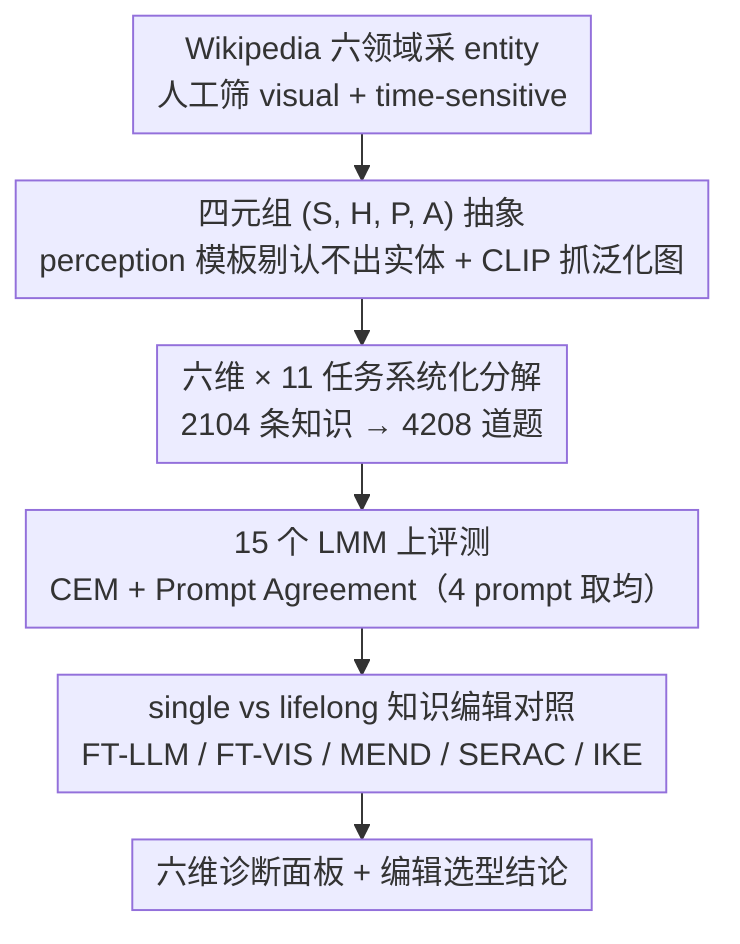

# MINED: Probing and Updating with Multimodal Time-Sensitive Knowledge for Large Multimodal Models

**会议**: ACL 2026  
**arXiv**: [2510.19457](https://arxiv.org/abs/2510.19457)  
**代码**: 待确认 (论文中未给出)  
**领域**: 多模态 LMM / 知识评测 / 知识编辑 / 时间敏感知识  
**关键词**: time-sensitive knowledge、temporal awareness、benchmark、knowledge editing、LMM probing

## 一句话总结
作者提出 MINED——首个**多模态时间敏感知识**评测基准，包含 2104 条 (subject, hypernym, property, attribute-list) 四元组、6 个维度（Cognition / Awareness / Trustworthiness / Understanding / Reasoning / Robustness）共 11 个子任务，4208 道题，在 15 个 LMM 上跑下来 Gemini-2.5-Pro 拿到最高平均 CEM=63.07 但仍漏掉 ~15% 知识；进一步用 FT-LLM / IKE 等知识编辑方法在 single editing 下能把 LLaVA-v1.5 和 Qwen-VL 的过时知识有效更新，但 lifelong editing 下大幅退化（FT-LLM 平均掉 43.2%）。

## 研究背景与动机

**领域现状**：LMMs（LLaVA-v1.5、Qwen2.5-VL、Gemini-2.5-Pro 等）通过大规模预训练编码了大量事实知识，但参数是静态的——一旦 Messi 转会 Inter Miami CF，模型的"Messi 现在为哪支球队效劳"答案就过时。文本侧已有 TimeQA / TempReason / EvolveBench 等基准评测时间推理，但只测时间表达式或逻辑关系，几乎不测"模型内部的时间敏感事实是否最新"；多模态侧只有 LiveVQA / MMKU-Bench 做实时视觉知识更新，没有系统的 temporal awareness 评测。

**现有痛点**：(i) 现有 multimodal benchmark 只覆盖单一维度（cognition 或 reasoning），没有六维联合评测；(ii) 没有 benchmark 显式测试"模型如何在 query 时间和外部 context 时间错配（temporal misalignment）时表现"、"如何拒答时间窗口外的 unanswerable date"、"如何理解 implicit temporal concept"（如"Bezos 任 Amazon CEO 期间"）等真实部署中常见但被忽视的问题；(iii) 缺少对应的 evaluation protocol——CEM、Prompt Agreement 这种细粒度评测在多模态时间敏感场景下还没标准化。

**核心矛盾**：LMM 的参数化知识是静态的，但现实事实是动态的，二者必然存在 gap；但目前评测只能粗略告诉你"模型答错了"，不能告诉你**为什么**答错（是 cognition 失败？还是 implicit time 不理解？还是被 misaligned context 误导？），导致后续改进无的放矢。

**本文目标**：(a) 构造一个跨 6 个领域（country / sport / company / university / organization / competition）、6 个维度、11 个子任务的多模态时间敏感知识 benchmark；(b) 评测 15 个 SOTA LMM 找出共性弱点；(c) 验证现有知识编辑方法能否在多模态场景下有效更新时间敏感知识。

**切入角度**：作者把每条时间敏感知识抽象为四元组 $(S, H, P, A)$——subject $S$（如 Lionel Messi）、hypernym $H$（如 footballer）、property $P$（如 plays for）、属性时序列表 $A=[a_1, \ldots, a_n]$（如 ["FC Barcelona | 2003-2021", "PSG | 2021-2023", "Inter Miami | 2023-now"]）。然后用模板把这个四元组改造成 11 种子任务（time-agnostic / interval-aware / timestamp-aware / unanswerable date / implicit concept / ranking / calculation / adversarial error 等）。

**核心 idea**：把"时间敏感知识能力"分解为 cognition (recall) → awareness (context conflict detection) → trustworthiness (reject invalid time) → understanding (implicit time) → reasoning (rank/calc) → robustness (self-correct) 六维，每维若干任务，形成系统化的"诊断面板"。

## 方法详解

### 整体框架
MINED 把「LMM 的静态参数知识 vs 动态现实事实」这道 gap 做成一个可诊断、可更新的评测系统，由三段流程串起来。先是 benchmark 构造：人工 + GPT-4o 从 Wikipedia 六个领域采 entity 候选，两名标注员手工筛出 visual 且 time-sensitive 的实体，抽成四元组 $(S, H, P, A)$ 配原图，用 5 个 perception 模板剔掉「15 个 LMM 里有 10 个都认不出」的 entity 保证视觉感知达标，再用 CLIP 从 Google 抓泛化图做相似度过滤取 top-1。接着把每个四元组按 11 个子任务模板批量生成 4208 道题（2104 条 unique 知识 × 多 prompt 配置），在 15 个 LMM 上以 CEM + Prompt Agreement 评测。最后是知识编辑：拿 LLaVA-v1.5 (7B) 和 Qwen-VL (7B) 当「过时模型」，在 single / lifelong 两种 setting 下对比 FT-LLM / FT-VIS / MEND / SERAC / IKE 五种方法，看时间敏感知识到底更不更得动。

### 关键设计

**1. (S, H, P, A) 四元组抽象 + Prompt Agreement 评测协议**

整个 pipeline 的地基是把每条知识抽象成四元组 $(S, H, P, A)$——subject、hypernym、property、属性时序列表——而非自然语言 QA pair，这样一个知识点才能批量套不同子任务模板：对 (Lionel Messi, footballer, plays for, [...]) 套 T.A 就生成 "Which club does the footballer in the image currently play for?"，套 R.K 就生成 "...can you identify which one was former?"。这层抽象也让 benchmark 可持续更新——每季度抓 Wikipedia 刷新属性列表 $A$ 即可，这正是作者称 MINED 为 evolvable benchmark 的底气。构造时还用 5 个 perception 模板剔掉「15 个 LMM 里有 10 个都认不出」的实体保证视觉可感知，再用 CLIP 从 Google 抓泛化图做相似度过滤取 top-1。

评测端两个选择都为了贴合「事实查询」场景：用 Cover Exact Match $\text{CEM} = \mathbb{1}(\hat y \subseteq Y)$ 而非严格 EM，只要答案出现在生成里就算对，比 BLEU/F1 更适合自由格式回答；Prompt Agreement 则取 4 个语义等价 prompt（Question / Generalization Question / Image / Generalization Image，末项用 CLIP 抓的泛化图）的平均分，把 prompt 措辞带来的 artifact 从评测噪声里挤出去。

**2. 六维 × 11 任务的系统化评测分解**

有了四元组当原料，下一步是把「时间敏感知识理解」拆成六个独立诊断维度套模板生成题目——以前的 benchmark 只报一个 overall accuracy，failure mode 无从定位，而每个维度都对准 LMM 部署中的一类真实痛点。Cognition 用 T.A/T.I.A/T.S.A 三种 time-format 测召回（"currently plays for?" 是 T.A，"From 2021 to 2023?" 是 T.I.A，"On 2024-01-01?" 是 T.S.A）；Awareness 用 F.M.C/P.M.C 测 context 时间与 query 时间错配时会不会被误导；Trustworthiness 用 P.U.D/F.U.D 测能否拒答属性时间窗口外的日期（如问 Messi 2075 年踢哪队）；Understanding 用 I.T.C 测隐式时间解析（"Bezos 任 Amazon CEO 期间"对应 1994.07.05–2021.07.05）；Reasoning 拆 R.K（chronological ranking）和 C.A（算两事件间天数）；Robustness 用 A.T.E 测被告知答错后能否自纠。2104 条 unique 知识就这样配出 4208 道题。

这种分解的价值在于让诊断信号浮出水面——比如「小模型对过去 misalignment context 极脆弱」（Qwen2-VL 7B 的 P.M.C 掉 56.43%）这种现象在单一 overall metric 下根本看不到。每维多任务之间还能交叉验证：cognition 三种 time-format 一致显示 timestamp-aware 最容易，说明 LMM 内部知识更接近 point-in-time 索引而非 interval。

**3. single vs lifelong 两种 setting 下的多模态知识编辑对照**

光评出模型知识过时还不够，这一步要回答「现有编辑方法能不能真正把过时知识更新掉」。作者从 LLaVA-v1.5 (7B)、Qwen-VL (7B) 这两个「过时模型」CEM ≠ 100 的样本里选编辑数据，再用两种 setting 拆开看：**Single editing** 每编一条就 restore 权重，测纯净更新效果（工具理论上 work 吗）；**Lifelong editing** 把整个数据集一次性编完再统一评测，测累积干扰（工具能规模化吗）。对比对象覆盖 parameter-modifying（FT-LLM 直接微调 LLM、FT-VIS 只调 visual encoder、MEND 用 hypernetwork 学 edit）与 parameter-preserving（SERAC 外挂 retrieval cache、IKE 用 in-context example）两类。

这组对照直接给出了选型路线图：FT-LLM single avg 97.2% 几乎完美，但 lifelong 崩到 54.0%（−43.2pp）；SERAC single 只 61.6% 却凭显式 cache 在 lifelong 仅掉到 51.2%（−10.4pp）。结论很 actionable——要更新百条以下用 FT-LLM，要更新千条以上用 memory-based 的 SERAC 才稳。

### 损失函数 / 训练策略
本文是 benchmark + 评测论文，没有训练新模型。知识编辑部分沿用原方法的损失（FT-LLM = standard CE fine-tuning，MEND = hypernetwork loss，SERAC = retrieval + counterfactual model loss）。评测指标：$C_d = \frac{1}{N}\sum_i^N \text{CEM}_i$，$\text{CEM} = \mathbb{1}(\hat y \subseteq Y)$。

## 实验关键数据

### 主实验
15 个 LMM 在 MINED 11 个子任务上的 CEM (%)（节选 5 个代表模型，关注 Cog./Awa./Tru./Und./Rea./Rob.）：

| 模型 | T.S.A (Cog) | F.M.C (Awa) | P.M.C (Awa) | P.U.D (Tru) | F.U.D (Tru) | I.T.C (Und) | R.K (Rea) | C.A (Rea) | A.T.E (Rob) | **Avg** |
|------|-------------|--------------|--------------|--------------|--------------|--------------|------------|------------|---------------|---------|
| LLaVA-v1.5 (7B) | 16.88 | 7.66 | 6.40 | 53.99 | 50.00 | 1.57 | 15.12 | 6.17 | 0.39 | 15.85 |
| Qwen2.5-VL (7B) | 41.67 | 40.04 | 33.98 | 99.64 | 99.76 | 4.02 | 38.89 | 25.00 | 16.86 | 39.55 |
| InternVL2.5 (8B) | 44.83 | 42.37 | 38.26 | 98.31 | 99.88 | 4.22 | 61.73 | 19.14 | 0.00 | 40.70 |
| GPT-4.1 | 80.91 | 78.07 | 77.49 | 65.22 | 91.30 | 8.63 | 15.74 | 59.57 | 17.58 | 51.82 |
| **Gemini-2.5-Pro** | **84.96** | **83.09** | **84.30** | 80.31 | 97.10 | **18.73** | 38.48 | **76.54** | **39.58** | **63.07** |

→ 闭源模型显著领先；I.T.C（implicit temporal concept）全模型崩盘（最高 18.73%）；A.T.E（自纠错）也是普遍弱点（多数 < 20%）。

### 消融实验
Single vs Lifelong knowledge editing（LLaVA-v1.5 7B，9 任务平均 CEM %，Δ = lifelong 相对 single 的变化）：

| 方法 | Single avg | Lifelong avg | Δ | 评价 |
|------|------------|---------------|----|------|
| **FT-LLM** | **97.2** | 54.0 | **−43.2** | single 最强但 lifelong 完全崩 |
| FT-VIS | 86.6 | 34.8 | −51.8 | 视觉端编辑更不稳 |
| MEND | 62.7 | (未报) | — | single 都偏弱 |
| **SERAC** | 61.6 | **51.2** | **−10.4** | single 平庸但 lifelong 稳，A.T.E 反而 +12.6 |
| IKE | 76.0 | (未报) | — | in-context 方法 single OK |

→ Lifelong editing 上 SERAC 因为 memory-based 架构靠显式 cache 避免 catastrophic forgetting，比参数修改方法稳健 4×。

### 关键发现
- **Obs 1: Timestamp-Aware > Interval-Aware > Time-Agnostic**：LMM 在具体时间点查询上表现最好，说明内部知识是 point-in-time 索引；但 Gemini-2.5-Pro 在 T.S.A 上仍漏 15% 知识。
- **Obs 2: 小模型对过去 misalignment context 极脆弱**：Qwen2-VL (7B) P.M.C 掉 56.43%，闭源 + 大模型显著更鲁棒（GPT-4.1 只掉 4.6%）。
- **Obs 3: 拒答未来日期比拒答过去日期更准**：未来日期是"完全没见过的概念"，模型 refuse 信心更强；Qwen2-VL 系列拒答率 ~99%，可能源自 instruction tuning 的 defensive mechanism。
- **Obs 5: 模型变大未必更好做 ranking**：Qwen2.5-VL ranking 准确率从 3B (50.3) → 7B (38.9) → 72B (11.4) 单调下降，疑似 over-thinking。
- **Obs 7: 越新模型 temporal awareness 越强**：发布时间和 Avg CEM 大致正相关，可能与训练数据 cutoff 更新有关。
- **Exploration 3: 开源模型生成大量 Irrelevant 响应**：在 Time-Agnostic 任务里 LLaVA-v1.5 (7B) Irrelevant 占 57.65%，闭源模型把 Irrelevant 压到 14–18% 但 Outdated 仍占 53–64%，暴露**多数模型生成的不是 latest 而是 outdated 答案**。

## 亮点与洞察
- **六维诊断面板让 failure mode 可分类**：把"时间敏感知识能力"拆成 cognition/awareness/trustworthiness/understanding/reasoning/robustness，每维都对应 LMM 部署中的一类真实痛点（如 RAG 系统的 context conflict 对应 Awareness、客服系统的 refuse-to-answer 对应 Trustworthiness），未来工作可以针对特定维度做 targeted 改进。
- **四元组 + 季度更新 = evolvable benchmark**：把每条知识抽象为 (S, H, P, A) 四元组并设计每季度从 Wikipedia 增量更新 $A$ 的 pipeline，让 MINED 是个**活的** benchmark——这种"benchmark as data infrastructure"的思路对长期评测非常有价值。
- **I.T.C 全模型崩盘是个 wake-up call**：implicit temporal concept（"Bezos 任 Amazon CEO 期间"）这种隐式时间表达 SOTA 模型都只能拿 18.73%，说明 LMM 几乎不会做"先把时间短语 ground 到具体区间再检索知识"的两步推理，是个值得整领域攻关的 open problem。
- **Single vs Lifelong editing 对照很有 actionable value**：直接给出"FT-LLM 适合少量编辑，SERAC 适合 lifelong"的工程结论，对真实部署 LMM-as-database 场景很有指导意义。

## 局限与展望
- 作者承认只覆盖 6 个领域（国家/体育/公司/大学/组织/竞赛），法律 / 医学等高时效性领域未覆盖；视觉数据只用静态图，没有视频。
- "evolvable" 的 quarterly update pipeline 还停留在设想，没有真实跑过几个 cycle 的对照数据。
- 知识编辑实验只在 LLaVA-v1.5 和 Qwen-VL 两个老模型上做，没在 Qwen2.5-VL / InternVL2.5 等更强模型上验证；老模型的 editing 结论不一定迁移。
- I.T.C 任务的 implicit time mapping 是手工 curate 的（必须保证"Bezos 任 CEO 期间 Messi 唯一只在 Barcelona"这种 temporal uniqueness），样本量小，泛化性受限。
- 评测全用 CEM（子集匹配），对生成型答案（特别是中文 / 自由文本）适配可能差，未给出更细的 fuzzy match 评测。改进方向：扩到法律/医学专业领域、加入视频时序数据、用更强的 fuzzy/semantic match 评测。

## 相关工作与启发
- **vs EvolveBench (Zhu et al. 2025)**: EvolveBench 在文本侧测 cognitive + conscious 两维，本文扩展到多模态六维，并加入 implicit temporal concept、adversarial robustness 等新维度。
- **vs LiveVQA / MMKU-Bench**: LiveVQA 关注"实时视觉知识获取"但忽视时间错配；本文显式构造 misalignment 场景测 LMM 的鲁棒性。
- **vs TimeQA / TempReason**: 这些文本基准只测时间表达式推理（"哪个事件早"），本文测"特定时间点上的事实知识是否最新"，是不同维度的问题。
- **vs VLKEB / MIKE (multimodal knowledge editing benchmark)**: 这些 benchmark 测多模态编辑通用能力，本文专门聚焦时间敏感知识更新，验证 lifelong editing 的退化幅度，给编辑方法选型提供量化依据。

## 评分
- 新颖性: ⭐⭐⭐⭐ 首个多模态时间敏感知识 benchmark + 六维评测分解 + evolvable schema 设计是新的，但每个子任务的设计思路在文本侧基准里都有先例（如 timestamp/interval-aware 来自 TimeQA、unanswerable date 来自 TempReason）。
- 实验充分度: ⭐⭐⭐⭐⭐ 15 个 LMM × 11 子任务 + Prompt Agreement + 5 种知识编辑方法 × 2 种 setting + 7 个 observation + 4 个 exploration，覆盖度非常全。
- 写作质量: ⭐⭐⭐⭐ 任务分类逻辑清晰，每个 Obs 都对应一个具体 takeaway；但表格较多（Table 3 有 11 列），readability 一般。
- 价值: ⭐⭐⭐⭐⭐ 作为评测基础设施有长期价值，每季度更新设计让它能跟踪 LMM 演进；I.T.C 全模型崩盘的发现可能催生新研究方向。

<!-- RELATED:START -->

## 相关论文

- [\[ACL 2026\] Knowledge Vector of Logical Reasoning in Large Language Models](knowledge_vector_of_logical_reasoning_in_large_language_models.md)
- [\[CVPR 2026\] Towards Faithful Multimodal Concept Bottleneck Models](../../CVPR2026/interpretability/towards_faithful_multimodal_concept_bottleneck_models.md)
- [\[ACL 2026\] Experiments or Outcomes? Probing Scientific Feasibility in Large Language Models](experiments_or_outcomes_probing_scientific_feasibility_in_large_language_models.md)
- [\[ACL 2026\] Tracing Relational Knowledge Recall in Large Language Models](tracing_relational_knowledge_recall_in_large_language_models.md)
- [\[ACL 2026\] FineSteer: A Unified Framework for Fine-Grained Inference-Time Steering in Large Language Models](finesteer_a_unified_framework_for_fine-grained_inference-time_steering_in_large_.md)

<!-- RELATED:END -->
