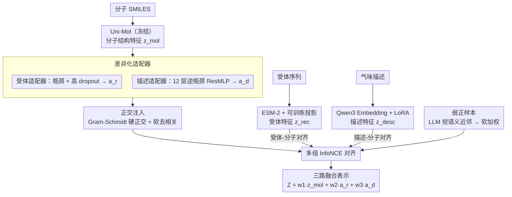

# NOSE: Neural Olfactory-Semantic Embedding with Tri-Modal Orthogonal Contrastive Learning

**会议**: ACL 2026  
**arXiv**: [2604.10452](https://arxiv.org/abs/2604.10452)  
**代码**: [GitHub](https://github.com/Xianyusyy/NOSE)  
**领域**: 可解释性  
**关键词**: 嗅觉表示学习, 三模态对齐, 正交解耦, 对比学习, 弱正样本

## 一句话总结
提出 NOSE 三模态嗅觉表示学习框架，以分子为枢纽通过正交注入机制对齐分子结构、受体序列和自然语言描述三个模态，配合 LLM 驱动的弱正样本策略缓解描述稀疏问题，在 11 个下游任务上达到 SOTA 并展现优秀的零样本泛化能力。

## 研究背景与动机

**领域现状**：嗅觉是最难数字化的感官——视觉有像素、听觉有频谱，但嗅觉缺乏稳定的物理量到感知的映射。嗅觉感知链条为：分子结构 → 受体结合 → 神经信号 → 语言描述。

**现有痛点**：(1) 现有方法只建模嗅觉通路的片段（仅分子结构、或仅分子-描述/受体对应），从未在统一框架中捕获完整的分子→受体→语义链；(2) 主流方法将气味预测建模为分类问题（"花香"or"果香"），破坏了气味空间的连续性——"薄荷"和"清凉"高度相关但在分类框架下是独立标签；(3) 分类目标迫使模型拟合标签边界，丢弃了对分子结构重要但对分类无用的信息。

**核心矛盾**：完整的三模态数据（分子-受体-描述三元组）极其稀缺，但双模态数据（分子-受体 和 分子-描述）可分别获取。如何在没有三元组标注的情况下实现三模态对齐？

**本文目标**：构建覆盖完整嗅觉感知通路的连续表示空间，使分子表示同时编码受体信息和语义信息且互不干扰。

**切入角度**：分子是两个双模态数据集的唯一交集，可作为枢纽桥接受体和语义信息。关键问题是防止两种信号在注入时相互覆盖——解决方案是正交注入。

**核心 idea**：将受体特征和语义特征作为正交增量叠加到分子表示上，通过 Gram-Schmidt 正交化保证模态独立，同时用 LLM 挖掘气味描述符间的语义近邻关系扩展稀疏标签。

## 方法详解

### 整体框架

NOSE 要在没有"分子-受体-描述"三元组标注的前提下，把完整嗅觉通路压进一个连续表示空间。它以分子为枢纽：Uni-Mol 冻结地抽出分子 3D 结构特征 $z_{mol}$，ESM-2 配可训练投影层抽出受体序列特征 $z_{rec}$，Qwen3 Embedding 经 LoRA 微调抽出气味描述特征 $z_{desc}$；分子嵌入再经双适配器分解为受体对齐分量 $a_r$ 和描述对齐分量 $a_d$，两者被正交化后用多组 InfoNCE 损失对齐到各自模态。这样分子是两个双模态数据集的唯一交集，就成了间接桥接受体与语义的支点，而推理时只需保留分子编码器和适配器即可输出三模态融合表示。

### 关键设计

**1. 差异化适配器：用结构差异吸收两个数据集 20 倍的规模落差**

分子表示 $z_{mol}$ 要分别向受体和描述两个模态对齐，但两个数据集规模悬殊——受体数据只有 3,877 对，而描述数据多达 88,512 对，规模差超过 20 倍，统一架构必然在一端过拟合、另一端欠拟合。NOSE 为两条路设计不同容量的适配器：描述适配器用 12 层逆瓶颈 ResMLP，以高容量吃下丰富文本，输出描述对齐分量 $a_d$；受体适配器用带高 dropout 的瓶颈结构，以强正则防止在稀疏数据上过拟合，输出受体对齐分量 $a_r$。结构上的差异正好匹配数据量上的差异，让两个模态都被恰当地拟合。

**2. 正交注入：让受体信号和语义信号各占一块互不覆盖的子空间**

简单地把上一步的两路分量 $a_r$、$a_d$ 叠加到分子表示上会导致信息冗余与相互覆盖——后注入的信号会抹掉先注入的。NOSE 用两道正交约束来隔离它们。硬正交化做几何解耦，通过 Gram-Schmidt 把适配器输出投影到 $z_{mol}$ 的正交补空间：$z_{adapter} = a_{adapter} - \frac{a_{adapter} \cdot z_{mol}}{\|z_{mol}\|^2 + \epsilon} z_{mol}$，保证增量与分子主干垂直。软正交化做优化层面的去相关，用正则项 $\mathcal{L}_{orth} = \sum_{(i,j)} \|\frac{z_i}{\|z_i\|} \cdot \frac{z_j}{\|z_j\|}\|^2$ 驱动三个子空间保持互相去相关。两者合力让每个模态贡献独特且不可替代的信息，从而把受体和语义同时注入分子表示而不打架。

**3. LLM 驱动的弱正样本：把离散气味标签软化成连续语义流形**

对齐分量靠对比损失训练，但气味描述天然稀疏，传统对比学习会把"lemon"和"sour"当成负样本互相排斥，可它们在嗅觉空间里本应相邻，这种假负样本会让表示退化。NOSE 用 DeepSeek 挖掘 1,086 个气味描述符之间的语义近邻关系，把孤立标签扩展成连续的气味语义邻域，并在描述-分子对比学习中给正样本权重 1.0、弱正样本权重 0.5、负样本权重 0.0，得到一个软化的 InfoNCE 损失。这样语义相近的描述不再互斥，离散标签空间被重塑为连续语义流形。

### 损失函数 / 训练策略

总损失由受体-分子 InfoNCE、描述-分子软加权 InfoNCE、模态内 InfoNCE 与正交约束损失共同构成。训练时分子编码器 Uni-Mol 冻结，ESM-2 仅训练投影层，Qwen3 Embedding 用 LoRA 微调。最终表示为三路加权融合 $Z = w_1 \cdot z_{mol} + w_2 \cdot a_r + w_3 \cdot a_d$。

## 实验关键数据

### 主实验（基础感知属性预测，Pearson 相关系数）

| 方法 | 阈值(Abraham) | 愉悦度(Keller) | 愉悦度(Sagar) | 强度(Keller) | 强度(Sagar) | 强度(Ravia) |
|------|-------------|---------------|---------------|-------------|-------------|-------------|
| Uni-Mol | 0.78 | 0.68 | 0.14 | 0.27 | 0.37 | 0.31 |
| ChemBERTa | 0.81 | 0.65 | 0.15 | 0.39 | 0.45 | 0.47 |
| **NOSE** | **0.84** | **0.71** | **0.40** | **0.42** | **0.47** | **0.49** |

### 消融实验

| 配置 | 关键指标 | 说明 |
|------|---------|------|
| NOSE (完整) | SOTA | 三模态+正交+弱正样本 |
| w/o 受体模态 | 下降显著 | 仅双模态，缺少生物学接地 |
| w/o 正交约束 | 下降 | 模态特征冗余 |
| w/o 弱正样本 | 下降 | 假负样本导致表示退化 |

### 关键发现
- NOSE 在 11 个下游任务中全面达到或超越 SOTA，尤其在稀疏数据集（Sagar）上提升最大（Pearson 从 0.14 跃升至 0.40）
- 零样本泛化表现优异，验证了表示空间与人类嗅觉直觉的强一致性
- 混合物感知任务上也表现良好，说明学到的表示能捕获分子间非线性交互

## 亮点与洞察
- 以分子为枢纽实现无三元组标注的三模态对齐是核心创新——利用双模态数据的交集间接桥接第三模态
- 正交注入的设计哲学值得迁移：在任何多模态融合中，当不同信号源提供互补而非冗余信息时，正交约束都能防止信息覆盖
- 弱正样本策略将离散标签空间"软化"为连续流形，是对比学习中处理标签稀疏的通用技巧

## 局限与展望
- 受体数据仅 3,877 对，规模仍然有限，随着更多受体-配体数据积累效果可能进一步提升
- 当前仅考虑单一分子的气味预测，真实场景中混合气味的组合效应更为复杂
- 嗅觉描述的主观性问题本质上无法完全解决，不同文化背景下的气味描述差异较大

## 相关工作与启发
- **vs POM**: POM 仅建模分子-描述双模态，缺少受体信息的生物学接地；NOSE 的三模态对齐在感知属性预测上一致优于 POM
- **vs Uni-Mol**: Uni-Mol 作为分子编码器表现已经很强，但 NOSE 通过注入受体和语义信息进一步提升了所有任务
- **vs 分类方法**: 传统分类方法无法捕获气味空间的连续性，NOSE 的表示学习范式根本性地解决了这个问题

## 评分
- 新颖性: ⭐⭐⭐⭐⭐ 首个覆盖完整嗅觉通路的三模态框架，正交注入机制新颖
- 实验充分度: ⭐⭐⭐⭐⭐ 11个下游任务，6个数据集，丰富的消融和零样本实验
- 写作质量: ⭐⭐⭐⭐⭐ 动机推导清晰，图表精美，背景介绍友好
- 价值: ⭐⭐⭐⭐ 嗅觉计算是新兴交叉领域，框架设计可迁移到其他多模态场景

<!-- RELATED:START -->

## 相关论文

- [\[ICLR 2026\] Modal Logical Neural Networks for Financial AI](../../ICLR2026/interpretability/modal_logical_neural_networks_for_financial_ai.md)
- [\[AAAI 2026\] Explainable Melanoma Diagnosis with Contrastive Learning and LLM-based Report Generation](../../AAAI2026/interpretability/explainable_melanoma_diagnosis_with_contrastive_learning_and_llm-based_report_ge.md)
- [\[CVPR 2025\] Learning Visual Composition through Improved Semantic Guidance](../../CVPR2025/interpretability/learning_visual_composition_through_improved_semantic_guidance.md)
- [\[AAAI 2026\] Adaptive Evidential Learning for Temporal-Semantic Robustness in Moment Retrieval](../../AAAI2026/interpretability/adaptive_evidential_learning_for_temporal-semantic_robustnes.md)
- [\[ICML 2026\] Neural Collapse by Design: Learning Class Prototypes on the Hypersphere](../../ICML2026/interpretability/neural_collapse_by_design_learning_class_prototypes_on_the_hypersphere.md)

<!-- RELATED:END -->
