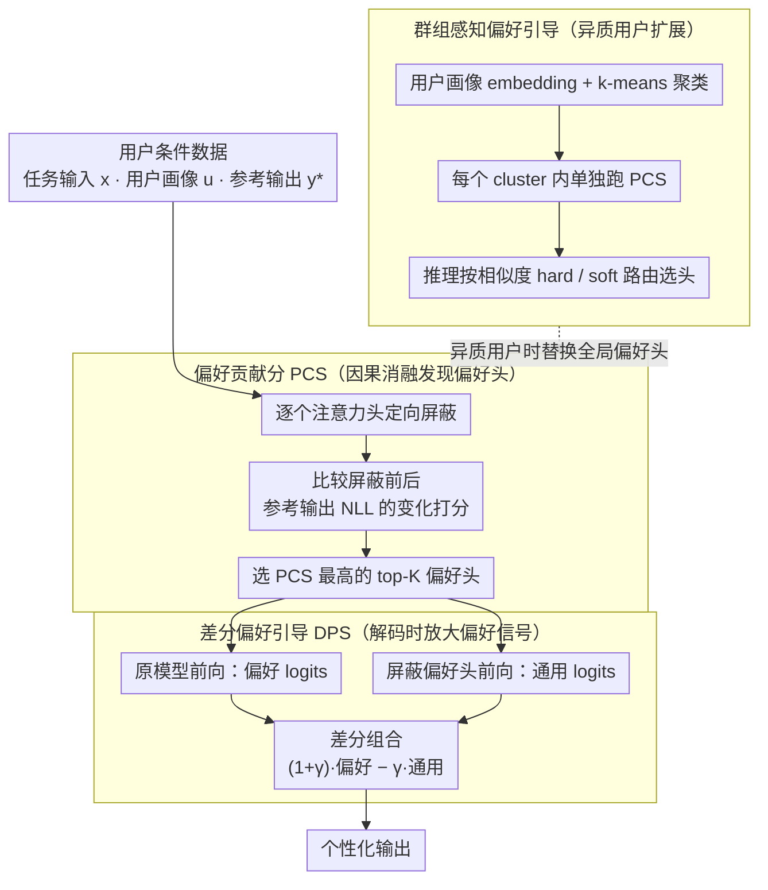

# Preference Heads in Large Language Models: A Mechanistic Framework for Interpretable Personalization

**会议**: ACL2026  
**arXiv**: [2604.22345](https://arxiv.org/abs/2604.22345)  
**代码**: https://github.com/weixuzhang/DPS  
**领域**: 可解释性 / 个性化生成 / LLM  
**关键词**: 机制可解释性, 注意力头, 个性化生成, 对比解码, 用户偏好

## 一句话总结
这篇论文提出 Preference Heads 与 Differential Preference Steering，用因果消融找出少量承载用户偏好的注意力头，再在解码时放大这些头带来的偏好信号，从而在不改模型参数的情况下提升个性化生成与预测效果。

## 研究背景与动机
**领域现状**：LLM 已经表现出很强的隐式个性化能力。给定用户历史、画像或少量偏好描述后，模型往往能在语气、主题选择、标题风格、推荐理由等方面向用户靠拢。现有个性化 LLM 方法主要沿三条路线推进：一是把用户信息写进 prompt 或检索增强上下文，二是用用户数据做微调或偏好学习，三是在解码阶段用对比方法改变输出分布。

**现有痛点**：这些方法大多把模型当成黑箱。它们能让输出看起来更符合用户，但很难回答一个更机制性的问题：模型内部到底在哪里表示用户偏好？是所有层都在均匀贡献，还是少数模块在关键时刻起作用？如果只能看到最终文本指标，就很难做可解释分析，也难以判断个性化失败时是用户画像不准、检索不准，还是模型内部偏好通路没有被激活。

**核心矛盾**：个性化需要增强用户相关信号，但语言模型的 logits 同时混合了通用语言能力、任务内容约束和用户偏好信号。纯 prompt 或纯微调能改变整体行为，却不区分“哪些内部组件在传递偏好”。如果偏好信号确实是稀疏、局部的，那么全局式干预既不透明，也可能引入多余噪声。

**本文目标**：作者希望把个性化从黑箱行为拆成一个可定位的机制问题：先找出哪些 attention heads 对用户对齐输出有因果贡献，再利用这些 heads 在推理阶段做可控的偏好增强，同时保持内容相关性和生成流畅度。

**切入角度**：论文借鉴了 mechanistic interpretability 中对 induction heads、retrieval heads、factuality heads 的分析思路。既然某些 transformer 行为可以由少数专门化注意力头解释，那么用户风格和主题偏好也可能存在类似的“偏好头”。关键不是看相关性或激活强度，而是通过消融验证：拿掉某个头后，模型对用户参考输出的似然是否下降。

**核心 idea**：用因果 head ablation 发现 Preference Heads，再通过“原模型 logits 减去屏蔽偏好头后的 generic logits”的差分信号，在解码时强化用户偏好方向。

## 方法详解
这篇论文的主线可以拆成三步：第一步，定义并发现 Preference Heads；第二步，用这些 heads 做 Differential Preference Steering；第三步，面对不同用户偏好不共享的问题，用用户聚类和加权路由做异质偏好扩展。

### 整体框架
输入是一组用户条件数据，每个样本包含任务输入 $x$、用户画像或历史 $u$、参考输出 $y^*$。作者先离线遍历模型里的 attention heads，对每个 head 做定向屏蔽，衡量屏蔽后用户参考输出的负对数似然是否变差。变差越多，说明这个 head 对用户对齐输出越重要。分数最高的少量 heads 被选为 Preference Heads。

推理时，DPS 对同一个上下文做两种前向：一条是原模型，得到 preference-conditioned logits；另一条是屏蔽 Preference Heads 后的模型，得到更偏通用行为的 generic logits。然后把两者的差异放大，得到最终解码 logits。这样做的直觉是：原模型和屏蔽模型之间的差别，主要就是被偏好头贡献出来的个性化信号。

如果用户群体差异很大，论文还会先把用户画像编码成 embedding 并聚类。每个 cluster 内重新发现 Preference Heads，推理时根据用户到各 cluster 的相似度做 hard routing 或 soft routing，避免把所有用户的偏好头粗暴合并成一个全局集合。

### 关键设计
**1. Preference Contribution Score：用因果消融给每个注意力头打一个个性化贡献分**

很多可解释性分析停在激活可视化或相关性统计上，看得到某个 head 在“亮”，却说不清它是否真的改变了输出。PCS 直接用 intervention 回答这个问题：对第 $l$ 层第 $k$ 个 head $h_{l,k}$ 做定向屏蔽，比较屏蔽模型 $M_{\theta \setminus h_{l,k}}$ 与原模型 $M_\theta$ 在用户参考输出上的平均负对数似然，定义 $PCS(h_{l,k}) = E[L(M_{\theta \setminus h_{l,k}}, x, u, y^*) - L(M_\theta, x, u, y^*)]$。如果 PCS 为正且较大，说明拿掉这个 head 会显著降低用户对齐输出的概率，它就不只是“相关”，而是对个性化行为有因果贡献。这种和“个性化输出似然”直接绑定的因果评估，比单看 attention 权重大小可靠得多。

**2. Differential Preference Steering：解码时放大偏好头贡献的差分信号，不动一个参数**

直接强行指定输出风格容易损伤内容一致性，DPS 换了个思路。它对同一上下文分别算原模型 logits $l_t^{pref}$ 和屏蔽 Preference Heads 后的 logits $l_t^{gen}$，再组合成 $\tilde{l}_t = (1 + \gamma) l_t^{pref} - \gamma l_t^{gen}$：$\gamma = 0$ 时退化为原模型，$\gamma$ 增大时模型会更强调原模型相对 generic 模型多出来的那部分偏好方向。因为这个差异主要就是被偏好头贡献出来的个性化信号，DPS 更像是在增强模型内部已有的偏好通路，而不是从外部塞一个新控制目标进去——它放大的是模型“已经想说”的个性化倾向。

**3. Cluster-aware Preference Steering：按用户群组分别发现偏好头，避免全局集合稀释信号**

实验里的 Jaccard overlap 分析显示，不同用户的 top-K Preference Heads 大多重叠很低，若把所有用户的偏好头粗暴合并成一个全局集合，真正有用的信号会被稀释。为此 DPS 先用用户历史文本得到 profile embedding，再用 k-means 等方式把用户分成若干偏好群组，每个 cluster 内单独跑一遍 PCS 发现流程得到 cluster-specific head set。推理时既可以把用户硬分配到最近 cluster，也可以按用户到各 cluster 的相似度做 soft routing。这样在个体化和统计稳定性之间取得折中：相似用户共享 head 既保留了个性化，又不至于让单用户的稀疏样本把偏好头估歪。

### 损失函数 / 训练策略
DPS 本身不训练模型参数，也不需要额外微调。离线阶段只用参考输出计算每个 head 的负对数似然变化，并据此选择 top-K heads。推理阶段多做一次屏蔽 Preference Heads 的前向，用差分 logits 控制生成强度。论文还分析了 $K$ 和 routing 策略：较小 $K$ 会漏掉偏好信号，较大 $K$ 会逐渐引入噪声；hard routing 更适合分类任务，soft routing 在生成任务上更稳。

## 实验关键数据

### 主实验
论文在 LaMP 个性化基准上评估 LLaMA-3-8B-Instruct、Qwen2-7B-Instruct、Mistral-7B-Instruct，任务覆盖新闻标题生成、学术标题生成、推文改写、引用识别、电影标签和商品评分。生成任务使用 ROUGE-1、ROUGE-L、METEOR；分类任务使用 Accuracy / F1；回归任务使用 MAE / RMSE。对比方法包括 CAD、DeCoRe 和 DoLa。

| 模型 | 方法 | 新闻标题 R-1 / R-L / METEOR | 学术标题 R-1 / R-L / METEOR | 推文改写 R-1 / R-L / METEOR |
|------|------|------------------------------|-------------------------------|-------------------------------|
| LLaMA-3-8B | CAD | 0.1681 / 0.1498 / 0.1568 | 0.3530 / 0.3068 / 0.3925 | 0.3368 / 0.2893 / 0.2813 |
| LLaMA-3-8B | DeCoRe | 0.1768 / 0.1572 / 0.1626 | 0.4010 / 0.3527 / 0.4004 | 0.3231 / 0.2764 / 0.2729 |
| LLaMA-3-8B | DoLa | 0.1694 / 0.1508 / 0.1592 | 0.3636 / 0.3117 / 0.4079 | 0.3365 / 0.2877 / 0.2795 |
| LLaMA-3-8B | DPS | 0.1787 / 0.1596 / 0.1650 | 0.3243 / 0.2787 / 0.3826 | 0.3389 / 0.2898 / 0.2884 |
| Qwen2-7B | CAD | 0.1580 / 0.1392 / 0.1255 | 0.4197 / 0.3780 / 0.4381 | 0.3590 / 0.3106 / 0.3384 |
| Qwen2-7B | DeCoRe | 0.1581 / 0.1305 / 0.1232 | 0.4311 / 0.3729 / 0.4565 | 0.3470 / 0.3065 / 0.3173 |
| Qwen2-7B | DoLa | 0.1642 / 0.1473 / 0.1272 | 0.4277 / 0.3746 / 0.4596 | 0.3524 / 0.3046 / 0.3246 |
| Qwen2-7B | DPS | 0.1627 / 0.1450 / 0.1318 | 0.4071 / 0.3421 / 0.4230 | 0.3533 / 0.2981 / 0.3269 |
| Mistral-7B | CAD | 0.1361 / 0.1132 / 0.0980 | 0.4375 / 0.3712 / 0.4561 | 0.3342 / 0.2916 / 0.3097 |
| Mistral-7B | DeCoRe | 0.1299 / 0.1085 / 0.0908 | 0.4135 / 0.3648 / 0.4419 | 0.3407 / 0.2927 / 0.2978 |
| Mistral-7B | DoLa | 0.1362 / 0.1136 / 0.0962 | 0.4364 / 0.3733 / 0.4605 | 0.3291 / 0.2852 / 0.3026 |
| Mistral-7B | DPS | 0.1536 / 0.1366 / 0.1399 | 0.3983 / 0.3350 / 0.4162 | 0.3441 / 0.2998 / 0.2990 |

这个表格最明显的结论是：DPS 在新闻标题生成和推文改写上非常稳定，尤其 Mistral-7B 的新闻标题指标从 CAD 的 0.1361 / 0.1132 / 0.0980 提升到 0.1536 / 0.1366 / 0.1399。学术标题生成上，DeCoRe 或 DoLa 在若干模型上更强，说明 Preference Heads 不是对所有任务都绝对占优；但 DPS 的优势是跨任务一致性更好，特别适合需要保持用户风格的短文本生成。

| 模型 | 方法 | 引用识别 Acc / F1 | 电影标签 Acc / F1 | 商品评分 MAE / RMSE |
|------|------|-------------------|-------------------|---------------------|
| LLaMA-3-8B | CAD | 0.6240 / 0.6070 | 0.4552 / 0.3839 | 0.4426 / 0.9300 |
| LLaMA-3-8B | DeCoRe | 0.6232 / 0.6200 | 0.4639 / 0.4034 | 0.4442 / 0.9458 |
| LLaMA-3-8B | DoLa | 0.6156 / 0.5961 | 0.2800 / 0.1643 | 0.4200 / 0.8718 |
| LLaMA-3-8B | DPS | 0.6356 / 0.6288 | 0.4610 / 0.3910 | 0.4236 / 0.9278 |
| Qwen2-7B | CAD | 0.6230 / 0.6250 | 0.1850 / 0.1181 | 0.3180 / 0.6240 |
| Qwen2-7B | DeCoRe | 0.5400 / 0.5891 | 0.2320 / 0.1217 | 0.3250 / 0.6325 |
| Qwen2-7B | DoLa | 0.6790 / 0.6795 | 0.2412 / 0.0958 | 0.3200 / 0.6300 |
| Qwen2-7B | DPS | 0.6932 / 0.7078 | 0.3902 / 0.3202 | 0.3276 / 0.6719 |

分类/回归结果显示，DPS 在 LLaMA-3-8B 的引用识别上达到 0.6356 / 0.6288，在 Qwen2-7B 的引用识别上达到 0.6932 / 0.7078，并在 Qwen2-7B 的电影标签任务上明显高于 CAD、DeCoRe、DoLa。商品评分作为回归任务更混合，LLaMA-3-8B 上 DoLa 的误差最低，Qwen2-7B 上 CAD 的误差更低，说明偏好头放大并不总是等价于数值预测最优。

### 消融实验

| 分析项 | 结果 | 说明 |
|--------|------|------|
| Preference Heads 稀疏性 | 高 PCS heads 在 layer-head 热图中呈局部集中分布 | 个性化不像是所有 heads 平均贡献，而是由少数内部组件主导 |
| 跨用户重叠 | top-K head sets 的 pairwise Jaccard overlap 多数接近 0 | 不同用户依赖的偏好通路差异明显，支持 cluster-aware 设计 |
| 随机 heads 对照 | 用随机 heads 替代 Preference Heads 会稳定降级 | DPS 的增益来自有语义意义的因果组件，而不是任意稀疏屏蔽 |
| K 值敏感性 | K 增大时性能先升后饱和，过多 heads 会引入噪声 | 用户偏好信号集中在有限 head 集合中，中等规模更合适 |
| 路由策略 | hard routing 在分类任务略好，soft routing 在生成任务更稳 | 离散任务受益于更强专门化，生成任务受益于更平滑的偏好混合 |

论文还报告了推理开销。DPS 每个 decoding step 需要原模型和屏蔽偏好头模型两次前向，但共享 prompt prefill，因此上下文越长，相对开销越低。

| Prompt 长度 | 标准解码 TFlop | DPS TFlop | 相对开销 |
|-------------|----------------|-----------|----------|
| 512 | 6.57 | 6.96 | 1.06x |
| 1024 | 13.04 | 13.43 | 1.03x |
| 2048 | 26.80 | 27.21 | 1.02x |

人类与 LLM-as-judge 评估集中在 LaMP-4 新闻标题任务。人工标注者在匿名成对比较中更偏好 DPS 的用户画像匹配度；GPT-5.2 评估也显示 DPS 在相关性、流畅度、风格、偏好对齐和事实性上均高于 CAD。

| 评估维度 | CAD | DPS |
|----------|-----|-----|
| Relevance | 3.97 | 4.45 |
| Fluency | 4.51 | 4.83 |
| Style | 3.62 | 3.91 |
| Alignment | 3.63 | 3.93 |
| Factuality | 4.08 | 4.21 |

### 关键发现
- Preference Heads 是稀疏且用户相关的。PCS 热图不是均匀铺满所有层，而是在少数 heads 上出现高分，这让“个性化可以被局部电路解释”的论点更有说服力。
- 用户之间的偏好头重叠很低。这个发现很重要，因为它反过来解释了为什么简单的全局个性化头集合可能不稳定，也为什么 cluster-aware routing 是必要补充。
- DPS 的优势主要体现在个性化生成与分类任务上，尤其是需要把用户历史映射为风格或主题偏好的任务。对商品评分这类数值回归任务，偏好信号放大不一定总能降低误差。
- 效率分析比直觉更乐观。虽然 decoding 有第二次前向，但由于不重复 prefill，在 2048 token prompt 下估计 FLOPs 只从 26.80 增加到 27.21，约 1.02x。
- 自动指标并不能完全衡量个性化质量。作者补充人工和 LLM 评估是合理的，因为标题是否“像这个用户会写/会喜欢”往往不只体现在 ROUGE 或 METEOR 上。

## 亮点与洞察
- 最大亮点是把个性化从“外部条件控制”转成“内部组件定位”。这让个性化 LLM 不只是调 prompt 或调参数，而是可以问：哪些 attention heads 在携带用户偏好？
- PCS 的设计很干净：它用消融后的似然变化定义贡献，而不是简单看 attention 权重大小。对可解释性研究来说，这种因果评估比可视化更可靠。
- DPS 把机制分析和解码控制连接起来。很多 mechanistic interpretability 工作停在解释层面，而这篇论文进一步把找到的 heads 变成可用的生成控制信号。
- Cluster-aware 扩展抓住了个性化的本质：用户偏好不是一个全局属性。偏好头低重叠这个实验结果提醒我们，个性化系统若想稳定，通常需要在用户级和群组级之间做层次化建模。
- 这篇论文对“可解释个性化”有启发：未来可以不只解释风格偏好，也可以分析推荐理由、写作结构、引用偏好、领域术语选择等更细粒度行为是否对应不同内部组件。

## 局限与展望
- DPS 需要访问模型内部 attention heads 和中间激活，因此不适用于只能调用黑箱 API 的模型。这限制了它在封闭商业模型上的直接使用。
- 推理时需要第二次前向，虽然 FLOPs 增量在长上下文下不高，但对极低延迟场景仍可能成为负担。
- PCS 发现阶段是离线计算，若用户画像频繁变化或用户数量极大，如何高效更新 Preference Heads 仍需要进一步研究。
- 实验主要围绕 LaMP，覆盖任务虽多，但还不足以说明 Preference Heads 在长程对话、多轮偏好漂移、隐私敏感画像、跨语言个性化等场景中同样稳定。
- 显式放大用户偏好可能带来偏见强化问题。如果用户历史有噪声、片面或包含不良倾向，DPS 可能把这些窄化模式进一步强化。论文也承认了这一点，因此后续应加入偏好质量评估和安全约束。
- 机制解释仍然是 head 级别的。Preference Heads 能说明“哪里起作用”，但尚未完全解释 head 内部如何编码具体风格、主题或价值偏好。

## 相关工作与启发
- **vs Prompt / Retrieval 个性化**: 这些方法从外部给模型更多用户上下文，本文则追问模型内部哪个组件在吸收和传递用户信号。前者更容易落地，后者更可解释，也更适合做机制分析。
- **vs Fine-tuning / Preference Learning**: 微调能强力改变模型行为，但会引入训练成本和参数更新。DPS 不改参数，适合把个性化作为推理时控制信号，但表达能力也受限于原模型内部是否已经存在可用偏好通路。
- **vs CAD / DoLa / DeCoRe**: CAD 对比上下文强弱，DoLa 对比不同层，DeCoRe 对比 retrieval heads；DPS 的区别在于对比对象是因果识别出的 personalization heads。因此它不是泛化的对比解码技巧，而是任务机制驱动的解码控制。
- **vs Retrieval Heads / Factuality Heads 分析**: 这篇论文把“专门化 heads”从事实检索扩展到用户偏好。启发是，未来很多高层行为都可以先做因果组件发现，再把发现结果用于轻量控制。
- **对后续研究的启发**: 可以把 PCS 思路用于发现“安全偏好头”“礼貌风格头”“领域术语头”或“引用习惯头”，但需要谨慎区分可解释分析和行为控制，尤其要避免把不可靠用户画像当成应被放大的真偏好。

## 评分
- 新颖性: ⭐⭐⭐⭐☆ 把 mechanistic interpretability 引入 LLM 个性化，并用 Preference Heads 连接因果发现与解码控制，问题切得很有辨识度。
- 实验充分度: ⭐⭐⭐⭐☆ LaMP 多任务、多模型、主结果、消融、效率和人工评估都覆盖到了；不足是 benchmark 仍较集中，真实多轮用户场景还不够。
- 写作质量: ⭐⭐⭐⭐☆ 论文结构清楚，PCS 与 DPS 的逻辑链顺畅，图表也能支持核心论点；但部分表格中不同任务的胜负关系需要读者仔细区分。
- 价值: ⭐⭐⭐⭐☆ 对可解释个性化和推理时控制都有参考价值，尤其适合启发“先找内部机制，再做轻量控制”的研究路线。

<!-- RELATED:START -->

## 相关论文

- [\[ACL 2026\] Embracing Anisotropy: Turning Massive Activations into Interpretable Control Knobs for Large Language Models](embracing_anisotropy_turning_massive_activations_into_interpretable_control_knob.md)
- [\[ACL 2025\] Mechanistic Interpretability of Emotion Inference in Large Language Models](../../ACL2025/interpretability/mechanistic_interpretability_of_emotion_inference_in_large_language_models.md)
- [\[ACL 2026\] FineSteer: A Unified Framework for Fine-Grained Inference-Time Steering in Large Language Models](finesteer_a_unified_framework_for_fine-grained_inference-time_steering_in_large_.md)
- [\[ACL 2026\] Retrieval Heads are Dynamic](retrieval_heads_are_dynamic.md)
- [\[ACL 2026\] From Interpretability to Performance: Optimizing Retrieval Heads for Long-Context Language Models](from_interpretability_to_performance_optimizing_retrieval_heads_for_long-context.md)

<!-- RELATED:END -->
