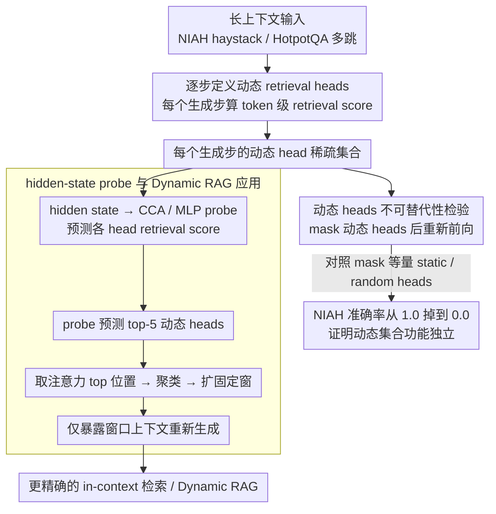

# Retrieval Heads are Dynamic

**会议**: ACL2026  
**arXiv**: [2602.11162](https://arxiv.org/abs/2602.11162)  
**代码**: 无公开代码  
**领域**: 信息检索 / 机制可解释性 / Dynamic RAG  
**关键词**: retrieval heads、动态注意力头、长上下文、HotpotQA、动态RAG

## 一句话总结
本文证明 LLM 中负责从上下文取信息的 retrieval heads 并不是固定集合，而会随生成步动态变化、不可被静态 heads 替代，并可由 hidden states 预测，从而能提升动态 RAG 的检索效果。

## 研究背景与动机
**领域现状**：已有机制可解释性研究发现 Transformer attention heads 会出现功能分化，例如 induction heads、attention sinks 和 retrieval heads。Retrieval heads 通常被认为负责从输入上下文中复制或提取关键信息，是长上下文利用和 in-context retrieval 的重要内部机制。

**现有痛点**：过去识别 retrieval heads 的方法大多把它们看成一个静态集合：在大量样本上统计哪些 heads 经常指向目标信息，然后取 top-k 作为模型的 retrieval heads。这种做法适合全局平均分析，但忽略了 autoregressive generation 中每个 token 的状态和需求都在变化。

**核心矛盾**：如果 retrieval heads 实际上是 step-specific 的，那么静态 top heads 只是一种平均近似。某些很少在全局统计中出现的长尾 heads，可能在特定上下文和特定生成步承担不可替代的检索功能；静态剪枝、静态 KV cache 压缩或静态 RAG 触发策略就可能误删关键机制。

**本文目标**：作者围绕三个 claim 展开：retrieval heads 是否动态变化；动态 heads 是否可由静态 heads 替代；模型 hidden state 是否提前编码未来 retrieval head pattern。随后把这些发现推广到 HotpotQA 多跳问答，并用动态 head selection 改造 Dynamic RAG。

**切入角度**：论文把 retrieval head 的定义从 dataset-level 统计改为 timestep-level 行为，直接观察每个生成步哪些 heads 正在检索目标信息。这种粒度更贴近 LLM 真实生成过程。

**核心 idea**：把 retrieval heads 视作由当前上下文和生成状态决定的动态稀疏集合，并用 hidden-state probe 预测当前需要的 heads，再将其用于更精确的 in-context retrieval。

## 方法详解

### 整体框架
论文先在 Needle-in-a-Haystack 任务上定义 copy-paste retrieval score：如果某个 head 在当前步最高注意力落在 needle token 上，且该 token 与即将生成 token 一致，则该 head 的 retrieval score 为 1。基于这个定义，作者逐步验证动态性、不可替代性和 hidden-state correlation。然后在 HotpotQA 上把定义放宽为 reasoning retrieval score，即 attention 分配给 supporting facts 的比例。最后，作者将动态 heads 接入改造版 DRAGIN，在需要检索时只暴露动态 heads 关注的上下文窗口，比较动态、静态和随机策略。

### 关键设计
**1. 逐步定义动态 retrieval heads：把检索头从数据集统计改成 token 级行为**

过去识别 retrieval heads 是在大量样本上统计哪些 heads 经常指向目标信息、取 top-k，这种平均近似会低估那些只在特定 token 或特定上下文下才激活的 heads。本文把定义下放到每个生成步：在 NIAH 中，head $h$ 在 timestep $t$ 的 copy-paste retrieval score 为 $1[i^*\in I_{needle}\land x^t_{i^*}=\hat{y}]$，其中 $i^*$ 是该 head 当前步最高注意力 token 的位置——只有当这个 head 正盯着 needle、且 needle token 恰好等于即将生成的 token 时才记 1。与静态 top-k 不同，这个集合每一步都重新计算，因此能捕捉到“长上下文检索并不是持续由同一批 heads 完成”这件事。

**2. 动态 heads 的不可替代性检验：mask 掉看模型会不会崩**

光说动态集合在变还不够，得证明它不是静态 heads 的另一种视角。作者每个生成步先正常 forward 识别出动态 retrieval heads，再把它们 mask 掉重新生成同一步 token，对照组则 mask 等量的 top static heads 或 random heads；进一步还逐步 mask $k$ 个动态 heads，观察模型会不会补偿性地激活静态 heads。结果是即使模型确实去激活了 static top heads 来补偿，NIAH accuracy 仍从 1.0 掉到 0.0。这说明动态 heads 承担的是 context-specific 功能，静态 heads 顶不上来——动态集合有独立的功能必要性，而不是更大静态集合里的简单子集。

**3. hidden-state probe 与 Dynamic RAG 应用：证明动态模式可预测，再拿来控检索**

如果动态 heads 只能事后识别，工程价值有限；本文要证明它在生成前就可预测。作者先用 temporal-offset CCA 测 timestep $n$ 的 final hidden state 与未来 $n+k$ 步 retrieval scores 的相关性，发现 $k=0$ 的 top-1 canonical correlation 高达 0.966，$k=1$、$k=2$ 仍有 0.931、0.915——模型在生成前已经编码了即将需要哪些检索机制。基于此训练一个 MLP probe，从 final hidden state 预测所有 heads 的 retrieval score pattern。在改造版 Dynamic RAG 里，probe 预测 top-5 dynamic heads，按这些 heads 的 attention top positions 聚类并展开上下文窗口，只让模型看到这些局部片段。可预测这一步是关键：它让动态机制从“后验分析”变成“在线控制信号”，可以接到动态 KV cache、动态检索触发或 hallucination monitoring 上。

### 损失函数 / 训练策略
本文主体是分析论文，没有训练新的 LLM。MLP probe 在 NIAH 中做二分类，输入为 final hidden state，目标为各 attention head 的 binary retrieval score；在 HotpotQA 中做回归，预测连续 reasoning retrieval score。Dynamic RAG 部分使用 probe 预测 top-5 dynamic heads，并与 DRAGIN 的 RIND 检索触发策略结合。

## 实验关键数据

### 主实验
NIAH 上的统计结果显示，动态 retrieval heads 分布在远大于 top-20 静态集合的长尾 heads 中，且相邻生成步的 heads 集合变化明显。

| 模型 | 每步动态 heads 数 | 激活过的 heads / 总 heads | 与 top-20 static Jaccard | 相邻步 Jaccard | Entropy |
|------|-------------------|---------------------------|--------------------------|----------------|---------|
| Llama-3.1-8B | 12.97 ± 7.69 | 238 / 1024 | 0.3512 | 0.2793 | 3.8154 |
| Llama-3.2-3B | 9.69 ± 6.18 | 149 / 672 | 0.3126 | 0.3188 | 3.0083 |
| Qwen3-8B | 20.18 ± 10.43 | 415 / 1152 | 0.4611 | 0.3668 | 4.1038 |
| Llama-2-13B | 6.20 ± 5.49 | 172 / 1600 | 0.2077 | 0.4979 | 4.8973 |
| Phi-4-mini | 6.13 ± 7.09 | 176 / 768 | 0.1845 | 0.5056 | 3.5532 |

MLP probe 能从 hidden state 解码 retrieval score pattern，说明动态 heads 不是纯随机波动，而是内在状态可预测的功能模式。

| 模型 | Precision | Recall | F1 | AUPRC |
|------|-----------|--------|----|-------|
| Llama-3.1-8B | 0.8344 | 0.8353 | 0.8349 | 0.9173 |
| Llama-3.2-3B | 0.8564 | 0.8351 | 0.8456 | 0.9289 |
| Qwen3-8B | 0.8780 | 0.8362 | 0.8566 | 0.9339 |
| Llama-2-13B | 0.8455 | 0.8220 | 0.8336 | 0.9183 |
| Phi-4-mini | 0.8219 | 0.7865 | 0.8038 | 0.8862 |

### 消融实验
HotpotQA 上，作者把 retrieval score 改为 supporting facts attention ratio，并训练 MLP regressor。R2 最高达到 0.8120，说明多跳推理场景中动态检索信号同样可由 hidden state 预测。

| 模型 | MSE ↓ | MAE ↓ | R2 ↑ |
|------|-------|-------|------|
| Llama-3.1-8B | 0.0023 | 0.0177 | 0.8120 |
| Llama-3.2-3B | 0.0036 | 0.0247 | 0.8015 |
| Qwen3-8B | 0.0050 | 0.0255 | 0.7200 |
| Llama-2-13B | 0.0009 | 0.0121 | 0.7669 |
| Phi-4-mini | 0.0014 | 0.0109 | 0.7333 |

Dynamic RAG case study 在 HotpotQA 上比较动态 heads、静态 heads、随机 heads 和无 RAG。多数模型中动态策略优于静态策略。

| 模型 | Dynamic EM/F1 | Static EM/F1 | Dynamic Random EM/F1 | Fixed Random EM/F1 | w/o RAG EM/F1 |
|------|---------------|--------------|----------------------|--------------------|---------------|
| Llama-3.1-8B | 0.456 / 0.5586 | 0.398 / 0.5098 | 0.272 / 0.3670 | 0.272 / 0.3763 | 0.252 / 0.3257 |
| Llama-3.2-3B | 0.384 / 0.4993 | 0.428 / 0.5386 | 0.224 / 0.3143 | 0.226 / 0.3051 | 0.184 / 0.2439 |
| Qwen3-8B | 0.286 / 0.3580 | 0.278 / 0.3429 | 0.210 / 0.2804 | 0.210 / 0.2804 | 0.220 / 0.2961 |
| Llama-2-13B | 0.284 / 0.3838 | 0.278 / 0.3789 | 0.276 / 0.3762 | 0.272 / 0.3751 | 0.192 / 0.2750 |
| Phi-4-mini | 0.202 / 0.2690 | 0.186 / 0.2505 | 0.082 / 0.1090 | 0.086 / 0.1111 | 0.172 / 0.2331 |

### 关键发现
- 动态 heads 与静态 top-20 heads 的 Jaccard 普遍低，扩展静态集合到 top-50 或 top-100 后 Jaccard 反而下降，说明动态 heads 不是更大静态集合中的简单子集。
- mask 动态 retrieval heads 对 NIAH 和 HotpotQA 的伤害显著大于 mask 静态 heads 或随机 heads，证明动态集合有功能必要性。
- hidden state 与未来 retrieval scores 有强相关，意味着模型在生成前已经编码了即将需要哪些检索机制。
- Dynamic RAG 的提升在 Llama-3.1-8B 上最明显，F1 从静态 0.5098 提高到 0.5586；但 Llama-3.2-3B 是例外，可能因为小模型 heads 少，每个 head 承担更多混合功能。

## 亮点与洞察
- 论文最有意思的地方是把 retrieval head 从“模型内固定器官”改写为“随状态激活的功能角色”。这对解释性、剪枝和检索增强推理都很重要。
- hidden-state probe 是一个很可迁移的工具。它让动态机制不只是事后分析，而可以成为在线推理控制信号。
- 对 KV cache compression 的启发很直接：静态剪掉低平均重要性的 heads 可能会误删长尾但关键的动态 retrieval heads，未来压缩策略应按 timestep 保留。
- 对 hallucination detection 也有启发：如果模型在生成事实性 claim 时缺少 retrieval head 激活，可能是“没有真正从上下文取证”的内在信号。

## 局限与展望
- Dynamic RAG 实验使用 attention masking 模拟上下文选择，而不是像生产 RAG 那样真正检索并拼接外部文档；部署可行性还需要进一步验证。
- MLP probe 不是 oracle，预测错误会把非最优 heads 纳入检索控制，可能引入噪声。
- 实验主要覆盖 NIAH 和 HotpotQA，仍偏向 retrieval-intensive QA；长文摘要、法律推理、代码库问答等场景是否也有相同机制还需检验。
- 论文聚焦 attention heads，但没有进一步解释不同动态 heads 是否形成稳定 circuit 或与具体语义操作绑定。

## 相关工作与启发
- **vs Wu et al. retrieval heads**: 早期工作用数据集统计识别固定 retrieval heads；本文强调同一模型在不同生成步会激活不同 heads，静态集合只是不完整近似。
- **vs QRHead / HeadKV**: 这些方法已经关注 query-aware 或 head-level 重要性，但仍常用于静态压缩或重排序；本文把 token-level dynamics 作为中心对象。
- **vs DRAGIN**: DRAGIN 决定何时检索，本文进一步决定当前应依赖哪些内部检索 heads 和哪些上下文窗口。
- **启发**: 未来 long-context inference 可以联合建模“何时需要检索、检索哪个上下文片段、哪些 heads 应被保留”。

## 评分
- 新颖性: ⭐⭐⭐⭐⭐ 动态 retrieval head 视角清晰挑战了静态 head 统计范式。
- 实验充分度: ⭐⭐⭐⭐☆ NIAH、HotpotQA、ablation、probe 和 Dynamic RAG 都覆盖到；场景多样性仍可扩展。
- 写作质量: ⭐⭐⭐⭐☆ 三个 claim 组织得很好，方法细节较技术但主线明确。
- 价值: ⭐⭐⭐⭐☆ 对解释性和推理系统优化很有启发，工程落地还需要更多验证。

<!-- RELATED:START -->

## 相关论文

- [\[ACL 2026\] From Interpretability to Performance: Optimizing Retrieval Heads for Long-Context Language Models](from_interpretability_to_performance_optimizing_retrieval_heads_for_long-context.md)
- [\[ACL 2026\] Preference Heads in Large Language Models: A Mechanistic Framework for Interpretable Personalization](preference_heads_in_large_language_models_a_mechanistic_framework_for_interpreta.md)
- [\[ICLR 2026\] Toward Faithful Retrieval-Augmented Generation with Sparse Autoencoders](../../ICLR2026/interpretability/toward_faithful_retrieval-augmented_generation_with_sparse_autoencoders.md)
- [\[ICML 2026\] Singular Vectors of Attention Heads Align with Features](../../ICML2026/interpretability/singular_vectors_of_attention_heads_align_with_features.md)
- [\[CVPR 2026\] Improving Sparse Autoencoder with Dynamic Attention](../../CVPR2026/interpretability/improving_sparse_autoencoder_with_dynamic_attention.md)

<!-- RELATED:END -->
