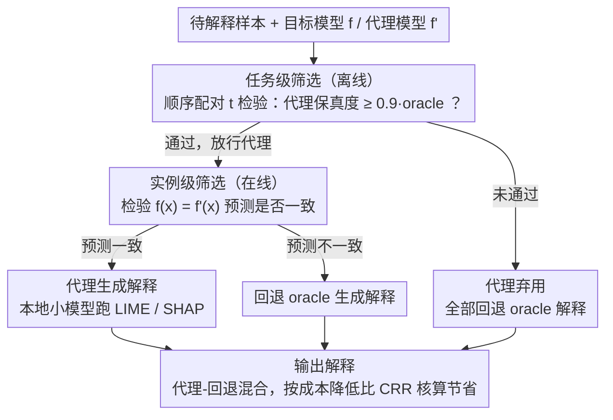

# Revitalizing Black-Box Interpretability: Actionable Interpretability for LLMs via Proxy Models

**会议**: ACL 2026  
**arXiv**: [2505.12509](https://arxiv.org/abs/2505.12509)  
**代码**: [https://github.com/outerform/Large-Model-Explanation-Benchmark](https://github.com/outerform/Large-Model-Explanation-Benchmark)  
**领域**: 可解释性 / LLM 优化  
**关键词**: 模型无关解释, 代理模型, 黑盒可解释性, Prompt 压缩, 特征归因

## 一句话总结

本文提出一种基于代理模型的黑盒可解释性框架，利用廉价小模型近似昂贵大模型的局部决策边界来生成 LIME/SHAP 解释，通过统计筛选-应用（screen-and-apply）机制确保可靠性，代理解释在保持超过 90% 保真度的同时将成本降低 88.2%，并成功用于 Prompt 压缩和中毒样本移除等下游优化任务。

## 研究背景与动机

**领域现状**：后验解释（post-hoc explanation）不仅是透明性工具，更是模型优化的驱动器（如 prompt 调试和数据清洗）。然而，闭源模型（如 GPT-4o、Google Gemini）阻断了对内部表示的访问，使模型无关方法（如 LIME、SHAP）成为唯一选择。但这些方法依赖大量扰动采样——生成单个 LIME 解释通常需要 1000 次查询，在验证集（如 50 个样本）上生成解释需要 50,000 次查询，花费超过 \$100。

**现有痛点**：(1) 成本-效用困境：生成解释的前期成本超过了优化任务本身的潜在收益，使这些强大的工具无法实际使用；(2) 现有加速方法（如摊销解释器、特征数缩减）与本文方法正交，但未利用 LLM 间的同质性；(3) 白盒解释方法需要访问模型内部表示，不适用于闭源模型。

**核心矛盾**：模型无关解释在理论上可以指导 LLM 优化，但其对昂贵模型的大量查询需求使其在实践中不可用——形成了"解释成本高于优化收益"的根本效用困境。

**本文目标**：(1) 提出经济可行的代理解释框架，用廉价模型替代昂贵模型生成解释；(2) 通过统计验证机制确保代理解释的可靠性；(3) 展示代理解释在下游优化任务中的实际效用。

**切入角度**：基于 LLM 间的同质性（homogeneity）——不同 LLM 在相似输入上倾向于表现出相似的行为，这意味着小模型可以在局部近似大模型的决策边界（"以小见大"）。

**核心 idea**：用廉价的本地/开源模型作为代理生成扰动式解释，通过两层统计筛选（任务级 + 实例级）确保只在代理解释可靠时才部署，不可靠时回退到昂贵模型。

## 方法详解

### 整体框架

本文要解决的是"生成解释比优化收益还贵"的困境：给闭源大模型做一次 LIME 解释要上千次查询、几十个样本就烧掉上百美元。其思路是用廉价小模型当代理来近似昂贵大模型的局部决策边界，从而代生成解释。但小模型未必处处对齐，因此整套框架是一个"先筛选、再应用"的流程——先在部署前统计验证代理解释是否够保真，再对通过验证的实例用代理生成解释、对不通过的实例回退到昂贵 oracle。筛选本身又分离线的任务级和在线的实例级两层，输入是待解释样本，输出是一份在可靠性有统计保障下、成本大幅压低的解释。

### 关键设计

**1. 任务级筛选：用顺序假设检验给整个数据集发"准入证"**

盲目把小模型套上去存在系统性对齐不良的风险，所以在动用代理前，本文先一次性评估代理模型 $f'$ 能否在整个任务 $\mathbb{D}$ 上为目标模型 $f$ 提供足够保真的解释。具体用顺序单侧配对 $t$ 检验，对每个样本计算配对差异 $d_i = q_{\text{proxy}}(\mathbf{x}_i) - \tau \cdot q_{\text{oracle}}(\mathbf{x}_i)$，检验代理保真度是否达到 oracle 的 $\tau=0.9$ 倍，在 $H_0: \mu_d < 0$ 对 $H_1: \mu_d \geq 0$ 之间以 $1-\delta=0.99$ 的置信度判定。算出置信区间后，若整个区间大于零就接受 $H_1$ 放行该代理，否则继续采样直到最大样本数 $N=50$。这道离线安全阀确保只有平均足够保真的代理才被部署。

**2. 实例级筛选：用预测一致性做逐样本的在线安全阀**

任务级通过不代表每个样本都安全，于是运行时再加一层逐实例校验：$s_{\text{inst}}(\mathbf{x}; f, f') = \mathbf{1}[f(\mathbf{x}) = f'(\mathbf{x})]$，只有代理和目标模型在当前输入上预测一致时才采用代理解释。这背后有两层道理：一是局部解释本就是为模型当前的预测设计的，两模型预测不同时代理解释无从对应；二是预测分歧本身就暗示二者在 $\mathbf{x}$ 附近的局部决策行为不同，代理解释更可能失真。一旦不一致就回退到 oracle，把保真度兜住。

**3. 代理-回退混合与成本核算：把节约量做成可量化指标**

最终落到成本上，本文用成本降低比 $\text{CRR} = \frac{C_{\text{oracle}}}{C_{\text{proxy}} + C_{\text{fallback}} + C_{\text{screen}}}$ 来度量收益，分母三项分别是对一致实例的代理解释成本 $C_{\text{proxy}}$、对不一致实例回退 oracle 的成本 $C_{\text{fallback}}$、以及筛选成本 $C_{\text{screen}}$。由于代理可以是本地运行的开源模型，$C_{\text{proxy}}$ 可被压到接近零，于是"代理为主、回退兜底"的混合策略在保住保真度的前提下把整体成本最大化地省下来。

### 实验设置

本文不涉及模型训练。解释直接复用现成的 LIME 与 Kernel SHAP，每个方法用 1000 个扰动样本、其余超参取默认值。评测覆盖 12 个 LLM，包括 GPT-4o 系列、DeepSeek V3、7 个 Qwen 2.5 模型和 2 个 Llama 3.1 模型。

## 实验关键数据

### 主实验

**成本降低比（CRR）——用代理模型解释昂贵 LLM**

| 目标模型 | CRR 类型 | SST | MMLU | NQ |
|---------|---------|-----|------|-----|
| GPT-4o | CRR_max (API) | 10.33 | 4.84 | 7.41 |
| GPT-4o | CRR_local | 14.17 | 5.62 | 10.53 |
| DeepSeek V3 | CRR_local | 13.31 | 5.32 | 8.33 |
| Qwen 2.5 72B | CRR_local | 16.25 | 6.07 | 9.09 |

**筛选步骤可靠性**

| 指标 | LIME (SST/MMLU/NQ) | Kernel SHAP (SST/MMLU/NQ) |
|------|-------------------|--------------------------|
| Precision | 100.0 / 99.4 / 94.1 | 100.0 / 100.0 / 100.0 |
| Recall | 80.2 / 77.6 / 76.1 | 96.3 / 97.2 / 96.2 |
| F1 | 89.0 / 87.2 / 84.2 | 98.1 / 98.5 / 98.0 |

### 消融实验

**Prompt 压缩比较（GPT-4o 上不同方法的压缩率 %）**

| 方法 | MMLU-Chem | MMLU-CS | HellaSwag | GSM8K | PIQA |
|------|-----------|---------|-----------|-------|------|
| Random | 29.0 | 35.6 | 58.8 | 25.3 | 54.3 |
| AttnComp | 34.5 | 39.1 | 64.3 | 30.2 | 60.2 |
| LLMLingua | 38.7 | 38.3 | 62.7 | 28.9 | 58.7 |
| Proxy Exp. | 41.0 | 43.0 | 70.1 | 35.5 | 64.5 |
| Oracle Exp. | 49.2 | 50.2 | 75.5 | 37.2 | 69.2 |

**中毒样本移除（GPT-4o 准确率 %）**

| 任务 | Oracle Exp. | Proxy Exp. | Random deletion |
|------|------------|-----------|-----------------|
| SST | 94.2 | 94.0 | 87.1 |
| HellaSwag | 93.7 | 93.5 | 88.4 |
| PIQA | 91.5 | 90.7 | 79.6 |

### 关键发现

- 对最昂贵的 GPT-4o，代理解释最多可节省 88% 的成本（CRR_max 达到 14.17），同时保持超过 90% 的保真度
- 筛选步骤平均精确率达 98.9%，极少将不保真的代理标记为可用；即使罕见的假阳性，实际代理保真度仍超过 89%
- 代理解释在 Prompt 压缩中达到 oracle 的 91.7% 性能，显著优于随机删除和 LLMLingua/AttnComp 等 SOTA 方法
- 代理解释能准确识别和移除中毒样本，使 GPT-4o 准确率从 <80% 恢复至 94%，与 oracle 效果几乎一致
- 跨模型解释可迁移性在不同任务和数据集上保持一致，Qwen 7B/14B 对 GPT-4o 均能达到超过 90% 保真度

## 亮点与洞察

- 将 LLM 同质性从一个被动观察转化为主动利用的工具——不同 LLM 的局部决策边界相似性成为节约解释成本的基础
- screen-and-apply 的双层筛选机制兼顾安全性和成本效率：任务级筛选一次性过滤不合格代理，实例级筛选提供逐样本安全阀
- 将可解释性从被动观察工具转变为主动优化原语（prompt 压缩、数据清洗），拓展了解释方法的应用边界

## 局限与展望

- 聚焦于扰动式特征归因方法（LIME、SHAP），对其他解释技术的适用性未探索
- 在需要极端推理能力的场景中（如复杂符号逻辑），小代理与大 oracle 的对齐可能减弱，此时框架会回退到 oracle，降低成本节约幅度
- 未探索通过轻量微调来对齐代理模型与 oracle 的方向
- 解释本身的双重用途风险——同样的工具可能被用于对抗性攻击或生成误导性解释

## 相关工作与启发

- **vs LLMLingua/AttnComp**: 这些是专门的 prompt 压缩方法，代理解释在压缩率上显著优于它们，说明解释引导的优化比专用启发式更有效
- **vs 摊销解释方法（Amortized）**: 摊销方法训练统一解释器来近似解释分布，与本文的代理方法正交，可以组合使用进一步降低成本
- **vs 白盒解释**: 白盒方法需要访问模型内部表示，不适用于闭源模型；本文用代理模型的模型无关方法实现类似效果

## 评分

- 新颖性: ⭐⭐⭐⭐ 利用 LLM 同质性构建代理解释框架是新颖视角，统计筛选机制设计严谨
- 实验充分度: ⭐⭐⭐⭐⭐ 12 个 LLM、7 个数据集、两种解释方法、两种下游任务，覆盖极为全面
- 写作质量: ⭐⭐⭐⭐⭐ 问题动机清晰，统计框架严谨，实验组织条理分明
- 价值: ⭐⭐⭐⭐⭐ 使黑盒可解释性从"理论可行但实践不可用"变为"经济可行且实际有用"，开源基准数据集有长期价值

<!-- RELATED:START -->

## 相关论文

- [\[ICML 2026\] Interpretability Can Be Actionable](../../ICML2026/interpretability/interpretability_can_be_actionable.md)
- [\[ACL 2026\] Mechanistic Interpretability of Large-Scale Counting in LLMs through a System-2 Strategy](mechanistic_interpretability_of_large-scale_counting_in_llms_through_a_system-2_.md)
- [\[ACL 2026\] Towards Intrinsic Interpretability of Large Language Models: A Survey of Design Principles and Architectures](towards_intrinsic_interpretability_of_large_language_modelsa_survey_of_design_pr.md)
- [\[NeurIPS 2025\] OrdShap: Feature Position Importance for Sequential Black-Box Models](../../NeurIPS2025/interpretability/ordshap_feature_position_importance_for_sequential_black-box_models.md)
- [\[ACL 2026\] Interpretability from the Ground Up](interpretability_from_the_ground_up_stakeholder-centric_design_of_automated_scor.md)

<!-- RELATED:END -->
