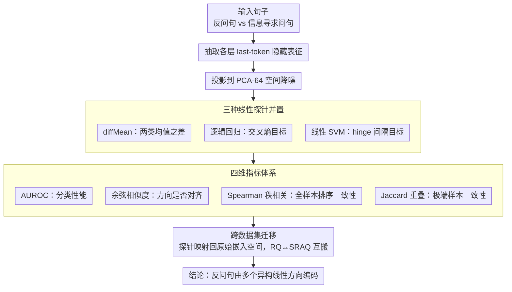

# Rhetorical Questions in LLM Representations: A Linear Probing Study

**会议**: ACL 2026  
**arXiv**: [2604.14128](https://arxiv.org/abs/2604.14128)  
**代码**: [GitHub](https://github.com/ruyi101/rq-representation-probing)  
**领域**: 可解释性  
**关键词**: 反问句、线性探针、LLM表征、跨数据集迁移、修辞分析

## 一句话总结
通过线性探针分析 LLM 内部如何表征反问句，发现反问句在表征空间中是线性可分的且可跨数据集迁移，但不同数据集学到的探针方向并不一致——反问句由多个异构的线性方向编码，而非单一统一维度。

## 研究背景与动机

**领域现状**：反问句（rhetorical question）是日常交流中常见的修辞形式，说话者用它来表达立场、质疑或说服，而非真正寻求信息。计算语言学对反问句的研究主要集中在分类/检测任务，使用显式标签训练分类器。

**现有痛点**：虽然 LLM 在实际使用中频繁生成和理解反问句，但关于模型"内部如何表征反问句意图"几乎没有研究。现有工作关注预测准确率，忽略了表征层面的理解。

**核心矛盾**：一个自然的假设是，如果反问句可以被线性探针检测到，那么模型内部应该存在一个"反问句方向"。但如果不同上下文中的反问句具有不同的修辞功能（如篇章级立场表达 vs 句法级疑问标记），那么单一方向假设可能过于简化。

**本文目标**：系统性地回答三个问题：(1) 反问句信号在模型哪些层出现？(2) 不同探针方法是否一致？(3) 跨数据集迁移时探针方向是否对齐？

**切入角度**：在两个社交媒体数据集上用多种线性探针（diffMean、逻辑回归、SVM）分析 Qwen3-32B 和 Llama-3.3-70B 的内部表征，不仅看分类准确率，更关注探针间的方向一致性和排名一致性。

**核心 idea**：反问句在 LLM 表征中是"异构编码"的——由多个不对齐的线性方向捕获不同的修辞现象，而非单一共享维度。

## 方法详解

### 整体框架

本文不训练新模型，而是把预训练 LLM 当作待解剖的对象：给定一句话，抽取它在各层的 last-token 隐藏表征，先投影到 64 维 PCA 空间降噪，再用三种线性探针判断它是反问句还是信息寻求问句。关键不在于探针能不能分对，而在于把同一份表征喂给不同探针、或把一个数据集上学到的方向搬到另一个数据集上时，这些方向是否指向同一处——因此整条流水线的输出不是一个准确率，而是 AUROC、方向余弦相似度、Spearman 秩相关、Jaccard 重叠四组指标的对照。

### 关键设计

**1. 三种线性探针并置：把"可分"和"方向唯一"拆开看**

反问句若真有一个统一的表征维度，那么不管用什么方法找它，找到的方向都该差不多。为验证这一点，本文同时上三种探针：diffMean 不需训练，直接取两类均值之差 $w_{\text{DM}} = \mu_+ - \mu_-$；逻辑回归优化交叉熵；线性 SVM 优化 hinge loss 的间隔。三者最终都给出同一形式的线性评分 $w^\top h(x)$，差别只在优化目标。这样设计的用意很直接——如果它们的 AUROC 接近却学到了不同的 $w$，就说明"线性可分"并不蕴含"方向唯一"，而这正是本文要戳破的假设。

**2. 四维指标体系：区分"分类一致"与"表征一致"**

传统 probing 研究只盯 AUROC，于是默认只要分类性能接近、探针就在做同一件事。本文把评估拆成四层来打破这种默认：AUROC 衡量分类性能，余弦相似度衡量两个 $w$ 的方向是否对齐，Spearman 秩相关衡量探针对全部样本的排序是否一致，Jaccard 重叠则聚焦极端样本——看两个探针各自认定的 top-20% 和 bottom-20% 是否落在同一批句子上。后三个指标专门用来暴露"AUROC 很高、方向却南辕北辙"的情形，而这恰恰是单看准确率永远看不见的。

**3. 跨数据集迁移：检验是否存在通用的"反问句方向"**

如果反问句方向是模型的一个稳定内部概念，那么在 RQ 数据集上学到的探针搬到 SRAQ 上（以及反向）应当依然对齐、排名依旧一致。难点在于两个数据集各自做了 PCA，坐标系并不通用，因此迁移前需先把探针方向映射回原始嵌入空间再做比较。一旦发现迁移后方向几乎正交、极端样本几乎不重合，就只能得出反问句编码是上下文依赖、随数据分布而变的结论。

### 损失函数 / 训练策略

diffMean 无需训练；逻辑回归和 hinge loss 在训练集上优化，用验证集选模型，在测试集上报告结果。所有表征统一投影到 PCA-64 空间以降噪。

## 实验关键数据

### 主实验

| 模型 | 数据集 | 探针 | AUROC (深层) | 表征选择 |
|------|--------|------|-------------|----------|
| Llama-3.3-70B | RQ | Hinge/Logistic | ~0.85-0.90 | last-token |
| Llama-3.3-70B | SRAQ | Hinge/Logistic | ~0.80-0.85 | last-token |
| Qwen3-32B | RQ | diffMean | ~0.80 | last-token |
| Qwen3-32B | SRAQ | diffMean | ~0.75 | last-token |
| 两模型 | RQ→SRAQ迁移 | 全部 | ~0.70-0.80 | last-token |

### 跨数据集方向一致性

| 分析维度 | RQ内部探针间 | SRAQ内部探针间 | RQ↔SRAQ跨数据集 |
|----------|-------------|---------------|-----------------|
| 余弦相似度 (hinge vs logistic) | ~1.0 | ~1.0 | ~0.2-0.4 |
| 余弦相似度 (diffMean vs trained) | ~0.5-0.7 | ~0.3-0.5 | ~0.2-0.4 |
| Top-20% Jaccard | ~0.25 | ~0.25 | <0.20 |
| Bottom-20% Jaccard | ~0.50 | ~0.50 | ~0.30-0.40 |

### 关键发现
- **last-token 优于 mean pooling**：在深层 last-token 表征稳定优于均值池化，说明反问句信号集中在序列末端
- **训练探针和 diffMean 方向不一致**：尽管 AUROC 差别不大（SRAQ上）或有差距（RQ上），三种探针学到的方向余弦相似度只有 0.3-0.7
- **跨数据集排名极度不一致**：top-20% 样本的 Jaccard 重叠经常低于 0.2，说明两个探针认为"最反问"的样本几乎不重合
- **定性分析揭示本质差异**：SRAQ 方向偏好长篇议论中的篇章级修辞（反问句推动论证），RQ 方向偏好短小、句法驱动的局部疑问形式

## 亮点与洞察
- **"高AUROC ≠ 共享方向"的洞察**：这是对整个 probing 方法论的重要提醒——线性可分不意味着只有一个可分方向。可推广到其他语言属性的探针研究
- **反问句的异构性**：反问句不是一个单一属性，而是涵盖从局部句法标记到全局修辞策略的谱系，这与语言学理论一致
- **top vs bottom 的不对称性**：信息寻求问句的排名更一致，反问句排名更不一致——说明"非反问"是相对同质的，而"反问"是异构的

## 局限与展望
- 仅在两个社交媒体数据集上实验，未涉及正式文体（如学术论文、新闻中的反问句）
- 仅使用线性探针，非线性表征结构被排除在外
- 未进行系统性因果干预实验——线性可分不等于线性可控
- 未来应结合 sparse autoencoder 或因果干预方法，验证反问句方向的因果效力

## 相关工作与启发
- **vs Ikumariegbe et al. 2025**: 他们以 QA 分类框架研究反问句，关注预测准确率；本文深入表征层面，揭示准确率背后的方向异构性
- **vs Marks & Tegmark 2024 (diffMean)**: 本文使用他们的 diffMean 方法作为基线之一，但发现 diffMean 和训练探针方向不一致，说明 diffMean 虽简洁但可能遗漏部分信号
- **vs sparse autoencoder 方法**: SAE 可以分解激活为可解释特征方向，未来可用于验证本文发现的多方向假说

## 评分
- 新颖性: ⭐⭐⭐⭐ 首次系统性分析反问句在 LLM 表征中的编码方式
- 实验充分度: ⭐⭐⭐⭐ 多探针、多模型、多指标的全面分析
- 写作质量: ⭐⭐⭐⭐⭐ 逻辑链条清晰，从现象到分析再到定性验证层层递进
- 价值: ⭐⭐⭐⭐ 对 probing 方法论和修辞理解都有启发

<!-- RELATED:START -->

## 相关论文

- [\[ICLR 2026\] One Language, Two Scripts: Probing Script-Invariance in LLM Concept Representations](../../ICLR2026/interpretability/one_language_two_scripts_probing_script-invariance_in_llm_concept_representation.md)
- [\[ACL 2026\] Crosscoding Through Time: Tracking Emergence & Consolidation Of Linguistic Representations Throughout LLM Pretraining](crosscoding_through_time_tracking_emergence_consolidation_of_linguistic_represen.md)
- [\[ICLR 2026\] Dynamic Reflections: Probing Video Representations with Text Alignment](../../ICLR2026/interpretability/dynamic_reflections_probing_video_representations_with_text_alignment.md)
- [\[ACL 2026\] Linear Probes Detect Task Format, Not Reasoning Mode in Language Model Hidden States](linear_probes_detect_task_format_not_reasoning_mode_in_language_model_hidden_sta.md)
- [\[ACL 2026\] AdaptiveK: Complexity-Driven Sparse Autoencoders for Interpretable Language Model Representations](adaptivek_complexity-driven_sparse_autoencoders_for_interpretable_language_model.md)

<!-- RELATED:END -->
