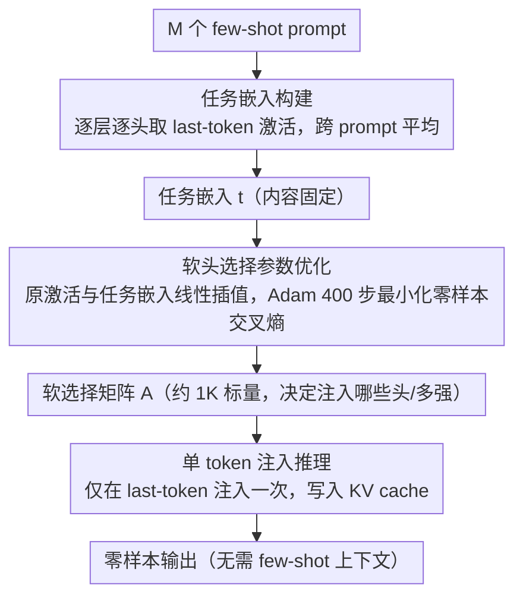

# SITE: Soft Head Selection for Injecting ICL-Derived Task Embeddings

**会议**: ACL 2026 Findings  
**arXiv**: [2507.20906](https://arxiv.org/abs/2507.20906)  
**代码**: [https://github.com/SNU-DRL/Soft_Injection](https://github.com/SNU-DRL/Soft_Injection)  
**领域**: 可解释性 / 参数高效适配  
**关键词**: 注意力头选择, 任务嵌入, 上下文学习, 激活补丁, 参数高效

## 一句话总结

SITE 提出了一种基于梯度优化的软注意力头选择方法，通过识别任务相关的注意力头来有效注入 ICL 衍生的任务嵌入，在 12 个 LLM（4B-70B）上显著超越 ICL 和现有嵌入方法，同时用远少于 PEFT 的可训练参数达到可比性能。

## 研究背景与动机

**领域现状**：LLM 的任务适配主要有三种范式：参数高效微调（PEFT，如 LoRA）性能好但需要训练；上下文学习（ICL）无需训练但增加推理成本；嵌入注入方法从 ICL 激活中提取任务嵌入并在推理时注入。

**现有痛点**：ICL 驱动的嵌入注入方法概念上很有吸引力，但实际上未能展现对 PEFT 或 ICL 的一致优势。现有方法（如 FV、TV、MTV、I2CL）依赖启发式规则或受限搜索空间来确定嵌入的提取和注入位置，且大多仅在简单分类任务上评估。

**核心矛盾**：任务相关信息在注意力头中分布不均匀且随任务变化——随机选择头进行补丁会导致性能剧烈波动，但现有方法缺乏高效的头选择机制。

**本文目标**：开发一种 ICL 驱动的嵌入注入方法，在更少参数下达到接近 PEFT 的性能，同时显著超越 ICL。

**切入角度**：将注意力头选择形式化为连续优化问题，通过梯度下降学习每个头的重要性参数（软选择），实现高效的任务嵌入注入位置识别。

**核心 idea**：用可学习的软选择参数在原始激活和任务嵌入之间进行线性插值，仅优化 $L \times H$ 个标量参数（约 1K），实现精准的任务相关头识别和高效注入。

## 方法详解

### 整体框架

SITE 把"任务适配"拆成内容和位置两件事，并主张位置才是关键。给定一个任务，它先从若干 few-shot prompt 里把 ICL 激活压成一份固定的任务嵌入（内容），再学一组软选择参数决定该嵌入注入到哪些注意力头、注入多少（位置）；推理时只在输入的最后一个 token 处做一次注入，写进 KV cache 后正常自回归解码。整个过程冻结 LLM，只训练约 1K 个标量，输出是一个无需 few-shot 上下文、却带着任务信息的零样本模型。

### 关键设计

**1. 任务嵌入构建：把 few-shot 激活平均成一份任务级表示**

要把"这是什么任务"从 ICL 里固化下来，本文对 $M$ 个各含 $N$ 个输入-输出示例的 few-shot prompt，逐层逐头提取 last-token 激活 $\mathbf{t}_m^{(l,h)}$，再跨 $M$ 个 prompt 取平均得到任务嵌入 $\mathbf{t}^{(l,h)} = \frac{1}{M}\sum_m \mathbf{t}_m^{(l,h)}[-1,:]$。平均化的作用是把单条 prompt 里的实例特异性噪声抹掉，只留下跨样本稳定的任务级信号——后续实验显示即便 $M=1$ 性能也仅微降，说明这份嵌入对样本数并不敏感。

**2. 软头选择参数优化：用连续插值把离散选头变成可微问题**

任务信息在注意力头里分布不均且随任务漂移，随机选头补丁会让性能剧烈抖动，所以核心是高效找出该补哪些头。本文引入可学习矩阵 $\mathbf{A} \in [0,1]^{L \times H}$，每个 $\alpha^{(l,h)}$（经 sigmoid 参数化以锁定 [0,1]）控制对应头的注入强度，零样本推理时把该头的 last-token 激活替换为原激活与任务嵌入的线性插值 $\mathbf{o}^{(l,h)} \leftarrow (1-\alpha^{(l,h)}) \cdot \mathbf{o}^{(l,h)} + \alpha^{(l,h)} \cdot \mathbf{t}^{(l,h)}$。这样"选哪些头"被松弛成连续优化，可直接用 Adam 跑 400 步梯度下降，而不必做离散搜索或强化学习；更关键的是它只优化注入位置、不动嵌入内容，可训练量仅 1.02K，比 LoRA 的 3407K 少了三个数量级。

**3. 单 token 注入推理：一次性写入，最小化对生成的扰动**

注入越多越容易干扰自回归生成，因此 SITE 把干预压到极致——只在初始 prompt 的 last-token 位置注入一次，信息随之写入 KV cache，之后的逐 token 解码完全不再插手。相比在多个 token 位置反复注入的做法，这种单点干预既降低了实现复杂度，也避免了对后续生成质量的累积破坏。

### 损失函数 / 训练策略

优化目标是零样本推理下的交叉熵损失。每 50 步用验证集选择检查点。无正则化，无模型特异性超参调整。

## 实验关键数据

### 主实验

**Llama-3.1-8B 四基准平均**

| 方法 | 类型 | 可训练参数 | FV (57 tasks) | ANLI | MMLU-Pro | BBH | Avg |
|------|------|-----------|---------------|------|---------|-----|-----|
| LoRA | PEFT | 3407K | 86.76 | 45.82 | 41.04 | 60.39 | 58.50 |
| 10-shot ICL | ICL | 0 | 76.76 | 43.96 | 36.47 | 47.17 | 51.09 |
| I2CL | Emb | 0.13K | 79.89 | 28.01 | 27.14 | 50.60 | 46.41 |
| **SITE (M=50)** | Emb | **1.02K** | **90.02** | **47.31** | **38.78** | **58.04** | **58.54** |

### 消融实验

| 配置 | 关键指标 | 说明 |
|------|---------|------|
| SITE M=50 | 58.54 avg | 最优 |
| SITE M=1 | 57.50 avg | 略降，对 M 不敏感 |
| 随机头补丁 | 不稳定 | 性能高度依赖选中的头 |
| Low-α 头补丁 | 6.2 avg | 性能下降，验证选择有效性 |
| High-α 头补丁 | 57.3 avg | 与 SITE 接近 |

### 关键发现

- SITE 在 FV 基准上超越 LoRA（90.02 vs 86.76），在 ANLI 上也超越，用 0.03% 的参数达到 PEFT 级别性能
- 在 12 个 LLM（4B-70B）上一致性地超越 10-shot ICL 10.2-14.3 个百分点
- 优化后的软选择参数呈近二值分布，说明注意力头的任务相关性是"非此即彼"的
- 跨任务激活补丁分析揭示：相似任务共享重要的注意力头，不相似任务的重要头不重叠——强任务特异性
- MMLU-Pro 和 BBH 上与 PEFT 仍有差距，表明 ICL 衍生的任务嵌入在复杂推理上表达能力有限

## 亮点与洞察

- 1K 参数达到 3.4M 参数的性能是非常亮眼的结果——核心洞察在于"注入位置比注入内容更重要"
- 近二值化的选择参数和跨任务头共享分析提供了新的机制可解释性洞察——注意力头确实具有任务特异性功能
- 方法的极简设计（无正则化、无模型特异性调参、400 步训练）使其非常容易复现和部署

## 局限与展望

- 在需要复杂推理的基准（MMLU-Pro、BBH）上与 LoRA 仍有差距
- 每个任务需要独立优化一组选择参数，多任务场景下的可扩展性待验证
- 仅在最后一个 token 位置注入，可能限制了任务信息的表达能力
- 任务嵌入固定不变，无法适应任务内部的变化（如不同难度的样本）

## 相关工作与启发

- **vs FV/TV**: 这些方法用启发式搜索或激活补丁确定注入位置，SITE 用梯度优化更高效
- **vs LoRA**: LoRA 修改模型权重，SITE 仅修改特定头的激活，参数量差 3000 倍但性能可比

## 评分

- 新颖性: ⭐⭐⭐⭐⭐ 软头选择的形式化和"位置比内容更重要"的洞察非常新颖
- 实验充分度: ⭐⭐⭐⭐⭐ 12 个模型、四个基准、完整的激活补丁分析、跨任务分析
- 写作质量: ⭐⭐⭐⭐⭐ 方法阐述清晰，实验逻辑严谨
- 价值: ⭐⭐⭐⭐⭐ 提供了极端参数高效的任务适配方案和注意力头功能的新理解

<!-- RELATED:START -->

## 相关论文

- [\[ACL 2026\] Style over Story: Measuring LLM Narrative Preferences via Structured Selection](style_over_story_measuring_llm_narrative_preferences_via_structured_selection.md)
- [\[ICLR 2026\] Bridging Explainability and Embeddings: BEE Aware of Spuriousness](../../ICLR2026/interpretability/bridging_explainability_and_embeddings_bee_aware_of_spuriousness.md)
- [\[ICLR 2026\] Cross-Modal Redundancy and the Geometry of Vision-Language Embeddings](../../ICLR2026/interpretability/cross-modal_redundancy_and_the_geometry_of_vision-language_embeddings.md)
- [\[AAAI 2026\] Unsupervised Feature Selection Through Group Discovery](../../AAAI2026/interpretability/unsupervised_feature_selection_through_group_discovery.md)
- [\[ACL 2026\] Learning What Matters: Dynamic Dimension Selection and Aggregation for Interpretable Vision-Language Reward Modeling](learning_what_matters_dynamic_dimension_selection_and_aggregation_for_interpreta.md)

<!-- RELATED:END -->
