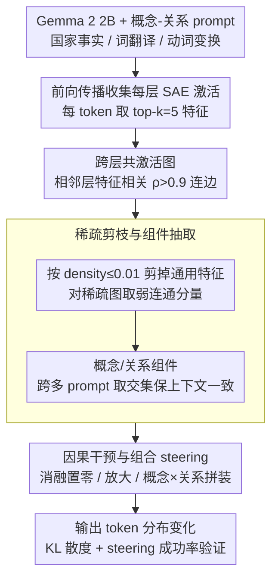

# Sparse Feature Coactivation Reveals Causal Semantic Modules in Large Language Models

**会议**: ACL2026  
**arXiv**: [2506.18141](https://arxiv.org/abs/2506.18141)  
**代码**: https://github.com/shanestorks/SAE-Semantic-Modules  
**领域**: LLM可解释性 / 机制解释 / 知识表示  
**关键词**: 稀疏自编码器、特征共激活、语义模块、因果干预、模型控制

## 一句话总结
论文用少量 prompt 中 SAE 特征的跨层共激活图自动发现 LLM 中表示概念和关系的语义模块，并证明对这些模块进行消融和放大能在最高 98% 的单概念/关系场景、最高 90% 的组合场景中可预测地操控 Gemma 2 2B 的关系推理输出。

## 研究背景与动机
**领域现状**：机制可解释性近年常用 sparse autoencoder 提取 LLM 激活中的可解释特征。SAE 能把 dense activation 分解成较稀疏、较单义的 feature direction，使研究者能分析某些概念、实体或行为在模型内部如何激活。

**现有痛点**：单个 SAE feature 往往仍然 polysemantic 或不稳定；跨层 transcoders 和 circuit tracing 可以画出信息流，但图中节点可能成百上千、连接稠密，需要大量人工理解。另一方面，关系知识推理，例如“中国的首都是北京”，涉及概念 China 与关系 capital city 的组合，单层线性方向或单个 feature 很难解释跨层协同。

**核心矛盾**：LLM 的知识可能分布在多个 feature 和多个层中，真正起作用的不是孤立特征，而是跨层共同激活的一组功能模块。可解释性方法既要足够细粒度，又要自动化和可干预。

**本文目标**：作者希望从很少 prompt 的 SAE 激活中构造 inter-layer feature network，自动抽取语义一致、上下文一致、且对输出有因果作用的 component，并测试这些 component 是否可以组合式操控模型输出。

**切入角度**：如果多个 SAE feature 在相邻层、同一 prompt token 序列上高度相关地激活，它们可能属于同一计算模块。再过滤掉高密度通用 feature，就能得到更稀疏、更可解释的弱连通分量。

**核心 idea**：把 SAE feature 当作图节点，用跨层共激活相关性连边，再把 connected component 当成概念或关系模块，通过 ablation/amplification 验证其因果功能。

## 方法详解

### 整体框架

方法要解决的问题是：LLM 里表示某个概念或关系的，往往不是一个孤立 SAE feature，而是一组跨层协同激活的 feature，怎样自动找出这些功能模块并验证它们真的因果地决定输出。整条 pipeline 从 Gemma 2 2B 的 concept-relation prediction prompts（country facts、word translation、verb transformation）出发，先在前向传播中收集每层 SAE 激活、取每 token 的 top features，按跨层共激活相关性连边构成图，剪掉高密度通用 feature 后用弱连通分量抽出 component；最后对这些 component 做消融、放大与组合干预，以输出 token 分布是否按预期变化反向确认它们的语义。整个过程中 component 不靠人工指定“China feature”或“capital feature”，而是在具体 prompt 下由共激活关系涌现，再用 KL divergence 和 steering success 验证。

### 关键设计

**1. 跨层 feature coactivation 图：用“一起激活”而非“描述文本”定义模块**

单个 SAE feature 的自动描述并不可靠——论文里 Spain component 的描述未必出现 Spain，translation language component 甚至会被标成 programming，所以纯文本描述无法支撑模块发现。方法转而直接利用模型内部动态：每层取 top activated features，节点记为 $(\ell,i)$；若相邻层两个 feature 在 prompt token 维度上的激活相关系数 $\rho>0.9$，就建立一条有向边。这样连出来的图捕捉的是“这些 feature 是否在同一语境中一起工作”，从而把离散 feature 组织成可解释的跨层网络。

**2. 稀疏性剪枝与 component 抽取：滤掉通用计算，留下任务特异的单义模块**

高密度 feature 常承载语法或通用计算，若直接纳入会让 component 不可解释，所以先用 Neuronpedia 的 activation density 只保留 $d_{\ell,i}\leq0.01$ 的 sparse features 并去掉孤立点，再对稀疏图求弱连通分量。为强调 context consistency，concept component 取同一概念跨多个关系所得 component 的交集，relation component 取同一关系跨多个概念所得 component 的交集——这样 China component 才能在 capital、currency、language 等 prompt 中保持稳定，而不是每个 prompt 各自漂移。

**3. 因果干预与组合 steering：只有能被操控并改变输出的才算 causal module**

仅仅与任务相关还不够，方法要求 component 能被干预并造成可预测的输出变化。具体做法是对 in-prompt component 做 ablation（将其 SAE feature activation 置零，再用 decoder 重构后继续前向），对 target component 做 amplification（按观测到的最大激活比例提升 activation），成功标准是输出转向目标概念、目标关系或二者的组合。组合 steering 进一步检验概念和关系能否分开操控、自由拼装（如把“中国的首都”改成“尼日利亚的货币”），而不是缠在同一条不可分解的方向上。

### 损失函数 / 训练策略

论文不训练新模型，直接复用 Gemma 2 2B 与预训练 Gemma Scope JumpReLU SAE。核心超参为每层每 token 选 top-$k=5$ 激活 feature、跨层相关阈值 $\tau_{corr}=0.9$、feature density 阈值 $\tau_{density}=0.01$。干预用 TransformerLens 实现，成功率在 zero-shot prompt template 上评估，且评估用的 prompt 与收集激活时的模板不同，以此检验 component 的上下文泛化能力。

## 实验关键数据

### 主实验

| 任务 | 概念数 / 关系数 | 模型原始准确率 | 概念 steering 平均 SR | 关系 steering 平均 SR | 组合 steering 平均 SR |
|--------|------|------|------|------|------|
| Country facts | 10 countries / 3 facts | 100% | 96% | 93% | 90% |
| Word translation | 11 words / 3 languages | 100% | 75% | 98% | 64% |
| Verb transformation | 8 verbs / 5 relations | 100% | 48% | 23% | 19% |
| 最高单项 | 若干 relation | 100% | up to 98% | up to 100% | up to 100% |
| 论文总体结论 | 三类任务 | 100% | up to 98% | up to 98% | up to 90% |

### 消融实验

| 配置 | 关键指标 | 说明 |
|------|---------|------|
| Full component, country facts | 概念/关系/组合 SR = 96% / 93% / 90% | 操控完整语义模块 |
| Single most causal feature baseline | 概念/关系/组合 SR = 83% / 83% / 75% | 只干预 KL 最大的单个 feature |
| Ablate country-fact components | 其他 country facts accuracy 1.00，translation 0.93，verb 1.00 | 模块多数具有任务特异性 |
| Ablate word-translation components | country facts 1.00，translation 0.83，verb 1.00 | 同任务关系之间有少量重叠 |
| Ablate verb-transformation components | country facts 0.73，translation 0.64，verb 0.63 | verb 模块更不特异，也对应较低 steering 成功率 |
| Transcoder proof-of-concept | 约 27% steering success | 方法可迁移但仍明显弱于 SAE 设置 |

### 关键发现
- 2-3 个 component 通常对输出 token 分布有显著更高的 causal effect，说明任务相关计算不是均匀分散在所有激活 feature 上。
- 概念 component 更早出现：8/10 个 country components 从第一层开始，word/verb components 也都从第一层开始；关系 component 更集中在后层，常跨最后 1/4 到 1/2 层。
- country facts 和 translation 的 component 可组合性较强，能把“中国的首都”干预成“尼日利亚的货币”这类复合反事实输出；verb transformation 的 synonym、antonym、past tense 较难，因为答案依赖词义、词性和上下文。
- 完整 component 明显优于单 feature，支持“概念不是一个 feature，而是一组分布式功能方向”的观点。

## 亮点与洞察
- 论文最有意思的地方是从“找 feature”推进到“找 feature module”。这更符合神经网络分布式表示的直觉，也比单 feature steering 更稳。
- 共激活图是一个轻量但有效的中间层表示。它不需要完整 circuit tracing，也不需要训练新 probing model，就能把跨层 SAE 激活组织成可干预结构。
- 概念早层、关系后层的发现很有启发，暗示实体/词项信息可能较早被建立，而抽象关系或操作在后层组合。
- 组合 steering 对知识编辑和安全控制都有意义。如果概念和关系能分开操控，就可能实现更细粒度的事实修正、风格控制或行为约束。

## 局限与展望
- 实验只覆盖 3 类小规模多关系任务，并且要求模型原始任务准确率为 100%。对开放问答、长文本推理、多跳事实和非客观关系的泛化仍未知。
- component 选择仍有人工启发式。抽取 connected component 是自动的，但选择哪些 component 代表某个概念/关系，以及是否取并集或交集，仍依赖任务经验。
- 模型主要是 Gemma 2 2B，附录仅有 Gemma 2 9B 的补充。不同架构、不同规模、不同 SAE 质量下是否稳定，还需要验证。
- 只保留 low-density features 会排除一些关键通用计算。作者也观察到 ablate high-density features 会导致语法和语义崩坏，说明这些 feature 可能承担重要但未解释的功能。
- 对 transcoders 的迁移只有约 27% steering success，说明“共激活 component”不是可直接套用到所有字典/电路工具的成熟方案。

## 相关工作与启发
- **vs 单 feature SAE 分析**: 单 feature 更容易解释但不够完整；本文强调跨层 feature group，能更全面捕捉概念和关系。
- **vs circuit tracing / cross-layer transcoders**: circuit tracing 更细但图复杂、成本高；本文用 feature coactivation 得到更轻量的模块级解释。
- **vs knowledge neurons / causal tracing**: 知识神经元关注局部神经元或层，本文关注 SAE feature component，并能做组合式反事实 steering。
- **vs function vectors / relation vectors**: function vector 常把关系作为线性方向或 attention head 中的功能表示，本文给出 feature-level 模块视角，可解释为何某些关系如 synonym/antonym 更难被模块化。

## 评分
- 新颖性: ⭐⭐⭐⭐⭐ 从 SAE 共激活自动抽取 causal semantic modules，非常漂亮。
- 实验充分度: ⭐⭐⭐⭐ 干预、组合、特异性和层分布分析完整，但任务和模型规模偏小。
- 写作质量: ⭐⭐⭐⭐ 方法线清晰，实验表充分，部分 component 选择启发式解释还可更系统。
- 价值: ⭐⭐⭐⭐⭐ 对机制解释、模型编辑和可控生成都有强启发，代码公开提升复现价值。

<!-- RELATED:START -->

## 相关论文

- [\[ACL 2026\] METER: Evaluating Multi-Level Contextual Causal Reasoning in Large Language Models](meter_evaluating_multi-level_contextual_causal_reasoning_in_large_language_model.md)
- [\[ICML 2026\] Towards Atoms of Large Language Models](../../ICML2026/interpretability/towards_atoms_of_large_language_models.md)
- [\[ACL 2026\] Knowledge Vector of Logical Reasoning in Large Language Models](knowledge_vector_of_logical_reasoning_in_large_language_models.md)
- [\[ACL 2026\] Preference Heads in Large Language Models: A Mechanistic Framework for Interpretable Personalization](preference_heads_in_large_language_models_a_mechanistic_framework_for_interpreta.md)
- [\[ACL 2026\] Tracing Relational Knowledge Recall in Large Language Models](tracing_relational_knowledge_recall_in_large_language_models.md)

<!-- RELATED:END -->
