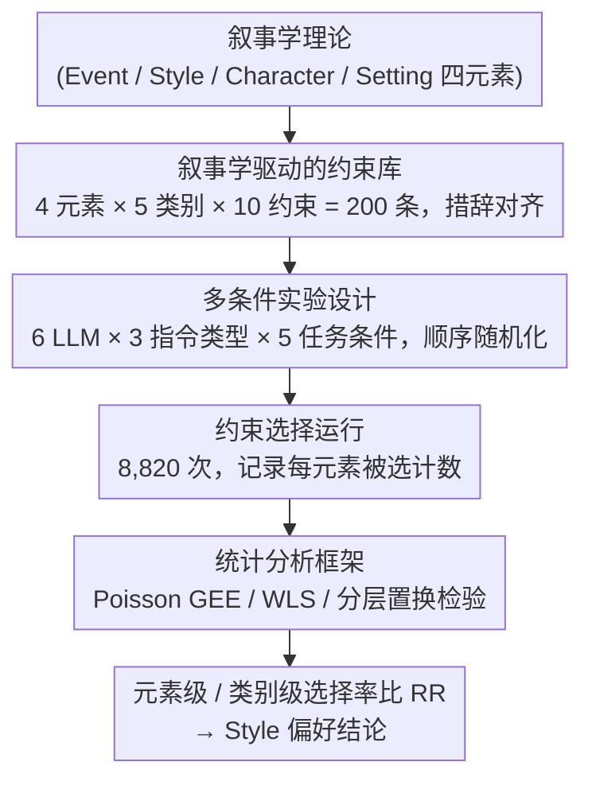

# Style over Story: Measuring LLM Narrative Preferences via Structured Selection

**会议**: ACL 2026 Findings  
**arXiv**: [2510.02025](https://arxiv.org/abs/2510.02025)  
**代码**: 无  
**领域**: 可解释性 / 文本生成  
**关键词**: 叙事偏好, LLM偏见, 约束选择, 叙事学, 风格偏好

## 一句话总结

本文设计了一种基于约束选择的实验范式来测量 LLM 的叙事偏好，使用叙事学理论构建的 200 个约束库让 6 个 LLM 在不同指令类型下进行选择，发现模型系统性地优先选择"风格"（Style）而非"事件"（Event）、"角色"（Character）和"场景"（Setting）等内容元素。

## 研究背景与动机

**领域现状**：小说家开始探索使用 LLM 辅助写作，但研究表明 LLM 使用可能减少叙事情节多样性、集体创造力和个人写作风格。现有 LLM 偏好研究已发现政治偏好、人格特质等，但叙事偏好尚未被探索。

**现有痛点**：(1) 现有叙事研究聚焦于分析生成的输出（如情节连贯性、语言复杂度），无法直接刻画潜在的叙事偏好；(2) 输出分析混淆了偏好与能力——模型不生成某种叙事可能是因为不偏好也可能是因为不擅长；(3) LLM 生成的文本表现出显著的风格统一性，但缺乏对其底层偏好结构的理解。

**核心矛盾**：如果不了解 LLM 的潜在叙事偏好，就无法区分"刻意的创作选择"和"系统性偏见"，对使用 LLM 辅助写作的实践有重要影响。

**本文目标**：设计一种能够隔离"偏好"与"能力"的测量方法，定量刻画 LLM 的叙事偏好结构。

**切入角度**：让模型选择而非生成——通过结构化选择任务隔离偏好，使用叙事学理论构建可解释的约束库。

**核心 idea**：约束选择范式——提供叙事学理论驱动的约束候选集，让模型选择要使用的约束，以选择行为作为偏好的代理指标。

## 方法详解

### 整体框架

方法要解决的核心难题是把“偏好”从“能力”里剥离出来：直接分析模型生成的文本无法判断模型不写某种叙事是因为不偏好还是因为不擅长。论文的破题思路是让模型选择而非生成——先用叙事学理论搭一个 200 条叙事约束的候选库，再让 6 个商业 LLM 在多种指令与任务条件下从中挑选要使用的约束，把选择频率当作潜在偏好的代理指标；输入是结构化的约束候选集，中间是 8,820 次随机化顺序的选择运行，输出经统计模型估计成各元素的选择率比。

### 关键设计

**1. 叙事学驱动的约束库：用理论锚定每一个候选项，选择才可解释**

若候选约束本身缺乏理论结构，选择行为就无法被有意义地分析，所以约束库严格沿经典与当代叙事学搭建：把叙事拆成 Event（情节动态）、Style（声音/语调/叙述）、Character（角色能动性）、Setting（空间/语境）四个核心元素，每元素 5 个类别、每类别 10 个约束，共 200 条，并给每条标注 1-3 个轴属性。为压低表面层面的选择偏差，所有约束统一为 15-20 词、平行语法、匹配概念粒度，使模型的取舍尽量反映叙事层面的偏好而非措辞差异。

**2. 多条件实验设计：用条件对比把偏好和任务设计伪影分开**

单一任务设置下的选择可能只是被预算或标签结构带偏，因此设计了 5 种任务条件——元素内自由预算(1-1)、元素内固定预算(1-2)、池化无标签自由(2-1)、池化无标签固定(2-2)、元素分块配额(3)——并叠加基础/质量/创意 3 种指令类型。其中池化无标签固定预算(2-2)被取作基线，因为它最接近模型不受外部约束时的原生偏好结构；只有当某种偏好在多条件下都稳定出现，才被认为是真实偏好而非设计产物。

**3. 统计分析框架：为计数型、聚类型选择数据选对模型**

选择数据是按运行聚类的计数，故用 Poisson GEE（以运行为聚类单元）估计元素级和类别级的选择率比 RR，用 K 加权 WLS 估计条件之间的对比，并用分层置换检验评估轴丰富度是否显著。这套组合既尊重数据的计数性质，又能在重复运行带来的相关性下给出可靠的区间与显著性。

### 损失函数 / 训练策略

纯推理实验，不涉及任何训练，直接评估 GPT-4.1、GPT-5、o4-mini、Claude、Gemini、Qwen 等 6 个商业 LLM。

## 实验关键数据

### 主实验

**元素级选择率比（vs Event 基线，Poisson GEE）**

| 元素 | RR [95% CI] | p |
|------|------------|---|
| Event (基线) | 1.00 | — |
| **Style** | **1.78** [1.74, 1.82] | <.001 |
| Character | 0.98 [0.96, 1.01] | .160 |
| Setting | 1.28 [1.25, 1.31] | <.001 |

### 消融实验

**跨模型稳定性**

| 发现 | 说明 |
|------|------|
| Style 偏好 | 所有 6 模型一致最高 |
| gpt4.1 特异性 | 最强 Style 偏好，所有其他元素最低 |
| 指令敏感性 | Style 跨指令稳定，内容元素受创意指令影响 |

### 关键发现

- 所有 LLM 系统性地优先选择 Style 约束，选择率比 Event 高 78%
- Style 偏好在模型间和指令类型间高度稳定，而内容元素（Event/Character/Setting）表现出更大的跨模型差异和指令敏感性
- gpt4.1 是"Style 偏好放大器"——在所有对比中位于极端
- 创意导向指令改变了轴级分布但不改变元素级排序——Style 始终第一
- 选择行为与输出分析研究中发现的风格统一性一致——LLM 确实对风格有系统性偏好

## 亮点与洞察

- "选择而非生成"的范式创新——巧妙地隔离了偏好与能力，填补了输出分析无法触及的空白
- "Style over Story"的发现对 AI 辅助写作有实际警示——如果 LLM 系统性地偏好风格，那么 AI 辅助的文学可能趋向表面精致但叙事单调
- 约束库本身是可复用的研究工具，可用于未来任何 LLM 的叙事偏好评估

## 局限与展望

- 选择偏好与实际生成行为之间的关系未直接验证
- 仅评估商业 LLM，未包含开源模型或不同规模的对比
- 约束库虽理论驱动但仍是主观设计，不同叙事学框架可能得出不同分类
- 未探索偏好来源——是训练数据偏差还是架构特性导致了 Style 偏好

## 相关工作与启发

- **vs LLM 偏好测量 (Rozado 2024, 政治偏好)**: 后者在政治领域，本文首次扩展到叙事领域
- **vs 输出分析 (Chakrabarty et al., 2024)**: 后者分析生成文本质量，本文通过选择直接测量偏好——互补而非替代

## 评分

- 新颖性: ⭐⭐⭐⭐⭐ 首次系统测量 LLM 叙事偏好，范式和发现都有原创性
- 实验充分度: ⭐⭐⭐⭐⭐ 6 模型 × 3 指令 × 5 条件 × 8820 次运行 + 严格统计
- 写作质量: ⭐⭐⭐⭐⭐ 叙事学理论与计算实验的结合优雅
- 价值: ⭐⭐⭐⭐ 对 AI 辅助创作和 LLM 偏见研究有重要启示

<!-- RELATED:START -->

## 相关论文

- [\[ACL 2026\] Interpreting Style Representations via Style-Eliciting Prompts](interpreting_style_representations_via_style-eliciting_prompts.md)
- [\[NeurIPS 2025\] Deep Value Benchmark: Measuring Whether Models Generalize Deep Values or Shallow Preferences](../../NeurIPS2025/interpretability/deep_value_benchmark_measuring_whether_models_generalize_deep_values_or_shallow_.md)
- [\[ICLR 2026\] Semantic Regexes: Auto-Interpreting LLM Features with a Structured Language](../../ICLR2026/interpretability/semantic_regexes_auto-interpreting_llm_features_with_a_structured_language_of_re.md)
- [\[ACL 2026\] SITE: Soft Head Selection for Injecting ICL-Derived Task Embeddings](soft_head_selection_for_injecting_icl-derived_task_embeddings.md)
- [\[ACL 2026\] A Structured Clustering Approach for Inducing Media Narratives](a_structured_clustering_approach_for_inducing_media_narratives.md)

<!-- RELATED:END -->
