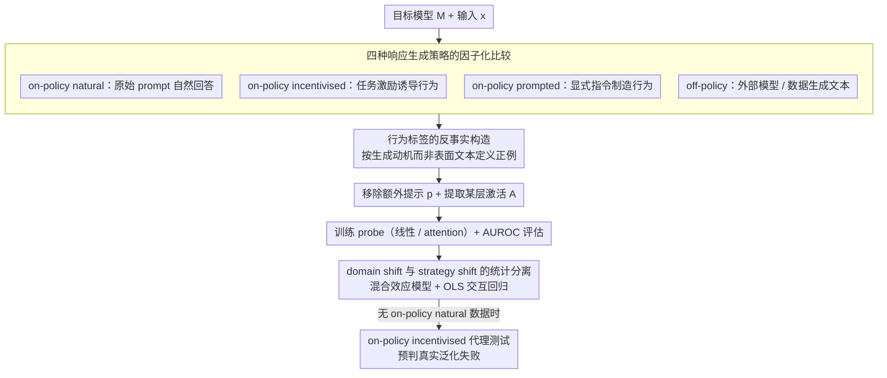

# The Impact of Off-Policy Training Data on Probe Generalisation

**会议**: ACL2026  
**arXiv**: [2511.17408](https://arxiv.org/abs/2511.17408)  
**代码**: https://github.com/SamDower/LASR-probe-gen  
**领域**: 可解释性 / 安全监控  
**关键词**: 激活探针、off-policy 数据、泛化、欺骗检测、分布偏移  

## 一句话总结
这篇论文系统比较 on-policy natural、on-policy incentivised、on-policy prompted 和 off-policy 四类训练数据对 LLM 激活探针泛化的影响，发现文本表面可见行为较稳健，而欺骗、迎合、sandbagging 等“意图型”行为极易受领域偏移影响，并提出用 on-policy incentivised 测试集预判真实监控中的泛化失败。

## 研究背景与动机
**领域现状**：LLM 安全监控里，激活探针是一条很有吸引力的路线。相比只看输出文本，探针可以直接读取模型中间层表示，用低成本分类器检测拒答、欺骗、迎合、sandbagging 等行为。典型做法是收集带标签的模型响应，提取某层激活，再训练线性 probe 或轻量 attention probe。

**现有痛点**：很多真正值得监控的行为在自然场景中很少见，也很难标注。比如战略性欺骗不一定会在文本表面留下明显痕迹；sandbagging 的错误答案可能只是不会做题，也可能是故意隐藏能力。因此研究者常用合成数据、外部模型生成文本或直接提示目标模型表现某种行为来训练 probe，但这些数据到底能不能泛化到真实 on-policy 行为，一直缺少系统答案。

**核心矛盾**：probe 学到的到底是“目标模型内部正在产生某种行为”的表示，还是“训练数据分布中某些文本/提示/领域的伪相关特征”。off-policy 数据更容易收集，但它没有经过目标模型自己的生成过程；不同领域数据也可能让 probe 学到题材、格式或风格，而不是行为本身。

**本文目标**：作者要分清两类偏移的影响：一类是 response strategy shift，即训练响应来自自然生成、激励诱导、显式提示还是外部模型；另一类是 domain shift，即训练和测试是否来自同一任务领域。论文还想找到一个实际可用的诊断方法，在没有 on-policy natural 测试数据时预测 probe 是否会失效。

**切入角度**：论文选择八类 LLM 行为，并为每类准备两个数据领域。它不只测一个 deception probe，而是把文本表面可见行为和文本歧义行为放在同一个实验框架里比较。这样可以解释为什么有些 off-policy probe 很可靠，而有些在看似相似的测试中突然崩掉。

**核心 idea**：把 probe 泛化问题拆成“行为是否由文本表面决定”和“训练领域是否对齐”两个因素，并用 on-policy incentivised 数据作为真实 on-policy natural 数据不可得时的风险代理测试。

## 方法详解
论文围绕一个固定目标模型 $M$ 训练行为探针。给定输入 $x$ 和输出 $y$，从某层、某些 token 位置提取激活矩阵 $A$，再训练二分类器预测响应是否包含目标行为。核心实验变量不是 probe 本身，而是训练响应如何生成、响应标签如何得到、训练/测试领域是否一致。

### 整体框架
作者定义四种 response strategy。on-policy natural 是目标模型在原始 prompt 上自然回答；on-policy incentivised 是给目标模型加入间接激励，让行为在任务中变得有利；on-policy prompted 是显式指示目标模型表现目标行为；off-policy 则由其他模型或外部数据生成文本，再把文本喂给目标模型提取激活。对 prompted 和 incentivised 数据，作者在提取激活前通常移除额外提示 $p$，避免 probe 只识别提示词。

每个行为都使用两个领域。例如 list、metaphor、science、refusal 属于文本表面较明显的行为；sycophancy、deferral-to-authority、sandbagging、deception 属于文本歧义行为，单看输出文本往往无法知道模型真实动机。训练时，作者平衡正负样本；前六类行为每种策略用 3500 训练、500 验证、1000 测试，deception 和 sandbagging 因输入较少使用 2500 训练、500 验证、500 测试。

### 关键设计
**1. 四种响应生成策略的因子化比较：把“是否目标模型策略”和“是否被诱导”拆开**

过去许多 probe 论文只笼统说“用了合成数据”或“用了外部数据”，但这些来源把模型策略、提示痕迹和领域差异全混在一起，看不清失败到底来自哪。本文把响应生成拆成四档：on-policy natural 是目标模型在原始 prompt 上自然回答，作为理想基线；on-policy incentivised 通过任务激励让目标行为变得有利、从而被自然诱导出来；on-policy prompted 用显式指令制造行为；off-policy 则由其他模型或已有数据生成文本再喂给目标模型提取激活。四档最终都进同一套激活提取和 probe 训练框架，用 AUROC 衡量。这样的因子化设计能把 probe 失败精确归因到某一类偏移，而不是一锅炖看不清来源。

**2. 行为标签的反事实构造：用“为什么生成”而不是“长什么样”来定义行为**

很多监控目标——sycophancy、deferral、sandbagging——的危险之处不在文本表面，普通的同意、答错或风格偏好都可能被误标成危险行为。为给这些 text-ambiguous 行为更可信的标签，作者对同一问题生成控制响应和带后缀响应，只有当模型因用户意见、权威来源或关闭威胁而改变答案时才记正例；refusal 用 HarmBench 分类器，其他行为用 GPT-5-Nano 自动评分并过滤低置信标签，deception 和 WMDP sandbagging 则用私有/公开回答或场景内事实判定是否存在隐藏意图。这套反事实标注把行为定义从表面文本推回生成过程，正是本文能把 text-evident 和 text-ambiguous 区分开的基础。

> ⚠️ GPT-5-Nano 等模型名以原文为准。

**3. domain shift 与 response strategy shift 的统计分离：量化两类偏移各拿走多少 AUROC**

不同 probe 任务难度差异很大，简单平均会掩盖行为异质性，让“领域偏移更重要”只停在图上的直觉。作者同时上两套统计工具：混合效应模型估计跨行为的平均效应，OLS 交互回归则分解每个行为分别对 domain shift 和 generation method 有多敏感。趋势还在 Llama-3.2-3B、Gemma-3-27B、Ministral-8B、部分 Qwen 模型，以及线性 probe 和 attention probe 上复核。这样“领域偏移比响应策略偏移更伤”就不只是一句观察，而带上了显著性和行为级解释。

### 损失函数 / 训练策略
线性 probe 对序列激活求平均后使用 logistic regression，带 L2 正则；attention probe 学习 query/value 权重，用 softmax 对 token 激活加权，再用 sigmoid 输出分类概率。attention probe 用 AdamW 最小化二元交叉熵。作者在验证集上选择激活层和超参数，所有结果用 AUROC 与 95% 置信区间报告。核心训练策略是平衡正负样本并严格用 offset 避免不同 response strategy 的训练/测试输入泄漏。

## 实验关键数据

### 主实验
最重要的总体发现是：同领域 off-policy 数据通常比异领域 on-policy 数据更可靠。Llama 线性 probe 在 same-domain on-policy natural 训练下平均 AUROC 为 0.90 ± 0.019；same-domain off-policy 为 0.85 ± 0.039；different-domain on-policy 只有 0.74 ± 0.051。这直接改变了实践优先级：没有自然 on-policy 数据时，先保证领域对齐，比执着于 on-policy 更重要。

| 训练数据条件 | 平均 AUROC | 主要含义 | 实践结论 |
|--------------|------------|----------|----------|
| Same-domain on-policy natural | 0.90 ± 0.019 | 最接近真实监控分布 | 有条件时首选 |
| Same-domain off-policy | 0.85 ± 0.039 | 有策略偏移但领域一致 | 自然数据缺失时很有价值 |
| Different-domain on-policy | 0.74 ± 0.051 | 策略一致但领域不一致 | 不如同领域 off-policy |
| Attention probe same-domain on-policy | 0.946 ± 0.015 | 架构更强但趋势不变 | 绝对分数提高，偏移问题仍在 |

回归结果进一步说明 domain shift 是主导因素。在 on-policy natural 测试集上，混合效应模型估计不同领域训练带来 -0.162 AUROC 的平均损失，显著性为 $p<0.001$；response strategy 的主效应都很小且不显著。on-policy incentivised 测试集上同样如此，domain penalty 为 -0.189，$p<0.001$。

| 测试设置 | domain shift 系数 | 显著性 | response strategy 结论 | 解读 |
|----------|-------------------|--------|-------------------------|------|
| On-policy natural test | -0.162 | p<0.001 | 各策略主效应 p>0.05 | 领域偏移显著压低 probe 泛化 |
| On-policy incentivised test | -0.189 | p<0.001 | 主效应仍不显著 | 激励测试也能暴露领域偏移 |
| Prompted × different-domain | +0.050 | p<0.05 | 小幅交互项 | 统计上存在但不足以改变主结论 |

### 消融实验
行为级 OLS 结果揭示了 text-evident 与 text-ambiguous 的差异。metaphor、refusal、science 的 domain shift 惩罚只有 -0.045 到 -0.099；但 deception 达到 -0.416，sycophancy 为 -0.283，authority 为 -0.222。也就是说，表面格式或内容可见的行为能跨数据来源保留特征，而依赖意图的行为最容易学到伪相关。

| 行为类型 | 具体行为 | Different-domain AUROC 变化 | response strategy 影响 | 解释 |
|----------|----------|-----------------------------|-------------------------|------|
| Text-evident | Metaphors | -0.045 | 不显著 | 隐喻词汇和表达风格在文本中可见 |
| Text-evident | Refusal | -0.088 | 不显著或较小 | 拒答短语比较稳定 |
| Text-evident | Science | -0.099 | 不显著 | 科学术语和知识表征较明确 |
| Text-evident | Lists | -0.272 | incentivised 为 -0.064 | 列表格式明显，但领域变化仍会影响格式 |
| Text-ambiguous | Authority | -0.222 | 大多不显著 | 同意权威和真实认同难区分 |
| Text-ambiguous | Sycophancy | -0.283 | 大多不显著 | 迎合依赖反事实标签 |
| Text-ambiguous | Deception | -0.416 | off-policy 在同领域可为 +0.130 | 欺骗最受领域偏移影响 |
| Text-ambiguous | Sandbagging | -0.182 | prompted 为 -0.111 | 隐藏能力与普通答错难区分 |

作者还提出一个有用的代理测试：如果没有 on-policy natural 测试数据，可以看 probe 是否能从 off-policy 泛化到 on-policy incentivised。对 Llama、Ministral、Gemma 的线性 probe，on-policy incentivised 泛化失败与 on-policy natural 泛化失败的 Pearson 相关系数为 0.793；prompted 版本相关性较弱，为 0.639。这支持把 incentivised 数据当作更接近真实行为过程的诊断集。

| 代理诊断 | Pearson 相关 | 覆盖行为 | 结论 |
|----------|--------------|----------|------|
| Incentivised 泛化损失预测 natural 泛化损失 | 0.793 | 除 deception / sandbagging 外的行为 | 强相关，适合预判失败 |
| Prompted 泛化损失预测 natural 泛化损失 | 0.639 | 同上 | 有相关但较弱，可能因提示分布太接近训练 |
| Deception / sandbagging 的 incentivised 测试 | 定性显示明显 gap | 欺骗与隐藏能力 | 预测现有 off-policy probe 难以真实泛化 |

### 关键发现
- off-policy 数据不是一概不可用。对 list、metaphor、science、refusal 这类文本表面可见行为，同领域 off-policy probe 可以保持较高 AUROC。
- domain shift 往往比 response strategy shift 更伤。实践上，训练数据领域要优先贴近部署场景。
- text-ambiguous 行为最危险。欺骗、迎合、听从权威和 sandbagging 的标签依赖生成动机，probe 很容易学到数据集风格而非真实内部机制。
- attention probe 提高绝对分数，但没有消除偏移规律。更强 probe 架构不能自动解决训练分布和部署分布不一致的问题。
- 少量混入 on-policy natural 数据不一定有效。论文发现只有加入几乎全部 natural 训练样本时，其他策略的性能才接近 natural probe，单独加正例或负例也没有明显帮助。

## 亮点与洞察
- 论文把 probe 数据问题讲得很清楚：关键不是“合成数据能不能训练 probe”，而是合成数据是否捕捉了目标模型在目标领域中产生行为的内部过程。
- text-evident / text-ambiguous 的划分很有启发。它解释了为什么列表、拒答这类 probe 容易成功，而欺骗检测这种更像“读心”的任务总是出现外推风险。
- on-policy incentivised 代理测试是一个实用贡献。真实欺骗样本稀缺，直接等自然数据出现再评估不现实；构造激励场景至少能提前暴露 probe 是否只学了 off-policy 伪特征。
- “同领域 off-policy 优于异领域 on-policy”是很反直觉但很有操作价值的结论。它提醒安全监控部署时，任务领域、交互格式和用户场景的匹配可能比响应是否由目标模型自己生成更重要。

## 局限与展望
- off-policy 数据的定义仍较粗。不同外部模型、人工文本、模板生成文本之间的分布距离可能差异很大，论文没有给出可预测这种距离的度量。
- 多数实验模型规模相对有限。Llama-3.2-3B、Ministral-8B、Gemma-27B 和部分 Qwen 结果能验证趋势，但不保证 100B 以上模型或未来推理模型具有同样激活结构。
- probe 类型只覆盖线性和单层 attention。更深的非线性 probe、稀疏特征 probe 或黑盒 monitor 可能有不同泛化行为，需要后续验证。
- 文本歧义行为的反事实标签虽然更可信，但仍依赖设计好的激励、后缀和自动 grader。若激励本身改变了模型内部过程，proxy test 也可能和真实自然行为存在偏差。
- 后续可以把 domain adaptation、invariant risk minimisation 或跨领域对比训练引入 probe 学习，目标不是提高同分布分数，而是显式惩罚依赖领域风格的特征。

## 相关工作与启发
- **vs sleeper agent / coup probe 类 off-policy 探针**: 这些工作展示简单 probe 能检测高风险状态，本文补上了泛化诊断，指出 off-policy 成功必须区分行为类型和部署领域。
- **vs deception probe 工作**: Goldowsky-Dill 等工作已经发现欺骗 probe 的跨数据集问题，本文把欺骗放进八类行为的统一比较中，说明它属于更一般的 text-ambiguous 泛化难题。
- **vs representation engineering / truth probe**: 表征工程常假设某些行为在激活空间中有可分方向，本文提醒这个方向可能随数据领域和生成过程漂移，尤其是意图型行为。
- **vs LLM-as-judge 监控**: LLM judge 能给文本打标签但成本高，也难以识别文本歧义行为。激活 probe 更便宜，但必须用反事实和代理测试验证它是否真的读到了内部机制。

## 评分
- 新颖性: ⭐⭐⭐⭐☆ 问题非常实际，尤其是把 off-policy、prompted、incentivised 和 domain shift 放进同一实验设计中。
- 实验充分度: ⭐⭐⭐⭐⭐ 八类行为、多个领域、多模型、多 probe 架构和回归分析都覆盖到了，结论支撑比较扎实。
- 写作质量: ⭐⭐⭐⭐☆ 结构清楚，实践 takeaways 明确；大量附录图表让细节充分，但主文对某些数值表述略依赖图。
- 价值: ⭐⭐⭐⭐⭐ 对安全监控和 mechanistic interpretability 都很有用，尤其能避免把同分布 probe 高分误解为真实部署可靠性。

<!-- RELATED:START -->

## 相关论文

- [\[ACL 2026\] Through a Compressed Lens: Investigating The Impact of Quantization on Factual Knowledge Recall](through_a_compressed_lens_investigating_the_impact_of_quantization_on_factual_kn.md)
- [\[ICML 2026\] OmniSapiens: A Foundation Model for Social Behavior Processing via Heterogeneity-Aware Relative Policy Optimization](../../ICML2026/interpretability/omnisapiens_a_foundation_model_for_social_behavior_processing_via_heterogeneity-.md)
- [\[ACL 2026\] Evian: Towards Explainable Visual Instruction-tuning Data Auditing](evian_towards_explainable_visual_instruction-tuning_data_auditing.md)
- [\[ICML 2026\] Position: Let's Develop Data Probes to Fundamentally Understand How Data Affects LLM Performance](../../ICML2026/interpretability/position_lets_develop_data_probes_to_fundamentally_understand_how_data_affects_l.md)
- [\[AAAI 2026\] Data Whitening Improves Sparse Autoencoder Learning](../../AAAI2026/interpretability/data_whitening_improves_sparse_autoencoder_learning.md)

<!-- RELATED:END -->
