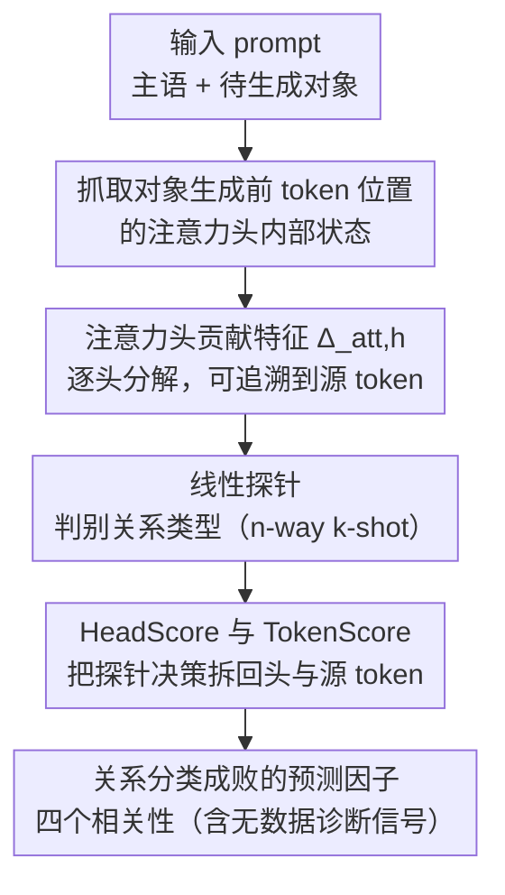

# Tracing Relational Knowledge Recall in Large Language Models

**会议**: ACL 2026 Findings  
**arXiv**: [2604.19934](https://arxiv.org/abs/2604.19934)  
**代码**: [nicpopovic.com/publications/tracing](https://nicpopovic.com/publications/tracing)  
**领域**: 可解释性 / 知识表示  
**关键词**: 关系知识、注意力头归因、线性探针、知识回忆机制、特征归因

## 一句话总结
本文系统研究LLM在文本生成过程中回忆关系知识的内部机制，发现注意力头对残差流的逐头贡献（$\Delta_{att,h}$）是线性关系分类的最强特征（准确率达91%），并提出HeadScore和TokenScore两种探针归因方法来分解预测到注意力头和源token级别，揭示了探针精度与关系特异性、实体连通度及探针信号集中度之间的明确相关性。

## 研究背景与动机

**领域现状**：LLM如何存储和回忆关系知识是可解释性研究的核心问题。已有研究揭示了知识回忆的典型图景：(1) 主语实体信息在中间到后期层的主语跨度最后token处累积；(2) 谓词/关系信息通过注意力头累积到对象生成前的token位置；(3) 对象实体通过注意力从MLP子层检索。这一过程有时可以用线性变换近似，并可追溯到关系特定的神经元。

**现有痛点**：对于实体表示，已有研究表明通过探针可以可靠地进行命名实体识别和消歧。但对于关系类型特征，尚不清楚哪些内部表示支持忠实的线性关系分类，也不清楚为什么某些关系类型比其他类型更容易被线性捕获。已有分析无法将关系预测同时追溯到特定的注意力头和源token。

**核心矛盾**：虽然知道注意力头和MLP在知识回忆中扮演角色，但缺乏一种可以同时在注意力头级别和token级别进行归因的探针方法来系统地理解关系分类的成功与失败因素。

**本文目标**：(1) 找到最适合线性关系分类的LLM内部表示；(2) 确定什么因素预测探针在关系分类上的成功或失败。

**切入角度**：聚焦于注意力头对残差流的逐头贡献，因为这些特征可以自然分解到源token级别，使得归因分析可行。

**核心 idea**：使用注意力头的逐头贡献 $\Delta_{att,h}$ 作为线性探针特征进行关系分类，并通过HeadScore（注意力头级归因）和TokenScore（源token级归因）两种方法来分解探针的预测决策。

## 方法详解

### 整体框架
本文把"关系知识回忆"设置成一个受控的填空式生成场景：给定一句含主语、待预测对象的 prompt，在对象生成前的那个 token 位置抓取模型内部状态，训练一个线性探针去判别这句话所表达的关系类型。关键在于选用注意力头的逐头贡献 $\Delta_{att,h}$ 作为探针特征——它既是最强的关系判别信号，又能自然拆解到单个注意力头与单个源 token，从而支撑起 HeadScore 与 TokenScore 两套归因分析。整套流程在 FewRel 验证集上对 LLaMA-3.2 1B/3B、LLaMA-3.1 8B、Qwen3 4B 四个指令调优模型做系统评估。

### 关键设计

**1. 注意力头贡献特征 $\Delta_{att,h}$：可追溯的最强关系信号**

完整的注意力状态或 MLP 状态虽然信息更丰富，却说不清某个判别究竟来自哪个头、哪个 token，因而天然不可归因。本文转而使用注意力头对残差流的逐头贡献：对目标位置 $t$（对象生成前），头 $h$ 的贡献为 $\Delta_{att,h}(t) = W_{O,h}(\sum_j \text{Attn}_h(t,j) V_h(j))$，即注意力加权聚合后再过输出投影矩阵的结果；它还能进一步拆到单个源 token $j$ 上，$\Delta_{att,h}(t,j) = W_{O,h}(\text{Attn}_h(t,j) V_h(j))$。反直觉的是，这种分解后的特征不仅可追溯，分类精度还反过来高于完整状态（>90% vs 完整注意力约 83–87%）——拆解消去了不同头之间的相互干扰，让线性可分性更好，也为下游的 HeadScore 与 TokenScore 归因铺好了路。

**2. HeadScore 与 TokenScore：把探针决策拆回头与 token**

要解释探针为何做出某个预测，就需要把它的线性权重投回到具体的头和源 token 上。给定探针权重矩阵 $W$ 和预测类 $\hat{c}$，先构造一个对比方向 $\Delta W = W_{\hat{c}} - \sum_{c \neq \hat{c}} \pi_c W_c$，即用 softmax 权重 $\pi_c$ 加权减去各竞争类的权重，突出 $\hat{c}$ 相对其它类的判别方向。HeadScore 把每维特征的贡献 $\Delta W_m x_m$ 按所属头聚合，$\text{HeadScore}_{\ell,h} = \sum_{m:\ell_m=\ell, h_m=h} \Delta W_m x_m$，揭示哪些头在驱动分类；TokenScore 则借助头贡献的 token 分解把归因细化到源 token，$\text{TokenScore}_\ell(j) = \sum_{m:\ell_m=\ell} \Delta W_m \cdot [\Delta_{att,h_m}(t,j)]_{d_m}$，从而看清决策信号到底来自输入的哪些词，使错误分析与词汇捷径检测成为可能。

**3. 关系分类成败的预测因子：四个相关性**

为解释"为什么有些关系类型探针好做、有些极难"，本文在 16-way-5-shot 设置下系统分析探针精度与四个因素的相关性。前三个刻画输入数据本身的难度：Wikidata 输出范围（一种关系对应多少种不同对象）与精度负相关，对象越发散越难；主-宾实体对之间的平均实体连通度（共享的 Wikidata 属性数量）也负相关，连通越密关系越易混淆；而示例间的 TF-IDF 词汇相似度正相关，词面越像越好分。第四个因素来自探针自身——HeadScore 达到 95% 累积贡献所需的头数量与精度负相关：信号越集中在少数头，分类越准。由于这一指标不依赖任何标注数据，它可以直接当作探针行为的诊断信号，预测探针在新关系类型上的可靠性。

### 损失函数 / 训练策略
线性探针使用交叉熵损失和 Adam 优化器训练 200 个 epoch。使用 RelSpec 专家特征选择，每个关系类型选取 top 3000 个特征。采用 FewRel 验证集的 n-way k-shot 评估，所有结果在 5 个随机种子 × 500 个 episode 上平均。

## 实验关键数据

### 主实验（5-way-5-shot关系分类精度，%）

| 特征类型 | LLaMA-3.2 1B | LLaMA-3.2 3B | LLaMA-3.1 8B | Qwen3 4B |
|---------|-------------|-------------|-------------|----------|
| Attention (完整) | 83.65 | 86.61 | 86.79 | 75.06 |
| $\Delta_{att,h}$ (逐头) | **90.26** | **91.06** | **91.09** | **89.66** |
| MLP (完整) | 85.79 | 86.40 | 85.90 | 80.37 |
| $\Delta_{MLP,h}$ (逐头) | 89.96 | 90.90 | 89.99 | 88.43 |
| $\Delta_{att,e_1}$ (实体) | 59.64 | 60.16 | 59.85 | 59.58 |

### 消融实验（词汇捷径分析）

| 模型 | Spearman ρ | Mass | StrongAlign× (%) |
|------|-----------|------|-------------------|
| LLaMA-3.2 1B | 0.115 | 0.491 | 7.7 |
| LLaMA-3.1 8B | 0.095 | 0.475 | 5.3 |
| Qwen3 4B | 0.099 | 0.490 | 5.9 |

### 关键发现
- $\Delta_{att,h}$ 是所有模型中最强的关系分类特征，始终优于完整注意力/MLP状态及其他变体，准确率超过90%
- 仅观察源实体token的贡献（$\Delta_{att,e_1}$）对关系分类无益（约59-60%），说明关系信号不仅仅编码在实体token上
- 探针精度在不同关系类型间差异巨大（如"part of"的F1为39.76%，而"constellation"为99.24%），与输出范围和实体连通度负相关
- HeadScore信号越集中在少数注意力头的关系类型，探针精度越高——这可能与特征叠加（superposition）有关
- 仅5.3%-7.7%的错误与词汇捷径一致，表明线性关系探针的决策不是主要由词汇线索驱动

## 亮点与洞察
- **逐头贡献优于完整状态**：反直觉的是，分解后的逐头特征比信息更丰富的完整状态更适合线性分类。这可能因为分解消除了不同头之间的干扰，使线性分离更容易。这个发现对其他LLM探针研究也有指导意义。
- **HeadScore集中度作为无数据诊断指标**：探针信号的集中度（需要多少头达到95%贡献）是探针自身的属性，不依赖于标注数据，可以预测探针在新关系类型上的表现——这为探针的可靠性评估提供了实用工具。
- **TokenScore揭示探针行为**：通过将归因细化到token级别，可以检查探针是否依赖语义相关token（如"crosses"）还是共现token（如"bridge"），为诊断探针行为提供了精细的工具。

## 局限与展望
- 仅在FewRel验证集上评估，关系类型相对有限（16个类）
- 所有发现是相关性而非因果性——输出范围、连通度等因素的影响机制尚待因果实验验证
- 评估模型范围从1B到8B，未测试更大模型
- 探针方法解释的是探针的决策而非LLM的内部计算，二者之间的关系需要进一步厘清
- 未探索非线性探针是否能捕获更多关系信息

## 相关工作与启发
- **vs Meng et al. (2022) / ROME**：聚焦知识编辑中的事实定位，本文聚焦关系分类中的特征选择和归因
- **vs Hernandez et al. (2024)**：展示了某些关系可被线性近似，但未解释为什么某些关系更容易。本文通过输出范围、连通度等因素提供了解释
- **vs Liu et al. (2025)**：在神经元级别隔离关系信息（主要在MLP层），本文在注意力头级别提供了可追溯的探针方法
- **vs Chughtai et al. (2024)**：使用直接logit归因分析模型自身行为，本文的TokenScore分析的是任务特定探针的决策

## 评分
- 新颖性: ⭐⭐⭐⭐ HeadScore/TokenScore归因方法和性能预测因子分析是有价值的贡献
- 实验充分度: ⭐⭐⭐⭐ 4个模型、多种特征变体、完整的相关性分析和词汇捷径检测
- 写作质量: ⭐⭐⭐⭐⭐ 形式化严谨，实验设计层层递进，写作非常清晰
- 价值: ⭐⭐⭐⭐ 为LLM关系知识的探针研究提供了系统方法论和实用工具

<!-- RELATED:START -->

## 相关论文

- [\[ACL 2026\] Knowledge Vector of Logical Reasoning in Large Language Models](knowledge_vector_of_logical_reasoning_in_large_language_models.md)
- [\[ACL 2026\] Through a Compressed Lens: Investigating The Impact of Quantization on Factual Knowledge Recall](through_a_compressed_lens_investigating_the_impact_of_quantization_on_factual_kn.md)
- [\[ACL 2026\] MINED: Probing and Updating with Multimodal Time-Sensitive Knowledge for Large Multimodal Models](mined_probing_and_updating_with_multimodal_time-sensitive_knowledge_for_large_mu.md)
- [\[ACL 2025\] Cracking Factual Knowledge: A Comprehensive Analysis of Degenerate Knowledge Neurons in Large Language Models](../../ACL2025/interpretability/degenerate_knowledge_neurons.md)
- [\[ACL 2026\] Compositional Steering of Large Language Models with Steering Tokens](compositional_steering_of_large_language_models_with_steering_tokens.md)

<!-- RELATED:END -->
