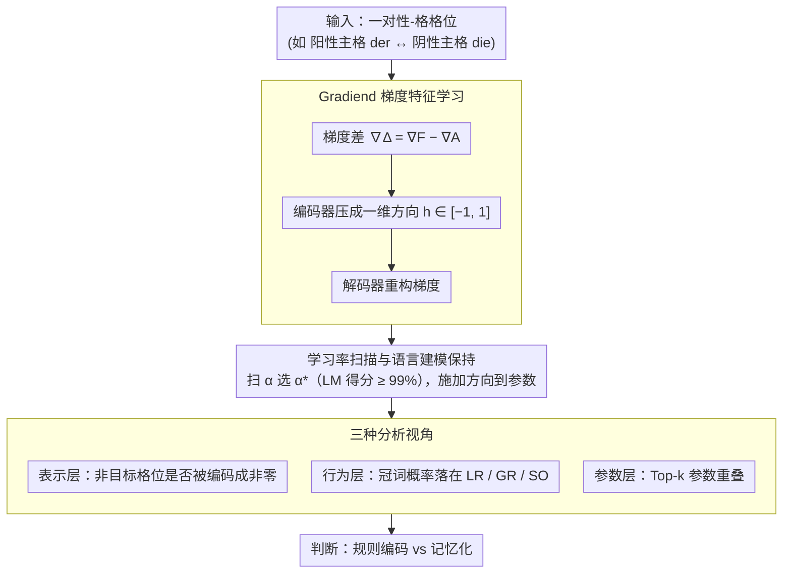

# Understanding or Memorizing? A Case Study of German Definite Articles in Language Models

**会议**: ACL 2026  
**arXiv**: [2601.09313](https://arxiv.org/abs/2601.09313)  
**代码**: 无  
**领域**: 可解释性  
**关键词**: 语法编码, 记忆 vs 泛化, 德语冠词, 梯度可解释性, Gradiend

## 一句话总结

本文利用 Gradiend 梯度可解释性方法研究语言模型预测德语定冠词（der/die/das/den/dem/des）时是基于抽象语法规则还是表层记忆，发现模型至少部分依赖记忆化关联而非严格的规则编码。

## 研究背景与动机

**领域现状**：现代语言模型在语法一致性任务上表现接近完美，但其内部机制究竟是编码了抽象语法规则（如性、数、格的系统性关系）还是仅仅记忆了高频的 token-上下文关联，仍是可解释性研究的核心问题。

**现有痛点**：现有探测（probing）研究只能证明语法特征"可从模型表示中恢复"，但无法证明这些特征"因果性地驱动"模型预测。因此，探测准确率高不等于模型真正理解了语法规则。

**核心矛盾**：德语定冠词系统提供了一个理想的测试场景——同一冠词可对应多种性-格组合（如"der"既是阳性主格也是阴性与格/属格），这种同形异义现象让研究者可以区分：如果模型基于规则编码，那么针对特定性-格转换的干预应只影响该语法维度；如果基于记忆，干预会溢出到共享同一表层冠词的不相关语法设定。

**本文目标**：通过梯度干预实验验证德语定冠词预测是规则驱动还是记忆驱动。

**切入角度**：使用 Gradiend 方法——一种基于梯度的编码器-解码器可解释性框架——为特定性-格冠词转换学习参数更新方向，然后测试这些更新方向是否泛化到不相关的语法设定。

**核心 idea**：如果为"阳性主格 der → 阴性主格 die"学到的更新方向同时影响了"阴性与格 der → 阴性与格 die"等不相关的语法设定，就说明模型在这些位置依赖的是表层记忆而非抽象规则。

## 方法详解

### 整体框架

本文把德语定冠词系统当成一个受控的"语法实验台"：3 性 × 4 格 = 12 个格位，却只有 der/die/das/den/dem/des 这 6 种表层冠词，于是同一冠词常对应多种性-格组合。给定一对性-格格位之间的冠词转换（如阳性主格 der → 阴性主格 die），方法先用 Gradiend 从梯度里学出一个一维的参数更新方向，再带着学习率扫描把这个方向施加回模型（同时守住语言建模能力），最后从编码器值分布、干预后冠词概率变化、参数空间重叠三个互补视角判断：模型究竟在抽象规则上编码这次转换，还是只是记住了表层冠词的共现关联。

### 关键设计

**1. Gradiend 梯度特征学习：把一次冠词转换压成一维方向**

要回答"规则 vs 记忆"，先得有办法把"某次特定的性-格转换"从模型里单独拎出来。对一对格位 $z_1, z_2$（如阳性主格 der ↔ 阴性主格 die），方法分别收集事实目标梯度 $\nabla^F$ 与替代目标梯度 $\nabla^A$，取其差 $\nabla^\Delta = \nabla^F - \nabla^A$ 作为这次转换的"信号"。编码器把 $\nabla^\Delta$ 压成一个标量 $h \in [-1, 1]$（+1、-1 对应转换的两个方向），解码器再从 $h$ 重构梯度；一维瓶颈逼着模型只保留最主要的那条更新方向，避免学成全局扰动。

关键在于约束这个方向必须"专属于"目标转换：所有非目标格位的训练样本都被设成恒等对（factual = alternative），强制它们的 $h \approx 0$。这样一旦干预时发现某个本该为零的非目标格位也被激活，就是记忆化的直接证据，而非规则编码本应有的"井水不犯河水"。

**2. 学习率扫描与语言建模保持：排除"模型退化"这一伪信号**

学到方向后要把它施加回模型，但大幅参数更新本身就可能靠破坏语言建模能力来改变预测，那样得到的"溢出"只是假象。施加干预时，方法扫描多个学习率 $\alpha$，只保留那些在中性数据集上仍维持 99% 以上语言建模得分的候选，并从中选出在目标数据集上最大化目标冠词概率的 $\alpha^*$。同时报告 SuperGLEBer 基准分数，确认干预前后模型整体能力未受损，从而保证后续观察到的冠词概率变化反映的是真实语法机制，而非模型被改坏了。

**3. 三种分析视角：从表示、行为、参数三处交叉取证**

单一视角都可能有混淆因素，方法因此并行做三种分析。表示层看编码器——检查非目标格位的梯度是否也被编码成非零值（纯规则下应为零）。行为层做概率干预——把上一步选出的 $\alpha^*$ 方向施加到参数后，观察冠词概率变化是落在目标格位内（LR）、系统性扩展到同性/同格维度（GR），还是溢出到只是共享表层冠词的不相关格位（SO）；其中 SO 正是记忆的标志。参数层比 Top-$k$ 重叠——若不同转换的最重要参数大量重叠，说明模型没有给每种语法关系分配独立的参数子集。

三处证据分别落在表示空间、功能行为、参数空间，相互独立却指向同一结论时，记忆化的判断才足够稳。

### 损失函数 / 训练策略

Gradiend 以 MSE 重构损失 $\|\text{dec}(\text{enc}(\nabla^A W_m)) - \nabla^\Delta W_m\|_2^2$ 训练。这里特意把替代目标梯度 $\nabla^A$ 作为编码器输入——因为事实目标梯度往往接近零、信息量不足，用 $\nabla^A$ 才能让编码器学到有判别力的方向。

## 实验关键数据

### 主实验

在 6 个模型上（GermanBERT、GBERT、ModernGBERT、EuroBERT、GermanGPT-2、LLaMA）训练 19 种 Gradiend 变体。

| 模型 | 编码器相关性 | 溢出现象 |
|--------|------|------|
| GermanBERT | 90-98% | 显著：针对 der→die 的干预同时影响阴性与格/属格 |
| GBERT | 95-99% | 显著：类似模式 |
| ModernGBERT | 81-95% | 中等溢出 |
| EuroBERT | 50-73% | 较弱但仍显著 |
| GermanGPT-2 | 51-71% | 模式不一致 |
| LLaMA | 50-67% | 最少溢出，可能反映更大模型的趋势 |

### 消融实验

| 分析 | 关键发现 | 说明 |
|------|---------|------|
| 概率干预 | 溢出模式(SO)频繁出现 | der→die 干预增加了阴性与格/属格(也用 der)的 die 概率 |
| Top-1000 参数重叠 | 同冠词组内重叠 40-60% | 不同转换共享大量参数，超出随机基线 |
| 跨冠词组重叠 | 20-30% | 即使不同冠词的转换也有可观参数重叠 |
| 对照组 | 基线级重叠 | 使用打乱数据训练的 Gradiend 仅有基线水平重叠 |

### 关键发现

- **溢出现象广泛存在**：针对特定性-格转换学到的参数更新方向显著影响共享同一表层冠词的不相关格位，这与纯规则编码假设不符。
- **参数重叠度高**：不同冠词转换的最重要参数大量重叠（40-60%），远超随机基线，说明模型没有为每种语法关系分配独立的参数子集。
- **编码器模型更"记忆化"**：GermanBERT、GBERT 等编码器模型的溢出现象最强，可能因为双向注意力让模型更容易利用表层共现关联。
- **模型越大可能越少记忆**：LLaMA（3.2B）是唯一没有在某些关键格位展示溢出的模型，暗示更大模型可能倾向于更抽象的编码。
- **语言建模能力未受损**：SuperGLEBer 分数在干预前后基本不变（70.7 → 70.1-70.2），确认效果不是由模型退化导致。

## 亮点与洞察

- **精巧的实验设计**：利用德语冠词的同形异义特性（der 可以是阳性主格或阴性与格/属格）构建了一个自然的对照实验，这种"同一表层形式、不同深层语法功能"的设置在其他语言中也可复制。
- **因果性证据**：超越了传统探测的"相关性"证据，通过参数干预提供了"因果性"证据——模型预测改变的模式直接揭示了内部编码机制。
- **综合三视角分析**：编码器分析、概率干预和参数重叠三个视角提供了一致的结论，增强了证据的说服力。

## 局限与展望

- 仅研究了德语定冠词一个语法现象，结论能否推广到其他形态丰富语言的语法系统有待验证。
- 解码器模型（GPT-2、LLaMA）需要自定义 MLM 预测头，这可能引入噪声影响结论。
- Gradiend 的一维瓶颈可能过度简化了实际的多维语法编码。
- 未探讨训练数据中冠词-名词共现频率如何影响记忆 vs 泛化的程度。

## 相关工作与启发

- **vs 线性探测**: 探测只能证明信息"存在于"表示中，Gradiend 干预能证明信息"因果性地驱动"预测，提供更强的证据。
- **vs Finlayson et al. (2021)**: 他们修改内部表示来研究主谓一致，本文修改模型参数来研究冠词预测，方法论互补但层次不同（表示空间 vs 参数空间）。

## 评分

- 新颖性: ⭐⭐⭐⭐ 利用德语冠词同形异义特性的实验设计非常精巧
- 实验充分度: ⭐⭐⭐⭐⭐ 6个模型19种变体，三视角分析，统计检验严谨
- 写作质量: ⭐⭐⭐⭐ 清晰但对非德语读者有一定门槛
- 价值: ⭐⭐⭐⭐ 为 LM 语法编码的记忆 vs 规则之争提供了重要因果证据

<!-- RELATED:START -->

## 相关论文

- [\[ACL 2026\] Interpretable Semantic Gradients in SSD: A PCA Sweep Approach and a Case Study on AI Discourse](interpretable_semantic_gradients_in_ssd_a_pca_sweep_approach_and_a_case_study_on.md)
- [\[ICML 2025\] Do Sparse Autoencoders Generalize? A Case Study of Answerability](../../ICML2025/interpretability/do_sparse_autoencoders_generalize_a_case_study_of_answerability.md)
- [\[CVPR 2026\] Understanding Counting Mechanisms in Large Language and Vision-Language Models](../../CVPR2026/interpretability/understanding_counting_mechanisms_in_large_language_and_vision-language_models.md)
- [\[ACL 2026\] Rhetorical Questions in LLM Representations: A Linear Probing Study](rhetorical_questions_in_llm_representations_a_linear_probing_study.md)
- [\[ACL 2026\] Knowledge Vector of Logical Reasoning in Large Language Models](knowledge_vector_of_logical_reasoning_in_large_language_models.md)

<!-- RELATED:END -->
