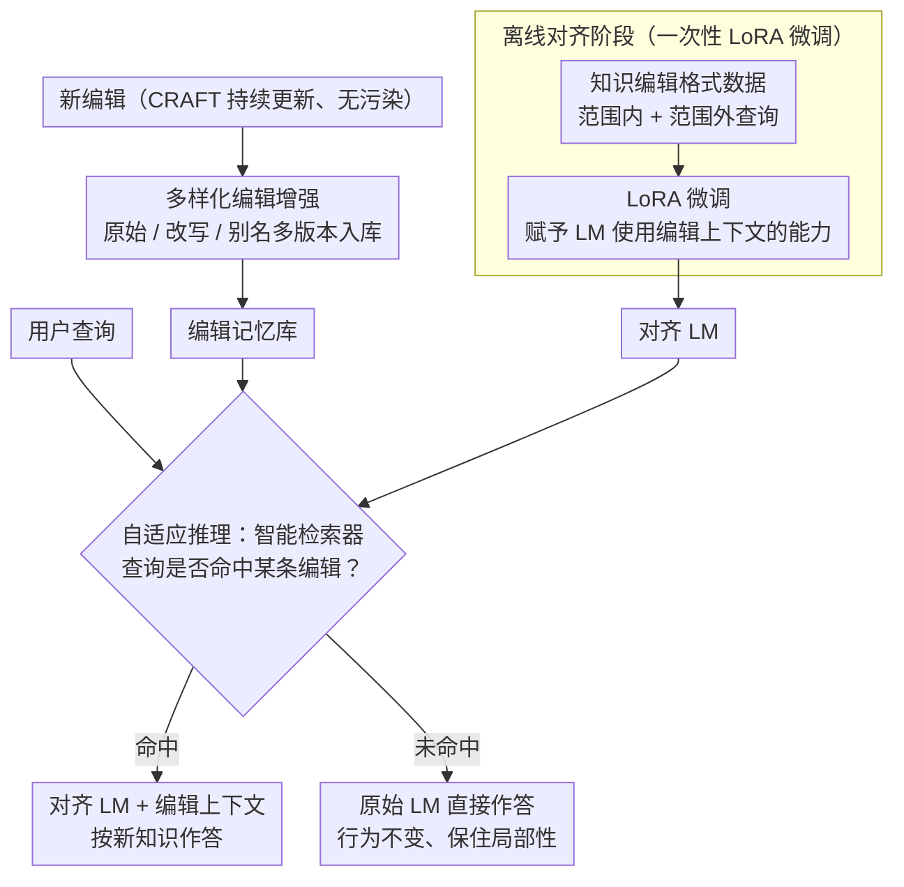

# Aligning Language Models with Real-time Knowledge Editing

**会议**: ACL 2026  
**arXiv**: [2508.01302](https://arxiv.org/abs/2508.01302)  
**代码**: [GitHub](https://github.com/JamyDon/CRAFT-KEDAS)  
**领域**: Knowledge Editing  
**关键词**: 实时知识编辑, 知识对齐, 数据集污染, 多样化增强, 自适应推理

## 一句话总结

引入CRAFT（持续更新的中文金融知识编辑数据集）和KEDAS（基于多样化编辑增强和自适应推理的知识编辑对齐范式），解决现有知识编辑方法在实时场景中成功率-局部性-可迁移性难以兼顾的问题。

## 研究背景与动机

**领域现状**：知识编辑旨在高效修改LM中的过时知识，无需完全重训练。但主流评估数据集（ZsRE, MQuAKE, RippleEdits）是静态的，一旦发布就无法更新。

**现有痛点**：(1) 静态数据集存在严重的数据泄露问题——大部分知识已被LM在预训练中见过，导致评测不公平；(2) WikiBigEdit虽然实时但需要处理数百GB的Wiki数据且稀疏性严重；(3) 现有方法在编辑成功率、局部性和可迁移性之间难以取得平衡。

**核心矛盾**：参数修改方法（如ROME, WISE）在连续编辑时模型退化严重；检索方法（如IKE, EREN）因缺乏对齐而性能不稳定；对齐方法（如LTE）因过拟合而局部性差。

**本文目标**：构建一个持续更新、无污染的实时知识编辑数据集，并提出能在所有指标上均衡表现的知识编辑方法。

**切入角度**：利用中国官方公开的金融统计数据（持续更新且LM未见过）构建数据集，并将知识编辑重新定义为LM对齐问题。

**核心 idea**：通过一次性离线对齐（LoRA微调）赋予LM知识编辑能力，然后在推理时通过自适应路由决定使用原始模型还是对齐模型，从根本上解决局部性问题。

## 方法详解

### 整体框架

KEDAS 把"知识编辑"重新定义成"让 LM 学会使用编辑提示"的对齐问题，分离线、在线两个阶段。离线阶段用 LoRA 在知识编辑格式的数据上微调一次 LM，赋予它"看到编辑上下文就据此更新回答"的能力；在线阶段则只动外部记忆——新知识以多样化形式存入记忆，推理时智能检索器先判断查询是否命中某条编辑，再据此在"原始 LM"和"LoRA 对齐 LM"两条路径间自适应路由。这样编辑能力一次性注入、后续编辑零参数改动，局部性也由路由从根上保证。

### 关键设计

**1. CRAFT 数据集：用持续更新的官方数据躲开污染**

静态基准（ZsRE、MQuAKE、RippleEdits）一旦发布就固定，里面大部分知识 LM 在预训练时早已见过，评测因此失真。CRAFT 改用中国官方持续公开的金融与统计数据（GDP、人口等），天然保证 LM 没见过、且能随时间刷新。它还把编辑设计成成对的（paired edits）作为组合推理测试，并配套别名可迁移性、时间局部性、常识局部性三类评估——成对结构专门考察模型整合多条编辑的能力（composite portability），而非只改单点。

**2. 多样化编辑增强：一条知识存成多种说法**

用户问同一件事的措辞千变万化，若编辑只以单一形式入库，检索很容易因表述不匹配而漏召。多样化编辑增强把每条编辑同时存成原始 QA 对、改写版本、别名版本等多种表达，显著抬高检索命中率，让后续的路由决策建立在"该召回的都召回了"的基础上。

**3. 自适应推理路径：用路由从根上保住局部性**

局部性差的本质是编辑会殃及无关查询。KEDAS 让一个带过滤增强的智能检索器先判断查询是否与任何编辑相关：相关，就走 LoRA 对齐模型并喂入编辑上下文，按新知识作答；不相关，则直接用原始 LM、完全不改其行为。因为对无关查询根本不激活对齐模型，过拟合导致的知识遗忘就被绕开了，这正是它在局部性上胜过 LTE 等纯对齐方法的关键。

### 一个完整示例

以"某省最新 GDP 已更新"这条编辑为例：入库时它被增强成原始问法、改写问法、含别名的问法等多个版本存进记忆。推理时若用户问"该省去年经济总量是多少"，检索器命中这条编辑，查询走 LoRA 对齐模型并带上编辑上下文，输出更新后的数值；若用户改问一个无关常识"该省省会是哪座城市"，检索器判定不相关，查询直接交给原始 LM，模型行为丝毫不受这次编辑影响——成功率、可迁移性与局部性由此同时拿到。

### 损失函数 / 训练策略

对齐阶段用 LoRA 微调，训练数据同时覆盖编辑范围内与范围外的查询，让模型既学会"该用编辑时怎么用"，也学会"无关时别乱改"。这次一次性对齐完成后，后续所有编辑都只操作记忆，不再触碰模型参数。

## 实验关键数据

### 主实验

| 方法 | 编辑成功率 | 局部性 | 可迁移性 | 综合 |
|------|----------|--------|---------|------|
| ROME (参数修改) | 高→退化 | 差 | 差 | 不平衡 |
| IKE (检索) | 中 | 中 | 中 | 不稳定 |
| LTE (对齐) | 高 | 差(过拟合) | 中 | 不平衡 |
| KEDAS (本文) | 高 | 高 | 高 | **全面优秀** |

### 消融实验

| 配置 | 关键指标 | 说明 |
|------|---------|------|
| 数据泄露分析 | CRAFT暴露率≈0 | 传统数据集大部分已被LM见过 |
| 移除多样化增强 | 检索召回降低 | 多形式存储提升了鲁棒性 |
| 移除自适应推理 | 局部性下降 | 路由机制是局部性保障的关键 |

### 关键发现
- 现有数据集的知识泄露问题严重——5个LM在传统数据集上的暴露率远高于CRAFT
- ROME等参数修改方法在连续编辑时迅速退化，无法满足实时编辑需求
- KEDAS在CRAFT和传统数据集上都显著优于所有基线，首次实现全指标平衡

## 亮点与洞察
- 数据泄露问题的揭示对知识编辑领域有警示意义——评测结果可能不反映真实能力
- "一次对齐、终身编辑"的范式优雅地将对齐成本与编辑灵活性分离
- 自适应推理路径巧妙地解决了编辑与不编辑的trade-off——无需修改参数即可编辑

## 局限与展望
- CRAFT目前仅覆盖中文和金融/统计领域，泛化到其他语言和领域需进一步验证
- 自适应检索器的质量是系统性能的瓶颈
- 极大规模编辑（如百万级）时记忆管理的效率未讨论
- 未来可探索更高效的对齐策略和跨语言实时编辑

## 相关工作与启发
- **vs ROME/MEMIT**: 参数修改方法在连续编辑时退化，KEDAS通过外部记忆避免此问题
- **vs LTE**: 同为对齐方法，KEDAS通过自适应推理路径解决了LTE的过拟合问题
- **vs RAG**: KEDAS不仅检索编辑还对齐了LM利用编辑的能力，比纯RAG更有效

## 评分
- 新颖性: ⭐⭐⭐⭐ CRAFT数据集和KEDAS范式都有创新
- 实验充分度: ⭐⭐⭐⭐⭐ CRAFT+传统数据集双重验证，数据泄露分析
- 写作质量: ⭐⭐⭐⭐ 问题定义清晰，方法描述系统
- 价值: ⭐⭐⭐⭐⭐ 对知识编辑领域有数据集和方法论的双重贡献

<!-- RELATED:START -->

## 相关论文

- [\[ACL 2026\] The Model Agreed, But Didn't Learn: Diagnosing Surface Compliance in Large Language Models](the_model_agreed_but_didn39t_learn_diagnosing_surface_compliance_in_large_langua.md)
- [\[ACL 2025\] Context-Robust Knowledge Editing for Language Models](../../ACL2025/knowledge_editing/context-robust_knowledge_editing_for_language_models.md)
- [\[ICML 2026\] Reverse-Engineering Model Editing on Language Models](../../ICML2026/knowledge_editing/reverse-engineering_model_editing_on_language_models.md)
- [\[AAAI 2026\] Multiplicative Orthogonal Sequential Editing for Language Models (MOSE)](../../AAAI2026/knowledge_editing/multiplicative_orthogonal_sequential_editing_for_language_models.md)
- [\[ICML 2026\] The Labyrinth and the Thread: Rethinking Regularizations in Sequential Knowledge Editing for Large Language Models](../../ICML2026/knowledge_editing/the_labyrinth_and_the_thread_rethinking_regularizations_in_sequential_knowledge_.md)

<!-- RELATED:END -->
