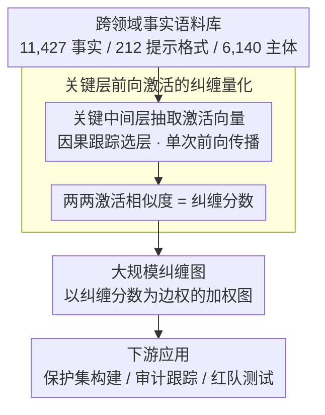

# CLaRE-ty Amid Chaos: Quantifying Representational Entanglement to Predict Ripple Effects in LLM Editing

**会议**: ACL 2026  
**arXiv**: [2603.19297](https://arxiv.org/abs/2603.19297)  
**代码**: [https://github.com/manitbaser/CLaRE](https://github.com/manitbaser/CLaRE)  
**领域**: 模型编辑/知识编辑  
**关键词**: 模型编辑, 连锁效应, 表示纠缠, 前向激活, 纠缠图

## 一句话总结

CLARE 提出了一种轻量级的表示层面方法，通过单个中间层的前向激活量化事实间的纠缠程度，用于预测模型编辑的连锁效应，相比梯度方法平均提升 62.2% Spearman 相关性，同时快 2.74 倍、内存减少 2.85 倍。

## 研究背景与动机

**领域现状**：模型编辑通过修改模型权重更新特定事实关联，但常产生连锁效应——未预期的行为变化传播到其他输出，甚至传播到隐藏空间。

**现有痛点**：(1) 连锁效应可以延伸到语义无关的事实，产生跨领域干扰；(2) 现有方法（如 GradSim）使用梯度相似度，计算成本高且与跨领域连锁效应相关性差；(3) 缺乏大规模跨领域连锁效应的系统研究。

**核心矛盾**：模型编辑需要精确预测哪些事实会受影响，但现有方法既慢又不准确。

**本文目标**：提出轻量级、高精度的连锁效应预测方法，并构建大规模纠缠图。

**切入角度**：用前向激活替代梯度计算，仅需单层激活即可量化纠缠。

**核心 idea**：事实间的纠缠可以通过关键层的前向激活表示的相似度来量化，而不需要计算梯度。

## 方法详解

### 整体框架

CLARE 要回答的问题是：在不触碰梯度的前提下，如何预测某次编辑会牵连到哪些事实。它的做法是把"事实之间是否纠缠"重新定义为"两条事实提示在模型某个关键中间层留下的前向激活是否相似"。整体流程为——先用一个跨领域事实语料库作为底料，对每个事实提示喂入模型并抽取关键层的激活向量，再两两计算激活相似度得到纠缠分数，最后把这些分数汇成一张大规模纠缠图，供保护集构建、审计跟踪、红队测试等下游环节查询。

### 关键设计

**1. 跨领域事实语料库：把研究视野从近邻扩展到全局传播。** 

此前的连锁效应研究大多只盯着 1–2 跳的语义邻居，无法暴露编辑向语义无关事实扩散的现象。为系统刻画这种全局传播，CLARE 从 3 个现有数据集整合出 11,427 个事实，覆盖 212 种提示格式和 6,140 个独特主体，构成后续量化与纠缠图的统一底料。正是在这个跨领域语料上，作者才得以观察到连锁效应可以传播到与被编辑事实完全无关的领域，并验证前向激活在预测这种跨域传播上优于梯度。

**2. 关键层前向激活的纠缠量化：用一次前向传播替代整套梯度计算。** 

衡量两个事实是否纠缠，传统做法（如 GradSim）需要对每个事实跑完整的反向传播、比较梯度方向，计算与显存成本都随事实数线性膨胀。CLARE 把这件事压缩到前向侧：对每条事实提示，只在一个由因果跟踪（causal tracing）识别出的关键中间层提取激活向量，再用两个事实激活向量的相似度作为纠缠分数。由于一次前向传播即可拿到激活，整套量化避免了反向图的构建与存储，这也是它相比梯度方法快 2.74 倍、峰值显存减少 2.85 倍的根源。其有效性来自一个观察——关键层的表示已经编码了事实在模型内部的"落点"，落点相近的事实在编辑时更容易互相牵连，因此单层激活就足以捕获跨领域纠缠的核心信号。

**3. 大规模纠缠图构建：把逐对分数汇成模型知识的全局拓扑。** 

单个纠缠分数只能描述一对事实，要服务于保护集构建和审计这类全局任务，需要一张能够整体审视模型知识结构的图。CLARE 对语料库中 11,427 个事实两两计算纠缠分数，以分数为边权构建加权纠缠图，并对多个模型分别发布了对应的图。有了这张图，下游就能直接查询"编辑某事实时哪些邻居风险最高"，从而支撑更强的保护集构建、可追溯的审计跟踪以及成本可控的红队测试，而无需在每次编辑时重新做昂贵的相似度扫描。

> CLARE 仅依赖前向传播提取激活，不涉及任何模型训练或参数更新。

## 实验关键数据

### 主实验

- CLARE 相比 GradSim 平均提升 62.2% Spearman 相关性（最高提升 0.31）
- 速度快 2.74 倍，峰值 GPU 内存减少 2.85 倍
- 存储需求仅为基线的一小部分

### 消融实验

- 在多种编辑技术（ROME、MEMIT）和多个模型上结果一致
- 纠缠图支持的保护集构建显著减少编辑副作用

### 关键发现

- 前向激活比梯度更能预测跨领域连锁效应
- 连锁效应可以传播到语义完全无关的事实
- 单层激活足以捕获关键纠缠信息

## 亮点与洞察

- 用前向激活替代梯度计算是简洁且有效的洞察
- 大规模纠缠图的发布为社区提供了宝贵资源
- 审计跟踪和红队测试的应用场景展示了实用价值

## 局限与展望

- 关键层的选择可能依赖于模型架构
- 纠缠图是静态的，可能不反映多次编辑后的变化
- 未来可探索动态纠缠图和更大规模的事实库

## 相关工作与启发

- 对 GradSim 和 RippleEdits 的重要改进
- 为模型编辑的安全性和可解释性提供了新工具
- 纠缠图的思路可推广到模型安全和可解释性研究

## 评分

- 新颖性: ⭐⭐⭐⭐⭐ 前向激活量化纠缠是重要的方法论创新
- 实验充分度: ⭐⭐⭐⭐⭐ 11,427 事实、多模型、多编辑技术的全面验证
- 写作质量: ⭐⭐⭐⭐ 问题动机清晰，方法描述简洁

<!-- RELATED:START -->

## 相关论文

- [\[ACL 2025\] ChainEdit: Propagating Ripple Effects in LLM Knowledge Editing through Logical Rule-Guided Chains](../../ACL2025/knowledge_editing/chainedit_propagating_ripple_effects_in_llm.md)
- [\[ACL 2026\] FABLE: Fine-grained Fact Anchoring for Unstructured Model Editing](fable_fine-grained_fact_anchoring_for_unstructured_model_editing.md)
- [\[ICML 2026\] CrispEdit: Low-Curvature Projections for Scalable Non-Destructive LLM Editing](../../ICML2026/knowledge_editing/crispedit_low-curvature_projections_for_scalable_non-destructive_llm_editing.md)
- [\[ACL 2026\] EvoEdit: Evolving Null-space Alignment for Robust and Efficient Knowledge Editing](evoedit_evolving_null-space_alignment_for_robust_and_efficient_knowledge_editing.md)
- [\[ICML 2026\] From Backward Spreading to Forward Replay: Revisiting Target Construction in LLM Parameter Editing](../../ICML2026/knowledge_editing/from_backward_spreading_to_forward_replay_revisiting_target_construction_in_llm_.md)

<!-- RELATED:END -->
