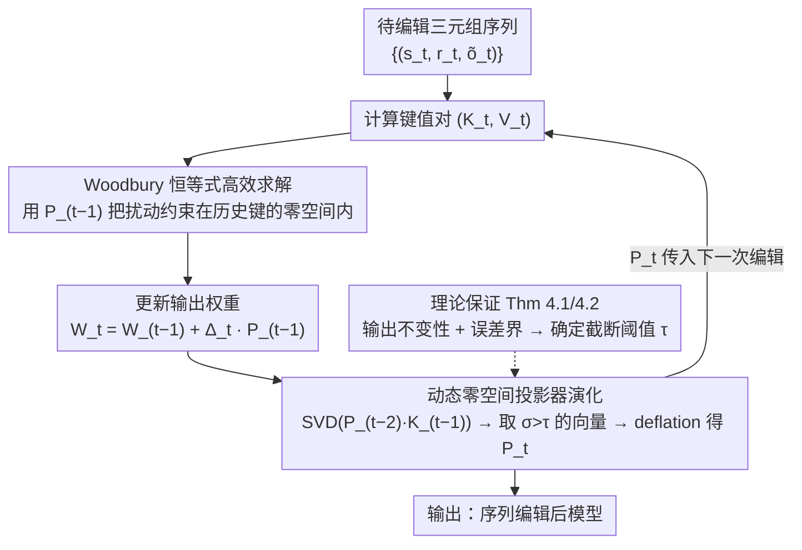

# EvoEdit: Evolving Null-space Alignment for Robust and Efficient Knowledge Editing

**会议**: ACL 2026 Findings  
**arXiv**: [2510.13851](https://arxiv.org/abs/2510.13851)  
**代码**: [GitHub](https://github.com/) (论文中提及 code available)  
**领域**: 知识编辑  
**关键词**: 知识编辑, 零空间投影, 序列编辑, 大语言模型, 灾难性遗忘

## 一句话总结

提出 EvoEdit，通过动态演化零空间投影器实现大规模序列知识编辑，在保持原有知识的同时高效注入新知识，在 10K 编辑量级下仍保持 SOTA 性能，且比 AlphaEdit 快 3.5 倍。

## 研究背景与动机

**领域现状**：大语言模型需要频繁更新以保持事实准确性，主流知识编辑方法采用"定位-编辑"（locate-then-edit）范式，如 ROME 和 MEMIT，先找到存储特定事实的参数，再施加扰动来注入新知识。

**现有痛点**：现有方法在单次编辑时效果尚可，但在序列编辑（sequential editing）场景下，多次更新累积导致"灾难性干扰"——后续编辑会破坏先前已整合的知识，仅几百次编辑后性能就急剧下降甚至模型崩溃。

**核心矛盾**：新知识注入与旧知识保持之间存在根本性矛盾——参数更新需要修改权重以编码新事实，但这些修改不可避免地干扰已有事实的编码。AlphaEdit 使用固定零空间投影器来缓解这一问题，但忽略了序列编辑引起的零空间漂移；LangEdit 每次重新计算零空间，但协方差矩阵的 SVD 在数值上不稳定。

**本文目标**：设计一种可扩展到万级编辑量的序列编辑框架，既保证编辑有效性又不破坏已有知识和模型能力。

**切入角度**：作者观察到 AlphaEdit 的固定投影器在序列编辑中会产生零空间漂移（null-space drift），表现为 $\|PK_p\|_F$ 随编辑次数增长而急剧增大，这迫使模型在新知识获取和干扰抑制之间做出妥协。

**核心 idea**：动态演化零空间投影器——每次编辑后通过对增量键矩阵做 SVD 来递增式更新投影器，而非重算全量协方差矩阵，从而在数值稳定性和计算效率之间取得最优平衡。

## 方法详解

### 整体框架

EvoEdit 沿用 locate-then-edit 范式，把 FFN 层的输出权重矩阵 $W_{out}$ 当作"键→值"的关联记忆，通过在该矩阵的零空间内施加扰动来注入新事实。它要解决的核心难题是序列编辑下的灾难性干扰——固定零空间投影器会随编辑累积发生漂移，而每步重算又数值不稳。整体流程是：输入为待编辑三元组序列 $\{(s_t, r_t, \tilde{o}_t)\}$，每步先算出键值对 $(K_t, V_t)$，再用上一步演化得到的投影器 $P_{t-1}$ 把扰动约束在不触碰历史知识的子空间里，求解权重增量并更新模型，同时把投影器递增演化为 $P_t$ 传给下一步。

### 关键设计

**1. 动态零空间投影器演化：让投影器随每次编辑递增对齐历史键的零空间。** 

AlphaEdit 用一个一次性算好的固定投影器，随着编辑累积，投影后增量键的范数 $\|PK_p\|_F$ 会增大数个量级（即零空间漂移），迫使模型在注入新知识与抑制干扰之间妥协；LangEdit 每步重算全量协方差的 SVD，又会撞上病态矩阵的数值不稳。EvoEdit 走中间路线：每步只对投影后的增量键矩阵 $P_{t-2}K_{t-1}$ 做 SVD，取出奇异值高于阈值 $\tau$ 的奇异向量 $Q_{t-1}$，再用 deflation 更新投影器 $P_{t-1} = P_{t-2} - Q_{t-1}Q_{t-1}^\top$。由于 $K_{t-1}$ 的列数远小于全量矩阵，这个 SVD 既高效又稳定，使投影器始终与所有历史编辑键的零空间保持对齐，从根上消除了漂移。

**2. 基于 Woodbury 恒等式的高效求解：把求逆成本从隐藏维度搬到编辑维度。** 

标准零空间方法的闭式解 $\Delta P_{t-1} = R_t K_t^\top P_{t-1}(K_t K_t^\top P_{t-1} + I)^{-1}$ 需要对一个 $d_K \times d_K$ 的大矩阵求逆，而 $d_K$ 通常达数千，复杂度 $O(d_K^3)$ 成为序列编辑的瓶颈。EvoEdit 借助低秩表示 $P = I - QQ^\top$ 与 Woodbury 矩阵恒等式，把上式改写为 $\Delta = R_t(K_t^\top P_{t-1} K_t + I_r)^{-1} K_t^\top P_{t-1}$，需要求逆的对象变成编辑维度 $r$ 上的小矩阵。整体复杂度因此从 $O(d_K^3)$ 降到 $O(d_K(rn + n^2) + n^3)$，隐藏维度只以线性方式出现——这正是它把 500 次编辑的求解时间从 39.9s 压到 0.1s、整体提速 3.5 倍的来源。

**3. 输出不变性与误差界的理论保证：为截断阈值的选择提供依据。** 

递增演化与截断会引入近似，需要理论保证其干扰可控。Theorem 4.1 证明在不截断时，投影器的零空间与所有历史编辑键的列空间精确等价，即 $\text{Null}(P_{t-1}) = \text{Range}(\hat{K}_{t-1})$，从而保证历史知识的输出严格不变；Theorem 4.2 进一步给出截断情形下的全局误差界，Corollary 4.3 再把投影器的近似误差转化为对历史知识的干扰界。这套保证把"阈值 $\tau$ 取多大"从经验调参变成有界可控的选择，确保每步编辑都不会越界破坏已整合的知识。

### 损失函数 / 训练策略

每步优化目标为最小化编辑残差加正则项：$\min_{\Delta_t} \|(W_{t-1} + \Delta_t P_{t-1})K_t - V_t\|^2 + \|\Delta_t P_{t-1}\|^2$。其中历史知识的保持项之所以无需显式写入目标，是因为投影器已保证 $\Delta_t P_{t-1} \hat{K}_{t-1} = 0$，扰动自动落在历史键的零空间内；正则项 $\|\Delta_t P_{t-1}\|^2$ 则用于约束扰动幅度、稳定收敛。

## 实验关键数据

### 主实验

2K 序列编辑（Llama-3-8B, CounterFact）：

| 方法 | Eff.↑ | Gen.↑ | Spe.↑ | Flu.↑ | Consis.↑ |
|------|-------|-------|-------|-------|----------|
| MEMIT | 65.65 | 64.65 | 51.56 | 437.43 | 6.58 |
| AlphaEdit | 98.90 | 94.22 | 67.88 | 622.49 | 32.40 |
| **EvoEdit** | **99.67** | **94.93** | **69.99** | **623.09** | **32.64** |

10K 序列编辑（Llama-3-8B, CounterFact）：

| 方法 | Eff.↑ | Gen.↑ | Spe.↑ | Flu.↑ | Consis.↑ |
|------|-------|-------|-------|-------|----------|
| MEMIT | 49.73 | 49.24 | 51.54 | 389.31 | 3.45 |
| AlphaEdit | 66.78 | 58.27 | 51.79 | 489.91 | 4.59 |
| **EvoEdit** | **98.29** | **91.21** | **63.91** | **613.88** | **33.22** |

### 消融实验

效率分析（500 次编辑总运行时间，Qwen2.5-7B, BS=100）：

| 方法 | Solve(s)↓ | Total(s)↓ | 加速比 |
|------|-----------|-----------|--------|
| AlphaEdit | 39.9 | 39.9 | - |
| EvoEdit | 0.1 | 11.3 | 3.53× |

GPU 内存（1000 次编辑，Llama-3-8B）：

| 方法 | Peak Alloc. (GB) | Peak Reserved (GB) |
|------|------------------|-------------------|
| AlphaEdit | 34.79 | 35.36 |
| EvoEdit | 31.73 (-14%) | 32.74 (-15%) |

### 关键发现

- 10K 编辑下 EvoEdit 的 Efficacy 仍达 98.29%，而 AlphaEdit 降至 66.78%，差距 31.5 个百分点
- 前 100 条编辑在 2000 步后的保留率：EvoEdit 仅下降 2%（重写准确率），AlphaEdit 下降 53%
- 通用能力测试中（SST/MRPC/MMLU/NLI），ROME/MEMIT 在 400-800 次编辑后崩溃，EvoEdit 全程稳定

## 亮点与洞察

- 将零空间投影从"静态一次性计算"升级为"动态序列演化"，思路简洁且理论扎实
- 10K 量级的实验规模远超前人工作，真正测试了知识编辑的实用性上限
- Woodbury 恒等式的应用巧妙地将计算瓶颈从隐藏维度转移到编辑维度，实现了理论复杂度和实际速度的双重改进

## 局限与展望

- 实验仅覆盖了有限的模型和数据集，未测试编辑事实之间的相关性对性能的影响
- 零空间会随编辑量增加而缩小，长期来看可用的投影空间有限，能否扩展到百万级编辑仍是开放问题
- 知识编辑存在被滥用的潜在风险（注入不当知识/特征）

## 相关工作与启发

- AlphaEdit 和 LangEdit 是最直接的前驱工作，分别代表了"固定投影器"和"全量重算"两种范式，EvoEdit 找到了中间路线
- 与持续学习中的弹性权重巩固（EWC）思想相呼应，但 EvoEdit 通过零空间投影提供了更强的保护保证
- 启发：其他需要序列更新的场景（如增量适配器合并）也可借鉴动态零空间对齐思路

## 评分

- 新颖性: ⭐⭐⭐⭐ 动态零空间演化思路自然但有效，理论分析充实
- 实验充分度: ⭐⭐⭐⭐⭐ 多模型多尺度，10K 编辑量级测试，效率/内存/通用能力全面评估
- 写作质量: ⭐⭐⭐⭐ 论文结构清晰，理论推导完整，图表信息量大

<!-- RELATED:START -->

## 相关论文

- [\[ACL 2025\] Mitigating Negative Interference in Multilingual Sequential Knowledge Editing through Null-Space Constraints](../../ACL2025/knowledge_editing/mitigating_negative_interference_in_multilingual_sequential_knowledge_editing_th.md)
- [\[ICLR 2026\] EAMET: Robust Massive Model Editing via Embedding Alignment Optimization](../../ICLR2026/knowledge_editing/eamet_robust_massive_model_editing_via_embedding_alignment_optimization.md)
- [\[ICLR 2026\] When Large Multimodal Models Confront Evolving Knowledge: Challenges and Explorations](../../ICLR2026/knowledge_editing/when_large_multimodal_models_confront_evolving_knowledge_challenges_and_explorat.md)
- [\[ACL 2025\] Efficient Knowledge Editing via Minimal Precomputation](../../ACL2025/knowledge_editing/efficient_knowledge_editing.md)
- [\[ICML 2026\] KORE: Enhancing Knowledge Injection for Large Multimodal Models via Knowledge-Oriented Controls](../../ICML2026/knowledge_editing/kore_enhancing_knowledge_injection_for_large_multimodal_models_via_knowledge-ori.md)

<!-- RELATED:END -->
